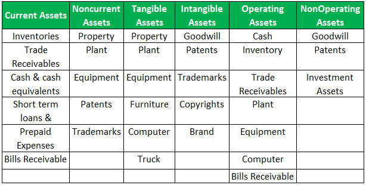

## Table of Contents

## What is an asset?

An asset is something that has value and can be owned or controlled to produce positive economic benefits. This can include money, property, or even things like stocks and bonds. Assets are important because they can help people and businesses grow and become more financially stable.

There are different types of assets. Some assets, like cash or bank accounts, are easy to turn into money quickly. These are called liquid assets. Other assets, like real estate or heavy machinery, might take longer to sell and turn into cash. These are known as non-liquid or fixed assets. Understanding the difference between these types of assets can help in making better financial decisions.

## What are the different types of assets?

Assets can be split into different groups based on what they are and how they are used. One big group is called tangible assets. These are things you can touch, like a car, a house, or a piece of land. Another group is intangible assets. These are things you can't touch, like a patent or a brand name. Both types of assets can be valuable, but they are used in different ways.

Another way to look at assets is by how quickly they can be turned into cash. Liquid assets are things like cash or money in a bank account that you can use right away. Non-liquid assets, or fixed assets, take more time to turn into cash. Examples are real estate or heavy machinery. Knowing the difference between liquid and non-liquid assets can help you manage your money better.

There's also a difference between current assets and non-current assets. Current assets are things that will be used up or turned into cash within a year, like inventory or accounts receivable. Non-current assets are things that will last longer than a year, like buildings or long-term investments. Understanding these categories helps in planning and managing finances over time.

## Can you provide examples of tangible assets?

Tangible assets are things you can touch and see. They have a physical form. Some common tangible assets include cars, houses, and land. These are things that people often own and use every day. A car can take you to work, a house is where you live, and land can be used for farming or building.

Other examples of tangible assets are furniture, machinery, and inventory. Furniture like tables and chairs are used in homes and offices. Machinery, like a factory's equipment, helps make products. Inventory is the stock of goods a business has to sell. All these tangible assets have value because they can be used or sold.

Tangible assets also include things like jewelry, art, and electronics. Jewelry can be worn or sold for money. Art, like paintings or sculptures, can be displayed or sold. Electronics, like computers and smartphones, are used for communication and work. These items are valuable because they can be used or turned into cash.

## What are intangible assets and can you give examples?

Intangible assets are things you can't touch or see, but they still have value. They are important because they can help a business make money or have a good reputation. Some examples of intangible assets are patents, which give a company the right to make or sell a special product, and trademarks, which protect a company's name or logo. These are valuable because they stop other people from copying the company's products or using its name.

Another example of an intangible asset is goodwill. This is the value of a company's good reputation. If people like a company and trust its products, that can make the company worth more money. Copyrights are also intangible assets. They protect things like [books](/wiki/algo-trading-books), music, and movies, so only the owner can make money from them. These intangible assets are important because they help businesses make money and stand out from others.

## How do current assets differ from fixed assets?

Current assets are things a business can turn into cash quickly, usually within a year. They include money in the bank, money that customers owe (called accounts receivable), and things the business has to sell (called inventory). These assets are important because they help a business run day-to-day. For example, a store needs inventory to sell to customers, and it needs cash to pay for things like rent and salaries.

Fixed assets, on the other hand, are things that a business will use for a long time, usually more than a year. These are things like buildings, land, and heavy machinery. Fixed assets are not meant to be sold quickly; instead, they help the business make money over time. For example, a factory uses machines to make products, and a company might own a building where it does its work. While current assets help with daily operations, fixed assets are key for long-term growth and stability.

## What is the difference between personal and business assets?

Personal assets are things that you own for yourself, like your home, car, or savings account. These things help you live your life and do the things you want to do. For example, your car can take you to work or on vacation, and your savings can help you buy things you need or want. Personal assets are important because they make your life easier and more enjoyable.

Business assets are things that a company owns to help it make money. These can include things like office buildings, machines, and money in the bank that the business uses to pay for things. Business assets are important because they help the company do its work and make a profit. For example, a factory uses machines to make products, and a store needs inventory to sell to customers. While personal assets are for your own use, business assets are used to run and grow a company.

## How are financial assets categorized?

Financial assets are things that have value because they can be sold or used to make money. They include things like cash, bank accounts, stocks, and bonds. Cash is money you can use right away, while bank accounts hold money that you can use when you need it. Stocks are pieces of a company that you can buy and sell, and bonds are loans you give to a company or government that they pay back with interest. All these things are called financial assets because they can be turned into money or used to make more money.

Another way to think about financial assets is by how easy they are to turn into cash. Some financial assets, like cash and bank accounts, are very easy to use and are called liquid assets. Other financial assets, like stocks and bonds, might take a bit longer to sell and turn into cash. These are called non-liquid assets. Knowing the difference between liquid and non-liquid financial assets can help you manage your money better and make good choices about what to buy or sell.

## What are digital assets and what are some examples?

Digital assets are things that exist in a digital form and have value. They are different from physical things you can touch because they are stored on computers or online. People use digital assets for many things, like buying and selling things, or showing that they own something special.

Some examples of digital assets are cryptocurrencies like Bitcoin, which people use to buy things online. Another example is Non-Fungible Tokens (NFTs), which are like digital certificates that show you own something unique, like a piece of art or a song. Digital files, like music or eBooks, are also digital assets because you can buy them and use them on your devices.

## How do you evaluate the value of an asset?

Evaluating the value of an asset can be done in different ways, depending on what kind of asset it is. For tangible assets like a house or a car, you can look at what similar things have sold for recently. This is called the market approach. Another way is to figure out how much it would cost to replace the asset, which is called the cost approach. For businesses, you might also look at how much money the asset helps the business make, which is called the income approach.

For intangible assets like patents or trademarks, the value can be trickier to figure out. You might look at how much money the asset could make in the future, which is similar to the income approach for tangible assets. You could also see how much it would cost to create a similar asset from scratch, which is like the cost approach. Sometimes, you look at what similar intangible assets have sold for, which is the market approach. Each method helps give a different view of the asset's value, and often, people use more than one method to get a good idea of what the asset is worth.

## What role do assets play in financial statements?

Assets are a big part of a company's financial statements. They show up on a document called the balance sheet. The balance sheet is like a snapshot of what the company owns and what it owes at a certain time. Assets are important because they tell people how much the company is worth. They include things like cash, buildings, and even things the company is owed by others. By looking at the assets, people can see if the company has enough valuable things to cover its debts and keep running.

Assets also help people understand how well a company is doing. For example, if a company has a lot of cash and things it can sell quickly, it might be in a good position to grow or handle problems. On the other hand, if a company has a lot of old machines or buildings that are hard to sell, it might be in a tougher spot. By looking at the assets on the financial statements, people like investors and managers can make better decisions about the company's future.

## How can assets be used as collateral for loans?

When you want to borrow money, you can use your assets as collateral. Collateral is something valuable that you promise to give to the lender if you can't pay back the loan. For example, if you own a house, you can use it as collateral to get a loan. If you don't pay back the loan, the lender can take your house. This makes lenders feel safer about giving you money because they know they can get something valuable if you don't pay.

Different kinds of assets can be used as collateral. Things like cars, jewelry, or even savings accounts can work. The value of the asset matters a lot. If the asset is worth a lot, you might be able to borrow more money. Lenders will check how much the asset is worth and how easy it would be to sell it if they need to. This helps them decide if they should give you the loan and how much they are willing to lend.

## What are the tax implications of owning different types of assets?

When you own different types of assets, you need to think about how they affect your taxes. For example, if you own a house, you might be able to get a tax break on the interest you pay on your mortgage. If you sell your house, you might have to pay capital gains tax on any profit you make. But if it's your main home, you might not have to pay that tax if the profit is below a certain amount. Cars and other personal items usually don't have big tax effects unless you sell them for a lot more than you paid.

Business assets can also change your taxes. If you buy equipment or machinery for your business, you might be able to deduct the cost from your taxes. This can lower how much tax you have to pay. If you sell business assets, you might have to pay capital gains tax on any profit. But there are rules that can help you avoid or lower this tax, like if you use the money to buy new business assets. It's important to keep good records of what you buy and sell so you can do your taxes correctly.

## References & Further Reading

[1]: Bergstra, J., Bardenet, R., Bengio, Y., & Kégl, B. (2011). ["Algorithms for Hyper-Parameter Optimization."](https://papers.nips.cc/paper/4443-algorithms-for-hyper-parameter-optimization) Advances in Neural Information Processing Systems 24.

[2]: ["Advances in Financial Machine Learning"](https://www.amazon.com/Advances-Financial-Machine-Learning-Marcos/dp/1119482089) by Marcos Lopez de Prado

[3]: ["Evidence-Based Technical Analysis: Applying the Scientific Method and Statistical Inference to Trading Signals"](https://www.amazon.com/Evidence-Based-Technical-Analysis-Scientific-Statistical/dp/0470008741) by David Aronson

[4]: ["Machine Learning for Algorithmic Trading"](https://github.com/stefan-jansen/machine-learning-for-trading) by Stefan Jansen

[5]: ["Quantitative Trading: How to Build Your Own Algorithmic Trading Business"](https://www.amazon.com/Quantitative-Trading-Build-Algorithmic-Business/dp/1119800064) by Ernest P. Chan