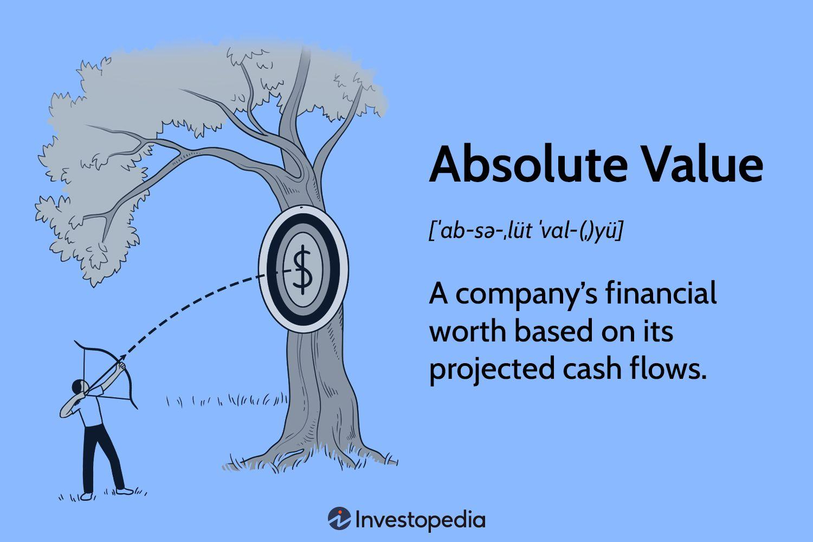

## Table of Contents

## What is asset valuation and why is it important?

Asset valuation is the process of figuring out how much something is worth. This could be anything from a piece of land, a building, a company's stock, or even a piece of art. People and businesses do this to make smart choices about buying, selling, or investing in these things. It's like trying to find out the price tag of an item before deciding if it's a good deal or not.

Understanding asset valuation is important because it helps people and businesses make informed decisions. If you know the true value of an asset, you can decide if it's a good time to buy or sell it. For example, if a company wants to buy another company, they need to know how much the other company is really worth. This helps them avoid paying too much or missing out on a good deal. It also helps in planning for the future, like knowing how much money you might get if you need to sell something later.

## What are the different types of valuation methods?

There are several ways to figure out how much something is worth, and each method looks at different things. One common way is the market approach, which is like checking the price tags of similar items that have been sold recently. If you want to know the value of your house, you might look at what similar houses in your neighborhood sold for. Another method is the cost approach, which tries to figure out how much it would cost to replace the asset if you had to build or buy it new today. This is often used for things like buildings or machinery.

Another popular method is the income approach, which looks at how much money the asset can make in the future. This is often used for businesses or rental properties. You might calculate the future earnings and then figure out what those earnings are worth today. Lastly, there's the asset-based approach, which adds up the value of all the parts of a business, like its buildings, equipment, and inventory, to find out the total value. Each method has its own strengths and is used depending on what kind of asset you're valuing and what information you have available.

## What is absolute valuation and how does it differ from relative valuation?

Absolute valuation is a way to figure out the true value of something by looking at its own numbers and facts. It's like trying to find out how much a house is worth by looking at its size, how old it is, and what it can do for you. People often use methods like the discounted cash flow (DCF) model for this. With DCF, you guess how much money the thing will make in the future and then figure out what that money is worth today. This helps you see if the price you're thinking about paying is a good deal or not.

Relative valuation is different because it compares the thing you're looking at to other similar things. It's like checking the price of your house by seeing what other houses in your neighborhood sold for. You might use ratios like the price-to-earnings (P/E) ratio to do this. If a company's P/E ratio is lower than others in its industry, it might be a good buy. The main difference between absolute and relative valuation is that absolute valuation looks at the thing all by itself, while relative valuation looks at it compared to others. Both ways can help you make smart choices, but they give you different kinds of information.

## Can you explain the concept of intrinsic value in the context of absolute valuation?

Intrinsic value is a big idea in absolute valuation. It's like trying to find out the real, true worth of something, not just what people are willing to pay for it right now. Imagine you have a toy that you think is really special because it was your favorite when you were little. The intrinsic value of that toy would be what it's worth to you, based on how much you love it and the memories it brings back. In the world of business and investing, intrinsic value is figured out by looking at things like how much money a company can make in the future, how much it costs to run the business, and other important numbers.

Finding the intrinsic value is important because it helps people decide if something is a good deal or not. If the price someone is asking for a company is less than its intrinsic value, it might be a good time to buy it. On the other hand, if the price is more than the intrinsic value, you might want to wait or look for something else. This way of thinking helps investors and business owners make smart choices by focusing on the real value of things, not just what the market says they're worth at the moment.

## What are the most common absolute valuation models?

The most common absolute valuation models are the Discounted Cash Flow (DCF) model and the Dividend Discount Model (DDM). The DCF model is like trying to guess how much money a company will make in the future and then figuring out what that money is worth today. It's a bit like saving up for something you want to buy later; you need to know how much money you'll have in the future and what it's worth now. This model is really useful for businesses that don't pay dividends but still make a lot of money. You look at things like how fast the company is growing, how much it costs to run the business, and how risky it is to invest in it.

The Dividend Discount Model (DDM) is another way to find out a company's value, but it's used for companies that pay dividends to their shareholders. It's like trying to figure out how much money you'll get from those dividends in the future and what that money is worth today. This model is simpler than the DCF because it focuses just on the dividends. You need to guess how much the dividends will grow each year and then figure out what all those future dividends are worth right now. Both models help investors see if a company is a good deal by looking at its true value, not just what the market says it's worth.

## How does the Dividend Discount Model (DDM) work in asset valuation?

The Dividend Discount Model (DDM) is a way to figure out how much a company is worth by looking at the money it pays to its shareholders, called dividends. Imagine you own a part of a company, and every year, the company gives you some money. The DDM tries to guess how much money you'll get in the future from these dividends and then figures out what that money is worth right now. It's like saving up for something you want to buy later; you need to know how much money you'll have in the future and what it's worth now.

To use the DDM, you start by guessing how much the dividends will grow each year. Then, you take all those future dividends and bring them back to today's value using a thing called the discount rate. The discount rate is like the [interest rate](/wiki/interest-rate-trading-strategies) you might get if you put your money in a bank instead of investing it in the company. If the total value of all those future dividends, when brought back to today, is more than what the company's stock costs right now, then the stock might be a good buy. This way, the DDM helps investors see if a company is a good deal by focusing on the money they'll get from dividends.

## What is the Discounted Cash Flow (DCF) method and how is it applied?

The Discounted Cash Flow (DCF) method is a way to figure out how much a company is worth by looking at the money it will make in the future. It's like trying to guess how much money a business will bring in over the years and then figuring out what that money is worth right now. Imagine you're saving up for a big toy; you need to know how much money you'll have in the future and what it's worth today. The DCF method uses something called a discount rate, which is like the interest rate you might get if you put your money in a bank instead of investing it in the company. This rate helps bring all those future earnings back to today's value.

To use the DCF method, you start by making a guess about how much money the company will make each year. You look at things like how fast the company is growing, how much it costs to run the business, and how risky it is to invest in it. Then, you use the discount rate to figure out what all that future money is worth right now. If the total value of all those future earnings, when brought back to today, is more than what the company is worth right now, then it might be a good buy. This way, the DCF method helps investors see if a company is a good deal by focusing on its future earnings and what they're worth today.

## Can you describe the Residual Income Model and its use in valuation?

The Residual Income Model is another way to figure out how much a company is worth. It's like looking at the extra money a company makes after it pays for everything it needs to run the business. Imagine you have a lemonade stand. After you pay for the lemons, sugar, and cups, the money you have left over is your residual income. This model helps investors see if a company is making enough extra money to be a good investment.

To use the Residual Income Model, you start by figuring out the company's net income, which is the money it makes after paying all its bills. Then, you subtract the cost of the money the company used to run its business, which is called the equity charge. If the company's net income is more than its equity charge, it has residual income. You add up all the future residual incomes and bring them back to today's value using a discount rate, just like in the DCF method. If the total value of all that future residual income is more than what the company is worth right now, then it might be a good buy. This way, the Residual Income Model helps investors see if a company is worth investing in by focusing on the extra money it makes.

## What are the key assumptions and limitations of using absolute valuation methods?

When using absolute valuation methods like the Discounted Cash Flow (DCF) model, the Dividend Discount Model (DDM), or the Residual Income Model, you have to make some guesses about the future. One big guess is how fast the company will grow. If you think it will grow a lot, the value you come up with will be higher. Another guess is the discount rate, which is like the interest rate you might get from a bank. If you think investing in the company is risky, you'll use a higher discount rate, and that will make the value lower. These guesses can be hard to get right, and if you're wrong, your valuation could be way off.

There are also some limits to using absolute valuation methods. They can be really complicated and take a lot of time to do right. You need a lot of information about the company, like how much money it's making now and how much it might make in the future. Sometimes, it's hard to get all that information, especially for smaller companies or ones that are new. Also, these methods don't take into account what other people think the company is worth, which can be important. The stock market can change a lot because of what people feel and think, and absolute valuation methods don't always catch those changes.

## How do you select the appropriate discount rate for absolute valuation models?

Picking the right discount rate for absolute valuation models is like figuring out how much risk there is in investing in a company. The discount rate is the interest rate you could get if you put your money in a safe place like a bank instead of investing it in the company. If the company is risky, you'll want a higher discount rate because you need to be rewarded more for taking that risk. To find the right discount rate, you often start with something called the risk-free rate, which is the interest rate on really safe investments like government bonds. Then, you add extra percentages to account for things like how risky the company's business is, how much debt it has, and even how the whole economy is doing.

It's important to get the discount rate right because it can change the value of the company a lot. If you use a high discount rate, the value you come up with will be lower because you're saying the future money is worth less today. If you use a low discount rate, the value will be higher because you're saying the future money is worth more today. People often use models like the Capital Asset Pricing Model (CAPM) to help them figure out the discount rate. CAPM looks at the risk of the whole market and how much more risky the company is compared to the market. But remember, even with these models, [picking](/wiki/asset-class-picking) the discount rate is still a bit of a guess, and different people might come up with different numbers.

## What are the advanced techniques used to refine absolute valuation estimates?

To make absolute valuation estimates more accurate, people often use something called sensitivity analysis. This means they change the numbers they're using, like the growth rate or the discount rate, to see how the final value changes. It's like trying different recipes to see which one makes the best cake. By doing this, they can see which guesses are most important and how much they can trust their final number. Another way to refine estimates is by using scenario analysis. This means they think about different things that could happen in the future, like a new law that helps the company or a big competitor that hurts it. They make different valuations for each scenario to see how the company's value might change.

Another advanced technique is called Monte Carlo simulation. This is a bit like playing a game where you roll dice many times to see all the different outcomes. In valuation, you use a computer to run the valuation model many times with different random guesses for things like growth rates and discount rates. This helps you see a range of possible values for the company instead of just one number. It's useful because it shows you how sure you can be about your valuation. All these techniques help make absolute valuation more accurate by showing how different guesses and future events can change the value of a company.

## How can sensitivity analysis improve the reliability of absolute valuation results?

Sensitivity analysis helps make absolute valuation results more reliable by showing how different guesses can change the final value of a company. Imagine you're trying to guess how much a toy is worth. If you think the toy will become really popular and you guess a high growth rate, the value you come up with will be higher. But if you're not sure about that guess, sensitivity analysis lets you change the growth rate to see how much the value changes. This way, you can see which guesses are most important and how much you can trust your final number.

By doing sensitivity analysis, you get a better idea of how sure you can be about your valuation. If small changes in your guesses make big changes in the value, then your valuation might not be very reliable. But if the value stays pretty much the same even when you change your guesses a lot, then you can feel more confident about it. This helps investors make smarter choices by understanding how sensitive their valuation is to different guesses about the future.

## What are Absolute Valuation Techniques?

Absolute valuation techniques are a cornerstone in the framework of financial analysis, providing tools to gauge the intrinsic value of an asset based on its inherent characteristics. These methods focus heavily on [fundamental analysis](/wiki/fundamental-analysis), removing market noise and speculation, allowing for a clearer understanding of true worth. Two prominent models utilized in this approach are the Discounted Cash Flow (DCF) and the Dividend Discount Model (DDM).

### Discounted Cash Flow (DCF) Model

The Discounted Cash Flow (DCF) model is one of the most widely used methods due to its comprehensive approach to valuing an asset based strictly on its future cash flows. By projecting the future cash flows of an asset and discounting them back to their present value, DCF provides a clear picture of an asset's worth based solely on its expected profitability.

The core formula used in DCF is:

$$

PV = \sum_{t=1}^{n} \frac{CF_t}{(1 + r)^t}
$$

Here, $CF_t$ represents the cash flow in period $t$, $r$ stands for the discount rate, which often reflects the asset's weighted average cost of capital (WACC), and $n$ is the number of periods over which the cash flows are projected.

The strength of the DCF model lies in its detailed assessment of future financial performance, making it particularly useful for businesses expecting substantial cash inflows in the future. However, accurate forecasts of future cash flows and the choice of an appropriate discount rate are critical for reliable valuations.

### Dividend Discount Model (DDM)

The Dividend Discount Model (DDM) is another essential valuation approach that focuses on the anticipated dividends a stock will pay in the future. This model is most applicable to valuing companies with a stable dividend payout history and is specifically designed for firms in mature industries with predictable dividend distributions.

The basic formula used in DDM is as follows:

$$

P_0 = \frac{D_1}{r - g}
$$

In this equation, $P_0$ is the present value of the stock, $D_1$ represents the expected dividend in the next period, $r$ is the required rate of return, and $g$ is the dividend growth rate.

DDM's simplicity and focus make it especially useful for valuing stable dividend-paying stocks, providing clarity through the predictability of income streams. However, it is less applicable to companies without a predictable or significant dividend history, such as high-growth technology firms.

### Conclusion

Both DCF and DDM offer robust frameworks for calculating intrinsic asset values, each with specific use cases depending on the asset's cash flow characteristics and dividend payout tendencies. Mastery of these models enables financial experts to make more informed investment decisions, highlighting their integral role in navigating modern financial markets. 

These absolute valuation techniques require a deep understanding of financial projections and an acute sensitivity to economic variables, signifying the importance of rigorous analysis and sound judgment in their application.

## References & Further Reading

[1]: Damodaran, A. (2012). ["Investment Valuation: Tools and Techniques for Determining the Value of Any Asset."](https://books.google.com/books/about/Investment_Valuation.html?id=5SRHAAAAQBAJ) John Wiley & Sons.

[2]: Fabozzi, F. J., & Markowitz, H. (2011). ["The Theory and Practice of Investment Management: Asset Allocation, Valuation, Portfolio Construction, and Strategies."](https://onlinelibrary.wiley.com/doi/book/10.1002/9781118267028) John Wiley & Sons.

[3]: Lopez de Prado, M. (2018). ["Advances in Financial Machine Learning."](https://www.amazon.com/Advances-Financial-Machine-Learning-Marcos/dp/1119482089) John Wiley & Sons.

[4]: Chan, E. P. (2009). ["Quantitative Trading: How to Build Your Own Algorithmic Trading Business."](https://github.com/ftvision/quant_trading_echan_book) John Wiley & Sons.

[5]: Hull, J. C. (2018). ["Options, Futures, and Other Derivatives."](https://www.semanticscholar.org/paper/Options%2C-Futures%2C-and-Other-Derivatives-Hull/89bdee500c8623864fc9eb7a471546aa713acc44) Pearson.

[6]: Jansen, S. (2020). ["Machine Learning for Algorithmic Trading: Predictive Models to Extract Signals from Market and Alternative Data for Systematic Trading Strategies."](https://www.amazon.com/Machine-Learning-Algorithmic-Trading-alternative/dp/1839217715) Packt Publishing.