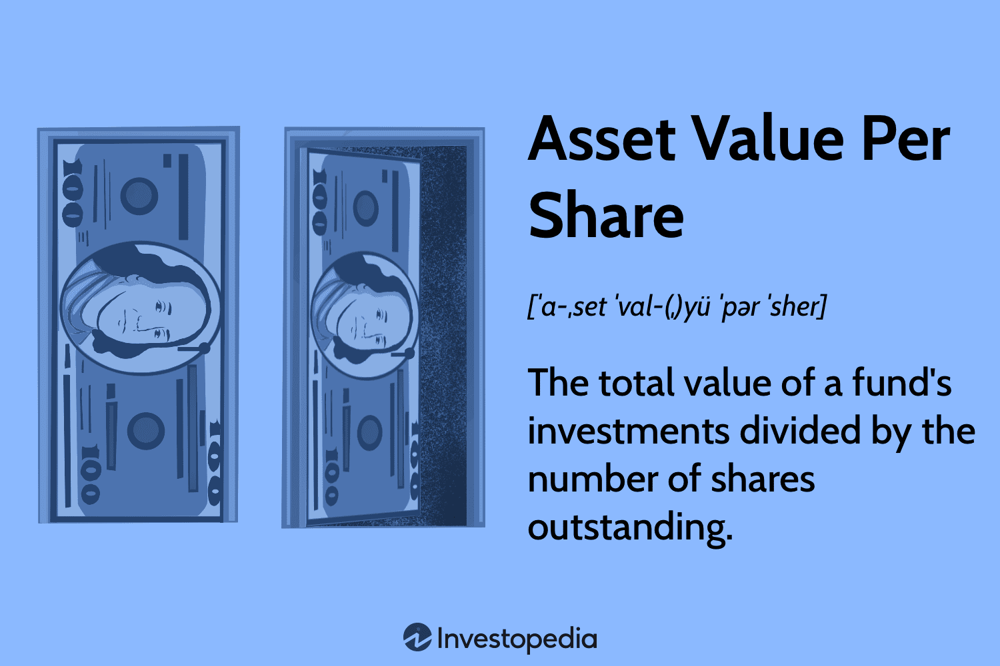

## Table of Contents

## What is Asset Value Per Share?

Asset Value Per Share is a way to figure out how much a company's assets are worth for each share of its stock. It's calculated by taking the total value of all the company's assets and then dividing that by the number of shares that are out there. This number can help investors see if a stock is a good deal. If the asset value per share is higher than the stock's price, it might mean the stock is undervalued.

This measure is useful but it's not perfect. It doesn't take into account things like debts the company might have. So, while it gives a snapshot of what the company's assets are worth per share, it's just one piece of the puzzle. Investors should look at other numbers and information too before deciding to buy or sell a stock.

## How is Asset Value Per Share calculated?

To find the Asset Value Per Share, you start by adding up everything the company owns that has value. This includes things like buildings, machines, money in the bank, and anything else they own. Once you have the total value of all these assets, you then divide that number by how many shares of the company's stock are out there. This gives you the value of the company's assets for each share of stock.

It's a simple calculation, but it's important to remember that it doesn't tell the whole story. For example, it doesn't subtract any money the company owes, like loans or bills. So, while Asset Value Per Share can give you a quick idea of what the company's stuff is worth per share, it's just one part of understanding if a stock is a good buy. You should look at other information too, like the company's debts and how much money it's making.

## Why is Asset Value Per Share important for investors?

Asset Value Per Share is important for investors because it helps them see if a stock might be a good deal. It shows how much of the company's stuff, like buildings and money, is worth for each share of stock. If this number is higher than what the stock costs, it might mean the stock is undervalued. That could be a signal to investors that it's a good time to buy the stock, because they might be getting more value than they're paying for.

However, it's not the only thing investors should look at. Asset Value Per Share doesn't take into account the company's debts or how much money it's making. So, while it's a useful number, it's just one part of the bigger picture. Investors need to look at other information too, like the company's financial health and future growth possibilities, to make a smart decision about buying or selling a stock.

## What is the difference between Asset Value Per Share and Book Value Per Share?

Asset Value Per Share and Book Value Per Share are similar but not the same. Asset Value Per Share is calculated by taking the total value of all the company's assets and dividing it by the number of shares. This gives investors an idea of how much the company's stuff is worth per share of stock. It's a way to see if the stock might be a good deal by comparing it to the stock's price.

Book Value Per Share, on the other hand, takes into account not just the assets but also the company's debts. It's calculated by subtracting the company's total liabilities from its total assets, and then dividing that number by the number of shares. This gives a more complete picture of what each share is worth, because it considers what the company owes as well as what it owns. So, while Asset Value Per Share focuses only on assets, Book Value Per Share gives a clearer view of the company's net worth per share.

## How does Asset Value Per Share relate to a company's market value?

Asset Value Per Share is a way to figure out how much a company's stuff is worth for each share of its stock. It's calculated by taking the total value of all the company's assets and dividing that by the number of shares. This number can help investors see if a stock's price is a good deal compared to what the company owns. If the Asset Value Per Share is higher than the stock's price, it might mean the stock is undervalued and could be a good buy.

The market value of a company, on the other hand, is what people are willing to pay for the company's stock in the market. It's calculated by multiplying the current stock price by the total number of shares. The market value can be very different from the Asset Value Per Share because it's influenced by things like how investors feel about the company's future, the economy, and other factors. So, while Asset Value Per Share gives a snapshot of the company's assets per share, the market value shows what the market thinks the whole company is worth at that moment.

## Can Asset Value Per Share be used to assess a company's financial health?

Asset Value Per Share can give you a quick look at a company's financial health by showing how much its stuff is worth for each share of stock. If this number is high, it might mean the company has a lot of valuable things, which could be a good sign. But remember, it only looks at the company's assets and doesn't tell you about any money the company owes or how much money it's making.

So, while Asset Value Per Share is a helpful number, it's not enough by itself to fully understand a company's financial health. You need to look at other things too, like the company's debts, how much money it's making, and its future plans. Only by putting all these pieces together can you get a complete picture of how healthy the company really is.

## What are the limitations of using Asset Value Per Share as an investment metric?

Asset Value Per Share is a useful number, but it has some limits when you use it to decide if a stock is a good buy. One big problem is that it only looks at what the company owns, like buildings and money, and doesn't take into account what the company owes, like loans or bills. This means you might think a company is worth more than it really is if you just look at its assets.

Another issue is that Asset Value Per Share doesn't tell you about the company's future. It doesn't show if the company is making money or if it has good plans for growing. So, while it can help you see if a stock's price is a good deal compared to what the company owns, it's not enough to understand if the company will do well in the future.

Because of these limits, it's important to use Asset Value Per Share along with other numbers and information. Look at things like the company's debts, how much money it's making, and what it plans to do next. Only by putting all these pieces together can you get a full picture of whether a stock is a smart investment.

## How does Asset Value Per Share impact stock valuation?

Asset Value Per Share can help investors figure out if a stock is a good deal. It shows how much the company's stuff, like buildings and money, is worth for each share of stock. If this number is higher than the stock's price, it might mean the stock is undervalued. That could be a sign to investors that it's a good time to buy the stock because they might be getting more value than they're paying for.

However, Asset Value Per Share is just one piece of the puzzle. It doesn't tell you about the company's debts or how much money it's making. So, while it can give you a quick idea of what the company's assets are worth per share, it's not enough to fully understand if the stock is a smart investment. Investors need to look at other information too, like the company's financial health and future growth possibilities, to make a good decision about buying or selling a stock.

## What industries benefit most from analyzing Asset Value Per Share?

Industries like real estate and manufacturing benefit a lot from looking at Asset Value Per Share. In real estate, companies own a lot of buildings and land. By figuring out the Asset Value Per Share, investors can see if the stock's price is a good deal compared to what all those properties are worth. In manufacturing, companies have a lot of machines and equipment. Knowing the Asset Value Per Share can help investors understand if the stock's price is a bargain based on the value of all that equipment.

However, it's not just these industries that can benefit. Any company with a lot of physical stuff, like energy companies with oil fields or utilities with power plants, can find Asset Value Per Share useful. It gives investors a quick way to see if the stock is undervalued based on what the company owns. But remember, it's important to look at other numbers too, like the company's debts and how much money it's making, to get the full picture.

## How can changes in Asset Value Per Share signal potential investment opportunities?

Changes in Asset Value Per Share can show investors when a stock might be a good buy. If the Asset Value Per Share goes up and the stock's price stays the same or goes down, it might mean the stock is undervalued. This could be a sign to investors that it's a good time to buy the stock because they might be getting more value than they're paying for. For example, if a company buys new buildings or equipment, the Asset Value Per Share could go up, making the stock look like a better deal.

However, it's important to remember that changes in Asset Value Per Share are just one part of the story. The number doesn't take into account the company's debts or how much money it's making. So, while a rising Asset Value Per Share might signal a potential investment opportunity, investors need to look at other information too. They should consider the company's overall financial health, future growth possibilities, and other numbers to make a smart decision about buying or selling a stock.

## What advanced techniques can be used to refine the calculation of Asset Value Per Share?

To refine the calculation of Asset Value Per Share, you can use a method called fair value accounting. Instead of just using the cost of the assets, you look at what they're really worth now. This can give a more accurate picture of the company's stuff, especially if the value of things like buildings or machines has changed a lot since they were bought. Another technique is to adjust for inflation. This means you change the value of the assets to account for the fact that money's value changes over time. By doing this, you get a better idea of what the company's assets are worth today.

You can also use sector-specific adjustments to refine Asset Value Per Share. Different industries have different ways of valuing their stuff. For example, in real estate, you might use appraisals to find out the current value of properties. In manufacturing, you might look at the market value of equipment. By using these specific methods, you can get a more accurate Asset Value Per Share for companies in different industries. Remember, though, even with these advanced techniques, it's still important to look at other numbers and information to fully understand if a stock is a good investment.

## How does global economic policy affect the interpretation of Asset Value Per Share?

Global economic policy can change how we look at Asset Value Per Share. When countries change their rules about money, like interest rates or taxes, it can make the value of a company's stuff go up or down. For example, if a country lowers interest rates, it might be easier for companies to borrow money to buy new things. This could make the Asset Value Per Share go up because the company now owns more valuable stuff. But if a country raises taxes on businesses, it might make it harder for companies to make money, which could make their stuff seem less valuable, even if the Asset Value Per Share stays the same.

Also, global economic policies can affect how investors see a company's future. If a country is doing well and has good policies, investors might think the company will grow and make more money in the future. This could make them willing to pay more for the stock, even if the Asset Value Per Share doesn't change much. On the other hand, if a country's policies make it hard for businesses to grow, investors might not want to buy the stock, even if the Asset Value Per Share looks good. So, when looking at Asset Value Per Share, it's important to think about what's happening with global economic policies too.

## What is the importance of understanding financial metrics in investment?

Financial metrics are essential tools for evaluating the performance and potential of investments. They provide quantitative measures that investors and analysts use to assess the financial health, profitability, and growth prospects of organizations. This section explores key financial metrics, emphasizing asset value per share (NAV) and tangible book value per share (TBVPS), which are crucial for making informed investment decisions.

### Key Financial Metrics

Financial metrics encompass a broad range of data, but some of the most critical include profitability ratios, [liquidity](/wiki/liquidity-risk-premium) ratios, solvency ratios, and valuation metrics. These metrics offer insights into various aspects of a company's performance. For example, profitability ratios, such as net profit margin, show how effectively a company converts revenue into profit, while liquidity ratios, like the current ratio, indicate a company's ability to meet short-term obligations.

### Importance of Asset Value Per Share (NAV)

Asset value per share, commonly referred to as Net Asset Value (NAV), is a measure used primarily for open-end investment funds like mutual funds. It represents the per-share value of a fund's assets minus its liabilities. The NAV is critical because it reflects the underlying value of a fund's holdings and is used by investors to determine whether a fund is over- or undervalued.

$$
\text{NAV} = \frac{\text{Total Asset Value} - \text{Total Liabilities}}{\text{Total Shares Outstanding}}
$$

NAV provides a straightforward way of assessing the market value of an investment at a given point in time, making it an essential metric for comparing different funds or determining the right entry and [exit](/wiki/exit-strategy) points for investments.

# to Tangible Book Value Per Share (TBVPS)

Tangible Book Value Per Share (TBVPS) is another critical financial metric that measures the company's tangible net asset value on a per-share basis. It excludes intangible assets, such as goodwill and patents, providing a conservative measure of a company's net worth. 

$$
\text{TBVPS} = \frac{\text{Shareholders' Equity} - \text{Intangible Assets}}{\text{Total Shares Outstanding}}
$$

TBVPS is particularly useful for investors interested in assessing the intrinsic value of companies whose balance sheets comprise significant tangible assets. It offers clarity by focusing on the real, physical assets a company holds, facilitating comparisons across businesses and industries.

### Impact and Interpretation of These Metrics

The interpretation of NAV and TBVPS is paramount in evaluating investment decisions. By understanding these metrics, investors can:

1. **Gauge Market Valuation**: NAV helps investors determine whether investment funds are priced fairly relative to their actual value. A discrepancy between a fund's market price and its NAV may indicate a potential opportunity or risk.

2. **Assess Financial Health**: TBVPS offers insights into a company's financial stability. Firms with high tangible book values may be deemed less risky, as they possess significant assets that can be liquidated if needed.

3. **Make Informed Comparisons**: Both NAV and TBVPS allow investors to compare investment options on a like-for-like basis, identifying stronger investment opportunities and better aligning their portfolios with their risk and return preferences.

By integrating these valuation approaches, investors can enhance their analysis, ensuring that investment choices are grounded in solid financial evidence and aligned with long-term financial goals.

## What is the Comprehensive Analysis of Asset Value Per Share?

Asset value per share, often associated with the net asset value (NAV), serves as a crucial financial metric for evaluating an investment's worth relative to its shares. The NAV represents the per-share value of a company's total assets, minus its liabilities. It is calculated using the formula:

$$

\text{NAV} = \frac{\text{Total Assets} - \text{Total Liabilities}}{\text{Number of Outstanding Shares}} 
$$

This metric is particularly significant in the context of mutual funds, exchange-traded funds (ETFs), and other pooled investment vehicles. 

### Difference between Open-end and Closed-end Fund NAV

The NAV calculation and its implications can differ between open-end and closed-end funds:

1. **Open-end funds**: These funds, typically mutual funds, are priced based on their NAV at the end of each trading day. The number of shares outstanding can change as investors buy or redeem shares at the NAV price. Thus, the NAV directly influences investor transactions and reflects the current market value of the fund's assets.

2. **Closed-end funds**: Conversely, closed-end funds have a fixed number of shares. They are traded on stock exchanges, so their market price can fluctuate independently of their NAV. This leads to situations where closed-end funds may trade at a premium or discount to their NAV, driven by investor demand and market conditions.

### Utilizing NAV for Investment Comparison

Investors employ NAV as a means of comparing investment vehicles. A consistent evaluation of NAV over time helps in assessing the fund's performance and the efficiency of its management. An increasing NAV typically indicates growing asset value and effective fund management, whereas a decreasing NAV might signal unfavourable market movements or management inefficiency. 

### Role of Asset Value Per Share in Identifying Market Opportunities

Asset value per share is instrumental in uncovering investment opportunities. It can highlight undervalued or overvalued securities, thus enabling informed investment decisions. A stock trading below its NAV might suggest potential undervaluation, presenting a buying opportunity if further analysis supports this conclusion.

Moreover, by comparing NAV with market prices, investors can identify trends and anomalies. For instance, a closed-end fund trading at a significant discount to its NAV could become attractive if the market dynamics suggest an impending correction. Similarly, consistent NAV growth in an open-end fund could draw investor interest despite broader market fluctuations.

In summary, the asset value per share is not only pivotal for individual investment analysis but also serves as a benchmark for comparing different investment vehicles and identifying market opportunities.

## How can investment analysis be conducted through financial ratios?

Financial ratios play a pivotal role in evaluating investment opportunities, providing insights into a company's operational efficiency, financial health, and market valuation. These ratios are essential for investors to assess the potential risks and returns associated with their investments.

**Crucial Ratios: Profitability, Liquidity, Solvency, and Valuation**

- **Profitability Ratios:** These ratios measure a company’s ability to generate profit relative to its revenue, assets, or equity. Key profitability ratios include the Gross Profit Margin, which indicates the percentage of revenue that exceeds the cost of goods sold; the Operating Profit Margin, showing the profit relative to its operating revenue; and Return on Equity (ROE), which assesses a company's ability to generate profits from shareholders' equity. Mathematically, ROE is expressed as:
$$
  \text{ROE} = \frac{\text{Net Income}}{\text{Shareholder's Equity}}

$$

- **Liquidity Ratios:** These ratios evaluate a company's capacity to meet its short-term obligations. The Current Ratio, calculated as Current Assets divided by Current Liabilities, provides a quick measure of liquidity. The Quick Ratio or Acid-Test Ratio, which excludes inventories from current assets, gives a more stringent test:
$$
  \text{Quick Ratio} = \frac{\text{Current Assets} - \text{Inventories}}{\text{Current Liabilities}}

$$

- **Solvency Ratios:** These ratios assess a company's ability to satisfy its long-term debts. The Debt to Equity Ratio compares total liabilities to shareholders' equity, providing insight into financial leverage and risk:
$$
  \text{Debt to Equity Ratio} = \frac{\text{Total Liabilities}}{\text{Shareholder's Equity}}

$$

- **Valuation Ratios:** These ratios help determine the worth of a company from an investment perspective. The Price to Earnings Ratio (P/E) compares a company's current share price to its earnings per share, helping investors gauge market expectations of future growth. Another crucial ratio is the Price to Book Ratio (P/B), indicating how much investors are willing to pay for each dollar of book value.

**Supporting Investment Decision Making through Financial Ratios**

Financial ratios offer a structured approach to understanding a company's financial position and operational efficiency, enabling investors to make informed decisions. By comparing these ratios over time or against industry benchmarks, investors can uncover trends, strengths, and weaknesses, helping them identify undervalued or overvalued stocks. This analysis is an integral component of [fundamental analysis](/wiki/fundamental-analysis), where investors evaluate securities by examining related economic, financial, and other qualitative and quantitative factors.

**Integrating Financial Ratios with Algorithmic Trading**

The integration of financial ratios into [algorithmic trading](/wiki/algorithmic-trading) strategies allows for systematic, data-driven investment decisions. Algorithms can be programmed to automatically analyze and compare financial ratios, triggering trades based on predefined criteria. This process enhances efficiency, allowing for rapid responses to market changes. In Python, simple scripts can be leveraged to screen stocks based on specific ratio thresholds. For instance, consider the following Python snippet that filters companies with a P/E Ratio below 15:

```python
import pandas as pd

# Assume 'data' is a DataFrame containing company financial information
filtered_stocks = data[data['P/E Ratio'] < 15]

# Display the filtered stocks
print(filtered_stocks)
```

By harnessing financial ratios in an algorithmic framework, investors can create strategies that align with their risk tolerance and investment goals, optimizing their portfolio management processes. These methods not only automate repetitive tasks but also help in deploying quantitative strategies that have historically demonstrated success in diverse market conditions.

## What are the challenges and limitations in financial metrics?

Financial metrics are crucial for evaluating investment opportunities, yet they are susceptible to inaccuracies and limitations, particularly for certain types of companies or investment scenarios. These challenges can hinder decision-making and require strategies to mitigate their impact.

Potential inaccuracies in financial metric calculations often stem from the underlying assumptions and data used. For instance, fluctuations in market conditions or errors in accounting can result in misleading outcomes. Asset valuations, such as those for real estate or inventory, can change over time from the values recorded on financial statements, thus affecting metrics like the Net Asset Value (NAV).

The Tangible Book Value Per Share (TBVPS) is specifically challenged when applied to companies with significant intangible assets, such as tech or pharmaceutical firms, where intellectual property, brand equity, and other non-physical assets don't appear on the balance sheet. This omission can lead to an undervaluation of a company’s true worth, as TBVPS primarily focuses on tangible assets. The formula for TBVPS is:

$$
\text{TBVPS} = \frac{\text{Total Tangible Assets} - \text{Total Liabilities}}{\text{Shares Outstanding}}
$$

Criticisms of NAV, primarily used in the context of investment funds, focus on its reliance on market prices for asset valuation, which can be volatile and not always reflective of intrinsic value. Additionally, NAV calculations may not account for future earnings potential or the possible overvaluation of assets in speculative markets, making it less useful as a sole indicator for determining a fund's worth.

Similarly, many financial ratios are criticized for their backward-looking nature. Ratios such as Price-to-Earnings (P/E) and Debt-to-Equity provide snapshots of past financial performance and condition, but often lack predictive power regarding future trends or disruptions.

To overcome these challenges, practitioners can adopt several strategies:

1. **Holistic Analysis**: Investors should employ a comprehensive set of metrics and qualitative factors, rather than relying on a single financial ratio. This approach incorporates various perspectives and safeguards against the limitations inherent in any one metric.

2. **Stress Testing and Scenario Analysis**: These techniques can help account for market volatility and stress the assumptions used in metrics like NAV, providing deeper insights into potential risks and their impacts.

3. **Regular Updates and Adjustments**: Continuously updating valuations and financial assumptions in response to new data and market conditions ensures that the calculations remain relevant and accurate.

4. **Integration of Intangible Assets in Valuations**: For companies with significant intangible holdings, more advanced valuation models that specifically account for intellectual property, branding, and other non-tangible assets can improve TBVPS accuracy.

By understanding and addressing these challenges, investors can better utilize financial metrics to inform their investment decisions and manage risk effectively.

## How does TBVPS compare to other financial metrics in a comparative study?

### TBVPS vs Other Financial Metrics: A Comparative Study

Tangible Book Value Per Share (TBVPS) is a significant metric for evaluating the financial health and intrinsic value of a company, particularly when compared to other financial metrics such as Book Value Per Share (BVPS). While BVPS provides a general measure of the value per share, including both tangible and intangible assets, TBVPS excludes intangible assets, offering a more conservative estimate focused solely on tangible assets. This distinction makes TBVPS particularly relevant in certain scenarios and industries.

#### Comparison between TBVPS and BVPS

The Book Value Per Share (BVPS) is calculated as the net asset value available to common shareholders divided by the number of outstanding shares. It is expressed as:

$$
\text{BVPS} = \frac{\text{Total Equity} - \text{Preferred Equity}}{\text{Outstanding Shares}}
$$

On the other hand, TBVPS refines this by subtracting intangible assets such as goodwill and patents:

$$
\text{TBVPS} = \frac{\text{Total Equity} - \text{Preferred Equity} - \text{Intangible Assets}}{\text{Outstanding Shares}}
$$

While BVPS gives a broader view of a company’s value, including intellectual property and brand value, TBVPS focuses solely on physical and liquid assets, excluding potentially volatile intangible asset valuations.

#### Scenarios Where TBVPS Is More Applicable

TBVPS is particularly useful in evaluating companies in the manufacturing, retail, and real estate sectors. These industries have significant tangible assets and lower reliance on intangible assets. For investors who are conservative or wish to evaluate liquidation value, TBVPS provides a rigorous benchmark by excluding more subjective components from the valuation.

#### How TBVPS Provides Clarity in Asset Valuation

By eliminating intangible assets, TBVPS offers a clearer view of the company's true asset backing. This metric is useful in stress scenarios or when evaluating companies for insolvency risks where tangible assets are likely to have salvage value. TBVPS is especially valuable during economic downturns when the value of intangibles may fluctuate significantly, allowing investors to assess the most reliable asset base of a company.

#### Industry-Specific Applications of TBVPS and Its Counterparts

In the banking sector, where assets are predominantly financial instruments, BVPS serves better to capture off-balance-sheet exposures and intangible values like franchise and network effects. Conversely, in industries like construction or mining, where tangible assets dominate, TBVPS becomes an indispensable tool for assessing company health and investment worthiness.

Moreover, TBVPS is crucial for asset-intensive businesses experiencing a shift due to mergers, acquisitions, or disposals, aiding in understanding the value continuity or disruption. It allows investors to make informed decisions by understanding the tangible asset base post-transaction. 

By comparing TBVPS with other valuation metrics, investors can gain a comprehensive understanding of a company's asset profile and make decisions that align with their investment philosophy. Whether considering conservative asset backing through TBVPS or a full spectrum view with BVPS, each metric holds value across different contexts and industries.

## References & Further Reading

Comprehensive list of referenced materials and articles:

1. **Books and Journals**:
   - Bodie, Z., Kane, A., & Marcus, A. J. (2014). *Investments*. McGraw-Hill Education. This book provides a comprehensive overview of investment principles and valuation metrics.
   - Graham, B., Dodd, D. L., & Cottle, S. (1934). *Security Analysis: Principles and Techniques*. This seminal work is essential for understanding the foundational concepts of financial metrics and security valuation.
   - Hull, J. C. (2017). *Options, Futures, and Other Derivatives*. Provides insights into derivatives markets and associated trading strategies highly relevant to algorithmic trading considerations.

2. **Research Articles and White Papers**:
   - Fabozzi, F. J., & Markowitz, H. M. (Eds.). (2002). *The Theory and Practice of Investment Management*. This collection of articles discusses modern investment strategies and the application of financial metrics in portfolio management.
   - Bertsimas, D., & Lo, A. W. (1998). *Optimal Control of Execution Costs*. Published in the *Journal of Financial Markets*, this paper investigates into algorithmic trading strategies and execution efficiencies.

3. **Online Resources and Websites**:
   - [Investopedia](https://www.investopedia.com/): A valuable resource for definitions and practical examples of financial metrics, including NAV and TBVPS.
   - [CFA Institute](https://www.cfainstitute.org/en): Offers in-depth articles and case studies on investment analysis and financial ratios.

4. **Reports and Market Analyses**:
   - [Morningstar's Guide to Mutual Funds](https://www.morningstar.com): Provides insights on NAV calculations and comparisons in open-end and closed-end funds.
   - [Deloitte: Algorithmic Trading](https://www2.deloitte.com): Discusses the advantages and challenges of implementing algorithmic trading strategies in modern finance.

Other essential readings for deeper understanding include market analysis reports available through financial services and consulting firms such as PwC and Ernst & Young, which often provide comprehensive overviews of the current state of algorithmic trading and financial metrics application.

Recommended [books](/wiki/algo-trading-books) and online resources for beginners and professionals:
- Bernstein, P. L. (1993). *Capital Ideas: The Improbable Origins of Modern Wall Street*. An introduction to the evolution of financial theories and their application.
- [Coursera: Financial Markets](https://www.coursera.org/learn/financial-markets): An online course that covers basic principles of finance and quantitative trading techniques suitable for both beginners and seasoned professionals.

