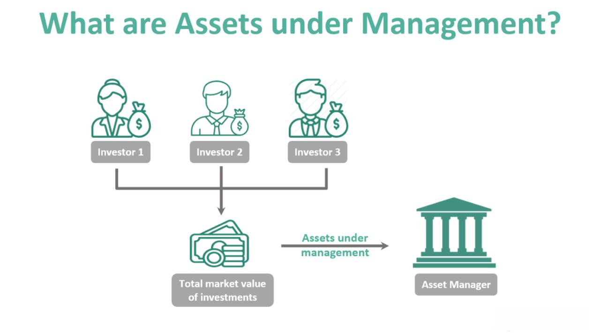

The financial world is experiencing rapid transformation, primarily driven by technological advancements and evolving market dynamics. As a result, the methods of asset management and trading are undergoing significant changes. This article explores the intersection of three pivotal concepts: financial management, Assets Under Management (AUM), and algorithmic trading (algo trading). These elements are increasingly critical in the modern financial landscape due to their impact on investment strategies and decision-making. By gaining an understanding of these components, both individual and institutional investors can harness their potential to make more informed and strategic investment choices.

Financial management is foundational to the functioning of any financial entity, encompassing the strategic planning, organizing, and controlling of financial resources. It ensures optimal allocation and efficient use of these resources to promote growth and sustainability. Within this context, AUM serves as a crucial metric, providing insights into the size, capability, and effectiveness of financial institutions. It represents the total market value of investments managed on behalf of clients and is directly connected to the profitability and perceived credibility of these institutions.



Alongside traditional financial management practices, algo trading has emerged as a significant force, revolutionizing how trading decisions are executed. By employing sophisticated computer algorithms, traders can capitalize on market opportunities with speed and precision, which was previously unattainable through manual methods. Algo trading minimizes human error and enhances the ability to implement complex strategies, making it indispensable in contemporary asset management.

The interaction between AUM and algo trading offers a potent synergy that amplifies the benefits of modern asset management strategies. Algorithms can dynamically respond to market conditions, adjust portfolios, and optimize returns while controlling risks. This combination enhances liquidity management and cost efficiency, prompting traditional asset managers to integrate these technological innovations into their operations.

Understanding these interconnected elements is essential for navigating the shifting terrain of financial management. As we continue, we'll examine how these factors influence asset management strategies, positioning investors to achieve their financial objectives more effectively.

## Table of Contents

## Understanding Financial Management

Financial management involves the strategic planning, organizing, and controlling of an organization's financial activities to achieve its objectives. It is integral to ensuring that an organization's resources are appropriately and effectively allocated. This discipline encompasses several critical components.

Capital budgeting refers to the process of planning and managing a firm's long-term investments. It requires evaluating potential major projects or investments to determine their value to the firm. The Net Present Value (NPV) or the Internal Rate of Return (IRR) are often used to assess the viability of these investments. The basic formula for NPV is:

$$
\text{NPV} = \sum \left( \frac{C_t}{(1 + r)^t} \right) - C_0
$$

where $C_t$ is the net cash inflow during the period $t$, $r$ is the discount rate, and $C_0$ is the initial investment cost.

Financial reporting involves the recording, summarizing, and presenting of financial transactions to stakeholders. This includes creating financial statements such as the balance sheet, income statement, and cash flow statement. These documents provide insight into the financial health, performance, and changes in the financial position of an organization, enabling informed decision-making.

Investment analysis is the process of evaluating an investment for profitability and risk. This analysis can be fundamental, examining economic indicators, financial statements, and industry trends, or technical, focusing on statistical analysis of market prices and volumes.

Effective financial management is crucial for the sustainability and growth of any organization. By judiciously managing financial resources, organizations can ensure operational efficiency, pursue strategic initiatives, and navigate economic challenges.

In recent years, technology and data analytics have substantially transformed financial management practices. The rise of big data and advanced analytics enables organizations to make more informed decisions, enhance forecasting accuracy, and uncover patterns or trends that may not be visible through traditional methods. For instance, predictive analytics can assess future outcomes based on historical data, allowing organizations to prepare strategically for various scenarios.

Moreover, innovations such as [machine learning](/wiki/machine-learning) algorithms and automated financial platforms have enhanced the efficiency and accuracy of financial management tasks, including risk assessment, fraud detection, and portfolio optimization. The shift towards digitization and the use of cloud computing have also facilitated real-time financial reporting and global accessibility, increasing transparency and collaboration.

The integration of these technologies not only improves financial management processes but also shapes the strategic direction and competitive positioning of organizations in today's ever-evolving economic landscape.

## Exploring Assets Under Management (AUM)

Assets Under Management (AUM) represents the total market value of all financial assets that a financial institution or individual manages on behalf of clients. This metric is pivotal for assessing the operational scale, fiscal efficiency, and overall success of a financial entity. 

Firstly, AUM serves as a benchmark of a firm's market position within the financial sector. A larger AUM generally signifies a firm's robust market presence and its ability to attract and maintain substantial capital inflow from individual and institutional investors. High AUM levels often correlate with perceived credibility and stability, making such institutions more appealing to potential investors.

From a profitability standpoint, AUM significantly influences a financial institution's revenue streams. Management fees, which are often calculated as a percentage of AUM, contribute substantially to a firm's earnings. For example, if a firm charges a management fee of 1% on an AUM of $10 billion, it would generate $100 million in management fees annually. Therefore, increasing AUM can directly enhance a firm's profitability.

Investors, on their part, see high AUM as an indicator of a firm's capability and reliability. Institutions with substantial AUM are usually equipped with more resources for research and risk management, which can translate to better investment performance. Moreover, these firms are typically perceived as more stable, owing to diversified asset bases that can mitigate the impacts of market [volatility](/wiki/volatility-trading-strategies).

However, AUM is not static; it fluctuates due to various factors. Market conditions play a significant role—asset values can rise or fall due to changes in market prices, directly impacting AUM. Investor behavior, such as capital withdrawals or additional investments, also causes AUM to change. Furthermore, the performance of the managed assets, whether securities in stock markets or real estate properties, can cause variations in AUM.

A practical Python snippet to illustrate how AUM can fluctuate based on market performance might look like this:

```python
def calculate_aum(initial_aum, percentage_change):
    return initial_aum * (1 + percentage_change / 100)

# Example scenario
initial_aum = 1000000000  # $1 billion
market_change_percentage = 5  # 5% increase
new_aum = calculate_aum(initial_aum, market_change_percentage)
print(f"New AUM after market change: ${new_aum}")
```

In this example, an initial AUM of $1 billion with a 5% market increase results in a new AUM of $1.05 billion.

In conclusion, AUM remains a vital component of financial management strategies. It offers insight into a firm's market stature, influences its profitability, and acts as a barometer of investor confidence and stability. Yet, it is susceptible to market dynamics, necessitating diligent management to optimize both performance and stability.

 to Algorithmic Trading

Algorithmic trading, commonly referred to as algo trading, leverages computer algorithms to execute trading orders with a focus on efficiency and precision. These algorithms are designed to adhere to predefined criteria such as timing, price, or the quantity of an order, allowing them to operate within the set confines of a given strategy automatically. With the ability to process large amounts of data rapidly, algo trading offers a speed and accuracy that surpasses manual trading, which can significantly reduce transaction costs and improve returns.

A notable advantage of [algorithmic trading](/wiki/algorithmic-trading) is its capacity to diminish human error, which is a common pitfall in traditional trading. By automating the trading process, algorithms can execute transactions at optimal times, based on real-time market analysis, without the delay or emotional interference that may affect human traders. Furthermore, this automation enables the implementation of complex trading strategies that might be challenging to execute manually due to the speed and [volume](/wiki/volume-trading-strategy) of trades involved.

As financial markets grow more intricate and interconnected, the role of algo trading continues to expand beyond the confines of large financial institutions. Increasingly, individual investors and smaller firms are adopting algorithmic strategies to remain competitive. The capacity of algorithms to analyze vast datasets quickly and execute trades at lightning speed is becoming essential in navigating today's volatile markets.

An example to illustrate this process could involve a simple moving average (SMA) trading strategy, where an algorithm might be programmed in Python as follows:

```python
def sma_strategy(prices, short_window, long_window):
    """
    Simple Moving Average (SMA) strategy: Buy when short-term SMA
    crosses above long-term SMA, sell when short-term SMA crosses below.

    :param prices: list of historical prices
    :param short_window: period for short-term SMA
    :param long_window: period for long-term SMA
    :return: list of trading signals
    """
    signals = []
    short_sma = []
    long_sma = []

    for i in range(len(prices)):
        if i >= short_window:
            short_sma.append(sum(prices[i-short_window:i]) / short_window)
        if i >= long_window:
            long_sma.append(sum(prices[i-long_window:i]) / long_window)

        if i >= long_window:
            if short_sma[-1] > long_sma[-1]:
                signals.append('buy')
            elif short_sma[-1] < long_sma[-1]:
                signals.append('sell')
            else:
                signals.append('hold')
        else:
            signals.append('hold')

    return signals
```

In this example, the algorithm calculates short-term and long-term SMAs and generates buy or sell signals based on the crossover points of these averages. This simple illustration underscores how algo trading can systematically manage and execute trade orders based on complex financial indicators, underscoring its growing significance in modern trading practices. As markets continue to evolve, algorithmic trading's influence is expected to further permeate the financial landscape due to its adaptability and precision.

## The Synergy Between AUM and Algo Trading

The integration of algorithmic trading in managing Assets Under Management (AUM) has emerged as a transformative approach within the financial industry, enhancing both efficiency and effectiveness. One of the primary advantages of using algorithmic trading for AUM is the capacity of algorithms to swiftly adapt to ever-changing market conditions. These algorithms are designed to process vast amounts of market data in real-time and execute trades based on predefined criteria, such as market trends and asset price movements. This level of automation ensures that large portfolios are managed optimally, aligning with pre-determined investment strategies without the need for continuous human intervention.

Algorithmic trading enhances the ability of financial institutions to maximize returns while effectively managing risk. By systematically analyzing large data sets, algorithms can identify potential investment opportunities or risks that might be overlooked by human analysts. This capability allows for better diversification and risk-adjusted returns, as algorithms can swiftly respond to market volatility—adjusting allocations and taking positions that align with the institution's risk appetite and investment objectives.

Another significant benefit of integrating algo trading in AUM management is improved [liquidity](/wiki/liquidity-risk-premium) management and cost efficiency. Algorithms can facilitate high-frequency trading, providing liquidity to the market and ensuring that asset managers can enter or [exit](/wiki/exit-strategy) positions with minimal market impact. This capability reduces transaction costs and slippage, contributing positively to the overall performance of the portfolio. Furthermore, algo trading allows for the execution of complex strategies such as statistical [arbitrage](/wiki/arbitrage) and [market making](/wiki/market-making), enhancing cost efficiency and enabling institutions to capitalize on even minor price discrepancies across markets.

The synergy between AUM and algorithmic trading is incentivizing traditional asset managers to adopt technological innovations within their operations. As quantitative methods and [artificial intelligence](/wiki/ai-artificial-intelligence) continue to evolve, asset managers are increasingly realizing the importance of adopting these tools to remain competitive. This technological shift not only supports improved portfolio management and operational efficiency but also caters to the growing demands of clients for transparency and high performance. In this transformative financial landscape, embracing the synergy of AUM and algo trading becomes essential for institutional growth and success.

## Challenges and Considerations

Algorithmic trading, while advantageous, presents distinct challenges and risks that must be navigated thoughtfully. One major concern is algorithmic failure, where coding errors or flawed algorithms can lead to significant financial losses. This necessitates rigorous [backtesting](/wiki/backtesting) and ongoing maintenance to ensure algorithms perform as intended.

Transparency also poses a challenge as complex algorithms may obscure how trading decisions are made. The lack of transparency can hinder oversight and regulatory compliance, making it difficult for auditors and regulators to ascertain whether these systems operate within legal and ethical boundaries. Consequently, financial institutions must strive to enhance the clarity and accountability of their trading algorithms.

Regulatory concerns are another critical consideration. Different jurisdictions have varying rules governing algorithmic trading, which can complicate compliance for multinational firms. For example, the European Union’s Markets in Financial Instruments Directive II (MiFID II) introduces stringent reporting requirements for high-frequency trading firms, underscoring the importance of remaining abreast of regulatory changes.

High-frequency trading ([HFT](/wiki/high-frequency-trading-strategies)), a subset of algorithmic trading, is associated with increased market volatility. Rapid execution speeds can exacerbate price fluctuations, potentially destabilizing markets during periods of stress. This has sparked debates over the role of HFT in financial markets and led to calls for stricter regulatory oversight.

Cybersecurity is a critical concern as trading algorithms and the infrastructure supporting them are lucrative targets for cyberattacks. Financial institutions must implement robust cybersecurity measures to safeguard sensitive data and maintain the integrity of their trading systems. Strategies may include encryption, intrusion detection systems, and regular security audits.

Continual evaluation and refinement of trading strategies are imperative for success in algorithmic trading. Market conditions and technologies evolve rapidly, requiring that trading algorithms adapt in response. Financial managers should establish feedback loops and regularly update their strategies based on performance metrics and changing market conditions.

In summary, while algorithmic trading offers increased speed and efficiency, careful consideration of algorithmic failure, transparency, regulatory compliance, market volatility, cybersecurity, and strategy refinement is essential to mitigate risks. The evolving nature of financial markets demands adaptability and vigilance from participants in the algorithmic trading space.

## Future Trends in Financial Management

The future of financial management is increasingly intertwined with advancements in artificial intelligence (AI) and machine learning, offering transformative potential across various aspects of the industry. These technologies enable the creation of personalized investment strategies, which are becoming progressively prominent as data analytics deepen our understanding of individual investor preferences and behaviors. With the ability to process vast amounts of financial data swiftly, AI and machine learning models can identify patterns and generate predictive insights, enabling financial advisors to tailor investment portfolios to the specific goals and risk profiles of their clients.

Moreover, blockchain technology is emerging as a powerful tool poised to significantly enhance transparency and security within asset management. By providing a secure, immutable ledger for transactions, blockchain reduces the potential for fraud and manipulations, while enabling more efficient audit trails and compliance reporting. This can be particularly beneficial in increasing trust and efficiency within global financial markets.

Sustainability and environmental, social, and governance ([ESG](/wiki/esg-investing)) considerations are also becoming increasingly crucial in asset management decisions. Investors and institutions are progressively integrating ESG factors into their investment processes, driven by both regulatory pressures and a growing recognition of the long-term value associated with sustainable practices. This shift is prompting asset managers to develop frameworks and methodologies that effectively account for ESG criteria, potentially supported by AI-driven analytical tools that can assess the social and environmental impacts of investments.

As these technological advancements continue to evolve, the roles of Assets Under Management (AUM) and algorithmic trading are expected to undergo significant transformation. AI and machine learning can enhance algorithmic trading strategies, allowing for more sophisticated and adaptive approaches that respond dynamically to market conditions. This, in turn, could lead to a more efficient management of AUM, as financial institutions leverage technology to optimize portfolio allocations, manage risks, and maximize returns.

Overall, the integration of AI, blockchain, and sustainability considerations into financial management heralds a new era of efficiency, transparency, and responsiveness, fundamentally altering the traditional paradigms of asset management. As the financial landscape continues to evolve, embracing these innovations will be crucial for institutions aiming to maintain a competitive edge and achieve sustainable growth.

## Conclusion

The integration of financial management, Assets Under Management (AUM), and algorithmic trading is increasingly pivotal in redefining how the financial world operates. This triad is not only altering traditional methods but is also empowering investors—both individual and institutional—to make more informed and strategic decisions. By comprehensively understanding these components, investors can navigate the complexities of modern asset management with greater competency. 

As technology relentlessly advances, the adoption and integration of innovations such as artificial intelligence and machine learning into these financial processes have become crucial. These technologies facilitate enhanced data analysis and execution speed, which are instrumental in optimizing asset management strategies. Consequently, the ability to harness such advancements will be a determining [factor](/wiki/factor-investing) for success in the competitive field of asset management.

It is imperative for industry professionals to remain well-informed about these evolving trends and integrate them into their operations to stay relevant and competitive. The symbiotic relationship between AUM and algorithmic trading, for instance, illustrates a substantial leap towards achieving operational efficiency and increased profitability. By leveraging these advanced tools and methodologies, investors and financial institutions can achieve their financial objectives more effectively and expediently, marking a significant transformation in the landscape of financial management.

## References & Further Reading

[1]: Bergstra, J., Bardenet, R., Bengio, Y., & Kégl, B. (2011). ["Algorithms for Hyper-Parameter Optimization."](https://dl.acm.org/doi/10.5555/2986459.2986743) Advances in Neural Information Processing Systems 24.

[2]: ["Advances in Financial Machine Learning"](https://www.amazon.com/Advances-Financial-Machine-Learning-Marcos/dp/1119482089) by Marcos Lopez de Prado

[3]: ["Evidence-Based Technical Analysis: Applying the Scientific Method and Statistical Inference to Trading Signals"](https://www.amazon.com/Evidence-Based-Technical-Analysis-Scientific-Statistical/dp/0470008741) by David Aronson

[4]: ["Machine Learning for Algorithmic Trading"](https://github.com/stefan-jansen/machine-learning-for-trading) by Stefan Jansen

[5]: ["Quantitative Trading: How to Build Your Own Algorithmic Trading Business"](https://www.amazon.com/Quantitative-Trading-Build-Algorithmic-Business/dp/1119800064) by Ernest P. Chan