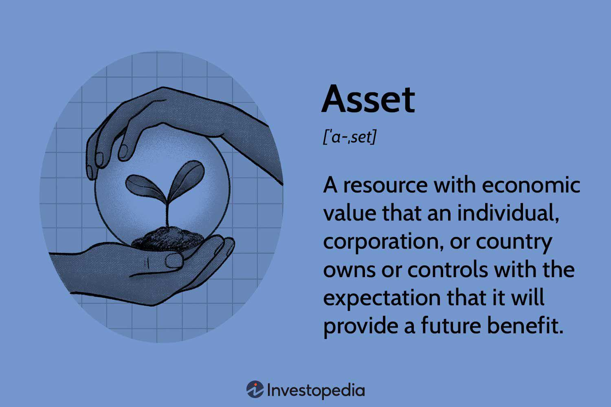

In the rapidly changing landscape of finance, grasping the intricacies of financial and business assets is crucial for both investors and traders. Financial assets, such as stocks, bonds, currencies, and commodities, represent instruments with monetary value that can be traded in financial markets. Business assets, on the other hand, encompass the tangible and intangible resources owned by a company, including machinery, buildings, patents, and brand values, which are essential for the company's future benefits and growth.

The interplay between financial and business assets is an important element in sophisticated trading strategies, notably in the context of algorithmic trading. Algorithmic trading, or algo trading, involves using computer algorithms to automate the execution of trades based on specific criteria. This approach enhances trading efficiency by executing trades with speed and precision, minimizing human error and emotional interference.



Understanding the classification and functionality of financial and business assets is essential for optimizing trading strategies and improving asset management efficiency. Financial assets are crucial for liquidity and diversification, while business assets often determine a company's financial health and future earning potential. By leveraging algorithmic trading technologies, traders and investors can enhance their strategic decisions, maximize returns, and explore innovative pathways in their investment portfolios.

This article aims to provide a thorough overview of these concepts, shedding light on how modern trading technology can redefine asset management practices. Before delving further, it is essential to explore the definitions and classifications of financial and business assets.

## Table of Contents

## Understanding Financial Assets

Financial assets are fundamental tools that facilitate the exchange and growth of capital in financial markets. These instruments carry intrinsic monetary value, enabling their trade and transfer among investors. Key categories of financial assets include stocks, bonds, currencies, and commodities. Each of these plays a critical role in investment strategies, serving as pivotal vehicles for achieving portfolio diversification and liquidity.

**Stocks** represent ownership in a company, granting shareholders a claim on part of the corporation's assets and earnings. They are essential for capital appreciation and income generation through dividends. **Bonds**, considered fixed-income securities, are debt instruments issued by corporations or governments to raise capital. Investors in bonds receive regular interest payments and the return of principal upon maturity. **Currencies** facilitate international trade and investment, with the foreign exchange market (Forex) being the most liquid financial market globally. Lastly, **commodities** are raw materials or primary agricultural products that can be bought and sold, such as gold, oil, and wheat. Trading in commodities allows investors to hedge against inflation and diversify their portfolios.

Valuation and [liquidity](/wiki/liquidity-risk-premium) are paramount considerations when dealing with financial assets. Valuation encompasses methods like discounted cash flow analysis for stocks, yield comparison for bonds, and purchasing power parity for currencies. Liquidity, defined as the ease with which an asset can be converted into cash without affecting its market price, is crucial for minimizing transaction costs and capitalizing on market opportunities.

Financial assets significantly contribute to economic activities by enabling capital allocation, risk management, and wealth transfer. They enhance market efficiency by reflecting all available information in their prices, thereby guiding investment decisions and economic forecasts. The interrelationship between financial assets and economic development underscores the importance of robust financial markets in facilitating growth.

In conclusion, understanding the dynamics of financial assets is essential for both individual and institutional investors. Mastery of these instruments empowers traders to achieve optimal investment outcomes and maintain a competitive edge in the financial landscape.

## Decoding Business Assets

Business assets are critical resources that companies own with the expectation that they will provide future economic benefits. These assets are split into two broad categories: tangible and intangible. Tangible assets are physical items like machinery, buildings, and land. These are often easier to value due to their physical presence and market comparables. For example, machinery can be appraised based on its current market value after accounting for depreciation through methods such as straight-line or reducing balance methods.

Intangible assets, on the other hand, include non-physical items such as patents, trademarks, goodwill, and brand value. Despite lacking physical form, intangible assets significantly influence company valuation and can offer competitive advantages. Patents can protect a company’s innovations, while a strong brand value can increase consumer loyalty and command premium pricing, thus enhancing future [earning](/wiki/earning-announcement) potential.

The evaluation of a company's financial health and future earning potential often hinges on its assets and liabilities. The asset-liability framework informs the balance sheet, a financial document crucial for stakeholders analyzing a company’s worth and financial viability. The equation Assets = Liabilities + Equity forms the foundation of the balance sheet, where managing business assets efficiently can lead to sustainable growth and operational success.

Efficient management of business assets involves regular monitoring and optimizing resource use to enhance productivity and profitability. This becomes crucial in maintaining a company’s competitive edge as it ensures resources are not underutilized or overstrained. Asset turnover ratios can be employed as a key performance indicator (KPI) to gauge the efficiency by dividing sales by average total assets. A higher ratio suggests efficient use of assets in generating revenue.

Additionally, aligning asset management strategies with corporate objectives ensures that all company resources contribute effectively to long-term goals. For instance, investing in cutting-edge technology or talent may create intangible assets that deliver transformative benefits.

Maintaining a strong asset portfolio not only aids in strategic execution but also positions the company favorably in accessing capital markets. Lenders and investors often view robust asset management as indicative of sound economic practices, reducing perceived risk and potentially lowering the cost of capital.

In summary, understanding and managing business assets—both tangible and intangible—are crucial in assessing a company's financial health and ensuring its ongoing competitive advantage. These resources underpin growth strategies, influence financial metrics, and can determine a company's overall market success.

## Intersection of Financial and Business Assets in Trading

Understanding the interplay between financial and business assets is crucial for strategic asset trading. This relationship is central to how companies operate and grow, as well as how investors make informed decisions to optimize their portfolios. 

Companies often leverage financial markets to raise capital by issuing and trading financial assets such as stocks and bonds. When a company issues new shares, it essentially converts part of its business assets into financial assets. This capital infusion can be utilized to enhance business assets, such as acquiring new machinery, investing in research and development, or expanding operations. Thus, the trading of financial assets directly affects the composition and value of a company's business assets. 

Investors, on the other hand, use financial asset valuation as a proxy for assessing a company's performance and its future growth prospects. By analyzing metrics such as earnings per share (EPS), price-to-earnings (P/E) ratio, and dividend yields, investors can determine the intrinsic value of securities relative to their market price. This valuation helps in selecting stocks that are undervalued or have high growth potential, ultimately influencing investment decisions and strategies.

The synergy between financial and business assets offers opportunities for risk management and maximization of investment returns. Diversification strategies, for instance, hinge on understanding how different classes of assets respond to market changes. Diversified portfolios typically include a mix of stocks, bonds, and sometimes commodities or real estate, to mitigate risk and enhance returns over time. 

Case studies provide insightful examples of effective asset management and trading strategies. For instance, the use of derivatives such as options can hedge against adverse price movements in underlying assets. A company might use such financial instruments to guard against inflation or fluctuations in currency exchange rates that could impact its business operations. Similarly, investors might engage in sector rotation strategies, which involve shifting investments from one sector to another based on economic cycles, ensuring that both financial and business assets are optimized to generate the highest returns relative to their risk profiles.

In conclusion, the dynamic relationship between financial and business assets is a cornerstone of effective trading and investment strategies, offering both companies and investors the means to enhance value and manage risk comprehensively.

## The Rise of Algorithmic Trading

Algorithmic trading refers to the use of advanced computational algorithms to automate and optimize the execution of trades according to predefined rulesets. This technology revolutionizes traditional trading by enhancing efficiency through quick and precise execution that surpasses human capabilities. Notably, it mitigates the emotional biases that can negatively affect decision-making, allowing a more systematic approach to trading. 

At the core of [algorithmic trading](/wiki/algorithmic-trading) is its ability to facilitate complex strategies such as [arbitrage](/wiki/arbitrage) and trend-following. Arbitrage involves capitalizing on price discrepancies between different markets or instruments, while trend-following focuses on identifying and investing in enduring market trends. By systematically analyzing market data and executing trades at optimal times, algorithms strengthen the potential for profitable outcomes.

One significant advantage of algorithmic trading is the reduction of transaction costs. Automated systems operate with minimal human intervention, curbing the expenses associated with manual trade execution. Furthermore, algorithms can execute trades at high frequencies and volumes, enhancing liquidity in financial markets. This increased liquidity benefits both retail and institutional traders by ensuring the availability of buyers or sellers if they wish to enter or [exit](/wiki/exit-strategy) trades swiftly.

Algorithmic trading also plays a pivotal role in asset management by optimizing trading decisions and outcomes. It utilizes large datasets and real-time market information to adjust strategies dynamically, ensuring that trading actions align with the prevailing market conditions. The integration of [machine learning](/wiki/machine-learning) algorithms further enhances these systems, allowing them to adapt by learning from past data and improving their predictive accuracy over time.

For example, consider a Python-based trading algorithm designed to identify arbitrage opportunities. Such an algorithm might look like this:

```python
import yfinance as yf  # For more datasets, visit: https://paperswithbacktest.com/datasets

def fetch_asset_prices(asset):
    data = yf.download(asset, period='1d', interval='1m')
    return data['Close']

def identify_arbitrage(opportunity_threshold=0.01):
    asset_a_prices = fetch_asset_prices('EURUSD=X')
    asset_b_prices = fetch_asset_prices('USDEUR=X')

    for a, b in zip(asset_a_prices, asset_b_prices):
        if a * b < 1 - opportunity_threshold:
            print(f'Arbitrage Opportunity: Buy EUR/USD at {a}, Sell USD/EUR at {b}')

identify_arbitrage()
```

This script uses Yahoo Finance to gather real-time prices of two currency pairs. If the product of these prices deviates significantly from one (considering transaction costs), an arbitrage opportunity is flagged.

The growing sophistication of algorithmic trading continues to reshape financial markets, promoting a more efficient and liquid trading environment. As technology advances and adapts to new market complexities, algorithmic trading remains an essential tool for traders and asset managers in maximizing returns and enhancing strategic decision-making.

## Leveraging Algorithmic Trading for Asset Management

Algorithmic trading significantly enhances the management of financial and business assets by utilizing sophisticated computational methods. Through [backtesting](/wiki/backtesting) and optimization, algorithmic trading systems enable the development of nuanced trading strategies, which can drastically mitigate risks while enhancing potential returns. Backtesting involves the application of trading strategies to historical data to determine their viability before applying them to live markets. This method allows traders to refine strategies iteratively, reducing the likelihood of unexpected losses.

The capability of algorithmic systems to process vast amounts of market data is pivotal in identifying trading opportunities. These systems can analyze patterns, trends, and market signals at speeds unattainable by human traders, making real-time decisions that optimize asset allocation and trading executions. This capacity for rapid data analysis is particularly valuable in high-frequency trading environments, where the speed of execution is crucial. For instance, algorithmic systems can execute a multitude of trades simultaneously, optimizing portfolios in response to even the smallest market fluctuations.

Platforms offering algorithmic trading tools are particularly valuable for traders and asset managers, allowing them to align their strategies with dynamic market conditions. These platforms often include features such as customizable algorithms, user-friendly interfaces, and integration with various data feeds and brokerage services, empowering traders to tailor their approaches based on specific market insights. An algorithm written in Python, for example, can be designed to automatically adjust a portfolio based on predefined risk parameters or market indicators.

```python
# Example: A simple moving average crossover strategy
import pandas as pd

def moving_average_crossover(prices, short_window, long_window):
    signals = pd.DataFrame(index=prices.index)
    signals['signal'] = 0.0

    # Calculate the short moving average
    signals['short_mavg'] = prices.rolling(window=short_window, min_periods=1).mean()

    # Calculate the long moving average
    signals['long_mavg'] = prices.rolling(window=long_window, min_periods=1).mean()

    # Generate signals
    signals['signal'][short_window:] = np.where(signals['short_mavg'][short_window:] 
                                                > signals['long_mavg'][short_window:], 1.0, 0.0)   

    # Generate trading orders
    signals['positions'] = signals['signal'].diff()

    return signals
```

This code highlights how traders can implement a straightforward moving average crossover strategy, a common method used in algorithmic trading. Here, trading signals are generated based on the relationship between short-term and long-term moving averages of asset prices.

By leveraging these algorithmic trading technologies, traders maximize their portfolios' performance by executing trades with sophistication, precision, and efficiency. These processes not only improve decision-making but also offer a strategic advantage in navigating volatile and complex market environments. This integration of technology and asset management signifies a transformative approach, facilitating robust financial strategies capable of adapting to rapid market changes. As a result, traders and investors are increasingly relying on algorithmic solutions to enhance their competitive edge in the financial markets.

## Challenges and Considerations in Algo Trading

Algorithmic trading, despite its transformative impact on financial markets, presents a suite of challenges that need careful management. One primary concern is the issue of overfitting, where trading algorithms are overly tailored to historical data. This can result in models that perform well in backtesting but poorly in real-world scenarios due to market fluctuations that were not considered during development. Such over-optimization can be mitigated through techniques like cross-validation and by ensuring that models generalize well across different datasets.

Data dependency is another challenge inherent in algorithmic trading. The success of an algorithm heavily depends on the quality, accuracy, and timeliness of the input data. Poor data can lead to erroneous trading decisions and substantial financial losses. To mitigate this risk, traders need robust data sourcing strategies, with diversified and reliable data feeds that cover a range of market conditions.

Market impact risks also present considerable challenges. High-frequency trading, a subset of algorithmic trading, can inadvertently cause market distortions, especially in less liquid markets. This can lead to increased [volatility](/wiki/volatility-trading-strategies) and exacerbate price swings. Traders can manage these risks by implementing algorithms that adapt trading velocity based on market conditions and liquidity levels.

Navigating regulatory requirements is crucial for trading strategies to remain compliant and ethical. Financial markets are subject to strict regulations that can vary significantly across jurisdictions. For instance, the European Union's MiFID II imposes stringent requirements on automated trading practices. Traders must stay informed about relevant regulations to ensure compliance, which may involve regular audits and updates to trading algorithms.

Technological failures and latency issues pose significant risks. The infrastructure supporting algorithmic trading must be robust to withstand operational failures, data lags, and cybersecurity threats. This demands comprehensive stress testing, redundant systems, and continuous monitoring to minimize the potential for disruptive downtime or costly errors. Efficient server locations and data routing can help reduce latency, ensuring timely execution of trades.

The balance between automation and human oversight is a critical consideration. While automation offers speed and efficiency, human intuition and judgment are invaluable for interpreting nuanced market conditions that algorithms may not effectively capture. This dual approach can prevent over-reliance on automated systems and enables traders to override or adjust algorithms when necessary, especially during unforeseen market turbulence.

To optimize algorithmic trading strategies sustainably, traders should adopt best practices, including rigorous testing and validation processes, diversification across multiple algorithms and asset classes, and a proactive approach to monitoring and adjusting strategies based on evolving market conditions. Continuous education and adaptation to technological advancements and regulatory changes are also essential for maintaining competitive and compliant trading operations.

## Conclusion

The integration of financial and business assets with algorithmic trading stands at the forefront of transforming asset management practices. In an era where precision and speed are paramount, the ability to harness technology allows traders to enhance their strategic outcomes and optimize portfolio performance. Algorithmic trading, with its capacity to process vast quantities of data and execute trades at unprecedented speeds, offers traders an edge in managing and maximizing the value of both financial and business assets.

As financial markets continue to evolve, the necessity for continuous learning and adaptation becomes apparent. Strategies that are effective today may not be tomorrow. A dynamic approach, constantly aligning with market conditions, is essential for staying competitive. Investors and traders must remain agile, routinely updating themselves with new tools, methodologies, and insights that technology provides.

Despite the remarkable advantages offered by algorithmic trading, understanding its inherent limitations is equally important. Concerns such as algorithmic overfitting, data quality issues, and market impact challenges must be carefully considered to mitigate potential risks. Moreover, navigating the regulatory landscape and ensuring compliance is crucial, as these factors play a significant role in successful trading operations.

Ultimately, the fusion of assets and technology holds the promise of delivering superior economic benefits. By intelligently applying algorithmic trading to manage financial and business assets, traders can not only achieve higher returns but also drive innovation within financial markets. This synergy is pivotal for fostering growth and capturing new opportunities in a rapidly changing financial environment.

## References & Further Reading

[1]: ["Advances in Financial Machine Learning"](https://www.amazon.com/Advances-Financial-Machine-Learning-Marcos/dp/1119482089) by Marcos Lopez de Prado

[2]: ["Quantitative Trading: How to Build Your Own Algorithmic Trading Business"](https://books.google.com/books/about/Quantitative_Trading.html?id=j70yEAAAQBAJ) by Ernest P. Chan

[3]: ["Machine Learning for Algorithmic Trading"](https://github.com/PacktPublishing/Machine-Learning-for-Algorithmic-Trading-Second-Edition) by Stefan Jansen

[4]: Bergstra, J., Bardenet, R., Bengio, Y., & Kégl, B. (2011). ["Algorithms for Hyper-Parameter Optimization."](https://dl.acm.org/doi/10.5555/2986459.2986743) Advances in Neural Information Processing Systems 24.

[5]: ["Evidence-Based Technical Analysis: Applying the Scientific Method and Statistical Inference to Trading Signals"](https://www.amazon.com/Evidence-Based-Technical-Analysis-Scientific-Statistical/dp/0470008741) by David Aronson