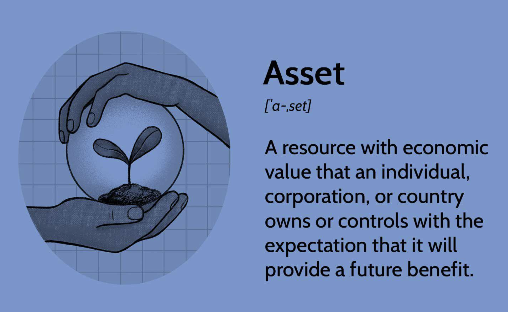

## Table of Contents

## What is an asset?

An asset is something that has value and can be owned or controlled to produce positive economic benefits. This can include money, property, or even things like patents and trademarks. Assets are important because they can be used to generate income, reduce expenses, or increase in value over time.

There are different types of assets, like current assets and fixed assets. Current assets are things that can be easily turned into cash within a year, like money in the bank or inventory. Fixed assets, on the other hand, are long-term items like buildings or machinery that a business uses for a long time. Understanding the difference between these types of assets helps people and businesses manage their finances better.

## What are the different types of assets?

Assets can be split into different types based on how they are used and how long they last. One type is called current assets. These are things that can be turned into cash quickly, usually within a year. Examples of current assets include cash, money in the bank, and inventory that a business has on hand to sell. They are important because they help businesses pay for day-to-day expenses and keep operations running smoothly.

Another type of asset is called fixed assets. These are things that a business uses for a long time, often more than a year. Buildings, machinery, and vehicles are examples of fixed assets. They are not meant to be sold quickly but are used to help the business make products or provide services. Fixed assets can lose value over time, which is called depreciation, but they are crucial for long-term business operations.

There are also intangible assets, which are different because you can't touch them. These include things like patents, trademarks, and brand names. Even though they don't have a physical form, they can be very valuable because they give a business special rights or a unique identity. Intangible assets can help a business stand out from competitors and can be a big part of its overall value.

## How do assets differ from liabilities?

Assets and liabilities are two important parts of a company's finances, but they are very different. Assets are things that a company owns and that have value. They can help the company make money or save money. For example, cash, buildings, and even things like patents are assets. They are important because they can be used to run the business and make it grow.

Liabilities, on the other hand, are what a company owes to others. This can include loans, bills that need to be paid, and money owed to suppliers. Liabilities are important to keep track of because they show how much money the company needs to pay back. While assets add value to a company, liabilities take away from its value because they are debts that need to be settled.

Understanding the difference between assets and liabilities is key to managing a company's finances well. If a company has more assets than liabilities, it is in a good financial position. But if liabilities are higher than assets, the company might be in trouble because it owes more than it owns. Keeping a good balance between the two helps a business stay healthy and grow over time.

## What are current assets and how do they function in a business?

Current assets are things a business owns that can be turned into cash within a year. They include cash, money in the bank, inventory, and money that customers owe the business, which is called accounts receivable. These assets are important because they help a business pay for everyday expenses like salaries, rent, and supplies. They also help the business keep running smoothly by making sure there's enough money to cover short-term needs.

In a business, current assets work like a safety net. They make sure the business can pay its bills on time and keep operations going without interruption. For example, if a business sells products, it needs inventory as a current asset to have goods ready to sell. When those goods are sold, the money from sales becomes cash, another current asset, which can then be used to buy more inventory or pay other expenses. Keeping a good level of current assets helps a business stay financially healthy and ready for any short-term challenges.

## What are fixed assets and why are they important?

Fixed assets are things a business owns that it uses for a long time, usually more than a year. These can include buildings, machinery, vehicles, and computers. Unlike current assets, fixed assets are not meant to be sold quickly. Instead, they help the business make products or provide services over a long period.

Fixed assets are important because they are the backbone of a business's operations. They help the business do its work and make money. For example, a factory needs machines to make products, and a delivery company needs trucks to move goods. Over time, fixed assets can lose value, which is called depreciation, but they are still crucial for the business to keep running and growing.

## How are intangible assets valued and why are they significant?

Intangible assets are things you can't touch but still have value, like patents, trademarks, and brand names. Valuing them can be tricky because they don't have a clear price tag like a building or a machine. Often, their value is based on how much money they can help the business make. For example, a patent might be valued based on the future profits it could bring in by giving the company exclusive rights to sell a product. Sometimes, experts use methods like looking at similar deals in the market or figuring out how much it would cost to recreate the asset from scratch.

These assets are important because they can give a business a big advantage over others. A strong brand name, like Coca-Cola or Nike, can make customers loyal and willing to pay more for products. Patents and trademarks protect a company's unique ideas and products, stopping others from copying them. This can help the business keep making money and growing. Even though you can't see or touch them, intangible assets can be some of the most valuable things a company owns.

## What is the role of assets in financial statements?

Assets play a big role in financial statements because they show what a company owns and how much it's worth. On a financial statement like a balance sheet, assets are listed first. They are split into different types, like current assets, fixed assets, and intangible assets. This helps people see how much money the company has right now, what it owns for the long term, and what special rights or brand value it has. Knowing the total value of assets helps people understand if the company is doing well financially.

Assets also help people see if a company can pay its bills and keep running smoothly. For example, current assets show how much cash and other things that can be turned into cash quickly the company has. This is important because it tells if the company can pay its short-term debts. Fixed assets show what the company uses to make money over a long time, like buildings and machines. Intangible assets, like patents and trademarks, can be very valuable because they give the company special rights and help it stand out. Together, all these assets give a full picture of the company's financial health.

## How do depreciation and amortization affect asset values?

Depreciation and amortization are ways to show how assets lose value over time. Depreciation is used for things like buildings and machines, which are called tangible assets. Over time, these things wear out or become outdated, so their value goes down. Businesses spread out this loss of value over the years they use the asset. This helps them match the cost of the asset with the money it helps them make. On financial statements, depreciation reduces the value of the asset on the balance sheet and is also listed as an expense on the income statement.

Amortization works in a similar way but is used for intangible assets, like patents and trademarks. These assets also lose value over time, but because you can't touch them, we use the term amortization instead of depreciation. Like depreciation, amortization spreads the cost of the intangible asset over its useful life. This means the value of the asset goes down a little bit each year on the balance sheet, and the cost is shown as an expense on the income statement. Both depreciation and amortization help businesses show a more accurate picture of their financial health by accounting for how assets lose value over time.

## What are the tax implications of owning various types of assets?

Owning different types of assets can affect how much tax you have to pay. For example, if you own things like buildings or machines, you can claim depreciation on your taxes. This means you can reduce your taxable income by a little bit each year as the asset loses value. This can help you pay less tax because it lowers the amount of money you're taxed on. But, you need to follow the rules about how much you can claim each year, and these rules can be different depending on where you live.

Another type of asset, like stocks or bonds, can also affect your taxes. If you sell these investments and make a profit, you might have to pay capital gains tax. This tax is on the money you made from selling the asset for more than you paid for it. How much you pay can depend on how long you owned the asset before selling it. If you owned it for a short time, you might pay a higher rate than if you held onto it for a longer time. Also, some types of income from investments, like interest or dividends, can be taxed differently, so it's important to know the rules for each type of asset you own.

## How can assets be used as collateral for loans?

Assets can be used as collateral for loans, which means you give the lender something valuable in case you can't pay back the loan. If you don't pay, the lender can take the asset and sell it to get their money back. This makes the lender feel safer about giving you the loan because they have something to fall back on. Common assets used as collateral include houses, cars, and sometimes even things like jewelry or savings accounts.

Using assets as collateral can help you get a loan more easily and sometimes at a lower interest rate. Lenders see the loan as less risky because they can take the asset if needed. But, it's important to be careful because if you can't pay back the loan, you could lose the asset. This is why it's a good idea to only use assets as collateral if you're sure you can make the loan payments on time.

## What strategies can be used for asset management and optimization?

Asset management and optimization are important for making sure a business uses its resources well. One way to do this is by keeping track of all the assets and making sure they are used as much as possible. For example, a business might use a computer system to see which machines are working and which ones need fixing. By fixing machines quickly, the business can keep making products without delays. Another strategy is to sell assets that are not needed anymore. If a company has old computers that no one uses, selling them can bring in extra money and free up space.

Another important part of asset management is planning for the future. This means thinking about what assets the business will need in the next few years and making sure they are ready. For example, if a business knows it will need more trucks in a year, it can start saving money now to buy them. It's also important to keep an eye on how much assets are worth and how they are doing. If an asset is losing value fast, the business might decide to sell it before it loses more value. By doing these things, a business can make sure it has the right assets at the right time and uses them in the best way possible.

## How do global economic factors influence asset valuation and investment decisions?

Global economic factors can have a big impact on how much assets are worth and what investments people choose to make. For example, if the economy in a country is doing well, people might feel more confident and be willing to spend more money on things like houses and stocks. This can make the value of these assets go up. On the other hand, if there's a lot of uncertainty or problems like high inflation or a recession, people might be more cautious and not want to invest in risky assets. This can cause the value of assets to go down because fewer people want to buy them.

Another way global economic factors affect asset valuation is through changes in interest rates and currency values. If interest rates go up in a country, it can make borrowing money more expensive, which might slow down the economy and lower the value of assets like real estate and stocks. Also, if a country's currency gets weaker compared to others, it can make investments in that country less attractive to foreign investors. This can lead to less money coming into the country and lower asset values. Keeping an eye on these global economic factors helps people make smarter choices about where to put their money.

## References & Further Reading

[1]: ["Advances in Financial Machine Learning"](https://www.amazon.com/Advances-Financial-Machine-Learning-Marcos/dp/1119482089) by Marcos Lopez de Prado

[2]: ["Quantitative Trading: How to Build Your Own Algorithmic Trading Business"](https://books.google.com/books/about/Quantitative_Trading.html?id=j70yEAAAQBAJ) by Ernest P. Chan

[3]: ["Machine Learning for Algorithmic Trading"](https://github.com/PacktPublishing/Machine-Learning-for-Algorithmic-Trading-Second-Edition) by Stefan Jansen

[4]: Bergstra, J., Bardenet, R., Bengio, Y., & Kégl, B. (2011). ["Algorithms for Hyper-Parameter Optimization."](https://dl.acm.org/doi/10.5555/2986459.2986743) Advances in Neural Information Processing Systems 24.

[5]: ["Evidence-Based Technical Analysis: Applying the Scientific Method and Statistical Inference to Trading Signals"](https://www.amazon.com/Evidence-Based-Technical-Analysis-Scientific-Statistical/dp/0470008741) by David Aronson