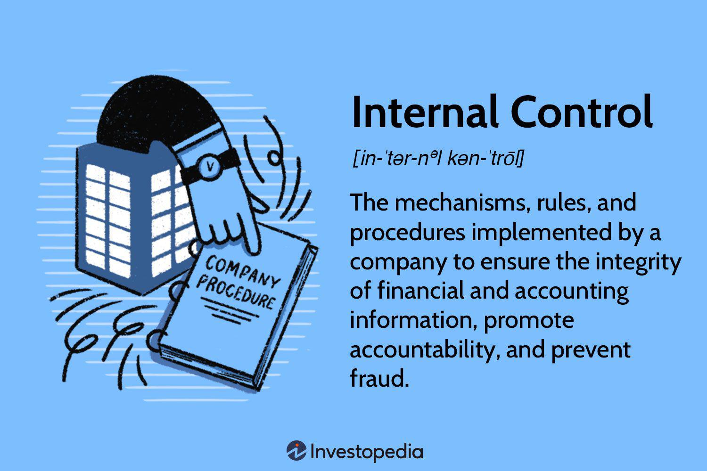

Algorithmic trading has fundamentally transformed financial markets by enabling the execution of trades at velocities and frequencies unattainable for human traders. This advancement is driven by sophisticated computer programs that automate the buying and selling of financial instruments, allowing for large volumes of transactions to occur with minimal human intervention. By utilizing preset criteria such as timing, price, or quantity, algorithmic trading optimizes the execution process to achieve specific financial objectives.

In this article, we explore the mechanisms that power algorithmic trading. These include order execution strategies, market prediction algorithms, risk management systems, and latency reduction techniques. We will also consider various assignment methods, such as FIFO (First In, First Out) and LIFO (Last In, First Out), which ensure efficient order distribution within trading systems. These mechanisms contribute significantly to market efficiency by reducing transaction costs and improving trade accuracy.

Furthermore, we will discuss the types of algorithms employed in financial markets and the advantages they bring, like enhanced market liquidity and the ability to capitalize on fleeting trading opportunities. However, algorithmic trading is not without its challenges. Dependence on technology introduces risks of system failures, and market volatility can lead to unpredictable algorithmic behavior. Increasing regulatory scrutiny also adds complexity to this domain. 

For anyone aspiring to succeed in this technology-driven and fast-paced environment, understanding these mechanisms is crucial. As financial markets continue to evolve, algorithmic trading remains a pivotal force in facilitating innovation and enhancing market performance.

## Table of Contents

## What is Algorithmic Trading?

Algorithmic trading, often called algo trading, is a systematic approach to executing trades using computer programs that follow a specified set of instructions. These instructions are algorithmic rules designed to make trading decisions based on various pre-defined criteria such as the timing of the trades, price thresholds, or specific quantities of the securities involved. 

The primary objective of algorithmic trading is to manage and execute large orders with reduced market impact and minimal risk. Unlike traditional human trading, which can be slow and prone to errors, algorithmic trading operates at high speeds and frequencies, allowing trades to be executed quickly and efficiently. This speed is essential in modern financial markets, where the time advantage can lead to significant differences in profit margins.

Algorithmic trading comes with several algorithms that dictate how trades are placed and executed. For example, simple strategies might involve executing trades when the stock price reaches a certain level, while more complex systems might analyze real-time data, such as market [volume](/wiki/volume-trading-strategy) and price movements, to make split-second trading decisions. These algorithms continuously scan the market and can execute trades automatically when the criteria are met, thus optimizing the trading process.

Since its early days, [algorithmic trading](/wiki/algorithmic-trading) has gained widespread adoption and has become a dominant trading method in contemporary financial markets. This shift is partly due to its ability to handle large volumes of transactions more efficiently than manual trading methods. Algorithmic trading reduces transaction costs because the algorithms can manage and execute orders more effectively, often by dividing them into smaller pieces and executing them over time to prevent drastic market fluctuations.

Understanding the basics of algorithmic trading is crucial for integrating more complex strategies and concepts. By comprehending the fundamental principles and technologies behind these algorithms, traders can enhance their trading experiences and outcomes. As technology continues to influence trading practices, grasping the basic concepts of algorithmic trading sets the foundation for exploring advanced strategies that exploit opportunities within financial markets.

## Key Mechanisms of Algorithmic Trading

Algorithmic trading mechanisms encompass several components and strategies, each tailored to fit different market needs and conditions. A fundamental aspect of this mechanism is the execution strategy, which determines how trades are executed in the market. Execution strategies often rely on algorithms that break down large orders into smaller parts and execute them over time to minimize market impact and achieve better average prices. For example, commonly used execution algorithms include the Volume Weighted Average Price (VWAP) and Implementation Shortfall strategies. These strategies use specific benchmarks to assess the optimal trade execution relative to market conditions.

Another important mechanism is market prediction algorithms, which rely heavily on statistical and quantitative data analysis to forecast market trends. These algorithms often employ historical data and [machine learning](/wiki/machine-learning) techniques to predict price movements and identify trading opportunities. Methods such as regression analysis, time series analysis, and neural networks are typically used to enhance the accuracy of market predictions. By effectively anticipating market trends, traders can devise strategies to exploit even short-lived opportunities.

Risk management algorithms are crucial as they help in mitigating potential losses by analyzing the risk-return profile of different trading strategies. These algorithms assess market conditions, asset correlations, and the potential impact of each trade on the portfolio's risk exposure. Key risk management techniques involve setting stop-loss orders, diversifying portfolios, and employing options strategies to hedge risks. By integrating these mechanisms, traders can sustain profitability while minimizing exposure to adverse market movements.

Another pivotal mechanism involves latency minimization, which ensures trades are executed as quickly as possible. In algorithmic trading, minimizing latency—the delay between making a trading decision and executing the trade—is critical to capitalizing on fleeting [arbitrage](/wiki/arbitrage) opportunities. High-frequency trading ([HFT](/wiki/high-frequency-trading-strategies)) systems invest considerably in reducing latency through streamlined algorithms, optimized network structures, and co-location services that place trading systems closer to exchanges. By achieving ultra-low latency, these systems can swiftly react to market movements, executing trades ahead of competitors and improving the likelihood of favorable execution prices.

Overall, understanding and optimizing these key algorithmic trading mechanisms enable traders to effectively and efficiently navigate the constantly evolving landscape of modern financial markets. Being adept with execution strategies, predictive modeling, risk management, and latency reduction is essential for developing a robust, responsive, and profitable trading system.

## Assignment Example Mechanisms

One of the critical components in algorithmic trading is the assignment of orders, a process that involves distributing transaction orders to various segments of the trading system to optimize execution efficiency. The assignment mechanism is typically determined by algorithmic methods, such as FIFO (First In, First Out), LIFO (Last In, First Out), or random assignment. These methodologies ensure orderly and timely execution of trades, minimizing market impact and trading costs.

### FIFO and LIFO Methods

FIFO and LIFO are two widely utilized methods in algorithmic order assignment. FIFO prioritizes orders based on their arrival time, ensuring that the earliest received order is executed first. This mechanism is beneficial in scenarios where the timing of trades is critical, as it can help maintain fairness and a first-come-first-serve order.

Conversely, LIFO executes the most recently received orders first. This method can be advantageous in rapidly changing markets where the latest information might provide better decision-making insights. By executing the latest orders first, traders can potentially capitalize on current market conditions more effectively.

### Random Assignment

A random assignment method distributes orders arbitrarily, without any regard for their sequence or arrival time. This approach might be used in situations where market conditions are stable, and the objective is to evenly distribute the trading volume among available resources or execution paths. While it may not always optimize for timing, random assignment can be effective in reducing systematic biases that could arise from a predictable assignment order.

### Real-World Example: Broker Allocation

An assignment mechanism can also involve the allocation of trades to different brokers, a situation often encountered in the real-world trading environment. For instance, routing trades through various brokerages can help analyze which intermediary offers the best execution rate, thus optimizing both performance and profitability.

The algorithm might dispatch smaller trade orders to multiple brokers, assess the resulting execution quality, and adjust future orders based on performance metrics. This dynamic assignment mechanism relies heavily on historical and real-time data analytics to refine and enhance trading outcomes continuously.

### Advantages of Optimizing Assignment Mechanisms

Understanding and refining the assignment mechanism is crucial to enhancing trading efficiency. A well-optimized order assignment system can lead to:

- Reduced transaction costs through strategic order fragmentation and timing optimization.
- Improved execution quality by choosing brokers or trading venues with the best track records.
- Enhanced ability to exploit market opportunities by prioritizing orders according to their potential profitability or strategic importance.

Overall, the assignment of orders is a vital component of algorithmic trading systems, intricately linked to maximizing the effectiveness and profitability of trading strategies. By leveraging advanced algorithmic methods and continuously measuring their efficacy, traders can achieve significant improvements in their operational performance.

## Benefits of Algorithmic Trading

Algorithmic trading presents multiple benefits that significantly enhance trading practices within financial markets. One primary advantage is the reduction of transaction costs. Algorithms can parse through vast data sets and execute large volumes of trades within milliseconds, minimizing the market impact and reducing the costs associated with manual trading processes. The precision and speed offered by algorithmic systems are unmatched by human traders, leading to more efficient order executions.

Another notable benefit is the enhanced accuracy and precision brought about by pre-programmed algorithms. These algorithms operate based on predefined rules and strategies, which eliminates the potential for human error. For instance, emotional biases, which often affect human decision-making, are absent in algorithmic trading. This accuracy ensures that trades align precisely with the designed strategy.

Algorithmic trading also facilitates the exploitation of short-lived trading opportunities. Financial markets often present transient pricing inefficiencies caused by market dynamics, and algorithms can capitalize on these fleeting opportunities much faster than human traders. This capability increases the probability of generating profits, as the window for such opportunities is typically narrow. 

Furthermore, algorithms contribute significantly to maintaining market [liquidity](/wiki/liquidity-risk-premium), which is essential for ensuring smoother and more efficient market operations. By continuously scanning the market and executing trades, algorithmic systems help in providing the liquidity that market participants require, enhancing overall market stability.

The capacity for back-testing trading strategies using historical data is another crucial advantage of algorithmic trading. Traders can refine and optimize their strategies by analyzing how they would have performed under different historical market conditions. This analytical capability provides traders with valuable insights into the effectiveness of their strategies and allows for more informed decision-making. 

Collectively, these benefits contribute to making algorithmic trading a powerful tool in modern financial markets, providing traders with the means to increase efficiency, accuracy, and profitability while reducing costs and minimizing human error.

## Challenges in Algorithmic Trading

Algorithmic trading, while offering numerous advantages, also faces several challenges that traders must contend with. A significant challenge stems from the dependency on technology. Automated systems are inherently reliant on software and hardware infrastructure, and any technical malfunction, such as software bugs, network outages, or hardware failures, can result in substantial financial losses. For instance, a delayed execution or incorrect trade due to a system error can lead to unexpected and potentially severe financial repercussions.

Market [volatility](/wiki/volatility-trading-strategies) poses another challenge, affecting the predictability and stability of algorithms. During volatile periods, market conditions can change rapidly, and algorithms that are not designed to adapt to such fluctuations may behave unpredictably. This can result in increased risk and potential for large drawdowns. Quantitative models used in algorithmic trading are often calibrated under specific market conditions, and extreme volatility can render these models less effective.

Regulatory oversight is another critical concern for algorithmic trading. As automated trading has become more prevalent, regulatory bodies have intensified their scrutiny, implementing stringent rules to prevent market abuse and ensure fair trading practices. This includes measures such as the imposition of circuit breakers and restrictions on high-frequency trading activities. Compliance with these regulations requires algorithmic trading firms to invest in legal expertise and resources, adding complexity and cost to their operations.

Lastly, developing effective and adaptive algorithms requires considerable resources and expertise, presenting a barrier for smaller trading firms. The development process involves extensive research, back-testing, and optimization to ensure the algorithms perform well under various market conditions. It also requires continuous monitoring and updating to respond to market changes and regulatory requirements. Smaller firms may lack the capital and human resources necessary to compete with larger institutions that have dedicated teams and advanced technological resources for algorithm development and execution.

Despite these challenges, algorithmic trading continues to be an essential component of modern financial markets. Traders and firms that can effectively navigate these challenges are well-positioned to leverage the significant opportunities that algorithmic trading offers.

## Conclusion

Algorithmic trading has become an integral component of modern financial markets, providing efficiencies and opportunities far beyond the reach of manual trading methods. By automating the execution of trades, algorithms minimize transaction times and optimize execution costs, thus enhancing market liquidity and stability. Understanding the mechanisms and strategies inherent to algorithmic trading, such as order assignment methods like FIFO and LIFO, is essential for traders who wish to excel in this high-frequency, technology-driven sphere.

Despite its many advantages, algorithmic trading also presents formidable challenges that require careful navigation. The reliance on advanced technology means that system failures or glitches can result in significant financial losses. Additionally, the unpredictable nature of market volatility may affect the behavior of algorithms, leading to substantial drawdowns. As regulators continue to implement stringent controls over automated trading, staying informed about these changes is crucial for developing robust algorithmic strategies.

Traders who remain adaptable to technological advancements and regulatory shifts are best positioned to effectively leverage the benefits of algorithmic trading. This adaptability not only helps in mitigating risks but also in tapping into the full potential of algorithmic strategies for superior market performance. As financial markets continue to evolve, algorithmic trading stands as a pivotal driver of innovation and performance, offering new avenues for financial gains and a deeper understanding of market dynamics.

## References & Further Reading

[1]: Bergstra, J., Bardenet, R., Bengio, Y., & Kégl, B. (2011). ["Algorithms for Hyper-Parameter Optimization."](https://dl.acm.org/doi/10.5555/2986459.2986743) Advances in Neural Information Processing Systems 24.

[2]: ["Advances in Financial Machine Learning"](https://www.amazon.com/Advances-Financial-Machine-Learning-Marcos/dp/1119482089) by Marcos Lopez de Prado

[3]: ["Evidence-Based Technical Analysis: Applying the Scientific Method and Statistical Inference to Trading Signals"](https://www.amazon.com/Evidence-Based-Technical-Analysis-Scientific-Statistical/dp/0470008741) by David Aronson

[4]: ["Machine Learning for Algorithmic Trading"](https://github.com/stefan-jansen/machine-learning-for-trading) by Stefan Jansen

[5]: ["Quantitative Trading: How to Build Your Own Algorithmic Trading Business"](https://github.com/LucindaYa/quant-resources/blob/master/Quantitative%20Trading%20How%20to%20Build%20Your%20Own%20Algorithmic%20Trading%20Business.pdf) by Ernest P. Chan