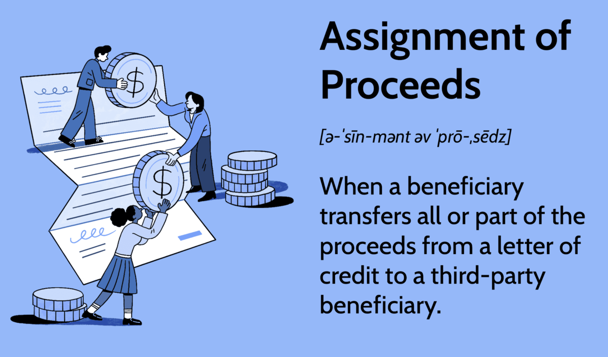

In the contemporary business landscape, comprehending financial mechanisms is vital for conducting economic operations efficiently. Among these mechanisms, the assignment of proceeds stands out as a critical financial tool, particularly for businesses involved in international trade. The intricate nature of global trade demands secure and effective financial strategies, where understanding the assignment of proceeds becomes indispensable. This concept involves transferring the rights to receive payment from a letter of credit to a third-party beneficiary, thus facilitating streamlined and secure financial transactions. By redirecting funds, businesses can settle payments seamlessly within complex trade agreements, thereby enhancing economic operations.

Additionally, the evolution of financial markets has given rise to algorithmic trading, which is rapidly transforming investment strategies with advanced technology. Algorithmic trading involves the use of computational algorithms to automate trading processes, thereby enhancing efficiency and precision in the financial markets. This trading style leverages data analytics and real-time market analysis to make quick decisions, optimizing trading outcomes and offering a competitive edge in volatile conditions.



As global trade increasingly integrates with sophisticated financial techniques, it is imperative for businesses to grasp these concepts to safeguard transactions and optimize financial growth. A profound understanding of the assignment of proceeds and algorithmic trading can enable businesses to manage financial transactions with greater security and agility. This article aims to explore essential financial terms, elucidate the assignment of proceeds, and examine the dynamic world of algorithmic trading. By setting a foundation for effectively leveraging these mechanisms in business finance, companies can strengthen their competitive positioning and realize growth in an ever-evolving financial landscape.

## Table of Contents

## Understanding Assignment of Proceeds

Assignment of proceeds is a financial mechanism primarily utilized in the domain of international trade finance. It involves the transfer of payment rights from the initial beneficiary of a letter of credit to a third-party beneficiary. This process plays a crucial role in facilitating secure and efficient financial transactions between businesses across different countries.

A letter of credit is a financial document provided by a bank that guarantees payment to the beneficiary, provided that the terms and conditions specified within the letter are met. The assignment of proceeds allows the original beneficiary to redirect the payment or a portion of it to another party. This redirection typically occurs under a line of credit, which enhances the fluidity of funds in complex trade agreements by ensuring that financial obligations to suppliers, manufacturers, or other third parties are met without delay.

One of the key features of this financial tool is the requirement for the financial institution’s approval to proceed with the assignment. The bank that issued the letter of credit must approve the redirection of funds to ensure adherence to the original credit terms. This approval process strengthens the integrity of the transaction by verifying that all parties involved comply with the contract stipulations.

By leveraging the assignment of proceeds, original beneficiaries—often exporters or sellers—gain the ability to manage their financial commitments more adeptly. They can maintain control over their transaction processes while mitigating potential risks associated with international trade. For example, if a seller owes a portion of the letter of credit proceeds to a supplier for raw materials, the assignment of proceeds ensures that the supplier is paid without requiring additional financial maneuvers by the seller.

This financial mechanism provides flexibility to the original beneficiaries by allowing them to prioritize and resolve various financial obligations. However, they must remain aware that the responsibility for adhering to the initial terms of credit rests on their shoulders. Consequently, the assignment of proceeds necessitates careful management of financial agreements and partnerships to ensure that obligations are fulfilled according to the prescribed terms.

In summary, the assignment of proceeds is a vital tool in international trade, offering numerous advantages in improving payment processes and mitigating risks associated with global transactions. By understanding and employing this process, businesses engaged in international trade can enhance their financial flexibility and transactional security.

## Benefits and Drawbacks of Assignment of Proceeds

Assignment of proceeds offers several significant advantages for businesses engaged in international trade. One primary benefit is the mitigation of risk, as it establishes secure payment settlements which in turn instill confidence in beneficiaries. By ensuring that funds are directed appropriately, parties involved in complex trade transactions can experience smoother trade flows and enhance the overall reliability of their financial dealings.

Flexibility is another notable advantage of assignment of proceeds. The option to redirect only a portion of the proceeds allows beneficiaries to address various financial commitments more effectively. This capability to allocate payments partially enables businesses to manage financial resources dynamically to meet ongoing commitments or invest in growth opportunities without disrupting their entire financial arrangement.

Despite these benefits, there are inherent drawbacks to consider. The original beneficiary remains accountable for the conditions specified in the initial credit agreement even when funds are redirected. This ongoing responsibility may translate into additional financial obligations. The original party must ensure that all initial credit terms are satisfied, which may impose a financial strain if unforeseen circumstances alter the expected flow of proceeds.

The dual obligation that results from having to satisfy both the credit terms and manage redirected funds requires careful evaluation of financial standing and trade partnerships. Businesses must assess their financial health and the reliability of their partners to make informed, strategic decisions. This evaluation is crucial in mitigating potential risks and ensuring that both immediate and long-term financial objectives are met. As such, the assignment of proceeds is a tool that offers both opportunities and challenges, requiring diligent scrutiny and strategic planning to optimize its use effectively.

## Algorithmic Trading in Modern Finance

Algorithmic trading, commonly referred to as algo trading, is a sophisticated financial process that utilizes computational algorithms to automate trading activities in financial markets. This approach has revolutionized how trading is conducted by significantly enhancing the efficiency and precision of transactions. By automating the trading process, [algorithmic trading](/wiki/algorithmic-trading) minimizes manual intervention, thereby reducing the likelihood of human error and ensuring consistent execution of trading strategies.

A key feature of algorithmic trading is its ability to leverage advanced data analytics and real-time market analysis. Traders can analyze large volumes of data almost instantaneously, allowing for quick decision-making that optimizes trading outcomes. Algorithms can process multiple market variables and historical data to identify trading opportunities that would be challenging to discern using traditional methods.

The algorithmic trading systems can implement various strategies, such as statistical [arbitrage](/wiki/arbitrage), [market making](/wiki/market-making), and [trend following](/wiki/trend-following). These systems use mathematical models to identify market inefficiencies and execute trades within milliseconds, a speed unattainable by human traders.

```python
# Example Python code for a simple moving average crossover strategy
import pandas as pd

def moving_average_crossover(prices, short_window, long_window):
    signals = pd.DataFrame(index=prices.index)
    signals['price'] = prices
    signals['short_mavg'] = prices.rolling(window=short_window, min_periods=1).mean()
    signals['long_mavg'] = prices.rolling(window=long_window, min_periods=1).mean()
    signals['signal'] = 0.0
    signals['signal'][short_window:] = \
        np.where(signals['short_mavg'][short_window:] > signals['long_mavg'][short_window:], 1.0, 0.0)   
    signals['positions'] = signals['signal'].diff()
    return signals

# Assuming 'data' is your DataFrame with stock prices
signals = moving_average_crossover(data['Close'], 40, 100)
```

One of the substantial benefits of algorithmic trading is the reduction in transaction costs. Automation allows for efficient order placement directly with market exchanges, bypassing intermediaries and exploiting the best pricing available. Additionally, the rapid execution of trades minimizes the impact of market fluctuations on transaction pricing.

Moreover, algorithmic trading provides a competitive edge in volatile markets by enabling quick adaptation to changing market conditions. Traders can implement strategies that respond dynamically to market trends and events, optimizing returns and maintaining a competitive posture.

However, the reliance on technology and complex algorithms introduces risks that must be managed vigilantly. Technical malfunctions, such as hardware failures or software bugs, can disrupt trading operations and lead to significant financial losses. Furthermore, the high-speed nature of algorithmic trading can exacerbate market [volatility](/wiki/volatility-trading-strategies) and contribute to market manipulation, posing systemic risks to financial stability.

Therefore, effective monitoring and adaptive strategies are essential to mitigate these risks. Continuous oversight ensures the algorithms function correctly and align with market conditions, while adaptive algorithms can adjust to unforeseen events, thereby ensuring robust trading operations. Overall, while algorithmic trading offers numerous benefits in terms of efficiency and cost-effectiveness, it requires diligent management and strategic planning to realize its full potential in modern finance.

## Interrelation of Financial Terms in Business Finance

The intersection of assignment of proceeds and algorithmic trading reflects the progressive nature of business finance. This evolution underscores the importance of marrying traditional financial instruments with contemporary, technology-oriented methodologies. The assignment of proceeds, a foundational component in international trade finance, grants businesses the ability to secure settlements and manage payment flows efficiently. By redirecting funds from a letter of credit to a third-party beneficiary, companies solidify transaction security and financial adaptability.

Simultaneously, algorithmic trading represents the pinnacle of modern financial strategies, employing sophisticated algorithms to optimize trading decisions with speed and precision. This method capitalizes on vast amounts of financial data and real-time market analytics, automating trades to enhance cost-effectiveness and minimize human error.

By integrating these two frameworks, businesses can significantly streamline their operations. Understanding and applying the assignment of proceeds can enhance transaction security—a paramount concern in international finance—by ensuring that financial commitments are met without default. When coupled with the precise execution capabilities offered by algorithmic trading, businesses can effectively manage their financial portfolios, responding dynamically to market fluctuations.

In practice, effectively harnessing these financial tools necessitates a balance of risk management, technical acumen, and strategic financial planning. Risk management is critical to navigate potential downfalls, such as the inherent risks of maintaining dual obligations in an assignment of proceeds or addressing the technological dependencies in algorithmic trading. Technical acumen is also essential, particularly given the complex algorithms underlying automated trading systems, which demand a fluency in data analysis and computational finance.

Strategic financial planning is indispensable for business growth, where these mechanisms can be tailored to fit an organization’s financial goals. With well-considered strategies, businesses can leverage traditional tools like the assignment of proceeds alongside tech-driven methods such as algorithmic trading to fortify their competitive edge in a rapidly evolving financial landscape. This synthesis dictates their capacity for sustaining profitability and achieving long-term financial success.

## Conclusion

Mastering financial terms like assignment of proceeds and adopting algorithmic trading are essential for businesses that seek to succeed in today's competitive global market. The shifting financial landscape demands an understanding of both traditional tools and modern technologies to stay relevant and effective. Assignment of proceeds, by facilitating secure payment flows in international trade, helps mitigate risks and optimize financial commitments. This mechanism allows businesses to confidently engage in global transactions, providing the flexibility needed to manage diverse financial obligations while mitigating exposure to financial liabilities.

Algorithmic trading, on the other hand, is transforming investment strategies through its use of computational algorithms that enhance transaction speed and accuracy. By automating trading processes, companies can reduce transaction costs and minimize human error, thereby gaining a competitive edge. The ability to react spontaneously to market shifts through precise analytics is invaluable in today's volatile financial markets.

Integrating these concepts into business finance underscores the need for adaptation and innovation. Businesses must continuously evolve their strategies while carefully managing associated risks. This synthesis of traditional financial mechanisms and modern technological advancements will determine competitive positioning. Companies that successfully blend these approaches can better navigate financial landscapes and, therefore, secure sustainable growth and strategic advantages in the global market.

## References & Further Reading

[1]: ["Documentary Credits: UCP 600 & ISBP"](https://exportdevelopmentinstitute.com/documents/ucp600-2020.pdf) International Chamber of Commerce Publication.

[2]: Kiefer, P. P., & Falzone, P. A. (2002). "The Assignment of Proceeds in Letters of Credit Transactions: A Proposal for International Trade." Business Lawyer.

[3]: Pardo, R. (2011). ["The Evaluation and Optimization of Trading Strategies, Second Edition"](https://onlinelibrary.wiley.com/doi/book/10.1002/9781119196969). Wiley Trading Series.

[4]: Brogaard, J., Hendershott, T., & Riordan, R. (2014). ["High-Frequency Trading and Price Discovery"](https://academic.oup.com/rfs/article-abstract/27/8/2267/1582754). Review of Financial Studies.

[5]: Aldridge, I. (2013). ["High-Frequency Trading: A Practical Guide to Algorithmic Strategies and Trading Systems"](https://books.google.com/books/about/High_Frequency_Trading.html?id=6l0DDQAAQBAJ). Wiley Finance.