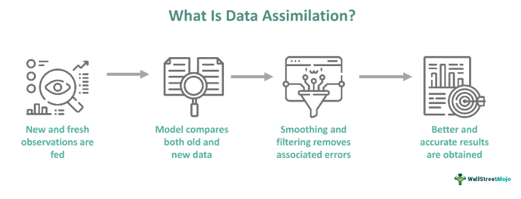

The intersection of cultural shifts and technological advancements profoundly influences various sectors worldwide, and the financial domain is no exception. Algorithmic trading, often referred to as algo trading, stands out as a prominent development within this space. It's not merely a technological innovation but a complex tool that intertwines diverse cultural practices and adaptation strategies. As global markets increasingly rely on automated systems for trading decisions, understanding the cultural implications of these technologies becomes crucial.

Algo trading employs sophisticated computer algorithms to automate trading strategies, enhancing the speed and efficiency of transactions. However, its integration into the financial markets extends beyond technical sophistication. It involves navigating the diverse cultural landscapes that shape financial exchanges worldwide. Cultural practices, regulatory frameworks, and local market conditions all play a role in shaping how algo trading is adopted and adapted across different regions.



This article explores the interplay between technological advancement and cultural factors in algorithmic trading. We examine how assimilation, integration, and cultural adaptation influence the deployment and success of algo trading systems in global markets. Assimilation involves the absorption of new technologies into existing market infrastructures, ensuring minimal disruption and maximizing efficiency. Integration requires the merging of varied cultural elements to form cohesive strategies that align with both local norms and global practices. Cultural adaptation, on the other hand, revolves around tailoring trading strategies to meet the specific needs of diverse markets, taking into account local nuances and regulatory requirements.

The ability to balance technological efficiency with cultural considerations is becoming increasingly important. As financial markets become more interconnected, the successful implementation of algo trading strategies rests on understanding and respecting cultural differences. In doing so, we can pave the way for more inclusive and innovative market solutions. Ultimately, this integration of technology and culture in trading not only enhances the robustness of algo trading but also offers insights that can inform other industries grappling with automation.

## Table of Contents

## Understanding Algorithmic Trading

Algorithmic trading involves the use of computer algorithms to execute trading strategies, thereby automating financial trading decisions. By utilizing complex algorithms, traders can analyze large datasets to identify trading opportunities that would be less apparent to humans. The roots of algorithmic trading lie in data analysis and advanced technological processes, significantly transforming the operations of financial markets.

Algo trading has revolutionized market operations by providing the capability to execute trades at optimal prices with increased speed and accuracy. By reducing the reliance on direct human intervention, algorithmic trading minimizes human error and subjective decision-making. These systems can analyze multiple market variables simultaneously, executing trades based on predefined criteria and market conditions, often in fractions of a second.

For example, in [quantitative trading](/wiki/quantitative-trading), an algorithm might be designed to buy a stock if a certain set of technical indicators align, such as a moving average crossover. This can be represented in a simple Python function:

```python
def moving_average_crossover(stock_prices, short_window=40, long_window=100):
    short_mavg = stock_prices.rolling(window=short_window).mean()
    long_mavg = stock_prices.rolling(window=long_window).mean()

    buy_signals = (short_mavg > long_mavg) & (short_mavg.shift(1) <= long_mavg.shift(1))

    return buy_signals
```

As [algorithmic trading](/wiki/algorithmic-trading) advances, its interaction with various cultural and institutional environments becomes increasingly significant. Different regions possess unique economic, regulatory, and cultural landscapes that can influence how algorithmic trading strategies are crafted and implemented. Such influences necessitate a nuanced understanding of these environments to design algorithms that not only operate efficiently but also remain compliant with local norms and regulations.

The ongoing development of algo trading prompts financial institutions to consider its broader societal and cultural implications. Traders and financial institutions must be able to navigate various challenges, including differing regulatory standards and market practices. This understanding is crucial to ensuring that the integration of algo trading into existing financial systems is smooth and effective, paving the way for its successful application across diverse global contexts.

## Assimilation in Financial Markets

Assimilation in finance involves the process through which new technologies or practices are integrated into pre-existing systems. In the context of algorithmic trading (algo trading), this assimilation can encompass the incorporation of advanced data analysis techniques or the development of innovative financial models that enhance efficiency and decision-making capabilities. This process of assimilation is crucial, as it ensures a seamless transition and minimizes disruptions in trading workflows.

One of the core aspects of successful assimilation in algo trading is the ability to integrate sophisticated data analytics methodologies. These methodologies often leverage large datasets and employ statistical models to make informed predictions about market trends and price movements. For instance, [machine learning](/wiki/machine-learning) algorithms can analyze historical market data to identify patterns and predict future movements, thereby optimizing trading strategies. This integration of machine learning not only improves decision-making precision but also reduces the dependency on human intuition, which can be prone to biases.

Furthermore, the evolution of traditional trading floors into digital platforms is a prime example of assimilation in financial markets. Historically, trading floors were bustling environments where traders physically gathered to negotiate and execute trades. However, with the advent of electronic trading systems, these environments have transformed significantly. Modern trading platforms enable transactions to be executed electronically, ensuring faster processing times and broader market access. This digital transition reflects the assimilation of new technologies, offering enhanced [liquidity](/wiki/liquidity-risk-premium) and transparency in the markets.

Python code has played a vital role in facilitating the assimilation of technological innovations in algo trading. The use of Python for algorithm development and data analysis has become prevalent due to its robust libraries such as NumPy, pandas, and scikit-learn. These tools allow traders to implement complex trading algorithms and perform extensive data analysis efficiently. Below is an example of how Python can be used to simulate a simple algorithmic trading strategy:

```python
import numpy as np
import pandas as pd

# Load market data
data = pd.read_csv('market_data.csv')
prices = data['Close']

# Define a simple moving average strategy
window_size = 20
signal = prices.rolling(window=window_size).mean()

# Determine buy/sell signals
buy_signals = (prices > signal) & (prices.shift(1) <= signal.shift(1))
sell_signals = (prices < signal) & (prices.shift(1) >= signal.shift(1))

# Calculate returns
returns = np.log(prices / prices.shift(1))
strategy_returns = returns.where(buy_signals, -returns.where(sell_signals, 0))

cumulative_returns = strategy_returns.cumsum()
print(f"Cumulative Strategy Returns: {cumulative_returns[-1]:.2f}")
```

This Python snippet illustrates a basic moving average crossover strategy, where buy and sell signals are generated based on the relationship between price and its moving average. Successful assimilation of such algorithmic strategies can significantly enhance trading efficiency, demonstrating the integration of technological innovation within financial systems.

In summary, assimilation in algo trading encompasses the integration of new analytical techniques and digital innovations, leading to more efficient and effective market participation. The transition from traditional practices to technologically advanced systems underlines the importance of assimilation in maintaining the competitiveness and sustainability of modern financial markets.

## Integration of Cultural Elements

Integration involves merging different systems or ideas to form a cohesive unit, and in the context of algorithmic trading, it necessitates aligning trading strategies with regional economic policies and practices. Algorithmic trading, which utilizes automated programs to conduct trades, operates under a global framework where economic environments and regulatory conditions vary significantly. Therefore, integrating cultural elements into algorithmic trading requires acknowledging and adapting to these regional nuances to ensure efficiency and compliance.

In areas with distinct economic regulations, customs, and transaction methods, cultural integration becomes crucial. Various countries impose different regulatory demands that can influence trading algorithms. For example, Europe's Markets in Financial Instruments Directive (MiFID II) emphasizes transparency and investor protection, which necessitates developing algorithms that comply with these regulations while effectively performing trades. Similarly, in the United States, trading algorithms must align with regulations set by the Securities and Exchange Commission (SEC) and the Commodity Futures Trading Commission (CFTC). Failing to [factor](/wiki/factor-investing) in such regulatory frameworks can lead to compliance risks and financial penalties, highlighting the importance of integration.

Furthermore, economic policies influenced by cultural contexts can shape the trading environment. In regions where relationship-based transactions prevail, business practices may put a premium on trust and long-term engagements over rapid transactional exchanges. Therefore, algorithms designed for these markets might need to prioritize stability and sustained interactions rather than high-frequency trading strategies prevalent in Western markets.

Understanding these cultural contexts is essential to prevent conflicts and enhance market efficiency. By integrating cultural elements, trading algorithms can better predict market movements that are influenced by local events, holidays, and economic cycles. For instance, during the Chinese New Year, markets might witness reduced trading volumes, affecting liquidity and market dynamics. An integrated algorithm that considers such cultural aspects can adjust its trading [volume](/wiki/volume-trading-strategy) or strategy accordingly, thereby optimizing performance.

Quantifying these integration aspects can also be achieved through advanced data analytics. By leveraging machine learning and natural language processing, algorithms can analyze vast datasets to discern cultural signals that influence market trends. Here's how Python can be utilized to integrate cultural data into trading strategies:

```python
import pandas as pd
from sklearn.ensemble import RandomForestClassifier

# Sample data of market trends influenced by cultural events
data = pd.DataFrame({
    'Event': ['Holiday', 'Economic Report', 'Festival'],
    'Market Reaction': [0.2, -0.3, 0.1]
})

# Relating events to market reactions using a machine learning model
X = data[['Event']]
y = data['Market Reaction']
model = RandomForestClassifier()
model.fit(X, y)

# Predicting outcomes of similar future cultural events
future_events = pd.DataFrame({'Event': ['Holiday', 'Festival']})
predictions = model.predict(future_events)

print(f"Predicted market reactions: {predictions}")
```

This code demonstrates how integrating cultural elements through predictive analytics can enrich algorithmic trading strategies. By employing such techniques, traders can enhance their algorithms' responsiveness to cultural dynamics, ultimately fostering a more nuanced and effective trading approach.

## Cultural Adaptation in Algorithmic Trading

Cultural adaptation in algorithmic trading involves tailoring trading strategies to align with the unique characteristics of various global markets. This requires a comprehensive understanding of local market conditions, regulatory environments, and cultural customs that influence trading behaviors and financial transactions.

One primary aspect of cultural adaptation is acknowledging the regulatory frameworks that vary significantly from one region to another. For instance, markets like the European Union enforce stringent financial regulations under directives such as the Markets in Financial Instruments Directive (MiFID II), which algorithmic traders must adhere to. Similarly, in Asia, markets such as Japan and China have their distinct regulatory landscapes that necessitate unique compliance strategies. Traders who are mindful of such requirements can adapt their algorithms to maintain legal compliance, thus ensuring smoother operations.

Besides regulatory considerations, cultural adaptation involves recognizing local market nuances. This could range from understanding trading volume patterns, investor behavior during cultural festivals, or holiday periods that may influence market liquidity. For example, in Middle Eastern markets where trading activities might slow down during Ramadan, algorithmic strategies need adjustments to account for altered trading volumes and liquidity conditions.

Moreover, cultural practices play a crucial role in shaping market dynamics. In regions where certain industries are culturally or economically predominant, algorithmic strategies might need to emphasize those sectors more than others. For instance, in countries where technology or manufacturing is a dominant industry, algorithms could be adjusted to prioritize asset allocation in those areas.

Case studies further illustrate effective cultural adaptation. For example, a global investment firm operating in Southeast Asia might observe that local investors place a high value on environmental, social, and governance ([ESG](/wiki/esg-investing)) criteria. Consequently, the firm might adapt its algorithmic models to focus on ESG-compliant stocks, thereby aligning with local investor sentiment and increasing the relevance and effectiveness of its trading algorithms.

Ultimately, cultural adaptation enhances the acceptance and effectiveness of algorithmic trading technologies, fostering improved integration into diverse global markets. Through strategic adjustments that reflect regional variations, firms can navigate the complexities of cultural differences, thus harnessing the full potential of algorithmic trading across the world.

## Challenges and Opportunities

Integrating and adapting algorithmic trading systems to cultural elements pose several noteworthy challenges. One primary challenge is regulatory compliance. Financial regulations vary significantly across different regions, necessitating careful navigation to ensure adherence to disparate legal frameworks. For example, the European Union's Markets in Financial Instruments Directive (MiFID II) imposes specific transparency and data protection requirements that algo trading systems must comply with. Failure to adhere to such regulations can result in severe penalties and loss of market access.

Political factors also play a crucial role. Algorithmic trading systems often operate in politically diverse environments, and fluctuations in political stability can significantly impact financial markets. Political changes can lead to shifts in market regulations or economic policies, necessitating agile adaptation strategies for algo traders. 

Despite these challenges, significant opportunities arise from the integration and adaptation of cultural elements in algo trading. One such opportunity is the potential for greater inclusivity within financial markets. By considering diverse cultural perspectives, algo trading systems can cater to a broader range of market participants. This inclusivity not only democratizes financial opportunities but also enhances market depth and liquidity, benefiting all participants.

Companies that successfully integrate and adapt to cultural nuances can gain a competitive edge in global markets. By aligning trading strategies with local customs and preferences, firms can better anticipate market movements and make more informed trading decisions. This cultural alignment can lead to improved risk management and higher profitability.

Emerging technologies and collaborative learning are essential tools that facilitate successful cultural integration in algorithmic trading. Advances in [artificial intelligence](/wiki/ai-artificial-intelligence) and machine learning provide opportunities to develop culturally aware trading algorithms that can dynamically adapt to new information. Moreover, collaborative learning platforms enable professionals from diverse cultural backgrounds to share insights and develop more robust trading strategies. By fostering an environment of continuous learning and adaptation, the financial industry can ensure that algorithmic trading remains both efficient and culturally attuned.

## Future Perspectives

As algorithmic trading continues to evolve, understanding its cultural dimensions will be essential for sustainable growth. This involves acknowledging the diverse cultural contexts in which trading systems operate and adapting these systems to meet local needs efficiently. An important focus for future research and development is the creation of flexible and culturally adaptive algotrading models. These models should be capable of dynamically adjusting to varying regulatory landscapes, trading customs, and economic behaviors specific to different regions.

To achieve this, algorithms must incorporate a diverse range of cultural perspectives. Doing so will enrich their functionality and increase their applicability across global markets. Incorporating cultural insights can help mitigate risks associated with cultural misunderstandings and non-compliance with regional norms. For instance, leveraging local knowledge about market sentiment and economic trends can improve predictive accuracy and decision-making processes within algorithmic systems.

Moreover, the harmonious blending of technology and culture within algotrading can serve as a model for other industries exploring automation. As more industries integrate technology-driven solutions, they can learn from the approach taken in financial markets to navigate cultural variations and enhance system interoperability. By fostering an inclusive approach that values cultural diversity, industries can drive innovation while ensuring broad applicability and acceptance in various regions.

In summary, the future of algorithmic trading lies in its ability to embrace and adapt to cultural complexity. By prioritizing cultural adaptability and inclusiveness, algorithmic trading systems can achieve optimized global functionality, serving as a benchmark for other sectors on the automation journey.

## Conclusion

The successful implementation of algorithmic trading depends heavily on the thorough assimilation, integration, and cultural adaptation of trading strategies within diverse financial markets. By efficiently aligning cultural elements within trading systems, stakeholders can enhance market inclusivity and spur innovation. For instance, recognizing and incorporating local customs, regulatory frameworks, and economic practices into algorithmic models can mitigate potential frictions and improve acceptance across regions. This approach not only facilitates smoother transitions into new markets but also fosters diversity in trading strategies.

Stakeholders in the financial technology sector must acknowledge the significance of cultural dynamics as a fundamental component in shaping robust financial strategies. The inclusion of cultural insights can lead to the development of algorithms that are not only technically proficient but are also contextually relevant and adaptable. By doing so, financial firms can better address unique market conditions and regulatory environments, thereby strengthening their global market presence and competitiveness.

Moreover, by maintaining a balance between technological advancements and cultural understanding, algorithmic trading can achieve optimized functionality on a global scale. Emphasizing cultural insight alongside technical innovation ensures that trading systems remain versatile and resilient amidst shifting market landscapes and varied cultural contexts. This balanced approach paves the way for more sustainable, responsive trading technologies that can adapt to the ever-evolving demands of global finance.

## References & Further Reading

[1]: Bergstra, J., Bardenet, R., Bengio, Y., & Kégl, B. (2011). ["Algorithms for Hyper-Parameter Optimization."](https://dl.acm.org/doi/10.5555/2986459.2986743) Advances in Neural Information Processing Systems 24.

[2]: ["Advances in Financial Machine Learning"](https://www.amazon.com/Advances-Financial-Machine-Learning-Marcos/dp/1119482089) by Marcos Lopez de Prado

[3]: ["Evidence-Based Technical Analysis: Applying the Scientific Method and Statistical Inference to Trading Signals"](https://www.amazon.com/Evidence-Based-Technical-Analysis-Scientific-Statistical/dp/0470008741) by David Aronson

[4]: ["Machine Learning for Algorithmic Trading"](https://github.com/stefan-jansen/machine-learning-for-trading) by Stefan Jansen

[5]: ["Quantitative Trading: How to Build Your Own Algorithmic Trading Business"](https://www.amazon.com/Quantitative-Trading-Build-Algorithmic-Business/dp/1119800064) by Ernest P. Chan