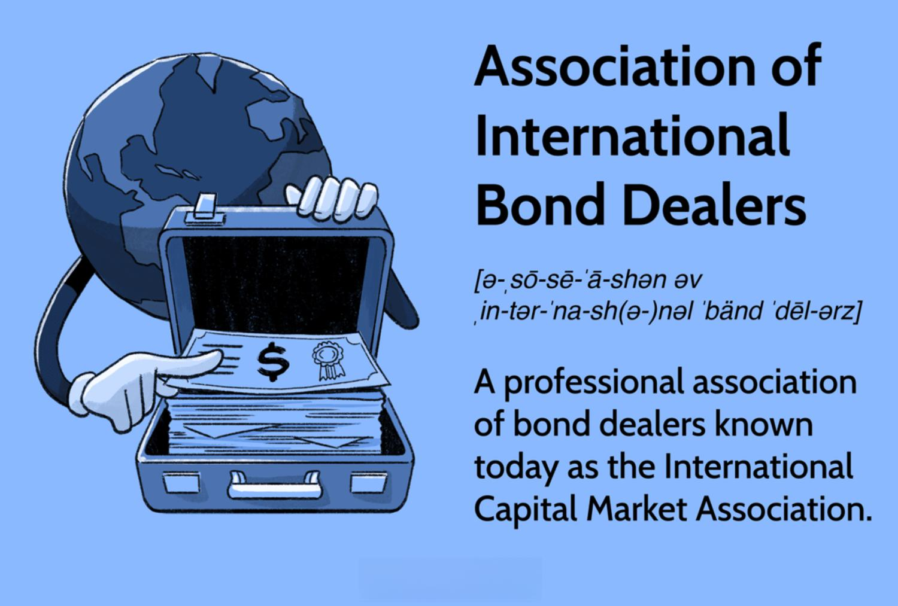

## Table of Contents

## What is the Association of International Bond Dealers (AIBD)?

The Association of International Bond Dealers (AIBD) is a group that helps people who buy and sell bonds from different countries. It was started in 1969 and its main job is to make sure that trading bonds between countries is fair and easy. The AIBD works to create rules and standards that everyone follows, so that bond trading is safe and trustworthy.

The AIBD also helps its members learn about new rules and changes in the bond market. They hold meetings and workshops where members can share ideas and learn from each other. This helps everyone stay up-to-date and do their jobs better. By working together, the AIBD makes the international bond market a better place for everyone involved.

## When was the AIBD founded?

The AIBD was founded in 1969. It is a group that helps people who trade bonds from different countries. The main goal of the AIBD is to make sure that trading bonds between countries is fair and easy.

The AIBD creates rules and standards that everyone follows. This makes bond trading safe and trustworthy. The group also helps its members learn about new rules and changes in the bond market. They hold meetings and workshops where members can share ideas and learn from each other. This helps everyone stay up-to-date and do their jobs better.

## What are the main objectives of the AIBD?

The main goal of the Association of International Bond Dealers (AIBD) is to make sure that trading bonds between different countries is fair and easy. They do this by creating rules and standards that everyone in the bond market follows. This helps to make bond trading safe and trustworthy for everyone involved. The AIBD works hard to keep the bond market running smoothly and to protect the people who buy and sell bonds.

Another important objective of the AIBD is to help its members stay informed about new rules and changes in the bond market. They do this by holding meetings and workshops where members can share ideas and learn from each other. This helps everyone stay up-to-date and do their jobs better. By working together, the AIBD makes the international bond market a better place for everyone involved.

## Who can become a member of the AIBD?

Anyone who works with bonds from different countries can join the AIBD. This includes people who buy and sell bonds, as well as companies and banks that deal with international bonds. If you are involved in the bond market and want to make sure that trading is fair and easy, you can become a member of the AIBD.

To join, you need to follow the rules and standards set by the AIBD. This helps keep the bond market safe and trustworthy for everyone. Members of the AIBD can also attend meetings and workshops to learn about new rules and changes in the bond market. This helps them do their jobs better and stay up-to-date.

## How does the AIBD influence the global bond market?

The AIBD helps make the global bond market better by setting rules and standards that everyone follows. This makes bond trading fair and easy for people from different countries. When everyone follows the same rules, it makes the bond market safe and trustworthy. This is important because it helps people feel confident when they buy and sell bonds.

The AIBD also helps its members learn about new rules and changes in the bond market. They do this by holding meetings and workshops where members can share ideas and learn from each other. This helps everyone stay up-to-date and do their jobs better. By working together, the AIBD makes the global bond market a better place for everyone involved.

## What are some key initiatives or programs run by the AIBD?

The AIBD runs several important programs to help make the global bond market better. One key initiative is the creation of rules and standards that everyone in the bond market must follow. These rules help make sure that bond trading is fair and easy for people from different countries. By setting these standards, the AIBD helps keep the bond market safe and trustworthy, which is important for everyone who buys and sells bonds.

Another important program run by the AIBD is their educational workshops and meetings. These events help members learn about new rules and changes in the bond market. By coming together to share ideas and learn from each other, members can stay up-to-date and do their jobs better. This helps the whole bond market run smoothly and makes it a better place for everyone involved.

## How does the AIBD promote ethical practices in bond trading?

The AIBD helps make bond trading fair by setting rules that everyone must follow. These rules are like a guidebook for people who buy and sell bonds from different countries. By having clear rules, the AIBD makes sure that everyone plays by the same standards. This helps stop people from doing things that are not fair or honest. When everyone follows the rules, it makes the bond market a safer and more trustworthy place for everyone.

The AIBD also teaches its members about ethical practices through workshops and meetings. These events give members a chance to learn about new rules and how to trade bonds the right way. By sharing ideas and learning from each other, members can understand what is right and wrong in bond trading. This helps them make good choices and keeps the bond market honest and fair.

## What role does the AIBD play in regulatory compliance for its members?

The AIBD helps its members follow the rules by creating standards that everyone in the bond market must follow. These standards make sure that bond trading is done the right way. When members follow these rules, it helps keep the bond market safe and fair for everyone. The AIBD makes sure that its members know what they need to do to stay in line with the rules.

The AIBD also helps its members stay up-to-date with new laws and changes in the bond market. They do this by holding meetings and workshops where members can learn about new rules and how to follow them. By sharing information and learning together, members can make sure they are always doing things the right way. This helps the whole bond market work smoothly and fairly.

## Can you describe the organizational structure of the AIBD?

The AIBD has a simple way of organizing itself to help people who trade bonds from different countries. At the top, there is a group of leaders called the Board of Directors. They make big decisions and set the main goals for the AIBD. The Board of Directors is made up of people who know a lot about the bond market and come from different countries. They work together to make sure the rules and standards help everyone in the bond market.

Below the Board of Directors, there are different groups that focus on specific tasks. One group works on making the rules and standards that everyone follows. Another group plans the meetings and workshops where members can learn and share ideas. There are also people who help members with any questions they have and make sure everyone is following the rules. This way, the AIBD can help keep the bond market fair and easy for everyone involved.

## How does the AIBD facilitate international cooperation among bond dealers?

The AIBD helps bond dealers from different countries work together by setting rules and standards that everyone follows. This makes it easier for people to trade bonds across borders because they all play by the same rules. When everyone knows what to expect, it builds trust and makes the bond market a safer place. The AIBD also helps its members stay informed about new laws and changes in the bond market, which helps them work together more effectively.

The AIBD also organizes meetings and workshops where members can come together and share ideas. These events give bond dealers from different countries a chance to learn from each other and talk about how to make the bond market better. By working together and learning from each other, members can solve problems and find new ways to make bond trading easier and more fair. This helps create a strong network of bond dealers who can work together smoothly, no matter where they are from.

## What are the AIBD's contributions to the development of bond market infrastructure?

The AIBD helps make the bond market better by creating rules and standards that everyone follows. These rules help make bond trading fair and easy for people from different countries. When everyone follows the same rules, it makes the bond market safe and trustworthy. This is important because it helps people feel confident when they buy and sell bonds. The AIBD also works to improve the systems and tools that people use to trade bonds. This makes it easier for everyone to do their jobs and helps the bond market run smoothly.

The AIBD also helps its members learn about new rules and changes in the bond market. They do this by holding meetings and workshops where members can share ideas and learn from each other. This helps everyone stay up-to-date and do their jobs better. By working together, the AIBD makes the global bond market a better place for everyone involved. They also help build better technology and systems that make trading bonds faster and more reliable. This helps the whole bond market grow and work more efficiently.

## How does the AIBD address challenges like market volatility and economic crises?

The AIBD helps its members deal with market ups and downs and economic problems by making sure everyone follows the same rules. These rules help keep the bond market stable, even when things get tough. When everyone knows what to expect, it makes it easier to handle sudden changes in the market. The AIBD also keeps its members informed about what's happening in the economy. This way, they can make smart choices and be ready for any challenges that come up.

The AIBD also holds meetings and workshops where members can talk about how to handle market volatility and economic crises. By sharing ideas and learning from each other, members can find new ways to keep the bond market strong. This helps everyone work together to solve problems and make the bond market a safer place during tough times. The AIBD's focus on cooperation and education helps its members stay ready and respond well to any economic challenges they face.

## References & Further Reading

[1]: ["An Econometric Model of the Term Structure of Interest-Rate Swap Yields"](https://onlinelibrary.wiley.com/doi/10.1111/j.1540-6261.1997.tb01111.x) by Robert Jarrow and Li H. M.

[2]: Lopez de Prado, M. (2018). ["Advances in Financial Machine Learning"](https://www.amazon.com/Advances-Financial-Machine-Learning-Marcos/dp/1119482089). Wiley.

[3]: Aronson, D. (2006). ["Evidence-Based Technical Analysis: Applying the Scientific Method and Statistical Inference to Trading Signals"](https://www.amazon.com/Evidence-Based-Technical-Analysis-Scientific-Statistical/dp/0470008741). Wiley.

[4]: Jansen, S. (2020). ["Machine Learning for Algorithmic Trading: Predictive models to extract signals from market and alternative data for systematic trading strategies with Python"](https://github.com/stefan-jansen/machine-learning-for-trading). Packt Publishing.

[5]: Chan, E. P. (2008). ["Quantitative Trading: How to Build Your Own Algorithmic Trading Business"](https://github.com/ftvision/quant_trading_echan_book). Wiley.

[6]: ["The Impact of Algorithmic Trading in Equity Markets"](https://www.semanticscholar.org/paper/Analyzing-the-impact-of-algorithmic-trading-on-A-Damilare-Oyeniyi/cfaa220cded37f824aa2bf5b97f26c9b2aa6cb95) by Terrence Hendershott, Charles M. Jones, and Albert J. Menkveld. National Bureau of Economic Research. 

[7]: ["High Frequency Trading in the Electronic Interdealer Spot Foreign Exchange Market"](https://www.federalreserve.gov/pubs/ifdp/2004/823/ifdp823.htm) by Albert J. Menkveld. Federal Reserve. 

[8]: International Capital Market Association (ICMA). ["Guidelines for the use of the Eurobond Market"](https://www.icmagroup.org/). 

[9]: Sinclair, J. (2013). ["Volatility Trading"](https://onlinelibrary.wiley.com/doi/pdf/10.1002/9781118662724.fmatter). Wiley.