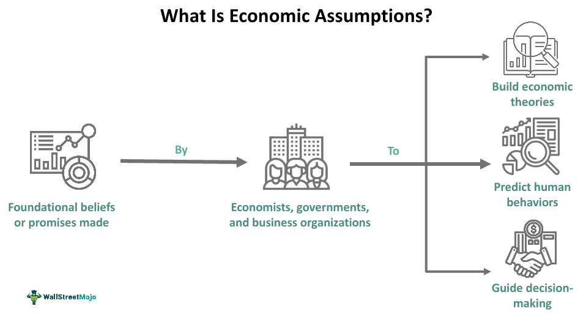

## Table of Contents

## What are economic models and why are they used?

Economic models are simplified representations of real-world economic processes and systems. They use mathematical equations, graphs, and diagrams to show how different parts of the economy, like businesses, consumers, and governments, interact with each other. Economists create these models to help them understand complex economic situations by breaking them down into simpler, more manageable pieces.

These models are used for several important reasons. First, they help economists predict what might happen in the economy in the future. By changing different parts of the model, economists can see how things like interest rates, taxes, or employment might affect the economy. Second, economic models help policymakers make decisions. For example, a government might use a model to see what would happen if they changed a policy, like increasing the minimum wage. This helps them make better choices that can improve the economy and people's lives.

## What is an assumption in the context of economic models?

An assumption in the context of economic models is a belief or idea that economists take to be true without needing proof. When they make a model, economists have to simplify the real world a lot. They do this by making assumptions about how things work. For example, they might assume that all people want to spend their money in the best way possible, or that businesses always try to make the most profit they can.

These assumptions help make the models easier to understand and use. But, they can also make the models less accurate because the real world is more complicated. If an assumption is not very realistic, the model might not predict what will happen in the economy very well. Economists know this, so they try to use assumptions that are as close to the real world as possible, but sometimes they have to make big simplifications to make their models work.

## How do assumptions simplify economic models?

Assumptions simplify economic models by taking away some of the complicated details of the real world. When economists make a model, they have to decide what parts of the economy are most important to include. By making assumptions, they can focus on those key parts and ignore other details that might make the model too hard to understand or use. For example, they might assume that everyone has the same information about prices, even though in real life, people often have different information.

These simplifications make it easier for economists to study and predict how the economy works. Without assumptions, models would be too complex and hard to use. By assuming certain things, like that people always make the best choices for themselves, economists can create models that are easier to work with. This helps them see the big picture and understand how different parts of the economy affect each other.

## What are some common assumptions made in basic economic models?

In basic economic models, one common assumption is that people are rational. This means they always make the best choices for themselves based on the information they have. For example, a model might assume that when people buy things, they always pick the option that gives them the most satisfaction for the least cost. Another common assumption is that markets are perfect. This means that everyone has all the information they need, there are no barriers to entering or leaving a market, and there are many buyers and sellers so no one can control prices.

Another assumption often made is that all goods and services are the same. Economists might assume that all apples are the same, so they don't have to think about different types of apples or where they come from. This makes the model simpler. Also, many models assume that the economy is always at full employment, meaning everyone who wants a job can have one. This helps economists focus on other parts of the economy without worrying about unemployment.

## How do assumptions affect the accuracy of economic models?

Assumptions can make economic models less accurate because they simplify the real world a lot. When economists assume things like everyone has the same information or that people always make the best choices, it might not match what really happens. For example, in real life, people often don't have all the information they need, and they might not always make perfect decisions. So, if a model assumes they do, it might not predict the economy's behavior correctly.

On the other hand, assumptions are necessary to make models easier to use and understand. Without them, models would be too complex to be helpful. Economists try to balance this by choosing assumptions that are as realistic as possible while still keeping the model simple. Even though assumptions can make models less accurate, they are important tools that help economists study and predict how the economy works.

## Can you give examples of how changing an assumption impacts a model's predictions?

Let's say we have a model that assumes everyone has the same information about prices. If we change this assumption to say that some people know more than others, the model's predictions will change. Now, the model might show that people with more information can buy things cheaper or sell things for more money. This could lead to different prices in the market than what the original model predicted. The new model might be more accurate because it's closer to how things really work, where people often have different information.

Another example is a model that assumes all workers are the same. If we change this assumption to say that workers have different skills, the model's predictions will be different. Now, the model might show that workers with more skills earn more money and that businesses pay more for skilled workers. This could change how the model predicts wages and employment. The new model might be more accurate because it takes into account the real differences between workers, which the original model ignored.

## What is the role of assumptions in microeconomic versus macroeconomic models?

In microeconomic models, assumptions help economists understand how individual people and businesses make choices. For example, a common assumption is that people always try to get the most out of what they have. This makes it easier to predict how someone might spend their money or how a business might set its prices. But, if the assumption is not very realistic, like thinking everyone knows everything about prices, the model might not be very accurate. So, economists try to use assumptions that are close to real life but still keep the model simple.

In macroeconomic models, assumptions help economists understand how the whole economy works. They might assume things like the economy is always at full employment or that all money is spent right away. These assumptions help economists see the big picture and predict things like inflation or economic growth. But, just like in microeconomics, if the assumptions are too far from reality, the model's predictions might not be very good. Economists have to balance making the model simple enough to use but realistic enough to be helpful.

## How do economists test the validity of assumptions in their models?

Economists test the validity of assumptions in their models by comparing the model's predictions to what actually happens in the real world. They collect data on things like prices, employment, and economic growth, and then see if their model's predictions match this data. If the model's predictions are close to what really happens, it suggests that the assumptions are good. But if the predictions are way off, it might mean the assumptions need to be changed.

Another way economists test assumptions is by running experiments or using simulations. They might change one assumption at a time in their model and see how it affects the predictions. For example, they could change an assumption about how people make decisions and then see if the new predictions are closer to real-world data. This helps them figure out which assumptions are most important and which ones need to be more realistic. By doing these tests, economists can make their models better and more accurate over time.

## What are the criticisms of using assumptions in economic models?

Some people criticize economic models for using assumptions because they think the models can be too simple and not match the real world. They say that when economists assume things like everyone knows all the prices or people always make the best choices, it's not realistic. In real life, people don't always have all the information they need, and they might make mistakes. So, critics argue that these models can't predict what will happen in the economy very well because they leave out important details.

Another criticism is that assumptions can make models seem more certain than they really are. When economists use assumptions, it can make their predictions look very clear and sure. But, in reality, the economy is very complicated and hard to predict. Critics worry that policymakers might trust these models too much and make bad decisions based on them. They think economists should be more careful about how they use assumptions and make it clear that their models are just simplified guesses, not perfect predictions.

## How have assumptions in economic models evolved over time?

Over time, the assumptions in economic models have changed a lot. Early models used very simple assumptions, like thinking everyone always makes the best choices and knows everything about prices. These models were easy to understand but not very accurate. As economists learned more about how the economy really works, they started to use more realistic assumptions. For example, they began to think about how people might not always have all the information they need or how they might make mistakes. This made the models more complicated but also more useful for understanding the real world.

Today, economists still use assumptions, but they try to make them as close to reality as possible. They know that the economy is very complex, so they use computers and new data to test their assumptions and make their models better. They also look at different parts of the economy, like how people behave or how businesses make decisions, and try to include these details in their models. This helps them make predictions that are more accurate and useful for policymakers. Even though assumptions are still a big part of economic models, they have become more realistic and helpful over time.

## What advanced techniques are used to relax or modify assumptions in economic modeling?

Economists use advanced techniques like computer simulations to relax or modify assumptions in their models. They can run many different versions of a model with slightly different assumptions and see how the results change. This helps them understand which assumptions are most important and how changing them affects the model's predictions. For example, they might change an assumption about how people make decisions and see if it makes the model's predictions closer to what really happens in the economy. This way, they can make their models more accurate by finding the best assumptions to use.

Another technique is called econometric analysis, which uses real-world data to test and adjust assumptions. Economists collect data on things like prices, wages, and economic growth, and then they use statistical methods to see if their model's predictions match this data. If the predictions are off, they can change the assumptions and try again. This helps them find assumptions that make the model more realistic. By using these advanced techniques, economists can make their models better and more useful for understanding the economy.

## How do assumptions in economic models influence policy-making and decision processes?

Assumptions in economic models play a big role in how policymakers make decisions. When economists create models, they use assumptions to simplify the economy so they can predict what might happen if a policy changes. For example, if a government wants to know what will happen if they raise taxes, they might use a model that assumes people always spend their money in the best way possible. This helps policymakers see how much money the government might get and how it could affect things like jobs and prices. But, if the assumptions are not very realistic, the predictions might not be right, and policymakers could make choices that don't work well.

Policymakers need to be careful about trusting these models too much. They should remember that the models are just guesses based on simple ideas about how the economy works. If the assumptions in the models are too far from reality, the policies based on them might not help the economy. So, it's important for policymakers to look at different models and real-world data to make the best decisions. By understanding how assumptions can affect the models, they can make choices that are more likely to improve people's lives and the economy.

## What are the assumptions of different economic theories?

Classical and neo-classical economic theories form the bedrock of modern economic thought. These theories typically rest on several foundational assumptions that simplify complex economic interactions to facilitate analysis and prediction. 

### Classical Economic Theories

Classical economics, pioneered by Adam Smith, David Ricardo, and John Stuart Mill, posits that markets are self-regulating entities driven by individuals acting out of rational self-interest. The principle of the "invisible hand" suggests that individual efforts to maximize personal gain would collectively contribute to societal benefit. A key assumption here is **ceteris paribus**, meaning all else is constant, which simplifies the analysis by focusing on the relationship between economic variables without external interferences.

Another assumption is rational decision-making by economic [agents](/wiki/agents). Classical economics assumes that consumers and producers pursue their interests with full knowledge, achieving an equilibrium through the forces of supply and demand. This market equilibrium can be represented mathematically. For instance, the equilibrium price $(P_e)$ is where quantity demanded $(Q_d)$ equals quantity supplied $(Q_s)$:

$$
Q_d(P_e) = Q_s(P_e)
$$

### Neo-Classical Economic Theories

Neo-classical economics builds on the classical framework with additional mathematical rigor. It assumes that consumers seek to maximize utility and producers aim to maximize profits. Mathematics and calculi techniques are employed to model individual behaviors and deduce market outcomes. 

The theory of utility maximization can be expressed through the utility function $U(X)$, where each choice set $X$ maximizes utility subject to a budget constraint. Neo-classical economics assumes that individuals allocate their resources in a way that achieves the highest satisfaction, leading to an optimal distribution of resources.

### Criticisms

Despite their utility, the assumptions underpinning classical and neo-classical theories have been critiqued for their lack of realism. The assumption of rational decision-making is often contested. Critics argue that human behavior is influenced by bounded rationality, emotions, and cognitive biases, contravening the notion of perfectly rational agents. Behavioral experiments, such as those conducted by Daniel Kahneman and Amos Tversky, underscore these deviations, demonstrating that humans often make decisions that contradict traditional rational choice theory.

Moreover, the assumption of perfect information is questioned as markets are subject to information asymmetries where parties have access to varying levels of information, leading to suboptimal outcomes as illustrated by George Akerlof's "The Market for Lemons."

The abstraction and simplifications inherent in these assumptions, while useful for theoretical modeling, may fail to capture the unpredictability and complexity of actual human behavior, resulting in models that sometimes miss their mark in real-world applications. The field of behavioral economics, for instance, challenges traditional assumptions by integrating psychological insights into economic models to better address how individuals actually make decisions.

As economic theories evolve, there is an increasing recognition of the limitations of classical assumptions. Economists continue to refine models to more closely align with observed behaviors, particularly as these insights have significant implications for applications such as [algorithmic trading](/wiki/algorithmic-trading), where assumptions about market participant behavior are paramount.

## References & Further Reading

[1]: Friedman, M. (1953). ["The Methodology of Positive Economics,"](https://www.cambridge.org/core/books/methodology-of-positive-economics/methodology-of-positive-economics-1953/CFF7143A05C9A667D3E54E9AD747A98A) Essays in Positive Economics. University of Chicago Press.

[2]: Fama, E. F. (1970). ["Efficient Capital Markets: A Review of Theory and Empirical Work,"](https://onlinelibrary.wiley.com/doi/abs/10.1111/j.1540-6261.1970.tb00518.x) The Journal of Finance, 25(2), 383–417.

[3]: Kahneman, D., & Tversky, A. (1979). ["Prospect Theory: An Analysis of Decision under Risk."](http://web.mit.edu/curhan/www/docs/Articles/15341_Readings/Behavioral_Decision_Theory/Kahneman_Tversky_1979_Prospect_theory.pdf) Econometrica, 47(2), 263-291.

[4]: Markowitz, H. (1952). ["Portfolio Selection,"](https://onlinelibrary.wiley.com/doi/abs/10.1111/j.1540-6261.1952.tb01525.x) The Journal of Finance, 7(1), 77-91.

[5]: Akerlof, G. A. (1970). ["The Market for 'Lemons': Quality Uncertainty and the Market Mechanism,"](https://www.jstor.org/stable/1879431) The Quarterly Journal of Economics, 84(3), 488-500.

[6]: Black, F., & Scholes, M. (1973). ["The Pricing of Options and Corporate Liabilities,"](https://www.cs.princeton.edu/courses/archive/fall09/cos323/papers/black_scholes73.pdf) Journal of Political Economy, 81(3), 637-654.

[7]: Daniel, K., & Hirshleifer, D. (1998). ["Investor Psychology and Security Market Under- and Overreactions,"](https://onlinelibrary.wiley.com/doi/full/10.1111/0022-1082.00077) The Journal of Finance, 53(6), 1839–1885.

[8]: Chan, E. (2009). ["Quantitative Trading: How to Build Your Own Algorithmic Trading Business."](https://github.com/ftvision/quant_trading_echan_book) Wiley Trading.