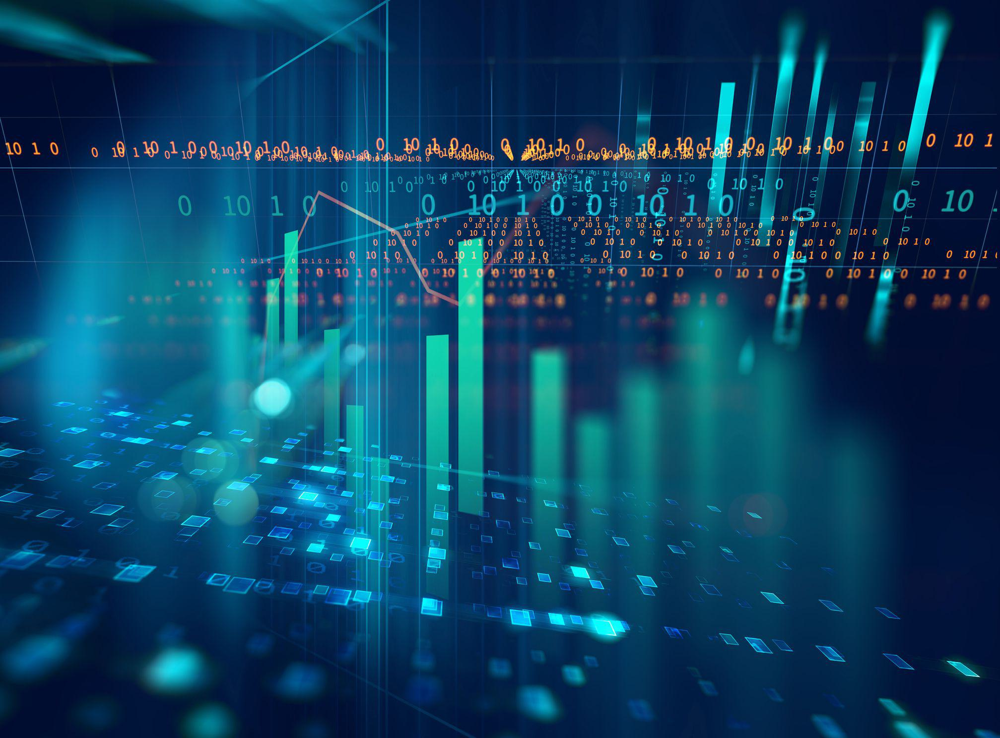

The interplay between economist assumptions, economic theories, and economic models is foundational for understanding and predicting financial market behaviors, particularly in fields like algorithmic trading. Assumptions serve as the bedrock for economic modeling and theory formulation, allowing economists to simplify complex real-world systems and focus on key variables that affect economic outcomes. These assumptions are crucial as they enable the abstraction of complex market behaviors into understandable models that can generate useful predictions. 

For instance, the Efficient Market Hypothesis (EMH), a seminal economic theory, rests on the assumption that market prices reflect all available information. Despite criticisms over its assumptions of rationality and information symmetry, EMH has been instrumental in shaping algorithmic trading strategies. Algorithms leveraging EMH principles assume that price changes follow a random walk, leading to the development of trend-following and mean-reversion strategies.



Economic models play an important role in practical applications by providing structured frameworks through which financial data can be analyzed. In algorithmic trading, models such as Brownian motion for stock price predictions or Poisson processes for event-driven trades are employed to forecast market movements. These models, underpinned by specific economic assumptions, are tested against historical data to evaluate their predictive power.

The significance of economic theories in predicting financial market behaviors is also evident. Theories like the Capital Asset Pricing Model (CAPM) and Portfolio Theory provide foundational insights into risk management and asset pricing, guiding automated investment strategies. These theories rely on assumptions of market efficiency and rational expectations, which influence the construction of algorithmic trading systems that optimize asset allocation and minimize risk exposure.

Algorithmic trading exemplifies the practical application of these models and theories, using vast datasets and computational power to execute financial transactions at speeds and scales beyond human capabilities. However, the effectiveness of algorithms is inherently tied to the underlying economic assumptions. As markets evolve and incorporate complex, often irrational human behaviors, the demand for adaptive and robust models that can accommodate these dynamics becomes evident.

In conclusion, the integration of economist assumptions, economic theories, and models is crucial for advancing algorithmic trading. The assumptions provide a simplified but powerful lens to understand broad economic phenomena, while theories give a structured approach for market predictions. This synergy drives the creation of sophisticated trading algorithms, underscoring the ongoing importance of these elements in navigating financial markets.

## Table of Contents

## The Importance of Assumptions in Economic Models

Assumptions are foundational elements in economic models, serving as simplifications to represent complex real-world systems. By defining a set of assumptions, economists can abstract and isolate specific variables, allowing models to be both tractable and insightful. These assumptions act as filters, controlling variables and interactions to create a streamlined framework that can produce predictive insights into economic phenomena.

In practice, assumptions might simplify consumer behavior, market scope, or the influence of external factors. For instance, assuming perfect competition or rational behavior among market participants allows economists to develop models like the supply-demand curve, which are central to classical and neo-classical theories. These assumptions make analytical solutions possible and help economists draw inferences that guide economic policy and decision-making.

The seminal work of economist Milton Friedman emphasizes that the realism of assumptions does not necessarily determine the validity or success of an economic model. In his renowned essay "The Methodology of Positive Economics" (1953), Friedman argued that the primary criterion for judging a model should be the accuracy and usefulness of its predictions, rather than the realism of its assumptions. He contended that assumptions serve as a pragmatic tool to distill the core elements of complex systems into manageable representations.

According to Friedman, the ultimate test of a model is its predictive power. If a model based on simplified assumptions predicts economic outcomes effectively, it can be deemed successful. This perspective suggests that assumptions are necessary compromises, trading off complexity for precision and predictive ability. They enable the development of models that, while not perfectly mirroring real-world intricacies, offer valuable insights into potential economic trends and behaviors.

By employing assumptions, economists can create models that simplify data analysis and provide clarity in interpreting the multifaceted nature of economies. However, it remains crucial for economists to remain aware of their limitations, continuously refining models to better capture the complexities and dynamics of real-world systems as they evolve.

## Economic Theories and Their Assumptions

Classical and neo-classical economic theories form the bedrock of modern economic thought. These theories typically rest on several foundational assumptions that simplify complex economic interactions to facilitate analysis and prediction. 

### Classical Economic Theories

Classical economics, pioneered by Adam Smith, David Ricardo, and John Stuart Mill, posits that markets are self-regulating entities driven by individuals acting out of rational self-interest. The principle of the "invisible hand" suggests that individual efforts to maximize personal gain would collectively contribute to societal benefit. A key assumption here is **ceteris paribus**, meaning all else is constant, which simplifies the analysis by focusing on the relationship between economic variables without external interferences.

Another assumption is rational decision-making by economic [agents](/wiki/agents). Classical economics assumes that consumers and producers pursue their interests with full knowledge, achieving an equilibrium through the forces of supply and demand. This market equilibrium can be represented mathematically. For instance, the equilibrium price $(P_e)$ is where quantity demanded $(Q_d)$ equals quantity supplied $(Q_s)$:

$$
Q_d(P_e) = Q_s(P_e)
$$

### Neo-Classical Economic Theories

Neo-classical economics builds on the classical framework with additional mathematical rigor. It assumes that consumers seek to maximize utility and producers aim to maximize profits. Mathematics and calculi techniques are employed to model individual behaviors and deduce market outcomes. 

The theory of utility maximization can be expressed through the utility function $U(X)$, where each choice set $X$ maximizes utility subject to a budget constraint. Neo-classical economics assumes that individuals allocate their resources in a way that achieves the highest satisfaction, leading to an optimal distribution of resources.

### Criticisms

Despite their utility, the assumptions underpinning classical and neo-classical theories have been critiqued for their lack of realism. The assumption of rational decision-making is often contested. Critics argue that human behavior is influenced by bounded rationality, emotions, and cognitive biases, contravening the notion of perfectly rational agents. Behavioral experiments, such as those conducted by Daniel Kahneman and Amos Tversky, underscore these deviations, demonstrating that humans often make decisions that contradict traditional rational choice theory.

Moreover, the assumption of perfect information is questioned as markets are subject to information asymmetries where parties have access to varying levels of information, leading to suboptimal outcomes as illustrated by George Akerlof's "The Market for Lemons."

The abstraction and simplifications inherent in these assumptions, while useful for theoretical modeling, may fail to capture the unpredictability and complexity of actual human behavior, resulting in models that sometimes miss their mark in real-world applications. The field of behavioral economics, for instance, challenges traditional assumptions by integrating psychological insights into economic models to better address how individuals actually make decisions.

As economic theories evolve, there is an increasing recognition of the limitations of classical assumptions. Economists continue to refine models to more closely align with observed behaviors, particularly as these insights have significant implications for applications such as [algorithmic trading](/wiki/algorithmic-trading), where assumptions about market participant behavior are paramount.

## Behavioral Economics: Challenging Traditional Assumptions

Behavioral economics represents a shift from traditional economic thought by incorporating psychological insights into economic decision-making. While classical and neo-classical economic theories often operate on the assumption of rational actors, behavioral economics questions this premise, proposing that humans frequently deviate from pure rationality due to cognitive biases and emotional responses.

A core principle of behavioral economics is that economic decisions are not solely the result of rational calculations but are significantly influenced by psychological factors. These factors include heuristics, biases like loss aversion and overconfidence, and social influences. For example, loss aversion suggests that individuals experience the pain of losses more intensely than the pleasure of equivalent gains, which can lead to irrational decision-making, such as holding onto losing stocks longer than is financially prudent.

This recognition of psychological influences necessitates a paradigm shift in economic modeling. Traditional economic models, which are largely deterministic and assume conditions of perfect information and rationality, struggle to accurately predict real-world economic behaviors when individuals consistently behave contrary to these assumptions. Behavioral economics, therefore, advocates for more adaptive models that accommodate the complexities of human psychology.

To incorporate these insights, models must evolve to include variables representing psychological and emotional states. For instance, predictive models of consumer behavior could integrate parameters for sentiment analysis, gauging how public mood or media tone might influence shopping patterns or market movements. Algorithms utilizing [machine learning](/wiki/machine-learning) can be trained to detect patterns consistent with known biases, thus refining predictions and strategies.

By acknowledging the limitations of traditional assumptions, behavioral economics challenges the very foundation of conventional economic thought and simulations. It underscores the necessity for models that are both descriptive and predictive, capable of adjusting to the nuanced, often erratic nature of human decision-making. This shift in perspective encourages a more holistic approach, combining the analytical rigor of economics with the adaptive learning of behavioral sciences, thereby enhancing the realism and applicability of economic models in areas such as finance and algorithmic trading.

## Economic Models and Algorithmic Trading

Economic models play a significant role in algorithmic trading by serving as foundational tools to predict market trends and movements. These models simplify the complex realities of financial markets through a set of assumptions that facilitate the processing of large datasets. In algorithmic trading, these assumptions underpin algorithms designed to efficiently manage and analyze vast quantities of financial data, aiding in timely decision-making processes. 

Economic models often use assumptions to reduce computational complexity and focus on key variables that drive market behavior. For example, the assumption of rational market participants is frequently employed, whereby traders are expected to act in their self-interest, optimizing their utility based on available information. This rational behavior assumption allows models to predict future market trends using historical data patterns. However, algorithm developers must carefully choose assumptions to balance simplification and realism.

Algorithmic trading systems utilize these models to automate the buying and selling processes, thereby capitalizing on the speed and accuracy of computer algorithms over human traders. For instance, time-series analysis models, such as ARIMA (AutoRegressive Integrated Moving Average), are used to identify patterns in historical data and predict future price movements. Linear regression models are also commonly applied to evaluate relationships between different financial indicators, assisting in the generation of trading signals.

```python
# Example: Implementing a simple ARIMA model using Python's statsmodels library
import pandas as pd
from statsmodels.tsa.arima.model import ARIMA

# Assume 'data' is a pandas DataFrame containing time-indexed price data
model = ARIMA(data['price'], order=(5, 1, 0))  # ARIMA(p, d, q)
model_fit = model.fit()

# Forecasting future prices
forecast = model_fit.forecast(steps=10) # Predict next 10 time periods
print(forecast)
```

While economic models are indispensable in algorithmic trading, they are not without limitations. The accuracy and efficacy of these models are inherently tied to the validity of their underlying assumptions. If the assumptions do not accurately capture the market's reality, the models may generate inaccurate predictions or suboptimal trading strategies. Moreover, market anomalies, irrational behaviors, and unforeseen economic events can disrupt patterns, leading to potential losses.

Another significant challenge is the reliance on historical data, which may not always reflect future market conditions. Models that excel in stable environments might struggle during periods of high [volatility](/wiki/volatility-trading-strategies) or systemic market changes. Therefore, exclusively using economic models can result in an over-reliance on quantitative techniques, ignoring qualitative factors such as socio-political influences or regulatory changes.

To mitigate these challenges, it is crucial for traders to complement economic models with other analytical tools and strategies. Integrating human expertise and judgment, stress-testing models against various scenarios, and incorporating insights from behavioral economics can enhance the robustness of algorithmic trading systems. By recognizing the limitations of economic models, traders can develop more adaptive and resilient strategies, ensuring greater accuracy and success in navigating the complexities of financial markets.

## The Integration of Economic Theory in Algorithmic Strategies

Economic theories have played a significant role in shaping algorithmic strategies within financial markets. These strategies leverage theoretical models to predict market behaviors and automate trading decisions. Various economic theories have been instrumental, particularly those recognized with prestigious awards like the Nobel Prize, in guiding the development of algorithmic trading.

One notable example is the Efficient Market Hypothesis (EMH), formulated by Eugene Fama, which suggests that asset prices reflect all available information. The implication for algorithmic trading is profound; strategies based on EMH often assume that it is impossible to consistently achieve returns exceeding average market returns on a risk-adjusted basis. As a result, algorithmic strategies may focus more on [arbitrage](/wiki/arbitrage) opportunities and statistical anomalies rather than broad market trends.

Another crucial development is the Capital Asset Pricing Model (CAPM), which has been pivotal in assessing risk and expected return. CAPM, which posits that the expected return of a security is equal to the risk-free rate plus the security's beta times the expected market risk premium, provides a structure for algorithms to evaluate the trade-off between risk and return. This model aids in constructing portfolios that aim to maximize returns for a given level of risk, a process that can be automated through algorithmic trading platforms.

The Black-Scholes-Merton model, awarded the Nobel Prize for its groundbreaking approach to option pricing, has revolutionized how derivatives are traded. Its application in algorithmic strategies includes calculating the theoretical price of options, which serves as a foundation for more complex trading algorithms. By understanding the dynamics of options pricing, algorithms can more effectively anticipate market movements and adjust their trading positions accordingly.

As financial markets and technology advance, trading strategies must evolve to incorporate new economic insights and technological advancements. Behavioral economics, which feeds into algorithmic trading strategies by accounting for psychological factors affecting market participants, challenges traditional models by incorporating human behavior anomalies. This integration has fueled the development of machine learning algorithms capable of adapting to subtle shifts in market sentiment and behavior.

Additionally, the increasing complexity of data sets and computational power has led to more sophisticated algorithms. These algorithms now utilize technologies such as [deep learning](/wiki/deep-learning), neural networks, and natural language processing to analyze vast amounts of market data, news feeds, and social media, enabling more nuanced and responsive trading strategies.

In summary, the integration of economic theory with algorithmic strategies is a dynamic and ongoing process, driven by continuous advancements in economic thought and technological innovation. This synergy enhances the ability of traders and institutions to navigate complex financial markets effectively.

## Criticisms and Challenges Facing Economic Models and Algorithmic Trading

Economic models, while crucial in conceptualizing financial markets, often face criticism for their oversimplified representation of complex realities. These models typically rely on assumptions that aim to distill a chaotic world into manageable constructs, allowing economists to generate predictions and insights. However, such simplification can lead to inaccuracies, particularly when models fail to account for variables that play significant roles in real-world market behaviors. For instance, traditional economic models may overlook factors such as investor psychology, regulatory changes, and geopolitical tensions, which can critically impact market dynamics.

Algorithmic trading, a derivative application of economic models, inherits these limitations. Algorithms are designed to execute trades based on models that predict market movements, often within fractions of a second. Yet, the rigidity inherent in algorithms can result in missed opportunities or unexpected losses when rare or unprecedented events occur. For example, while algorithms can efficiently process large datasets and identify patterns, they may struggle to adapt to new market conditions, such as those induced by a global pandemic.

Beyond technical criticisms, the ethical and market risks associated with algorithmic trading warrant attention. The reliance on algorithms can lead to market behaviors that undermine financial stability. Flash crashes—sudden, severe market downturns—are often attributed to the speed and scale with which algorithms execute trades. An illustrative event was the May 6, 2010, Flash Crash, which saw the Dow Jones Industrial Average plummet by almost 1,000 points within minutes, primarily driven by algorithmic trading activities. The incident highlights the systemic risks and volatility that algorithmic trading can introduce, potentially destabilizing the entire financial system.

Furthermore, market participants debate the fairness and ethicality of algorithmic trading. High-frequency traders (HFTs), equipped with sophisticated algorithms and ultra-fast internet connections, can gain a competitive edge over traditional investors. This disparity raises concerns about market equality and access, as well as the possibility of manipulative practices that could be unfairly advantageous to those with better technology.

To mitigate these risks, there is an increasing need for regulatory oversight and adaptive algorithms that incorporate a broader range of data and more flexible decision-making capabilities. Developing models that can integrate behavioral insights and real-time feedback from market conditions may offer solutions that balance efficiency with caution, aligning more closely with the complexities of financial markets.

## Conclusion

Economic models, built upon certain assumptions, form the cornerstone of algorithmic trading by providing fundamental frameworks for understanding financial markets. These assumptions, while simplifying complex economic systems, help in the creation of models that predict market behavior under specific conditions. By doing so, they allow the translation of economic theories into practical applications that drive algorithmic trading strategies.

Economic theories, from classical to behavioral economics, have evolved significantly to incorporate a broader spectrum of human behavior and market dynamics. This evolution represents a departure from the traditional view of markets as purely rational entities. By acknowledging elements such as bounded rationality and psychological influences, economists have refined their models to more accurately mirror real-world complexities, thereby enhancing the applicability and effectiveness of algorithmic trading systems.

Algorithmic trading's success hinges on the synthesis of advanced economic theory, financial acumen, and cutting-edge technology. This interdisciplinary approach is crucial for crafting algorithms that can navigate the unpredictable nature of financial markets. As financial technologies continue to advance, and as economic theories become more nuanced, the algorithms designed for trading must also evolve to accommodate these developments. This continuous adaptability ensures that trading strategies remain robust amidst the volatile and interconnected global market landscape.

In summary, the integration of economic assumptions, theories, and models into algorithmic trading not only underscores the importance of theoretical economics in practical applications but also illustrates the dynamic nature of both disciplines. This interdependence demands ongoing collaboration across fields to foster innovation and stability in financial markets. As we look to the future, harnessing the collective insights of economists, financiers, and technologists will be essential to addressing the challenges and seizing the opportunities within the ever-evolving landscape of global finance.

## References & Further Reading

[1]: Friedman, M. (1953). ["The Methodology of Positive Economics,"](https://www.cambridge.org/core/books/methodology-of-positive-economics/methodology-of-positive-economics-1953/CFF7143A05C9A667D3E54E9AD747A98A) Essays in Positive Economics. University of Chicago Press.

[2]: Fama, E. F. (1970). ["Efficient Capital Markets: A Review of Theory and Empirical Work,"](https://onlinelibrary.wiley.com/doi/abs/10.1111/j.1540-6261.1970.tb00518.x) The Journal of Finance, 25(2), 383–417.

[3]: Kahneman, D., & Tversky, A. (1979). ["Prospect Theory: An Analysis of Decision under Risk."](http://web.mit.edu/curhan/www/docs/Articles/15341_Readings/Behavioral_Decision_Theory/Kahneman_Tversky_1979_Prospect_theory.pdf) Econometrica, 47(2), 263-291.

[4]: Markowitz, H. (1952). ["Portfolio Selection,"](https://onlinelibrary.wiley.com/doi/abs/10.1111/j.1540-6261.1952.tb01525.x) The Journal of Finance, 7(1), 77-91.

[5]: Akerlof, G. A. (1970). ["The Market for 'Lemons': Quality Uncertainty and the Market Mechanism,"](https://www.jstor.org/stable/1879431) The Quarterly Journal of Economics, 84(3), 488-500.

[6]: Black, F., & Scholes, M. (1973). ["The Pricing of Options and Corporate Liabilities,"](https://www.cs.princeton.edu/courses/archive/fall09/cos323/papers/black_scholes73.pdf) Journal of Political Economy, 81(3), 637-654.

[7]: Daniel, K., & Hirshleifer, D. (1998). ["Investor Psychology and Security Market Under- and Overreactions,"](https://onlinelibrary.wiley.com/doi/full/10.1111/0022-1082.00077) The Journal of Finance, 53(6), 1839–1885.

[8]: Chan, E. (2009). ["Quantitative Trading: How to Build Your Own Algorithmic Trading Business."](https://github.com/ftvision/quant_trading_echan_book) Wiley Trading.