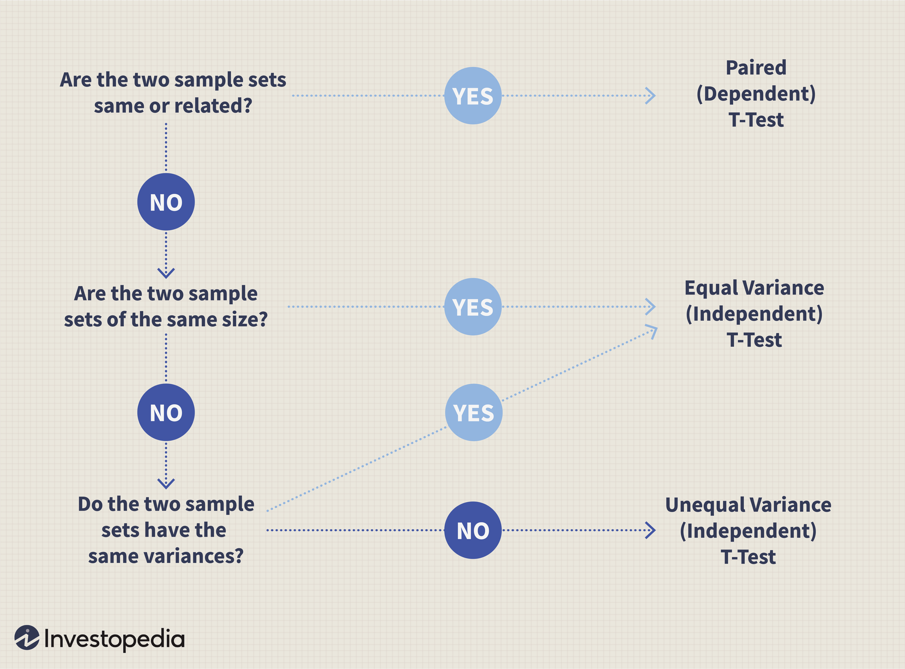

Understanding statistical methods is a cornerstone in today’s data-driven sectors like finance and economics, where precise decision-making is paramount. A key statistical tool in this domain is the t-test, which is used to assess whether there are significant differences between the means of two groups. This assessment is critical for identifying meaningful patterns within data and informing strategic decisions.

The t-test plays an important role in hypothesis testing, which is a method used to test the validity of a claim or hypothesis about a population based on sample data. Particularly in algorithmic trading, where decisions are executed automatically based on quantitative models, the t-test assists in the diligent evaluation of trading strategies. By deploying statistical models, traders can use hypothesis testing to validate assumptions about market movements, enhancing the reliability and effectiveness of their trading strategies.



Algorithmic trading relies heavily on the intelligent interpretation of data through statistical methods. Here, hypothesis testing can be employed to determine whether a particular trading strategy outperforms a benchmark. The application of the t-test becomes indispensable as it allows traders to ascertain the statistical significance of their results, ensuring that detected patterns are not due to random chance but represent genuine trends in the financial markets.

In this article, we will review the key assumptions necessary for the valid application of the t-test. Understanding these assumptions is essential, as they underpin the correct interpretation of the test's results. Whether it involves analyzing price movements or evaluating economic indicators, the t-test and its requirements provide a framework for robust statistical analysis in financial contexts.

## Table of Contents

## The Basics of Hypothesis Testing

Hypothesis testing is a cornerstone of statistical analysis, providing a framework to evaluate the validity of assertions regarding a given data set. At its core, hypothesis testing aims to assess the strength of evidence against a null hypothesis (H0), which is a default assumption about a population parameter. Typically, this null hypothesis suggests no effect or no difference between groups.

To challenge the null hypothesis, an alternative hypothesis (H1) is posed, asserting that there is indeed an effect or a difference. This forms the basis of the hypothesis testing process, which can be abridged into several critical steps.

Firstly, researchers must define both the null and alternative hypotheses. For instance, in evaluating the difference between the mean returns of two investment strategies, H0 might state that these means are equal, while H1 would assert that they are not.

Subsequently, a significance level (α) is chosen, typically set at 0.05 or 5%. This level represents the probability of rejecting the null hypothesis when it is actually true, known as a Type I error. The choice of α reflects the researcher's tolerance for this type of error, balancing between sensitivity to detect genuine effects and caution against false positives.

Next, a test statistic is computed from the sample data. This statistic measures the degree of deviation from what is expected under the null hypothesis. For example, in a t-test, the test statistic follows a t-distribution, assuming the null hypothesis is true. The formula for the t-statistic in the context of comparing two means can be expressed as:

$$
t = \frac{\bar{X}_1 - \bar{X}_2}{\sqrt{\frac{s_1^2}{n_1} + \frac{s_2^2}{n_2}}}
$$

where $\bar{X}_1$ and $\bar{X}_2$ are the sample means, $s_1^2$ and $s_2^2$ are the sample variances, and $n_1$ and $n_2$ are the sample sizes.

Following the calculation of the test statistic, a p-value is determined. This p-value indicates the probability of observing a test statistic as extreme as the one computed, assuming the null hypothesis is true. A p-value less than or equal to the significance level (α) suggests sufficient evidence to reject the null hypothesis in favor of the alternative.

These elements—hypotheses formulation, significance levels, test [statistics](/wiki/bayesian-statistics), and p-values—form the fundamentals of hypothesis testing. In financial and quantitative analysis, particularly in the development and testing of models, these concepts are indispensable, offering rigorous methods to test assumptions and validate strategies. Understanding and effectively applying these principles through methods like the t-test can lead to more informed decision-making and robust strategies.

## What is a T-Test?

A t-test is a fundamental statistical method utilized to assess whether there is a substantial difference between the means of two groups. This test is especially useful in situations where sample sizes are small and the variances of the populations from which the samples are drawn are unknown. Its utility extends to determining the effectiveness of treatments or the difference in outcomes in controlled experiments.

Mathematically, the t-test is framed around the assumption of a null hypothesis (H₀) that posits no difference exists between the group means. An alternative hypothesis (H₁) suggests that a difference does exist. The test then calculates a t-statistic, which quantifies the difference relative to the variability observed in the data:

$$
t = \frac{\bar{x}_1 - \bar{x}_2}{s \cdot \sqrt{\frac{1}{n_1} + \frac{1}{n_2}}}
$$

where:
- $\bar{x}_1$ and $\bar{x}_2$ are the sample means,
- $s$ is the pooled standard deviation of the two samples,
- $n_1$ and $n_2$ are the sample sizes of the two groups.

The flexibility of the t-test makes it a favored tool in fields like finance and economics. For instance, in finance, comparing the mean returns of two investment portfolios over a certain period using a t-test can provide vital insights into their relative performance. This application aids investors in making informed decisions based on statistical evidence, assuming normality in the financial return data.

Given its foundational role in statistical analysis, the t-test serves as a building block for more complex analyses and is often an integral part of the toolkit for data scientists and analysts working in data-intensive industries.

## Assumptions of the T-Test

The validity of a t-test is contingent upon a series of critical assumptions that must be met to ensure the reliability of the results. These assumptions are foundational to the correct application of the t-test in various statistical analyses, including quantitative finance and economics.

1. **Scale of Measurement**: The t-test demands data that are either continuous or ordinal. This scale ensures that the mean of the data is a meaningful measure of central tendency, which is crucial for the comparison of group means. Continuous data, such as stock prices or economic indicators, provide the precision necessary for detecting subtle differences between groups.

2. **Random Sampling**: The data used in a t-test should be derived from a random sample of the population. This assumption ensures that the sample is representative of the population, reducing potential biases. In financial studies, this could mean ensuring that the sample data of asset returns are not restricted to a specific time period or market condition, which could skew results.

3. **Normality**: The assumption of normality indicates that the data should be approximately normally distributed. This requirement applies to the differences between the means or, in some cases, the individual data points. While the Central Limit Theorem suggests that the distribution of the sample mean will approximate normality in large samples, smaller samples necessitate a more stringent check for normality. Tools like Q-Q plots or the Shapiro-Wilk test can help assess this assumption in practice.

4. **Sample Size**: Although the t-test can handle small sample sizes, the sample must be large enough to ensure the approximation of a normal distribution of the sample mean. In practical terms, a larger sample size increases the power of the test, making it more likely to detect a true difference between groups when it exists. For financial data, this might involve aggregating daily returns over several years to ensure a sufficient sample size.

5. **Homogeneity of Variance**: The assumption of homogeneity of variance, also known as homoscedasticity, requires that the variances among the groups being compared should be approximately equal. Unequal variances, or heteroscedasticity, can lead to unreliable test results. The Levene's test is commonly used to assess this assumption. In financial contexts, this might involve comparing volatility (variance) between different asset classes or time periods.

Failure to meet these assumptions can compromise the validity of the t-test, leading to inaccurate conclusions. Therefore, careful consideration and verification of each assumption are crucial steps in the hypothesis testing process. Statistical software and programming languages like Python offer built-in functions to test these assumptions effectively, ensuring the robustness of the analysis conducted.

## Applying T-Test in Algorithmic Trading

Algorithmic trading utilizes sophisticated statistical models to optimize and validate trading strategies. Hypothesis testing, particularly using t-tests, plays a vital role in this process by assessing whether the performance difference between two trading strategies is statistically significant. Here's how the t-test can be applied in [algorithmic trading](/wiki/algorithmic-trading):

### Data Preparation
The first step in applying a t-test in algorithmic trading involves data preparation. This includes collecting time-series data of trading returns or other performance metrics of interest for the strategies being compared. Data should be cleaned and standardized to eliminate biases and errors that can adversely affect hypothesis testing. For instance, missing values need to be addressed, and outliers should be checked for validity.

### Hypothesis Formulation
Before conducting the t-test, it is essential to formulate the null hypothesis (H0) and the alternative hypothesis (H1). Typically, the null hypothesis states that there is no significant difference between the means of the two strategies' returns, while the alternative hypothesis suggests a significant difference exists. Formulating clear hypotheses is crucial for interpreting results correctly. 

### Performing the T-Test
After defining the hypotheses, the t-test can be performed. Using Python, this process can be executed with the `scipy.stats` module, which provides a convenient function for this purpose. 

```python
from scipy import stats

# Sample data: daily returns of two trading strategies
strategy1_returns = [0.02, 0.01, 0.03, -0.01, 0.00, 0.04, 0.02]
strategy2_returns = [0.03, 0.00, 0.04, 0.01, 0.02, 0.05, 0.03]

# Perform a two-sample t-test
t_statistic, p_value = stats.ttest_ind(strategy1_returns, strategy2_returns)

print("T-statistic:", t_statistic)
print("P-value:", p_value)
```
This code snippet initiates a two-sample t-test, comparing the means of the daily returns from two distinct trading strategies. 

### Analysis of Results
Interpreting the results relies on the t-statistic and the corresponding p-value. A statistically significant result (usually p-value < 0.05) would indicate a sufficient difference in performance between the two strategies, warranting further analysis or adjustment.

### Practical Application for Traders
Consider a scenario where a trader wants to compare a moving average crossover strategy with a buy-and-hold strategy. By applying the t-test to monthly returns over a specified period, the trader can validate whether observed performance differences are statistically significant or merely the result of market [volatility](/wiki/volatility-trading-strategies).

Additionally, t-tests can be used when modifying an algorithmic strategy; for instance, to verify if a parameter adjustment genuinely enhances performance compared to the original configuration. Such tests help ensure trading strategies are grounded in statistical rigor, rather than anecdotal evidence or fleeting market conditions.

### Conclusion
In practice, applying a t-test effectively in algorithmic trading necessitates a robust understanding of the underlying assumptions and the quality of input data. Proper implementation can reveal valuable insights, enabling traders to develop and refine strategies with statistical confidence.

## Common Challenges and Limitations

Implementing t-tests in algorithmic trading involves multiple challenges and limitations that must be carefully addressed to ensure accurate and reliable results. One of the primary considerations is data quality. Poor quality data can lead to incorrect conclusions due to errors or biases present in the dataset. It is essential to ensure that the data used is accurate, relevant, and free from anomalies or outliers that could skew the results.

Sample size is another critical [factor](/wiki/factor-investing). A small sample size can lead to an underpowered t-test, reducing the statistical power and increasing the risk of Type II errors, where a false null hypothesis is not rejected. Conversely, a large sample size may lead to overfitting, where the model becomes too complex and captures noise rather than the underlying data pattern. Thus, selecting an appropriate sample size is vital for balancing these risks and obtaining meaningful results.

Market volatility can significantly impact the performance of trading strategies and, subsequently, the results of the t-test. Changes in market conditions may alter the characteristics of the data, leading to varied results. To mitigate these effects, it is beneficial to include robustness checks and conduct tests under different market scenarios when possible.

Overfitting is a prevalent issue in algorithmic trading, where models are excessively tailored to historical data but fail to perform well with new data. To prevent overfitting in hypothesis testing with t-tests, cross-validation techniques can be employed. Cross-validation involves dividing the dataset into training and testing subsets to assess the model’s ability to generalize to new data. This method helps in understanding if the statistical significance observed in sample tests holds when applied to different data splits.

Data normalization is another technique to address challenges related to implementing t-tests. Scaling the data to a standard range ensures that differences in data magnitude do not disproportionately affect the results. Moreover, it can improve the alignment of data distributions with the assumptions of the t-test, especially normality, enhancing the overall validity of the test.

Python can be used to perform t-tests and handle the discussed challenges effectively. For example, using libraries like `scipy` for statistical tests and `sklearn` for cross-validation enhances the reliability of the process. Here is a basic example of how a t-test might be implemented in Python:

```python
import numpy as np
from scipy.stats import ttest_ind
from sklearn.model_selection import train_test_split, cross_val_score

# Sample data
group1 = np.random.normal(loc=0.0, scale=1.0, size=100)
group2 = np.random.normal(loc=0.1, scale=1.0, size=100)

# Perform t-test
t_stat, p_value = ttest_ind(group1, group2)
print(f"T-statistic: {t_stat}, P-value: {p_value}")

# Example of cross-validation (For illustration, this uses a hypothetical model)
X = np.random.normal(size=(200, 10))
y = np.random.choice([0, 1], size=200)
model = ...  # some model
scores = cross_val_score(model, X, y, cv=5)
print(f"Cross-validation scores: {scores}")
```

By understanding and addressing these common challenges, traders and analysts can more effectively apply t-tests in their trading strategies, leading to more accurate and robust outcomes.

## Conclusion

The t-test continues to be a pivotal instrument in the statistical evaluation of trading strategies, providing a robust mechanism for discerning significant differences between group means. When traders rigorously adhere to its underlying assumptions—such as normality, homogeneity of variance, and adequate sample size—the t-test offers reliable insights that can significantly enhance model robustness and accuracy. Specifically, ensuring data integrity, through careful sampling and preprocessing, allows for more accurate hypothesis testing.

Moreover, the fast-paced dynamics of financial markets necessitate the continuous adaptation and application of statistical techniques. The evolving nature of these markets means that strategies that perform well under one set of conditions may not necessarily excel in another. As such, traders and analysts must remain agile, consistently refining their approaches to include newer statistical tools and methods that cater to the current market environment.

Employing advanced computational techniques to complement traditional statistical analyses, such as integrating [machine learning](/wiki/machine-learning) models and performing frequent back-testing, can further amplify the effectiveness of trading strategies. This holistic approach facilitates the anticipation of market trends and the swift identification of profitable opportunities, positioning traders optimally in an ever-evolving financial landscape.

## References & Further Reading

- **"Statistical Methods for Algorithmic Trading" by David Aronson**: This book provides a comprehensive overview of statistical techniques used in algorithmic trading, including hypothesis testing. Aronson covers the application of t-tests in financial markets, offering practical examples and detailed explanations.

- **"Advances in Financial Machine Learning" by Marcos López de Prado**: A critical resource for understanding the integration of machine learning with quantitative finance. López de Prado explores various statistical methods, emphasizing the importance of rigorous hypothesis testing, including the use of t-tests, to validate trading strategies.

- **"Practical Time Series Analysis" by Aileen Nielsen**: This book explores various methods for analyzing time series data, with a focus on Python implementations. Nielsen discusses hypothesis testing within the context of financial data, offering insights on when and how to apply t-tests effectively.

- **Research on Algorithmic Trading**: A variety of academic papers provide insights into the practical application of hypothesis testing in trading. For example, "The Use of Hypothesis Testing in Stock Market Prediction Models" explores the effectiveness of statistical tests in predicting market movement, highlighting the role of t-tests.

- **"Quantitative Finance for Dummies" by Steve Bell**: An accessible guide for beginners, this book introduces the basics of quantitative finance, including a foundational understanding of hypothesis testing and t-tests in market analysis.

- **Online Courses on Quantitative Finance and Algorithmic Trading**: Platforms such as Coursera and edX offer courses that include modules on statistical analysis and the use of t-tests in financial applications. These courses often incorporate hands-on coding examples, typically using Python, to illustrate key concepts.

- **Python Libraries and Documentation**: Libraries such as `scipy.stats` provide functions for performing t-tests, allowing users to easily implement these statistical tools in their analyses. The official documentation and communities around these libraries often share valuable use cases and tutorials. 

These resources collectively provide a solid foundation for understanding and applying hypothesis testing and t-tests in finance. They cater to various levels of expertise, from introductory guides to advanced academic texts, ensuring a better grasp of the complexities involved in trading strategy validation.

