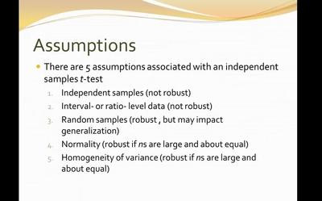

## Table of Contents

## What is a T-Test and why is it used in statistical analysis?

A T-Test is a statistical tool used to determine if there is a significant difference between the means of two groups. It helps researchers understand if the differences they observe in their data are due to a specific treatment or if they could have happened by chance. For example, if you want to know if a new teaching method improves test scores, you could use a T-Test to compare the scores of students who used the new method with those who didn't.

T-Tests are important in statistical analysis because they help make decisions based on data. By calculating the T-Test, researchers can find out if their results are reliable or if they might be due to random variation. This is crucial in fields like medicine, education, and psychology, where understanding the impact of different treatments or methods is essential. The T-Test gives a clear way to measure and interpret these differences, making it a fundamental part of many research studies.

## What are the basic assumptions required for conducting a T-Test?

To use a T-Test correctly, there are some basic assumptions that need to be met. The first assumption is that the data should be normally distributed. This means that if you plot the data on a graph, it should look like a bell curve, with most of the data points gathered around the middle and fewer points as you move away from the center. The T-Test works best when the data follows this pattern. If the data is not normally distributed, the results of the T-Test might not be reliable.

Another important assumption is that the variances of the two groups being compared should be roughly equal. This is known as the assumption of homogeneity of variance. If one group's data is much more spread out than the other group's, it can affect the T-Test results. There are ways to check this, like using a test called Levene's Test, which can tell you if the variances are similar enough to proceed with the T-Test.

Lastly, the observations in each group should be independent of each other. This means that the result of one observation should not influence the result of another. For example, if you're testing a new drug, the effect seen in one patient should not affect the effect seen in another patient. If the data does not meet these assumptions, you might need to use a different statistical test or transform your data to meet these requirements.

## How does the assumption of normality affect the T-Test results?

The assumption of normality is important for the T-Test because it helps make sure the test results are reliable. When the data follows a normal distribution, it looks like a bell curve with most of the data in the middle and less on the sides. If the data is normally distributed, the T-Test can accurately tell if the difference between the two groups is real or just by chance. If the data isn't normal, the T-Test might give wrong results. It might say there's a difference when there isn't one, or it might miss a real difference.

To check if the data is normal, you can use graphs or special tests like the Shapiro-Wilk test. If the data isn't normal, you have a few choices. You can try to make the data normal by changing it, like using a log transformation. Or, you can use a different test that doesn't need normal data, like the Mann-Whitney U test. It's important to check for normality because it helps make sure the T-Test results are trustworthy and useful for making decisions.

## What is the assumption of independence in T-Tests and why is it important?

The assumption of independence in T-Tests means that the data points in each group should not affect each other. For example, if you're testing a new medicine, the results from one patient should not influence the results from another patient. This is important because if the data points are not independent, the T-Test might give wrong results. It might say there's a difference between the groups when there isn't one, or it might miss a real difference.

If the data is not independent, it can mess up the T-Test. For instance, if you're studying students in a class and you use data from the same student multiple times, those data points are not independent. The T-Test assumes each data point is unique and not connected to others. If this assumption is broken, the test can't tell if the differences between groups are real or just because the data points are related. So, making sure the data is independent helps make the T-Test results more reliable and trustworthy.

## How can you check for the assumption of equal variances in T-Tests?

To check for the assumption of equal variances in T-Tests, you can use a test called Levene's Test. This test helps you see if the spread of data in one group is similar to the spread in the other group. If Levene's Test shows that the variances are not significantly different, it means you can go ahead and use the regular T-Test. But if the test shows that the variances are different, you might need to use a different version of the T-Test, called the Welch's T-Test, which doesn't assume equal variances.

You can also look at the data yourself to check for equal variances. One way to do this is by making a graph, like a box plot, which shows how spread out the data is in each group. If the boxes on the graph look about the same size, it suggests that the variances might be equal. If one box is much bigger or smaller than the other, it might mean the variances are not equal. Checking the data this way can give you a quick idea before you do the formal Levene's Test.

## What are the consequences of violating the assumption of equal variances?

If you violate the assumption of equal variances when doing a T-Test, it can mess up your results. The T-Test assumes that the spread of data in both groups is about the same. If it's not, the test might say there's a difference between the groups when there isn't one, or it might miss a real difference. This can lead to wrong conclusions and bad decisions based on the data.

To deal with this problem, you can use a different version of the T-Test called the Welch's T-Test. This test doesn't assume that the variances are equal, so it's better when the spreads are different. Another option is to transform your data to make the variances more equal before doing the regular T-Test. It's important to check for equal variances and use the right test to make sure your results are reliable and useful.

## How does sample size impact the robustness of T-Test assumptions?

Sample size can make a big difference in how well T-Test assumptions hold up. When you have a small sample size, the T-Test can be sensitive to things like non-normal data or unequal variances. If your data doesn't follow the normal distribution or if the spread of data in your groups is different, a small sample might lead to wrong results. This is because small samples can be easily thrown off by unusual data points or patterns that wouldn't matter as much in a bigger group.

On the other hand, a larger sample size can help make the T-Test more robust. With more data, the T-Test is less affected by small changes or weird patterns in the data. Even if the data isn't perfectly normal or the variances aren't exactly equal, a big sample can still give you reliable results. This is because larger samples give a better overall picture of the data, making the T-Test's assumptions less critical. So, when possible, using a larger sample can help make your T-Test results more trustworthy.

## What alternatives exist to the T-Test if its assumptions are not met?

If the assumptions of the T-Test are not met, you can use other tests that don't need those assumptions. One popular choice is the Mann-Whitney U Test. This test is good when your data is not normally distributed. It compares the ranks of the data points instead of their actual values, so it works well even if the data is all over the place. Another option is the Wilcoxon Signed-Rank Test, which is used when you're looking at the same group of people before and after some treatment, and the data isn't normal.

If the problem is with unequal variances, you can use the Welch's T-Test. This test is a version of the T-Test that doesn't assume the variances are the same in both groups. It adjusts the calculations to account for the different spreads, giving you more reliable results. If the issue is with the independence of data, you might need to look at more complex statistical models, like mixed-effects models, which can handle data where observations are related to each other. Choosing the right test depends on what kind of data you have and what assumptions are not being met.

## How can you use transformations to meet T-Test assumptions?

Transformations are a way to change your data so it fits the T-Test's assumptions better. One common transformation is the log transformation. If your data is spread out a lot and not normal, taking the log of each number can make it more normal. This can help if the data doesn't look like a bell curve. Another transformation is the square root transformation, which can be useful if you have a lot of small numbers and a few big ones. By taking the square root, you can make the data more even and closer to normal.

Transformations can also help with the assumption of equal variances. If one group's data is much more spread out than the other group's, a transformation like taking the log or square root can make the spreads more similar. This makes it okay to use the regular T-Test. But, you need to be careful. After you transform the data, you should check again to make sure it now meets the T-Test's assumptions. If it does, you can go ahead with the test and trust the results more.

## What are the implications of non-normality on T-Test power and Type I error rates?

When data isn't normal, it can affect how well a T-Test works. The power of a T-Test is how good it is at finding real differences between groups. If the data isn't normal, the T-Test might not be as good at spotting these differences. It might miss real effects, making the test less powerful. This means you might think there's no difference between groups when there actually is one. So, it's important to check if your data is normal before doing a T-Test to make sure you can trust the results.

Non-normality can also mess up the Type I error rate, which is the chance of saying there's a difference when there isn't one. The T-Test is set up to have a 5% Type I error rate if the data is normal. But if the data isn't normal, this rate can go up or down. If it goes up, you might think you found a difference when it's just by chance. If it goes down, you might miss real differences. Checking for normality and using the right test or transformation can help keep the Type I error rate in check and make your results more reliable.

## How do you interpret T-Test results when assumptions are marginally violated?

If the T-Test assumptions are only a little bit off, you can still use the T-Test, but you need to be careful with the results. When the data is not perfectly normal or the variances are not exactly the same, the T-Test might still work okay. But you should check how far off the assumptions are. If it's just a little bit, the T-Test might still give you good results. But if the assumptions are a lot off, the results might not be as trustworthy.

To make sure your results are reliable when assumptions are slightly violated, you can do a few things. First, you can look at the data to see if the T-Test results make sense. If they do, and the violations are small, you might be okay. Also, you can try using other tests, like the Welch's T-Test for unequal variances, or the Mann-Whitney U Test if the data isn't normal. These tests can help you feel more confident in your results even when the T-Test assumptions aren't perfect.

## What advanced statistical techniques can be used to validate T-Test assumptions more rigorously?

To check if the T-Test assumptions are really okay, you can use some advanced statistical techniques. One way is to use something called the Shapiro-Wilk test to see if your data is normal. This test gives you a number that tells you how close your data is to being normal. If the number is high, your data is probably normal enough for the T-Test. Another way is to use Levene's Test to check if the variances in your groups are the same. This test helps you see if the spread of data in one group is similar to the spread in the other group. If the test says the variances are not too different, you can feel more sure about using the T-Test.

Another advanced technique is to use something called bootstrapping. This method takes your data and makes lots of new samples from it. By doing the T-Test on these new samples, you can see how often you get the same results. If you get the same results a lot, it means your T-Test results are probably reliable, even if the assumptions are a bit off. You can also use something called a Q-Q plot to check for normality. This is a graph that shows how your data lines up with a normal distribution. If the points on the graph follow a straight line, your data is probably normal enough for the T-Test. These advanced techniques can help you feel more confident that your T-Test results are good, even when the assumptions are not perfect.

## What are the Basics of Hypothesis Testing?

Hypothesis testing is a cornerstone of statistical analysis, providing a framework to evaluate the validity of assertions regarding a given data set. At its core, hypothesis testing aims to assess the strength of evidence against a null hypothesis (H0), which is a default assumption about a population parameter. Typically, this null hypothesis suggests no effect or no difference between groups.

To challenge the null hypothesis, an alternative hypothesis (H1) is posed, asserting that there is indeed an effect or a difference. This forms the basis of the hypothesis testing process, which can be abridged into several critical steps.

Firstly, researchers must define both the null and alternative hypotheses. For instance, in evaluating the difference between the mean returns of two investment strategies, H0 might state that these means are equal, while H1 would assert that they are not.

Subsequently, a significance level (α) is chosen, typically set at 0.05 or 5%. This level represents the probability of rejecting the null hypothesis when it is actually true, known as a Type I error. The choice of α reflects the researcher's tolerance for this type of error, balancing between sensitivity to detect genuine effects and caution against false positives.

Next, a test statistic is computed from the sample data. This statistic measures the degree of deviation from what is expected under the null hypothesis. For example, in a t-test, the test statistic follows a t-distribution, assuming the null hypothesis is true. The formula for the t-statistic in the context of comparing two means can be expressed as:

$$
t = \frac{\bar{X}_1 - \bar{X}_2}{\sqrt{\frac{s_1^2}{n_1} + \frac{s_2^2}{n_2}}}
$$

where $\bar{X}_1$ and $\bar{X}_2$ are the sample means, $s_1^2$ and $s_2^2$ are the sample variances, and $n_1$ and $n_2$ are the sample sizes.

Following the calculation of the test statistic, a p-value is determined. This p-value indicates the probability of observing a test statistic as extreme as the one computed, assuming the null hypothesis is true. A p-value less than or equal to the significance level (α) suggests sufficient evidence to reject the null hypothesis in favor of the alternative.

These elements—hypotheses formulation, significance levels, test [statistics](/wiki/bayesian-statistics), and p-values—form the fundamentals of hypothesis testing. In financial and quantitative analysis, particularly in the development and testing of models, these concepts are indispensable, offering rigorous methods to test assumptions and validate strategies. Understanding and effectively applying these principles through methods like the t-test can lead to more informed decision-making and robust strategies.

## What is a T-Test?

A t-test is a fundamental statistical method utilized to assess whether there is a substantial difference between the means of two groups. This test is especially useful in situations where sample sizes are small and the variances of the populations from which the samples are drawn are unknown. Its utility extends to determining the effectiveness of treatments or the difference in outcomes in controlled experiments.

Mathematically, the t-test is framed around the assumption of a null hypothesis (H₀) that posits no difference exists between the group means. An alternative hypothesis (H₁) suggests that a difference does exist. The test then calculates a t-statistic, which quantifies the difference relative to the variability observed in the data:

$$
t = \frac{\bar{x}_1 - \bar{x}_2}{s \cdot \sqrt{\frac{1}{n_1} + \frac{1}{n_2}}}
$$

where:
- $\bar{x}_1$ and $\bar{x}_2$ are the sample means,
- $s$ is the pooled standard deviation of the two samples,
- $n_1$ and $n_2$ are the sample sizes of the two groups.

The flexibility of the t-test makes it a favored tool in fields like finance and economics. For instance, in finance, comparing the mean returns of two investment portfolios over a certain period using a t-test can provide vital insights into their relative performance. This application aids investors in making informed decisions based on statistical evidence, assuming normality in the financial return data.

Given its foundational role in statistical analysis, the t-test serves as a building block for more complex analyses and is often an integral part of the toolkit for data scientists and analysts working in data-intensive industries.

## References & Further Reading

- **"Statistical Methods for Algorithmic Trading" by David Aronson**: This book provides a comprehensive overview of statistical techniques used in algorithmic trading, including hypothesis testing. Aronson covers the application of t-tests in financial markets, offering practical examples and detailed explanations.

- **"Advances in Financial Machine Learning" by Marcos López de Prado**: A critical resource for understanding the integration of machine learning with quantitative finance. López de Prado explores various statistical methods, emphasizing the importance of rigorous hypothesis testing, including the use of t-tests, to validate trading strategies.

- **"Practical Time Series Analysis" by Aileen Nielsen**: This book explores various methods for analyzing time series data, with a focus on Python implementations. Nielsen discusses hypothesis testing within the context of financial data, offering insights on when and how to apply t-tests effectively.

- **Research on Algorithmic Trading**: A variety of academic papers provide insights into the practical application of hypothesis testing in trading. For example, "The Use of Hypothesis Testing in Stock Market Prediction Models" explores the effectiveness of statistical tests in predicting market movement, highlighting the role of t-tests.

- **"Quantitative Finance for Dummies" by Steve Bell**: An accessible guide for beginners, this book introduces the basics of quantitative finance, including a foundational understanding of hypothesis testing and t-tests in market analysis.

- **Online Courses on Quantitative Finance and Algorithmic Trading**: Platforms such as Coursera and edX offer courses that include modules on statistical analysis and the use of t-tests in financial applications. These courses often incorporate hands-on coding examples, typically using Python, to illustrate key concepts.

- **Python Libraries and Documentation**: Libraries such as `scipy.stats` provide functions for performing t-tests, allowing users to easily implement these statistical tools in their analyses. The official documentation and communities around these libraries often share valuable use cases and tutorials. 

These resources collectively provide a solid foundation for understanding and applying hypothesis testing and t-tests in finance. They cater to various levels of expertise, from introductory guides to advanced academic texts, ensuring a better grasp of the complexities involved in trading strategy validation.

