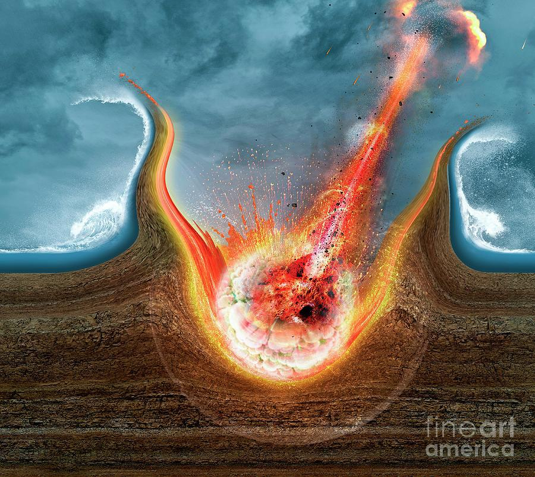

## Table of Contents

## What is an asteroid impact event?

An asteroid impact event is when a big space rock, called an asteroid, hits Earth. These events can be very dangerous because asteroids can be huge and move very fast. When they hit Earth, they can cause a lot of damage. The damage can include big holes in the ground called craters, fires, and even changes to the weather.

One famous asteroid impact happened about 66 million years ago. It is believed that this impact helped cause the dinosaurs to go extinct. The asteroid made a huge crater in what is now Mexico. The impact sent a lot of dust and smoke into the air, which blocked the sun and made the Earth very cold. This made it hard for plants to grow, and many animals, including dinosaurs, could not survive.

Scientists study these events to learn more about them and to try to predict if another big asteroid might hit Earth in the future. They use telescopes to watch the sky and look for asteroids that might be coming close to Earth. If they find one, they can try to figure out ways to stop it from hitting us.

## How often do asteroid impact events occur?

Asteroid impact events happen more often than you might think, but most of them are small and don't cause much harm. Every day, tiny pieces of asteroids, called meteoroids, burn up in Earth's atmosphere. We see them as shooting stars. These small impacts happen all the time and are not dangerous. Once in a while, a bigger piece of rock makes it through the atmosphere and hits the ground. These impacts happen a few times a year, but they usually land in places like the ocean or empty land where they don't hurt anyone.

Big asteroid impacts, the kind that can cause a lot of damage, are much rarer. Scientists think that an asteroid big enough to cause widespread destruction might hit Earth once every few hundred thousand years. The last really big impact happened about 66 million years ago and is believed to have helped wipe out the dinosaurs. While these big events are rare, they can be very dangerous, so scientists keep a close watch on the sky to try to spot any large asteroids heading our way.

## What are the different types of asteroids that can impact Earth?

There are different types of asteroids that can hit Earth. One type is called stony asteroids. These are made mostly of rock and can be different sizes. When they hit Earth, they can leave behind craters and sometimes pieces of the asteroid that scientists can study. Another type is called metallic asteroids. These are made mostly of metal, like iron and nickel. They are very heavy and can cause a lot of damage when they hit Earth. The last type is called carbonaceous asteroids. These are made of rock and a lot of carbon. They can be dark in color and might have water inside them, which is interesting to scientists.

Scientists learn about these different types of asteroids by studying the pieces that fall to Earth, called meteorites. When a stony asteroid hits, it might break apart and leave behind rocky pieces. Metallic asteroids can leave behind pieces of metal that look like they came from space. Carbonaceous asteroids can leave behind pieces that have clues about water and other things that might be useful for understanding how life started on Earth. By studying these different types of meteorites, scientists can learn more about the asteroids that hit our planet and where they come from in space.

## What are the potential effects of an asteroid impact on Earth?

When an asteroid hits Earth, it can cause a lot of damage right away. The asteroid can make a big hole in the ground called a crater. If it hits a city, it can destroy buildings and hurt people. The impact can also start fires and send a lot of dust and rocks flying into the air. This can make it hard to breathe and can damage things far away from where the asteroid hit. If the asteroid is big enough, it can even cause earthquakes and tsunamis, which are big waves in the ocean.

The effects of an asteroid impact can last a long time, too. The dust and smoke from the impact can go up into the sky and block the sun. This can make the Earth get very cold, which is called an impact winter. Without the sun, plants can't grow, and animals can't find food. This can cause a lot of animals to die, just like what happened to the dinosaurs a long time ago. It can take many years for the Earth to get back to normal after a big asteroid impact.

## Can you describe a historical asteroid impact event?

One famous asteroid impact happened about 66 million years ago. It is known as the Chicxulub impact. A huge asteroid, about 10 kilometers wide, hit what is now Mexico. The impact made a giant crater that is still there today, hidden under the ground. When the asteroid hit, it caused a lot of damage right away. It made big fires, threw rocks and dust into the air, and even caused tsunamis in the ocean.

The effects of the Chicxulub impact lasted a long time. The dust and smoke from the impact went up into the sky and blocked the sun. This made the Earth very cold and dark, which is called an impact winter. Without the sun, plants could not grow, and many animals could not find food. This led to the extinction of the dinosaurs and many other species. Scientists think that this impact was one of the main reasons why the dinosaurs disappeared from Earth.

## What methods are used to detect and track potentially hazardous asteroids?

Scientists use telescopes to find and keep an eye on asteroids that might be dangerous. They look at the sky with big telescopes that can see far into space. These telescopes help them find new asteroids and watch where they are going. Some telescopes, like the ones used by the NASA-funded Catalina Sky Survey, are always looking for new asteroids. They take pictures of the sky and use computers to find anything that moves, which could be an asteroid.

Once they find an asteroid, scientists use more telescopes to learn more about it. They want to know how big it is, what it is made of, and where it is going. They use special tools to measure the light from the asteroid and figure out its size and shape. They also use math to predict where the asteroid will go in the future. If they think an asteroid might come close to Earth, they keep watching it very carefully to make sure it won't hit us.

## How do scientists predict the impact location and effects of an incoming asteroid?

Scientists use math and computers to predict where an asteroid will hit Earth. They watch the asteroid with telescopes and measure how fast it is moving and in what direction. This information helps them figure out the asteroid's path. If they see that the asteroid is going to hit Earth, they can use more math to find out exactly where it will land. This is important because it helps people know if they need to get out of the way or take other safety measures.

Once they know where the asteroid will hit, scientists can also predict what will happen when it lands. They look at how big the asteroid is and how fast it is going. This helps them guess how big the crater will be and how much damage the impact will cause. They can also use computer models to see how the dust and smoke from the impact might affect the weather and the environment. By understanding these things, scientists can help people prepare for the impact and its aftermath.

## What are the current international efforts to prevent or mitigate asteroid impacts?

Countries around the world are working together to stop or lessen the damage from asteroid impacts. One big group that helps with this is the United Nations. They started something called the International Asteroid Warning Network (IAWN) and the Space Mission Planning Advisory Group (SMPAG). These groups help scientists share information about dangerous asteroids and plan what to do if one is coming toward Earth. They use telescopes and other tools to watch the sky and find new asteroids. If they see a big one coming close, they can warn people and start planning how to stop it.

One way to stop an asteroid is to change where it is going. Scientists are trying out a mission called the Double Asteroid Redirection Test (DART). It is run by NASA and it tries to hit an asteroid with a spacecraft to push it off [course](/wiki/best-algorithmic-trading-courses). If this works, it could be a way to stop an asteroid from hitting Earth. Another idea is to use a spacecraft to pull the asteroid away from Earth with gravity. These are just some of the ways that countries are working together to keep Earth safe from asteroid impacts.

## What technologies are being developed to deflect or destroy an incoming asteroid?

Scientists are working on different ways to stop an asteroid from hitting Earth. One way is called kinetic impact. This is where a spacecraft is sent to hit the asteroid and change its path. NASA is testing this with a mission called the Double Asteroid Redirection Test (DART). The idea is to crash a spacecraft into an asteroid to push it off course. If this works, it could be a good way to stop an asteroid from hitting Earth.

Another way is to use gravity to pull the asteroid away from Earth. This is called a gravity tractor. A spacecraft would fly close to the asteroid and use its gravity to slowly move the asteroid to a new path. This method would need to start early because it takes a long time to work. Both of these methods are being studied to see if they can really stop an asteroid from hitting Earth and keep us safe.

## How does the size of an asteroid affect the severity of its impact?

The size of an asteroid is really important when it comes to how much damage it can do if it hits Earth. A small asteroid, like one that is just a few meters wide, might burn up in the atmosphere and not cause much harm. But if it does make it to the ground, it might only make a small crater and not hurt many people. These small impacts happen a few times a year and usually land in places where no one gets hurt, like the ocean or empty land.

A big asteroid, on the other hand, can cause a lot of damage. If an asteroid is several kilometers wide, like the one that hit Earth 66 million years ago, it can make a huge crater, start big fires, and send a lot of dust and smoke into the air. This can block the sun and make the Earth very cold, which can kill a lot of plants and animals. The bigger the asteroid, the more damage it can do, so scientists keep a close watch on the sky to try to spot any large asteroids that might be coming our way.

## What geological evidence do we have of past asteroid impact events?

Scientists have found lots of evidence that shows big asteroids have hit Earth in the past. One big piece of evidence is craters. These are big holes in the ground that are left behind after an asteroid hits. One famous crater is the Chicxulub crater in Mexico. It was made by a huge asteroid about 66 million years ago. Scientists found this crater under the ground and it helped them understand why the dinosaurs went extinct. There are other craters around the world, like the Barringer Crater in Arizona, that also show where asteroids have hit Earth.

Another kind of evidence is the rocks and minerals that are left behind after an impact. When an asteroid hits, it can melt rocks and make new minerals that are not usually found on Earth. Scientists have found these special rocks and minerals in places like the Sudbury Basin in Canada. They show that a big asteroid hit there a long time ago. Also, layers of rock that have a lot of the element iridium are found all over the world. Iridium is rare on Earth but common in asteroids, so finding it in rocks helps scientists know that an asteroid impact happened around that time.

## What are the long-term environmental consequences of a large-scale asteroid impact?

When a big asteroid hits Earth, it can cause a lot of damage that lasts for a long time. The asteroid can send a lot of dust and smoke into the air. This dust and smoke can block the sun and make the Earth very cold. This is called an impact winter. Without the sun, plants can't grow, and animals can't find food. This can cause many species to die out, just like what happened to the dinosaurs a long time ago. It can take many years for the Earth to get back to normal after a big asteroid impact.

The impact can also change the Earth's environment in other ways. The big hole, or crater, that the asteroid makes can change the land around it. It can also cause big waves in the ocean called tsunamis. These waves can flood the land and change where animals and plants live. The dust and smoke from the impact can also change the weather. It can make it rain a lot in some places and not at all in others. All these changes can make it hard for life on Earth to go back to the way it was before the asteroid hit.

## What is the understanding of asteroid impact events?

Asteroid impact events are significant astronomical phenomena whereby celestial objects, such as asteroids, collide with terrestrial planets, including Earth. These impacts result in notable consequences that can range from minor regional disturbances to global catastrophic events. Historically, asteroid impacts have played a crucial role in shaping planetary landscapes and influencing the evolutionary trajectory of life on Earth.

One of the most profound ways in which asteroid impacts have influenced Earth is through their contribution to geological and biological change. The kinetic energy released during these collisions, driven by the mass, speed, and angle of entry of the asteroid, can result in the formation of craters, alterations in atmospheric conditions, and shifts in climate patterns. For instance, the impact that formed the Chicxulub crater approximately 66 million years ago, which is linked to the mass extinction event that led to the demise of the dinosaurs, exemplifies the profound, long-term effects an asteroid impact can have on life and the environment.

The frequency and intensity of asteroid impacts on Earth are variable. Statistical models suggest that smaller asteroids strike Earth with relatively [high frequency](/wiki/high-frequency-trading), often burning up in the atmosphere without significant damage. In contrast, larger asteroids, which can cause mass extinctions or global environmental change, are far less frequent. A widely referenced impact frequency model is given by the probability $P$ of an impact event occurring, dependent on the size $D$ of the asteroid, often expressed as:

$$
P(D) \propto D^{-b}
$$

where $b$ is a scaling parameter typically greater than 2, reflecting the decreasing likelihood of larger impacts. This implies that while smaller impacts are numerous, the catastrophic events attributable to larger bodies occur over extended geological timescales.

Localized damage from asteroid impacts can be observed in various features of the Earth's surface, such as the Barringer Crater in Arizona, USA. Such impacts have been instrumental in providing insights into the consequences of cosmic collisions at a smaller scale. Impact events often generate shockwaves, leading to the melting and vaporization of impacted rock and soil, and they can propel debris over extensive areas.

Understanding the complex dynamics of asteroid impacts is essential for both planetary defense and comprehension of Earth's history. By studying past impact events, scientists can better predict future occurrences and potentially devise strategies to mitigate their effects, safeguarding life on Earth.

## What is the science behind asteroid impacts?

Asteroid impacts are significant astronomical phenomena characterized by the transfer of kinetic energy during a collision between an asteroid and a planetary body, such as Earth. The magnitude of the energy released in such an event is primarily determined by several factors including the asteroid's size, velocity, and angle of entry upon impact with the planet's surface.

The kinetic energy $E_k$ associated with an impacting asteroid can be described by the equation:

$$
E_k = \frac{1}{2} mv^2
$$

where $m$ represents the mass of the asteroid and $v$ is its velocity at the point of impact. Large asteroids with substantial mass and high velocity can thus release tremendous amounts of energy, equating to millions of tons of TNT. The angle at which the asteroid enters the Earth's atmosphere also influences the impact outcome, with steeper angles typically resulting in more concentrated and powerful impacts.

Modern technology plays a critical role in studying and predicting asteroid impacts. Ground-based telescopes are employed to observe and track asteroids, enabling astronomers to assess their size and trajectory. These telescopes are equipped with powerful sensors and imaging capabilities to detect and monitor near-Earth objects.

Additionally, space observatories such as NASA's Near-Earth Object Wide-field Infrared Survey Explorer (NEOWISE) contribute to these efforts by identifying and characterizing asteroids that are difficult to detect from Earth due to their trajectory or size. Spacecraft missions, such as those conducted by the European Space Agency (ESA) and NASA, often involve flybys or landings on asteroids to gather data on their composition and structure, further enhancing our understanding of potential impact threats.

Predictive models and simulations are crucial in estimating the potential impacts of newly discovered asteroids. These models take into account an asteroid's orbital parameters and physical characteristics to calculate potential impact scenarios. They are vital for developing deflection strategies aimed at mitigating the threat of large asteroid impacts on Earth.

As technology advances, the integration of [machine learning](/wiki/machine-learning) and [artificial intelligence](/wiki/ai-artificial-intelligence) is becoming increasingly prevalent in this field, aiding in data processing and enhancing the precision of impact predictions. These technological advancements continue to improve our capacity to track, predict, and potentially mitigate asteroid impact events, ultimately safeguarding the planet from severe astronomical threats.

## What lessons have been learned from historical impact events?

Throughout Earth's history, asteroid impact events have left significant marks on the planet's geological and biological landscapes. One of the most critical and well-studied impact events is the Chicxulub impact, which occurred approximately 66 million years ago. This event is widely believed to have played a key role in the mass extinction at the Cretaceous-Paleogene (K-Pg) boundary, leading to the demise of about 75% of Earth's species, including most dinosaurs [1].

The Chicxulub impactor, estimated to have been about 10 kilometers in diameter, collided with what is now the Yucatán Peninsula in Mexico. The impact generated enormous energy, equivalent to billions of atomic bombs, creating a crater over 150 kilometers in diameter and 20 kilometers deep. The kinetic energy (E) released during such an impact can be estimated using the formula:

$$
E = \frac{1}{2} m v^2
$$

where $m$ is the mass of the asteroid and $v$ is its velocity upon impact. For Chicxulub, velocities are often estimated at around 20 km/s, highlighting the immense energies involved in asteroid impacts.

This catastrophic event led to immediate and long-term environmental consequences. The impact would have prompted widespread wildfires, generated massive tsunamis, and injected vast amounts of particulates and aerosols into the atmosphere, leading to a dramatic drop in global temperatures and reduced photosynthesis. These climate changes and habitat disruptions are believed to have driven the extinction patterns observed in the fossil record.

Other historical impact events, although not as massive as Chicxulub, provide valuable lessons. For example, the Tunguska event in 1908, which flattened around 2,000 square kilometers of Siberian forest, highlights the potential for localized but substantial damage from smaller impactors [2]. Such events underscore the importance of robust detection and response strategies to mitigate similar occurrences in the future.

In addition to their catastrophic potential, historical impact events offer insights into Earth's geological formations. They influence the stratigraphy of sediments, creating unique layers that provide markers across geological timescales. Complex craters, such as those observed at Chicxulub, reveal patterns of shock metamorphism and mineral deformation, contributing to our understanding of impact dynamics and planetology.

Researchers continue to study historical impact events to enhance predictive models and assess future risks. By understanding past impacts, scientists gain insights into the resilience and vulnerability of Earth's ecosystems, aiding in the development of strategies to protect the planet from future impacts.

References:
1. Schulte, P., et al. (2010). "The Chicxulub Asteroid Impact and Mass Extinction at the Cretaceous-Paleogene Boundary." Science.
2. Boslough, M., & Crawford, D. A. (2008). "Shoemaker-Levy 9 and Plume-forming Collisions on Earth." In Catastrophic Events and Mass Extinctions: Impacts and Beyond, Special Paper 356. Geological Society of America.

## References & Further Reading

[1]: Schulte, P., et al. (2010). ["The Chicxulub Asteroid Impact and Mass Extinction at the Cretaceous-Paleogene Boundary."](https://www.science.org/doi/10.1126/science.1177265) Science.

[2]: Boslough, M., & Crawford, D. A. (2008). ["Shoemaker-Levy 9 and Plume-forming Collisions on Earth."](https://nyaspubs.onlinelibrary.wiley.com/doi/abs/10.1111/j.1749-6632.1997.tb48345.x) In Catastrophic Events and Mass Extinctions: Impacts and Beyond, Special Paper 356. Geological Society of America.

[3]: ["Asteroids III"](https://uapress.arizona.edu/book/asteroids-iii) edited by William F. Bottke Jr., Alberto Cellino, Paolo Paolicchi, and Richard P. Binzel

[4]: Frankel, J. A., & Froot, K. A. (1990). ["Chartists, Fundamentalists, and Trading in the Foreign Exchange Market."](https://www.jstor.org/stable/2006566) The American Economic Review, 80(2), 181-185.

[5]: ["Asteroid Impacts: Effects and Risk Assessment"](https://cneos.jpl.nasa.gov/pd/cs/pdc23/PDC23-ImpactRisk-Intro.pdf) by H. Jay Melosh