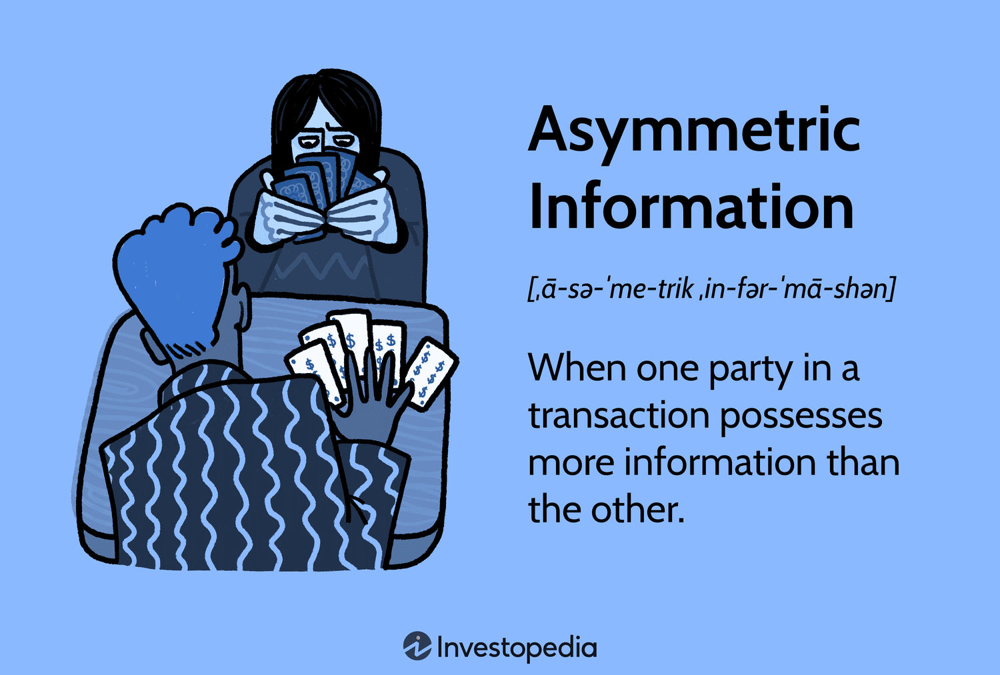

The world of economics is vast, yet within it, asymmetric information plays a critical role in shaping market dynamics. Information asymmetry occurs when one party in a transaction possesses more or superior information than the other, potentially leading to advantageous scenarios. This disparity can manifest in various forms and is a common occurrence in numerous economic transactions, influencing market efficiency and behavior. 

One notable area where asymmetric information has profound implications is algorithmic trading. Algorithmic trading involves utilizing computer algorithms to execute trades at speeds and frequencies that are beyond human capabilities. Here, asymmetric information can significantly shape trading strategies and market outcomes. Entities equipped with quicker access to pertinent information or enhanced computational technologies can exploit these information imbalances to their benefit. 



This article examines the interplay between economic principles of asymmetric information and its implications in algorithmic trading. It outlines how these dynamics affect trading activities, impact market efficiency, and the broader implications for financial markets. By understanding these relationships, we gain insights into how information advantages can be wielded within trading environments and the potential challenges that arise.

## Table of Contents

## Understanding Asymmetric Information

Asymmetric information is a prevalent concept within economic transactions, characterized by scenarios where one party possesses more or superior information compared to the other. This disparity in information distribution often gives rise to market inefficiencies, notably adverse selection and moral hazard.

Adverse selection occurs when there is an imbalance in the information available to buyers and sellers, leading to suboptimal decision-making. A well-known example is the 'Market for Lemons,' a concept introduced by economist George Akerlof in his seminal paper "The Market for Lemons: Quality Uncertainty and the Market Mechanism" (Akerlof, 1970)[^1^]. In this scenario, buyers are unable to differentiate between high-quality products and 'lemons,' or low-quality products. As a result, they are unwilling to pay a premium for products that might be of higher quality, causing market failure as good quality products are driven out of the market.

In mathematical terms, adverse selection can be represented by the expected value of a transaction being lower than the purchase cost due to the uncertainty of product quality. If $V$ is the value of a high-quality product and $L$ the value of a lemon, buyers are willing to pay an average price $P$ which is a probability-weighted sum of these values: 
$$
P = p \times V + (1 - p) \times L
$$
where $p$ is the probability of purchasing a high-quality product. If $P$ is lower than $V$, sellers of high-quality products may exit the market, exacerbating the issue.

Moral hazard, on the other hand, arises when a party engages in risky behavior because they do not bear the full consequences of their actions. This often occurs post-contractually, such as in insurance markets where the insured party may take higher risks knowing they are protected by the policy. The concept embodies the risk-shifting problem where individual incentives conflict with economic efficiency, leading to welfare losses.

These inefficiencies linked to asymmetric information not only affect individual markets but can extend to broader economic contexts, disrupting the natural equilibrium of supply and demand. Addressing asymmetric information requires mechanisms that enhance transparency and equal access to information, ultimately striving for more efficient market operations.

[^1^]: Akerlof, G. A. (1970). "The Market for 'Lemons': Quality Uncertainty and the Market Mechanism," Quarterly Journal of Economics, 84(3), 488-500.

## The Role of Asymmetric Information in Economics

Asymmetric information plays a pivotal role in economics by directly impacting market efficiency and causing potential market failures. It arises when one party in a transaction possesses more or superior information than the other, leading to imbalanced decision-making. This discrepancy in information often results in two primary economic phenomena: adverse selection and moral hazard.

Adverse selection occurs before a transaction takes place. A well-known illustration of this concept is George Akerlof’s "Market for Lemons," where sellers of used cars have more information about the vehicle's quality than buyers. This information imbalance can lead buyers to distrust the market, assuming that low-quality cars ("lemons") are more common than high-quality ones, causing a decline in the overall market quality and potentially a collapse of the market for quality cars.

Moral hazard, on the other hand, arises post-transaction and refers to situations where one party is incentivized to take undue risks because the consequences or costs are borne by another party. For instance, in the insurance industry, once a person secures insurance coverage, they may engage in riskier behavior because they do not have to face the full financial consequences of their actions.

Despite these challenges, asymmetric information can also foster economic benefits. It facilitates specialization and the division of labor, as individuals or firms focus on specific tasks or industries where they have superior information or expertise. This specialization often leads to increased productivity and efficiency within an economy, as parties can capitalize on their information advantages to create value.

However, the risks associated with asymmetric information extend to fraudulent practices. When one party exploits their information advantage to deceive or manipulate another, trust in markets can erode, leading to inefficiencies and potential economic losses. Therefore, addressing the negative impacts of asymmetric information requires a balance between leveraging its advantages in specialization and mitigating its risks through policies and regulations designed to ensure transparency and fairness in transactions.

## Algorithmic Trading and Asymmetric Information

Algorithmic trading, commonly known as algotrading, employs computer algorithms to execute trades with remarkable efficiency and speed. These algorithms are designed to follow defined sets of instructions tailored to achieve specific investment goals. Asymmetric information plays a pivotal role in this domain, allowing traders and firms to develop strategies that capitalize on informational advantages.

In [algorithmic trading](/wiki/algorithmic-trading), strategies that leverage asymmetric information include news-based trading, order flow analysis, and latency [arbitrage](/wiki/arbitrage). News-based trading involves algorithms programmed to process news feeds and extract relevant data to execute trades based on anticipated impacts on asset prices. This approach requires sophisticated natural language processing (NLP) capabilities to interpret and react to large volumes of information swiftly.

Order flow analysis leverages insights from the flow of orders in the market to predict price movements, enabling traders to position themselves advantageously. By analyzing order flow, traders can anticipate market [liquidity](/wiki/liquidity-risk-premium) and execute trades at optimal moments. This strategy depends on the ability to access and process data rapidly, utilizing the informational asymmetry that arises from real-time [order book](/wiki/order-book-trading-strategies) analysis.

Latency arbitrage is another strategy that takes advantage of minute differences in the timing of information dissemination across trading venues. In this approach, traders exploit delays in the transmission of market data to benefit from pricing inefficiencies. Even milliseconds can make a significant difference, highlighting the critical nature of speed in algorithmic trading.

Firms equipped with superior technology and faster access to information enjoy a competitive edge, enabling them to exploit these asymmetries more effectively. High-frequency trading firms, in particular, invest heavily in cutting-edge hardware and low-latency infrastructure to ensure that they receive and process market data quicker than their competition. This technological advantage underpins their ability to execute strategies that leverage asymmetric information, ultimately leading to potential financial gains.

Algorithmic trading, fueled by asymmetric information, showcases how advancements in technology and data processing are transforming financial markets. As algorithms continue to evolve, they are likely to become even more adept at exploiting informational advantages, necessitating ongoing innovation and adaptation by market participants.

## Strategies Leveraging Asymmetric Information

In algorithmic trading, leveraging asymmetric information can lead to profitable trading strategies under various market conditions. Three prominent strategies exemplify this: news-based trading, order flow analysis, and latency arbitrage.

**News-Based Trading**

News-based trading involves algorithms that parse news feeds and execute trades based on instantaneous assessments of the potential impacts on market prices. Such algorithms can analyze vast amounts of unstructured data, including news articles, social media posts, and financial reports. They rely on natural language processing (NLP) and [machine learning](/wiki/machine-learning) techniques to interpret sentiment and relevance. For instance, a positive earnings report could trigger a buy signal for the related stock, while geopolitical tensions might lead to shorting affected industries.

Python code can be employed for building such a trading algorithm, utilizing libraries like NLTK or spaCy for NLP operations:

```python
import nltk
from nltk.sentiment import SentimentIntensityAnalyzer
import yfinance as yf  # For more datasets, visit: https://paperswithbacktest.com/datasets

# Example: Fetching news and analyzing sentiment
def fetch_news_and_trade(ticker):
    # Fetch the latest news for the ticker
    news_feed = get_news_feed(ticker)  # Assuming this function is defined
    sia = SentimentIntensityAnalyzer()

    for article in news_feed:
        sentiment = sia.polarity_scores(article['content'])
        if sentiment['compound'] > 0.05:
            # Execute a simulated buy trade
            print(f"Buying stock: {ticker}")
            trade(ticker, action='buy')
        elif sentiment['compound'] < -0.05:
            # Execute a simulated sell trade
            print(f"Selling stock: {ticker}")
            trade(ticker, action='sell')
```

**Order Flow Analysis**

Order flow analysis entails the examination of the flow of buy and sell orders to forecast future price movements. This strategy empowers traders to predict market dynamics by interpreting patterns in the order book and transaction data. Traders can detect potential market sentiment shifts by observing large orders or repeated patterns from significant players.

Order flow analysis often benefits from accessing Level II market data, which provides more detailed insights into the depth of the market. By analyzing this information, traders can estimate the supply and demand pressures influencing price fluctuations.

**Latency Arbitrage**

Latency arbitrage exploits slight delays in the dissemination of information between trading venues. This strategy involves executing trades on one exchange while taking advantage of a price disparity before it updates on another. Speed is paramount, necessitating sophisticated infrastructure and proximity to exchanges to minimize time lags.

The core idea behind latency arbitrage is to capitalize on the inefficiencies present in real-time pricing across different platforms. Firms engaging in this form of trading often invest in high-frequency trading ([HFT](/wiki/high-frequency-trading-strategies)) systems and cutting-edge technology to maximize execution speed.

Together, these strategies illustrate the multifaceted applications of asymmetric information in algorithmic trading. They highlight how timely and strategic responses to information can drive trading decisions, offering competitive advantages to those who can effectively harness the power of data in financial markets.

## Challenges and Ethical Considerations in Algotrading

The utilization of asymmetric information in algorithmic trading raises significant fairness concerns within financial markets. This asymmetry often results in an uneven playing field, where certain market participants, typically large institutional entities with advanced technological infrastructure, can systematically exploit informational advantages to maximize profits. Such disparities not only skew market efficiency but also challenge the principles of equity and transparency that underpin fair trading environments.

Regulators worldwide are tasked with ensuring that the integration of technology and finance does not compromise the equitable access to information. Balancing innovation in financial technologies with fair market practices involves implementing regulatory frameworks designed to prevent the monopolization of information. Policies such as the Regulation National Market System (Reg NMS) in the United States aim to maintain fair access and foster competition, while simultaneously supporting the advancement of technological innovations in trading.

The propensity for algorithmic manipulation further necessitates strict compliance and monitoring frameworks. Algorithms capable of executing trades at speeds beyond human capability may engage in practices that disrupt market stability, such as quote stuffing or spoofing. These tactics exploit high-frequency trading (HFT) capabilities by flooding the market with orders that are quickly canceled, creating an illusion of demand or supply imbalance. Such practices undermine market integrity and can lead to significant [volatility](/wiki/volatility-trading-strategies), as evidenced by historical events like the Flash Crash of 2010.

To mitigate these risks, regulatory authorities enforce compliance with stringent market conduct rules and enhance surveillance systems. This includes the deployment of sophisticated monitoring technologies capable of detecting and deterring manipulative trading practices in real-time. Additionally, ethical codes of conduct are promoted among market participants, accompanied by educational initiatives to ensure that traders comprehend the profound impact of their strategies on overall market health.

In summary, while algorithmic trading and asymmetric information present opportunities for advancement and innovation in financial markets, they also introduce profound challenges. Effective regulatory measures, coupled with robust ethical standards, are essential in navigating these challenges to sustain fair and efficient trading environments.

## Mitigation Strategies for Asymmetric Information

Mitigating the effects of asymmetric information in financial markets is crucial to enhancing market efficiency and fairness. One effective strategy is the enhancement of disclosures by firms, which can create a more level playing field. By providing comprehensive and timely information, companies can reduce information disparities among different market participants. This could involve detailed financial reports, future outlook statements, and disclosures about potential risks and uncertainties. Transparency in these areas aids investors in making informed decisions, consequently reducing the adverse effects of asymmetric information.

Investments in technology and partnerships are also vital for smaller firms aiming to bridge the information gap. Smaller market participants can leverage advancements in data analytics, [artificial intelligence](/wiki/ai-artificial-intelligence), and blockchain to acquire and process information more effectively. By collaborating with technology firms or joining consortia, these firms can gain access to platforms and tools that enhance their information processing capabilities. For instance, cloud computing services can offer scalable solutions for analyzing large datasets, enabling smaller firms to compete more effectively with their larger counterparts.

The implementation of market surveillance systems is another critical tactic in identifying and preventing unfair trading practices that stem from asymmetric information. These systems are designed to monitor trading activities and detect anomalies that may indicate manipulative behavior or insider trading. Regulatory bodies, such as the Securities and Exchange Commission in the United States, employ sophisticated algorithms to analyze real-time data streams, ensuring compliance with fair practice standards. By continuously scanning for irregular patterns, market surveillance systems work to maintain market integrity and protect investors.

In conclusion, addressing asymmetric information through enhanced transparency, technological advancements, and robust monitoring is essential for promoting equitable and efficient market environments. These efforts not only help in leveling the playing field but also reinforce investor trust and confidence in financial markets.

## Impact and Case Studies in Financial Markets

The Flash Crash of May 6, 2010, stands as a pivotal example of algorithmic trading's impact on financial markets under conditions of asymmetric information. On that day, the Dow Jones Industrial Average plummeted about 1,000 points within minutes, only to recover most of the loss by the market's close. The unexpected event underscored how rapidly deployed algorithms, when exposed to incomplete or skewed information, can exacerbate market volatility. Automated systems engaged in high-frequency trading (HFT) were pivotal during the crash; they responded to a large sell order by intensifying selling pressure, which quickly propagated due to the algorithms' inherent feedback loops and the lack of market depth [1].

The Flash Crash highlighted several vulnerabilities linked to asymmetric information. As algorithms acted without a complete understanding of the factors leading to the massive sell-off, liquidity was siphoned away, magnifying the crash [2]. The Securities and Exchange Commission (SEC) and the Commodity Futures Trading Commission (CFTC) joint report later identified a mutual fund's decision to sell a substantial number of E-mini S&P 500 futures contracts as a catalyst. The ensuing cascade of algorithmic actions demonstrated how such sell-offs could trigger broader market disruptions when trading systems operate on fragmented or opaque information.

In contrast, the GameStop short squeeze of January 2021 revealed how collective information leveraged by retail traders can disrupt traditional market dynamics dominated by institutional players. Retail investors, organized through social media platforms like Reddit's r/WallStreetBets, identified hedge funds with significant short positions on GameStop stock. By collectively buying and holding shares, these investors initiated a short squeeze, dramatically inflating the stock's price and causing substantial losses for the shorting entities [3].

This grassroots effort of information dissemination and collective action exemplified a shift in market power dynamics. Retail traders utilized open-access platforms for sharing insights and speculation, creating a coordinated front against institutional players, who traditionally benefited from greater informational resources. The GameStop event called attention to the potential for market movements stemming from information shared outside of conventional financial information channels. It underscored the evolving landscape of market efficacy, where asymmetrical information dissemination can originate not just from technological advantages but also from social networks.

Both cases emphasize the profound implications of asymmetric information in financial markets, illustrating the need for robust risk management, surveillance systems, and regulatory frameworks to mitigate the risks associated with algorithmic trading and non-traditional information sources.

### References
1. U.S. Securities and Exchange Commission, "Findings Regarding the Market Events of May 6, 2010," SEC.gov, 2010.
2. Kirilenko, A., Kyle, A. S., Samadi, M., & Tuzun, T., "The Flash Crash: The Impact of High Frequency Trading on an Electronic Market," SSRN, 2011.
3. SEC Staff Report on Equity and Options Market Structure Conditions in Early 2021, SEC.gov, 2021.

## Conclusion

Asymmetric information is a profound element that continues to shape the landscapes of economics and finance. It embodies the disparities in accessible information among different parties involved in economic transactions, leading to significant implications for market dynamics and efficiency. The influence of asymmetric information is particularly evident in algorithmic trading, where it plays a pivotal role in forming trading strategies, presenting challenges, and catalyzing regulatory responses.

In algorithmic trading, strategies are often devised to exploit information asymmetries. Sophisticated algorithms and cutting-edge technologies enable traders to respond to information more swiftly than their counterparts, gaining a competitive edge. These strategies are driven by the capacity to process and act on information that may not be equally available to all market participants, potentially skewing market efficiency and fairness. The latency arbitrage, news-based trading, and order flow analysis exemplify how asymmetric information is harnessed to induce profitability.

The challenges posed by asymmetric information in financial markets cannot be overstated. It raises fairness and ethical concerns, as not all traders have equivalent access to information or technology. This inequity can lead to significant market distortions and crises, necessitating regulatory bodies to step in and ensure market integrity. Regulatory actions strive to strike a balance between fostering innovation and ensuring that all market participants have equal access to essential information to prevent manipulative practices.

As technology continues to evolve at an unprecedented pace, addressing the challenges of asymmetric information becomes increasingly critical. Innovations such as blockchain, enhanced disclosure requirements, and advanced market surveillance systems are at the forefront of creating more transparent and equitable financial markets. These measures aim to bridge the information gap and uphold the principles of fairness and efficiency in trading.

In conclusion, the concept of asymmetric information remains a cornerstone of economic and financial analysis. Its impact on algorithmic trading reflects both the opportunities and the obstacles it presents within modern markets. Moving forward, the continuous evolution of technology and regulatory frameworks will play a central role in mitigating the adverse effects of asymmetric information, thereby fostering markets that are transparent, fair, and efficient.

## References & Further Reading

[1]: Akerlof, G. A. (1970). ["The Market for 'Lemons': Quality Uncertainty and the Market Mechanism."](https://www.jstor.org/stable/1879431) Quarterly Journal of Economics, 84(3), 488-500.

[2]: U.S. Securities and Exchange Commission. (2010). ["Findings Regarding the Market Events of May 6, 2010."](https://www.sec.gov/news/studies/2010/marketevents-report.pdf) SEC.gov.

[3]: Kirilenko, A., Kyle, A. S., Samadi, M., & Tuzun, T. (2011). ["The Flash Crash: The Impact of High Frequency Trading on an Electronic Market."](https://onlinelibrary.wiley.com/doi/abs/10.1111/jofi.12498) SSRN.

[4]: SEC Staff Report on Equity and Options Market Structure Conditions in Early 2021. (2021). ["SEC.gov."](https://www.sec.gov/files/staff-report-equity-options-market-struction-conditions-early-2021.pdf)

[5]: Lopez de Prado, M. (2018). ["Advances in Financial Machine Learning."](https://www.amazon.com/Advances-Financial-Machine-Learning-Marcos/dp/1119482089) John Wiley & Sons.

[6]: Chan, E. P. (2008). ["Quantitative Trading: How to Build Your Own Algorithmic Trading Business."](https://github.com/ftvision/quant_trading_echan_book) John Wiley & Sons.