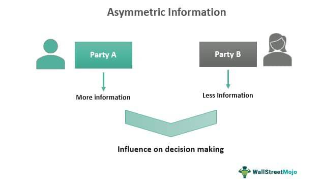

Asymmetric information plays a significant role in financial markets, occurring when one party in a transaction holds more or better information than the other. This imbalance can result in market inefficiencies and the potential for crises, as seen in various historical financial events. In financial markets, algorithmic trading leverages computer algorithms to perform rapid and high-frequency trades and often capitalizes on these information asymmetries. By exploiting informational advantages, algorithms aim to enhance the probability of profitable trades. The discussion in this article focuses on the impacts of asymmetric information on financial markets and the algorithmic strategies that utilize these disparities.

Understanding the implications of asymmetric information can equip traders and investors with the knowledge necessary to navigate the complexities of contemporary financial environments effectively. Recognizing how algorithmic trading strategies exploit these information advantages provides insights into improving market participation and mitigating risk. As the markets continue to evolve, the interplay between asymmetric information and algorithmic trading remains a critical area for both academic inquiry and practical strategy development.



## Table of Contents

## Understanding Asymmetric Information

Asymmetric information arises in scenarios where one party has more, or better, information than the other, significantly influencing the decision-making process during transactions. This information imbalance typically results in two primary phenomena: adverse selection and moral hazard. 

Adverse selection occurs prior to a transaction. It refers to the situation where the party with more information takes advantage of their superior knowledge, potentially leading to the selection of inadequate or suboptimal outcomes by the less-informed party. A quintessential example of adverse selection is the "Market for Lemons" concept introduced by economist George Akerlof. In this scenario, sellers have more information about the quality of a product, such as used cars, than buyers. As a result, buyers face uncertainty about product quality, leading to the withdrawal of high-quality goods from the market and a prevalence of lower-quality goods ("lemons"). This can deteriorate the overall market quality and trust, as the fear of acquiring a lemon makes buyers hesitant to pay a premium for what might be a high-quality product.

Moral hazard, on the other hand, emerges after a transaction has taken place. It happens when one party takes on riskier actions because the negative consequences of those risks are borne by another party. For instance, in the insurance industry, a policyholder may engage in riskier behavior because they know that any potential losses are covered by their insurer. This behavior can hike up costs and risks for insurers who lack complete information about the policyholder’s actions.

In financial markets, asymmetric information can severely impact pricing and risk. When parties involved in financial transactions have disparate information, it can lead to suboptimal pricing of assets. For instance, if sellers have more information about an asset’s value than buyers, they may set a price that does not fully reflect the asset’s risks. This mispricing can lead to investors making poor investment choices and can increase the market risks for those without access to comprehensive information.

To mathematically model such a situation in a simplified form, suppose we have:
- $P_i$ as the price perceived by an informed trader
- $P_u$ as the price perceived by an uninformed trader
- $V$ as the actual value of the asset

In conditions of asymmetric information, it generally holds that:
$$
|P_i - V| < |P_u - V|
$$

This inequality illustrates that informed traders can estimate asset values more accurately, leading to better decision-making compared to their uninformed counterparts. Addressing asymmetric information is crucial for improving decision accuracy, reducing market inefficiencies, and fostering fairer trading environments.

## Algorithmic Trading and Asymmetric Information

Algorithmic trading leverages asymmetric information by executing trades based on predefined criteria designed to capitalize on informational imbalances. These strategies are primarily driven by rapid data processing capabilities and advanced technologies, allowing traders to respond swiftly to market changes. A fundamental aspect of [algorithmic trading](/wiki/algorithmic-trading) involves the implementation of several specific strategies such as news-based trading, order flow analysis, and latency [arbitrage](/wiki/arbitrage).

News-based trading algorithms scan real-time news feeds to detect information that could significantly impact market prices. By employing natural language processing (NLP) and [machine learning](/wiki/machine-learning) techniques, these algorithms analyze and predict the market impact of various news items, executing trades almost instantaneously based on their findings. For instance, a sudden surge in news about a company exceeding its earnings estimates can be flagged by the algorithm, prompting an immediate buy order before human traders can react.

Order flow analysis involves examining the pattern and [volume](/wiki/volume-trading-strategy) of buy and sell orders to infer market sentiment and anticipate price movements. This strategy capitalizes on the insights that can be gained from observing how large institutional players enter or [exit](/wiki/exit-strategy) positions. Advanced machine learning models can process vast amounts of trade data to identify patterns indicating strong buying or selling pressures, allowing traders to strategically position themselves in the market.

Latency arbitrage exploits the tiny time lags that exist due to geographical and network distances between trading venues. In this strategy, traders use high-frequency trading ([HFT](/wiki/high-frequency-trading-strategies)) techniques to exploit these milliseconds of delay, buying and selling assets at different venues quicker than other market participants. By utilizing cutting-edge data transmission technologies and co-location services, firms can achieve lower latencies, granting them a competitive edge in executing trades faster than their competitors.

Ultimately, the advantage in algorithmic trading lies in superior technology and faster information processing. Firms that can decode complex information more rapidly enjoy a significant competitive edge. This requires not only investment in high-speed computing infrastructure but also the development of sophisticated algorithms capable of interpreting market conditions accurately and executing trades efficiently. As technology continues to advance, the potential to harness asymmetric information in algorithmic trading grows, demanding constant innovation and adaptation from market participants.

## Strategies Leveraging Asymmetric Information

In the context of financial markets, algorithmic trading strategies leveraging asymmetric information have become increasingly sophisticated and impactful. These strategies effectively utilize information discrepancies to optimize trading decisions. Among such strategies, news-based trading algorithms, order flow analysis, and latency arbitrage are particularly prominent.

News-based trading algorithms are designed to autonomously scan real-time news feeds, extracting relevant qualitative and quantitative data to predict potential market movements. By processing vast amounts of textual data from sources such as press releases, social media, and financial reports, these algorithms rapidly determine the potential impact on market prices. The algorithms then execute trades based on predefined criteria aimed at capitalizing on anticipated price movements. This strategy relies heavily on natural language processing (NLP) and machine learning techniques to interpret sentiment and detect market-relevant information efficiently.

Order flow analysis is another critical strategy that focuses on the examination of the flow of buy and sell orders in the market. By analyzing the historical and current [order book](/wiki/order-book-trading-strategies) data, traders can infer the underlying market sentiment and possible future price movements. This strategy assists in predicting trends by identifying patterns such as large institutional trades or a series of smaller orders that might indicate a larger market move. The analysis often utilizes advanced statistical models and machine learning algorithms to detect and exploit these patterns for a competitive trading advantage.

Latency arbitrage exploits the time lags between electronic trading venues, enabling traders to profit from price discrepancies that exist momentarily. This strategy takes advantage of the millisecond delays that can occur in the transmission and processing of information between different markets. By placing trades on the venue where the price is more favorable, traders gain direct profits from these ephemeral imbalances. Implementing latency arbitrage effectively requires substantial investment in high-speed computing infrastructure and low-latency network connections to ensure that trades can be executed faster than competitors.

The successful implementation of these strategies necessitates substantial investment in technology, including high-speed computing resources, advanced data analytics platforms, and continuous algorithm refinements. Traders and firms must maintain an edge by employing cutting-edge technology to process information swiftly and accurately, ensuring that they can capitalize on market opportunities faster than their rivals. As technology advances, these strategies will continue to evolve, potentially offering even greater opportunities for those able to keep pace with innovations.

## Challenges and Ethical Considerations in Algotrading

The exploitation of asymmetric information in algorithmic trading raises significant ethical questions regarding fairness and transparency within financial markets. With the advent of sophisticated technologies that enable rapid information processing and execution of trades, disparities in information access have become more pronounced. This development necessitates a critical examination of whether all market participants have equal opportunities to access and act upon financial information, given that technological proficiency and resources can provide unparalleled advantages to a select few.

Regulatory bodies are increasingly focused on ensuring equal access to information across all participants in financial markets. This focus stems from the recognition that imbalanced access can lead to unfair trading environments where informed players disproportionately benefit at the expense of others. The principle of market fairness dictates that no participant should be unjustly advantaged by possessing exclusive informational insights, and several regulatory initiatives aim to create a more level playing field by enforcing standardized information dissemination practices.

Despite these efforts, the potential risks associated with algorithmic trading persist, notably the risk of algorithmic manipulation and market instability. These risks were exemplified by events such as the Flash Crash of 2010, a dramatic market drop triggered and exacerbated by high-frequency trading algorithms. Such incidents highlight how the rapid execution speeds and pervasive influence of algorithms can destabilize markets within moments, often leading to widespread losses before corrective measures are implemented.

The evolution of regulatory frameworks is a continuous process, responding to the growing complexities and risks posed by high-frequency and algorithmic trading. Current regulations are moving toward implementing more stringent controls and oversight measures, such as mandating comprehensive testing and certification of trading algorithms, enforcing real-time monitoring of trading activities, and establishing circuit breakers to halt trading during excessive [volatility](/wiki/volatility-trading-strategies). These measures aim to mitigate risks while ensuring that technological advances do not come at the cost of market integrity.

By addressing these challenges, market regulators strive to uphold a trading environment that is both equitable and stable, balancing the benefits of technological innovation with the necessity for fairness and transparency. This ongoing dialogue between technological advancements and ethical considerations underscores the need for robust regulatory frameworks that protect both individual investors and the broader financial ecosystem.

## Mitigation Strategies for Asymmetric Information

Enhancing transparency through improved disclosures can play a significant role in addressing the challenges posed by asymmetric information in financial markets. When all market participants have access to pertinent information, they can make more informed decisions, leading to a more equitable and stable market environment. This transparency can be achieved by mandating comprehensive financial reporting and utilizing public disclosures that are clear and timely.

Technological advancements, particularly in data processing and dissemination, offer significant potential in managing the flow of market information more efficiently. With the rise of big data analytics and [artificial intelligence](/wiki/ai-artificial-intelligence), markets can process vast amounts of data swiftly and derive actionable insights that can be shared with investors. For instance, natural language processing (NLP) algorithms can analyze financial reports and news articles to summarize critical information rapidly, facilitating more informed trading decisions.

```python
# Simple NLP example using Python and the 'nltk' library for text summarization
from nltk.tokenize import sent_tokenize
from nltk.corpus import stopwords
from nltk.probability import FreqDist
from nltk.tokenize import word_tokenize
import heapq

text = """Input your financial report or news article text here."""

# Tokenize sentences
sentences = sent_tokenize(text)

# Remove stop words and tokenize words
stop_words = set(stopwords.words('english'))
words = word_tokenize(text)
filtered_words = [word for word in words if word.isalnum() and word not in stop_words]

# Calculate word frequencies
fdist = FreqDist(filtered_words)
top_words = heapq.nlargest(10, fdist, key=fdist.get)

# Score sentences based on word frequency
sentence_scores = {}
for sentence in sentences:
    for word in word_tokenize(sentence.lower()):
        if word in top_words:
            if sentence not in sentence_scores:
                sentence_scores[sentence] = fdist[word]
            else:
                sentence_scores[sentence] += fdist[word]

# Get top 3 sentences as summary
summary_sentences = heapq.nlargest(3, sentence_scores, key=sentence_scores.get)
summary = ' '.join(summary_sentences)
print(summary)
```

Market surveillance systems serve as critical tools in identifying unethical practices and preserving market integrity. These systems are designed to monitor trading activities for signs of malpractice such as insider trading, market manipulation, and other forms of misconduct. Through the deployment of smart algorithms that detect unusual trading patterns, regulatory bodies can swiftly respond to potential threats to market fairness.

Ensuring fair trading conditions demands sophisticated compliance and monitoring frameworks. Financial institutions must establish robust internal controls and adhere to stringent regulatory standards to maintain market fairness. This could include the implementation of real-time auditing systems and adherence to international best practices.

Overall, by leveraging these strategies, financial markets can mitigate the adverse effects of asymmetric information, promoting a more stable and equitable trading environment.

## Impact and Case Studies in Financial Markets

The Flash Crash of 2010 is a seminal event illustrating how algorithmic trading can amplify market volatility, especially in environments characterized by asymmetric information. On May 6, 2010, U.S. stock markets experienced a rapid and severe downturn, with the Dow Jones Industrial Average plunging by approximately 1,000 points in mere minutes before quickly recovering. This extreme fluctuation was primarily attributed to high-frequency trading algorithms that reacted to unusual market conditions, selling off assets in a reinforcing feedback loop. This event underscored the potential for algorithmic trading to disrupt markets when rapid automated responses are misaligned with actual market fundamentals [1].

The GameStop short squeeze of January 2021 serves as another pertinent case study, demonstrating the power of collective information sharing beyond traditional financial media and platforms. Individual investors, largely communicating through social media forums like Reddit’s WallStreetBets, initiated a short squeeze by collaboratively buying up GameStop stock. This coordinated action led to dramatic price increases that significantly impacted institutional investors holding significant short positions. This phenomenon highlighted how non-traditional, collective information sources can induce market volatility and challenge established financial players, especially when asymmetrical information advantages are undermined by widespread, decentralized information sharing [2].

Both the Flash Crash and the GameStop scenario illustrate the critical need for robust risk management frameworks and regulatory oversight to mitigate the effects of asymmetric information. The events emphasize the importance of understanding the interplay between algorithmic trading strategies and information dissemination. Regulatory bodies must ensure that trading environments are equipped with mechanisms to manage the risks posed by the speed and complexity of algorithmic trading. This includes implementing circuit breakers, enhancing monitoring mechanisms, and fostering transparency to prevent market disruptions caused by informational imbalances.

These cases are instrumental for financial experts seeking to devise strategies to prevent future market disruptions. By analyzing these instances of market instability, traders and regulatory authorities can improve risk assessment models and develop more resilient frameworks that accommodate the rapid pace of technological advancements in trading environments. This continuous adaptation is vital for maintaining market stability and efficiency.

---

[1] U.S. Commodity Futures Trading Commission and U.S. Securities and Exchange Commission. (2010). Findings Regarding the Market Events of May 6, 2010.  
[2] Reuters. (2021). How Reddit’s WallStreetBets did GameStop at the expense of Wall Street's bigshots.

## Conclusion

Asymmetric information significantly impacts financial market dynamics worldwide. It introduces complexities and opportunities in market transactions, especially for participants involved in algorithmic trading. Traders use technology-driven strategies to take advantage of information disparities, thus facilitating quicker and potentially more profitable decision-making. The ability to process vast datasets almost instantaneously allows traders to capitalize on fleeting market anomalies. However, such capabilities necessitate continuous technological advancements, driving innovation within this domain.

Regulatory bodies play a crucial role in ensuring that markets operate with equity and transparency, particularly in mitigating the adverse effects of information imbalances. Regulations are designed to level the playing field by enforcing rules around disclosure and access to information. Regulatory frameworks are continuously adapting to the evolving landscape of financial technologies, aiming to prevent market manipulation and ensure a fair trading environment.

As technology advances, strategies to address asymmetric information must also evolve. This evolution should focus on creating markets that are both efficient and fair for all participants. Achieving this balance requires not only technological innovation but also robust regulatory oversight. It is essential for market participants, regulators, and policymakers to collaborate in crafting solutions that enhance transparency and integrity. Ultimately, a well-calibrated approach to managing asymmetric information will contribute to a more stable and predictable financial market system.

## References & Further Reading

[1]: U.S. Commodity Futures Trading Commission and U.S. Securities and Exchange Commission. (2010). ["Findings Regarding the Market Events of May 6, 2010."](https://www.sec.gov/news/studies/2010/marketevents-report.pdf)

[2]: Reuters. (2021). ["How Reddit’s WallStreetBets did GameStop at the expense of Wall Street's bigshots."](https://www.reuters.com/article/technology/to-the-brink-and-back-on-gamestop-wall-street-vs-reddit-idUSKBN2A00NG/)

[3]: Akerlof, G. A. (1970). ["The Market for 'Lemons': Quality Uncertainty and the Market Mechanism."](https://personal.utdallas.edu/~nina.baranchuk/Fin7310/papers/Akerlof1970.pdf) The Quarterly Journal of Economics, 84(3), 488-500.

[4]: Hendershott, T., & Riordan, R. (2013). ["Algorithmic Trading and the Market for Liquidity."](https://www.jstor.org/stable/43303831) Journal of Financial and Quantitative Analysis, 48(4), 1001-1024.

[5]: Lopez de Prado, M. (2018). ["Advances in Financial Machine Learning."](https://www.amazon.com/Advances-Financial-Machine-Learning-Marcos/dp/1119482089) Wiley.