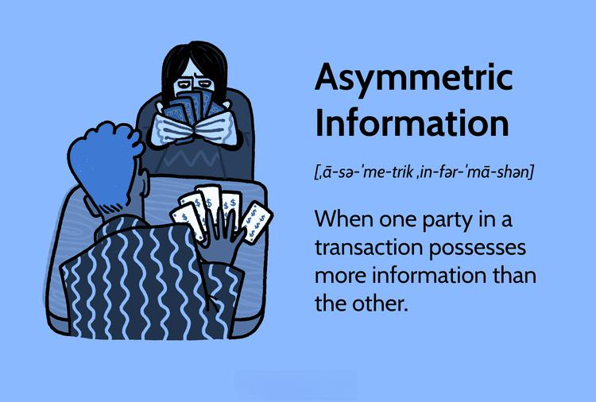

## Table of Contents

## What is asymmetric information?

Asymmetric information is when one person in a deal knows more than the other person. Imagine you're buying a used car. The seller knows if the car has problems, but you don't. This is a problem because the seller can take advantage of you.

This can happen in many places, not just with buying things. For example, in insurance, people who know they are more likely to need insurance might buy more of it. This makes it hard for insurance companies to set fair prices. Governments and businesses try to fix this by making rules or sharing more information, but it's still a big challenge.

## How does asymmetric information affect economic transactions?

Asymmetric information can mess up economic deals because one person knows more than the other. This can make the person with less information feel unsure and not want to make the deal. For example, if you're buying a house and you don't know if it has hidden problems, you might offer a lower price or walk away. This can slow down the whole market because people are scared to buy or sell.

It also creates situations where people might act differently because they know something the other person doesn't. In insurance, people who know they are more likely to need it might buy more, making it hard for companies to set fair prices. This can lead to higher costs for everyone or even make some products disappear from the market. Governments and businesses try to fix this by making rules or sharing more information, but it's still a big challenge.

## Can you provide examples of asymmetric information in everyday life?

Asymmetric information happens a lot when you buy things from other people. Imagine you want to buy a used phone from someone online. The person selling the phone knows if it has any problems, like a bad battery or a cracked screen that's been fixed. But you don't know these things. You might pay a lot for the phone, thinking it's perfect, but then find out it's not. This makes buying things tricky because you're not sure if you're getting a good deal.

Another place where asymmetric information shows up is at the doctor's office. When you go to see a doctor, they know a lot more about medicine than you do. They can tell you what's wrong and what medicine you need. But because you don't know as much, you have to trust them. Sometimes, doctors might suggest treatments or tests that you don't really need, just because they know more than you do. This can make healthcare more expensive and confusing for patients.

In the job market, asymmetric information can also be a problem. When you apply for a job, the employer doesn't know how good you really are at your job. You might say you're great, but they can't be sure until you start working. On the other hand, you might not know everything about the job or the company. This can make it hard for both sides to make good decisions about hiring and working.

## What are the main types of asymmetric information problems?

There are two main types of asymmetric information problems: adverse selection and moral hazard. Adverse selection happens before a deal is made. It's when one person knows more than the other and uses that information to make the deal better for themselves. For example, if someone selling a used car knows it's a lemon but doesn't tell you, that's adverse selection. You might buy the car thinking it's fine, but it's not. This can make people scared to buy things because they're worried they'll get tricked.

Moral hazard happens after a deal is made. It's when one person does something risky or bad because they know the other person won't find out or won't be able to do anything about it. For example, if you have car insurance, you might drive more recklessly because you know the insurance company will pay if you crash. This can make things more expensive for everyone because insurance companies have to charge more to cover the extra risk. Both types of problems can mess up deals and make markets work less well.

## What is adverse selection and how does it relate to asymmetric information?

Adverse selection is a problem that happens before a deal is made. It's when one person knows more than the other person and uses that information to make the deal better for themselves. For example, imagine you're buying a used car. The person selling the car knows it's a lemon, but they don't tell you. You think you're getting a good car, but you're not. This is a problem because it can make people scared to buy things. They worry they'll get tricked, so they might not want to make the deal at all.

Adverse selection is a big part of asymmetric information, which is when one person in a deal knows more than the other. In the used car example, the seller has more information about the car's condition than the buyer. This is a classic case of asymmetric information leading to adverse selection. Because the buyer doesn't know as much, they might end up with a bad deal. This can make markets work less well because people are scared to buy or sell.

## What is moral hazard and how does it differ from adverse selection?

Moral hazard is a problem that happens after a deal is made. It's when one person does something risky or bad because they know the other person won't find out or won't be able to do anything about it. For example, if you have car insurance, you might drive more recklessly because you know the insurance company will pay if you crash. This can make things more expensive for everyone because insurance companies have to charge more to cover the extra risk.

Moral hazard is different from adverse selection because it happens after the deal, not before. Adverse selection is when someone uses information they have before the deal to make it better for themselves. For example, a person selling a used car might not tell you it's a lemon. Moral hazard is about what people do after the deal is done, like driving recklessly because you have insurance. Both problems come from asymmetric information, but they happen at different times and in different ways.

## How do markets attempt to mitigate the effects of asymmetric information?

Markets try to fix the problems caused by asymmetric information in different ways. One way is by making rules and laws that make people share more information. For example, when you buy a house, the seller has to tell you about any big problems with the house. This helps you know more about what you're buying so you can make a better choice. Companies also try to fix this by giving warranties or guarantees. If you buy a product and it breaks, the company promises to fix it or give you your money back. This makes people feel safer about buying things because they know they can get help if something goes wrong.

Another way markets deal with asymmetric information is by using middlemen or experts. For example, when you want to buy a used car, you might go to a car dealership instead of buying from a stranger. The dealership checks the car and gives you more information about it. This helps you trust that the car is good. In other cases, people might hire experts, like a home inspector when buying a house. The inspector looks at the house and tells you about any problems. This helps balance out the information so you can make a better decision. Even with these fixes, asymmetric information can still be a problem, but these steps help make markets work better.

## What role do signaling and screening play in reducing asymmetric information?

Signaling is when someone with more information tries to show others that they are trustworthy or good at something. For example, when a student applies to college, they might send their grades and test scores to show they are smart and hard-working. This helps colleges know more about the student, even if they don't know everything. Companies can also use signaling by getting certifications or awards to show they make good products. By doing this, they try to fix the problem of asymmetric information by giving others more information about them.

Screening is when someone with less information tries to find out more before making a deal. For example, when a company is hiring, they might ask people to do interviews or tests to see if they are good at the job. This helps the company learn more about the people applying, so they can pick the best ones. Insurance companies also use screening by asking people about their health or driving history before giving them insurance. This way, they can set fair prices and avoid the problems that come from not knowing enough. Both signaling and screening help make deals fairer by reducing the gap in information between people.

## Can you discuss any major economic theories that address asymmetric information?

One big economic theory about asymmetric information is called the "lemons problem," which was talked about by economist George Akerlof. He used the example of used cars to explain it. Imagine you want to buy a used car. Some cars are good, but some are "lemons," which means they have big problems. The seller knows if their car is a lemon, but you don't. Because of this, you might think all used cars are risky and offer a lower price. Good car sellers might not want to sell at that low price, so only the bad cars (lemons) stay in the market. This makes the market smaller and less fair for everyone.

Another important theory is about "principal-agent problems," which is about how bosses (principals) and workers ([agents](/wiki/agents)) deal with asymmetric information. For example, a company owner (the principal) hires a manager (the agent) to run the business. The owner can't watch the manager all the time, so the manager might do things that are good for them but not good for the company. To fix this, the owner might use contracts or bonuses to make sure the manager works hard and does what's best for the company. Both of these theories help us understand how asymmetric information can mess up deals and what we can do to fix it.

## What are some of the challenges in measuring the impact of asymmetric information?

Measuring the impact of asymmetric information is hard because it's tricky to know exactly how much one person knows compared to another. You can't just ask people what they know because they might not tell the truth, or they might not even know how much they don't know. Also, the effects of asymmetric information can be hidden and hard to see. For example, if people don't buy used cars because they're scared of getting a lemon, it's tough to say exactly how much of that fear comes from not knowing enough about the car.

Another challenge is that the impact of asymmetric information can change depending on the situation. In some markets, like used cars or health insurance, the effects might be big and easy to see. But in other markets, the effects might be smaller and harder to spot. This makes it tough to come up with a simple way to measure the impact across different situations. Plus, trying to fix the problem can also mess up the measurements. If a government makes new rules to help people know more, it can change how the market works, making it even harder to see what the impact of asymmetric information was before the rules were made.

## How do regulatory frameworks address issues of asymmetric information?

Governments use rules and laws to help fix the problem of asymmetric information. They make companies share important information with people so everyone knows more about what they're buying. For example, when you buy a house, the seller has to tell you about any big problems with the house. This helps you make a better choice. Rules like these make markets work better because people feel safer about buying things. They also stop companies from hiding information or tricking people, which can make deals fairer for everyone.

Regulatory frameworks also use things like licenses and certifications to help fix asymmetric information. When a doctor or a plumber has a license, it shows they know what they're doing. This helps people trust them more. Governments might also make companies follow certain rules, like having to give warranties on products. If something goes wrong, the company has to fix it or give your money back. These rules help balance out the information so people can make better choices and feel more confident in the market.

## What are the latest research findings on asymmetric information in specialized fields like finance or healthcare?

In finance, recent research has looked at how asymmetric information affects things like stock markets and loans. One study found that when company insiders know more about the company's future than the public, they might sell their stocks before bad news comes out. This can make the stock price go down and hurt other investors who didn't know about the bad news. Another study showed that banks sometimes have trouble deciding who to give loans to because they don't know enough about the borrowers. This can make them charge higher interest rates to cover the risk, which can make it harder for good borrowers to get loans.

In healthcare, new research has focused on how asymmetric information affects patients and doctors. One study found that when patients don't know as much about their health as their doctors, they might get treatments they don't need. This can make healthcare more expensive and harder to get. Another study looked at insurance and found that people who know they are more likely to get sick might buy more insurance. This can make insurance companies charge higher prices for everyone, even people who are healthy. These findings show how big a problem asymmetric information can be in specialized fields like finance and healthcare.

## References & Further Reading

[1]: Akerlof, G. A. (1970). ["The Market for Lemons: Quality Uncertainty and the Market Mechanism."](https://academic.oup.com/qje/article-abstract/84/3/488/1896241) The Quarterly Journal of Economics, 84(3), 488-500.

[2]: Spence, M. (1973). ["Job Market Signaling."](https://www.jstor.org/stable/1882010) The Quarterly Journal of Economics, 87(3), 355-374.

[3]: Stiglitz, J. E., & Weiss, A. (1981). ["Credit Rationing in Markets with Imperfect Information."](https://www.jstor.org/stable/pdf/1802787.pdf) The American Economic Review, 71(3), 393-410.

[4]: Hendershott, T., Jones, C. M., & Menkveld, A. J. (2011). ["Does Algorithmic Trading Improve Liquidity?"](https://onlinelibrary.wiley.com/doi/full/10.1111/j.1540-6261.2010.01624.x) Journal of Financial Economics, 103(1), 1-28.

[5]: O'Hara, M. (1995). ["Market Microstructure Theory."](https://www.semanticscholar.org/paper/Market-Microstructure-Theory-O'Hara/2bd0833b023f3270a2a6bf301e86b8e02e2f28ed) Wiley-Blackwell.

[6]: MacKenzie, D. (2013). ["The Material Production of Virtuality: Innovation in Algorithmic Trading."](https://www.sps.ed.ac.uk/sites/default/files/assets/pdf/TheMaterialProductionofVirtuality.pdf) Economy and Society, 42(2), 282-318.

[7]: Easley, D., & O'Hara, M. (1987). ["Price, Trade Size, and Information in Securities Markets."](https://www.sciencedirect.com/science/article/pii/0304405X87900298) Journal of Financial Economics, 19(1), 69-90.

[8]: Aldrich, E. M., Grundfest, J. A., & Laughlin, G. (2016). ["The Flash Crash: A New Deconstruction."](https://papers.ssrn.com/sol3/papers.cfm?abstract_id=2721922) Journal of Trading, 11(2), 7-29.

[9]: Lopez de Prado, M. (2018). ["Advances in Financial Machine Learning."](https://www.amazon.com/Advances-Financial-Machine-Learning-Marcos/dp/1119482089) Wiley.

[10]: Chan, E. (2009). ["Quantitative Trading: How to Build Your Own Algorithmic Trading Business."](https://github.com/ftvision/quant_trading_echan_book) Wiley.