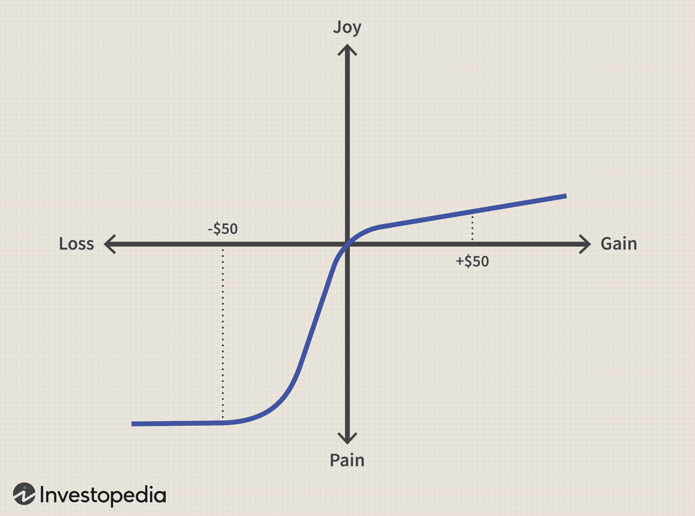

## Table of Contents

## What is the asymmetric volatility phenomenon?

The asymmetric volatility phenomenon, also known as the leverage effect, is a pattern observed in financial markets where stock prices tend to become more volatile when they fall than when they rise. This means that if a stock's price goes down, the ups and downs in its price (volatility) tend to increase more than if the stock's price goes up. This effect is important for investors and traders because it helps them understand and predict how stock prices might move in the future.

One reason for this phenomenon is the idea of "leverage." When a company's stock price drops, its debt becomes a larger part of its total value. This makes the company riskier, which can lead to more ups and downs in its stock price. Another reason could be the behavior of investors. When stock prices fall, investors might get scared and sell their stocks quickly, causing more volatility. Understanding this can help investors make better decisions about when to buy or sell stocks.

## How does the asymmetric volatility phenomenon differ from symmetric volatility?

The asymmetric volatility phenomenon and symmetric volatility are two different ways to describe how stock prices move up and down. Asymmetric volatility means that stock prices tend to be more volatile, or have bigger ups and downs, when they go down than when they go up. This is also called the leverage effect. On the other hand, symmetric volatility means that stock prices are just as likely to have big ups and downs whether they are going up or down. It doesn't matter if the stock price is increasing or decreasing; the volatility stays the same.

Understanding these differences is important for investors. If you know about asymmetric volatility, you can expect that a stock might become more volatile if its price starts to drop. This can help you decide when to buy or sell the stock. With symmetric volatility, you wouldn't expect the stock's ups and downs to change just because its price is going up or down. So, you might make different decisions about when to trade the stock based on whether you think volatility will be asymmetric or symmetric.

## What are the common causes of asymmetric volatility in financial markets?

Asymmetric volatility in financial markets often happens because of something called the leverage effect. When a company's stock price goes down, its debt becomes a bigger part of its total value. This makes the company riskier, so its stock price can have bigger ups and downs. For example, if a company's stock price drops from $100 to $50, its debt hasn't changed, but it's now a much larger part of the company's total value. This can make investors worried, which can lead to more volatility in the stock price.

Another common cause of asymmetric volatility is how investors behave. When stock prices start to fall, investors might get scared and start selling their stocks quickly. This rush to sell can make the stock price drop even more and cause bigger ups and downs. On the other hand, when stock prices go up, investors might not be as quick to buy more stocks, so the volatility doesn't increase as much. This difference in how investors react to falling and rising prices can lead to asymmetric volatility in the market.

## Can you explain the leverage effect in relation to asymmetric volatility?

The leverage effect is a big reason why we see asymmetric volatility in the stock market. Imagine a company's stock price goes down. Even though the company's debt stays the same, that debt now makes up a bigger part of the company's total value. This makes the company riskier because it has more debt compared to its value. When a company becomes riskier, its stock price can have bigger ups and downs. This is what we call asymmetric volatility – the stock price becomes more volatile when it goes down than when it goes up.

Another way to think about the leverage effect is by looking at how investors feel. When a stock price drops, investors might get worried and start selling their stocks quickly. This rush to sell can make the stock price drop even more and cause bigger ups and downs. On the other hand, when the stock price goes up, investors might not be as quick to buy more stocks, so the ups and downs don't get as big. This difference in how investors react to falling and rising prices is another part of the leverage effect that leads to asymmetric volatility in the market.

## How do investors and traders use the knowledge of asymmetric volatility to their advantage?

Investors and traders use the knowledge of asymmetric volatility to make smarter choices about when to buy or sell stocks. They know that if a stock's price starts to drop, it might become more volatile. This means the stock could have bigger ups and downs. So, if they think a stock's price will keep going down, they might decide to sell it quickly before the price drops even more. On the other hand, if they think the stock price has dropped too much and will go back up, they might see it as a good time to buy, hoping to make money when the price goes up again.

Another way investors use this knowledge is by adjusting their risk management strategies. Knowing that stocks can become more volatile when prices fall, they might use tools like stop-loss orders to limit their losses. A stop-loss order automatically sells a stock if it drops to a certain price, helping to protect their investment. Traders might also use options and other financial products to hedge against the risk of increased volatility when stock prices go down. By understanding and planning for asymmetric volatility, investors and traders can better manage their portfolios and potentially make more money.

## What are the key empirical findings supporting the existence of asymmetric volatility?

Researchers have found strong evidence that stock prices tend to be more volatile when they go down than when they go up. One of the main studies that showed this was done by Black in 1976. He looked at how stock prices moved and found that the ups and downs were bigger when prices fell. Since then, many other studies have confirmed this pattern. For example, Christie (1982) and Schwert (1989) also found that stock prices had more volatility when they dropped. These studies used different ways to measure volatility, but they all came to the same conclusion: stock prices have bigger ups and downs when they fall.

Another important finding is that this pattern of asymmetric volatility happens in many different markets around the world. For instance, research by Bekaert and Wu (2000) looked at stock markets in different countries and found the same thing: stocks were more volatile when prices went down. This shows that the phenomenon is not just limited to one market or country. The consistent results from these studies help us understand that asymmetric volatility is a real and widespread pattern in financial markets.

## How is asymmetric volatility modeled in financial econometrics?

In financial econometrics, asymmetric volatility is often modeled using special kinds of equations that can show how stock prices have bigger ups and downs when they go down. One popular way to do this is with something called GARCH models, which stands for Generalized Autoregressive Conditional Heteroskedasticity. These models can be changed a bit to account for the fact that stock prices are more volatile when they fall. For example, the EGARCH model, which stands for Exponential GARCH, is one way to do this. It lets the model see that negative changes in stock prices can lead to more volatility than positive changes. Another way is using the GJR-GARCH model, which adds a special term to the equation to show how falling prices can make volatility go up more than rising prices.

Researchers also use other methods to model asymmetric volatility. One of these is the Stochastic Volatility (SV) model. This model says that the volatility of stock prices changes over time in a way that can't be predicted perfectly. To account for asymmetric volatility, researchers can add a part to the SV model that makes the volatility go up more when stock prices go down. This helps the model fit the real data better, where we see that stock prices have bigger ups and downs when they fall. By using these models, financial econometricians can better understand and predict how stock prices might move in the future, which is very helpful for investors and traders.

## What are the limitations of current models in capturing asymmetric volatility?

Current models that try to show how stock prices can have bigger ups and downs when they fall have some problems. One big issue is that these models can be too simple. They might not be able to catch all the little details that can make stock prices move in different ways. For example, the models might not be good at showing how big news events or changes in the economy can make stock prices act differently. Also, the models often assume that the way stock prices move stays the same over time, but in real life, this can change a lot.

Another problem is that these models can be hard to use in real life. They need a lot of math and computer power to work well, and even then, they might not always give the right answers. Sometimes, the models can be too focused on the past and might not be good at predicting what will happen next. This can make it hard for investors and traders to use the models to make good decisions about buying and selling stocks. Even though these models help us understand asymmetric volatility better, they still have a long way to go to be perfect.

## How does asymmetric volatility impact option pricing and risk management?

Asymmetric volatility can change how much options cost and how investors manage risk. Options are like bets on where a stock's price will go, and their price depends a lot on how much the stock's price might move around, which is called volatility. When a stock's price goes down and becomes more volatile, options that let you sell the stock at a certain price, called put options, become more valuable. This is because there's a bigger chance the stock's price will drop even more, making the put option worth more. On the other hand, options that let you buy the stock at a certain price, called call options, might not change as much in value because the stock's price isn't as likely to go up a lot when it's already falling.

This change in option prices because of asymmetric volatility also affects how investors manage risk. If an investor owns a stock and sees its price start to drop, they might buy put options to protect themselves. These put options can help limit how much money they could lose if the stock's price keeps falling. Because of asymmetric volatility, these put options might cost more, but they can be a good way to manage risk. Investors and traders need to think about this when they're deciding whether to use options to protect their investments, and they need to understand how the cost of options can change because of the way stock prices move.

## What role does news and information asymmetry play in causing asymmetric volatility?

News and information asymmetry can make stock prices go up and down more when they fall. When bad news about a company comes out, it can make people worried. If some people know about the bad news before others, they might start selling their stocks quickly. This rush to sell can make the stock price drop a lot and cause bigger ups and downs. On the other hand, good news might not make people buy stocks as fast, so the price doesn't jump around as much.

This difference in how people react to news can lead to asymmetric volatility. When bad news spreads, it can make more people want to sell their stocks all at once. This can make the stock price fall even more and make it more volatile. But when good news comes out, people might not rush to buy the stock as quickly, so the price doesn't get as wild. Understanding how news and information asymmetry work can help investors and traders see why stock prices can have bigger ups and downs when they fall.

## How have recent studies advanced our understanding of asymmetric volatility?

Recent studies have helped us learn more about why stock prices can have bigger ups and downs when they fall. Researchers have looked at how news and information can affect stock prices. They found that when bad news comes out, it can make people worried and rush to sell their stocks. This rush to sell can make the stock price drop a lot and cause more volatility. On the other hand, good news might not make people buy stocks as fast, so the price doesn't jump around as much. This difference in how people react to news helps explain why stock prices can be more volatile when they go down.

Another way recent studies have advanced our understanding is by using new math models to show how stock prices move. These models can better capture the way stock prices can have bigger ups and downs when they fall. For example, some studies have used models that can change over time to show how stock prices might act differently depending on what's happening in the market. These new models help us see that stock prices don't always move the same way, and they can be more volatile when prices drop. By using these models, researchers can give investors and traders better tools to understand and predict how stock prices might move in the future.

## What are the future research directions in the study of asymmetric volatility?

Future research on asymmetric volatility will focus on understanding more about why stock prices can have bigger ups and downs when they fall. Researchers will look at how news and information can affect stock prices. They want to see if there are new ways to measure how news spreads and how it makes people react. By studying this, they can better explain why bad news can make stock prices more volatile than good news. They will also try to find out if there are other reasons for asymmetric volatility, like how the economy is doing or how companies are run.

Another important direction for future research is making better math models to show how stock prices move. Researchers will work on models that can change over time and show how stock prices might act differently depending on what's happening in the market. They will also try to use new computer tools to make these models more accurate. By improving these models, researchers can give investors and traders better tools to understand and predict how stock prices might move in the future. This can help people make smarter choices about buying and selling stocks.

## What is the key to understanding financial market volatility?

Market [volatility](/wiki/volatility-trading-strategies) refers to the frequency and magnitude of price movements in financial markets. It is a fundamental aspect that reflects the uncertainty or risk associated with the changing value of securities. Understanding market volatility is crucial for investors, as it influences investment decisions, risk management, and strategic planning.

### Types of Market Volatility

1. **Historical Volatility**: This measures the past price fluctuations of a security over a specific period, typically expressed as an annualized standard deviation. It provides insights into the asset's past behavior and helps assess the likelihood of future price movements. Historical volatility is calculated using the formula:
$$
   \sigma = \sqrt{\frac{1}{N-1} \sum_{i=1}^{N} (R_i - \bar{R})^2}

$$

   where $\sigma$ is the historical volatility, $R_i$ is the return of the asset at time $i$, $\bar{R}$ is the average return, and $N$ is the number of observations.

2. **Implied Volatility**: Unlike historical volatility, implied volatility is forward-looking and derived from the market prices of options. It reflects the market's expectations of future volatility. Higher implied volatility indicates greater anticipated price swings, often leading to more expensive options. It is a critical component of options pricing models such as the Black-Scholes model.

3. **Real-Time Volatility**: This is assessed by monitoring price movements over shorter intervals, using intraday data. Real-time volatility is vital for day traders and high-frequency traders who require immediate insights into market dynamics.

### Asymmetric Volatility Phenomenon (AVP)

The Asymmetric Volatility Phenomenon (AVP) is characterized by the tendency of market volatility to be higher in declining markets than in rising ones. This asymmetry can be attributed to several behavioral and psychological factors:

- **Loss Aversion**: According to behavioral economics, investors have a greater sensitivity to losses than to gains of a similar magnitude, causing more pronounced reactions during market downturns. This effect leads to rapid selling and increased market volatility.

- **Market Psychology**: Bear markets often trigger panic and emotional responses, accelerating price declines and raising volatility. In contrast, bull markets usually develop gradually, with smoother increments in asset values.

The implications of AVP for market behavior are significant. During periods of high volatility, risk-averse investors might [exit](/wiki/exit-strategy) the market, exacerbating price swings. Conversely, some traders may exploit these fluctuations for profit by adopting strategies that leverage this volatility pattern.

In summary, market volatility, both symmetric and asymmetric, plays a pivotal role in financial markets. By dissecting its types and understanding phenomena like AVP, participants can better navigate market uncertainties and devise strategies tailored to different volatility scenarios.

## References & Further Reading

[1]: Kirilenko, A. A., Kyle, A. S., Samadi, M., & Tuzun, T. (2017). ["The Flash Crash: High-Frequency Trading in an Electronic Market"](https://www.jstor.org/stable/26652722). Journal of Finance, 72(3), 1875-1940.

[2]: Black, F., & Scholes, M. (1973). ["The Pricing of Options and Corporate Liabilities"](https://www.cs.princeton.edu/courses/archive/fall09/cos323/papers/black_scholes73.pdf). Journal of Political Economy, 81(3), 637-654.

[3]: French, K. R., Schwert, G. W., & Stambaugh, R. F. (1987). ["Expected Stock Returns and Volatility"](https://www.sciencedirect.com/science/article/abs/pii/0304405X87900262). Journal of Financial Economics, 19(1), 3-29.

[4]: Lopez de Prado, M. (2018). ["Advances in Financial Machine Learning"](https://www.amazon.com/Advances-Financial-Machine-Learning-Marcos/dp/1119482089). Wiley.

[5]: Mandelbrot, B. B. (1963). ["The Variation of Certain Speculative Prices"](https://web.williams.edu/Mathematics/sjmiller/public_html/341Fa09/econ/Mandelbroit_VariationCertainSpeculativePrices.pdf). Journal of Business, 36(4), 394-419.

[6]: Kahneman, D., & Tversky, A. (1979). ["Prospect Theory: An Analysis of Decision under Risk"](https://www.jstor.org/stable/1914185). Econometrica, 47(2), 263-292.

[7]: Taleb, N. N. (2010). ["The Black Swan: The Impact of the Highly Improbable"](https://www.jstor.org/stable/23045073). Random House.

[8]: Chan, E. (2009). ["Quantitative Trading: How to Build Your Own Algorithmic Trading Business"](https://github.com/ftvision/quant_trading_echan_book). Wiley.

[9]: Soucek, L., & Todorova, N. (2013). ["Asymmetric volatility spillovers between stock market sectors in Australia"](https://www.semanticscholar.org/paper/Realized-volatility-transmission-between-crude-oil-Soucek-Todorova/e90db89398416c9863a1ad811d83a6f9550d450f). Applied Economics, 45(23), 3171-3185.