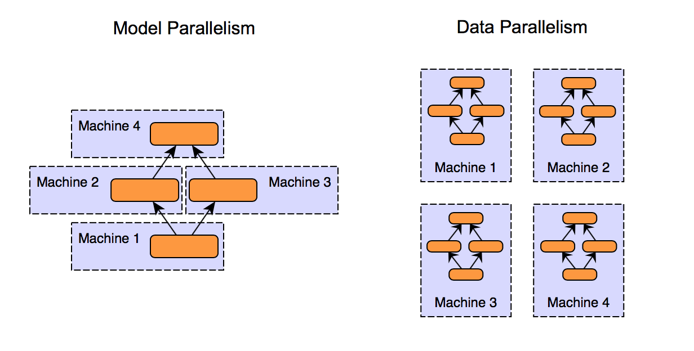

## Table of Contents

## What is Asynchronous Data Parallel in the context of machine learning?

Asynchronous Data Parallel is a technique used in machine learning to speed up the training of large models by distributing the workload across multiple processors or machines. In this approach, each processor works on its own copy of the model and updates the shared model parameters independently. Unlike synchronous methods where processors wait for each other to complete their computations before updating the model, in asynchronous methods, updates are applied as soon as they are ready. This can lead to faster training times because there's no waiting, but it can also introduce some instability because the model might be updated with outdated information.

The key idea behind asynchronous data parallel training is to maximize the utilization of computational resources. When one processor finishes processing a batch of data and updates the model, it immediately starts working on the next batch without waiting for other processors. This can be particularly beneficial in environments where the processors might have varying speeds or when there are communication bottlenecks. However, the trade-off is that the model might see slightly different versions of itself during training, which can lead to what is known as stale gradients. Despite this, asynchronous data parallel methods are often used in large-scale machine learning tasks where speed is critical and the potential instability can be managed.

## How does Asynchronous Data Parallel differ from Synchronous Data Parallel?

Asynchronous Data Parallel and Synchronous Data Parallel are two ways to train machine learning models faster by using multiple processors. In Synchronous Data Parallel, all processors work together and wait for each other to finish their part of the job before they update the model. This means that if one processor is slow, all the others have to wait for it. This can make the training process slower, but it keeps the model updates in sync, which can make the training more stable and accurate.

On the other hand, Asynchronous Data Parallel lets each processor update the model as soon as it finishes its part of the job, without waiting for the others. This can make the training much faster because there's no waiting around. However, it can also make the training a bit less stable because the model might be updated with information that's a little out of date. This method is good when you want to use all your processors as much as possible and when speed is more important than perfect accuracy.

## What are the main advantages of using Asynchronous Data Parallel for training machine learning models?

The main advantage of using Asynchronous Data Parallel for training [machine learning](/wiki/machine-learning) models is that it can significantly speed up the training process. Because each processor can update the model as soon as it finishes its work, there's no need to wait for other processors to catch up. This means that if you have a lot of processors, they can all be working at the same time, making the training much faster. This is especially useful when you're working with large datasets and complex models that take a long time to train.

Another benefit is that Asynchronous Data Parallel can make better use of computational resources. In real-world settings, processors might have different speeds or there might be delays in communication between them. With asynchronous methods, faster processors don't have to wait for slower ones, which means they can keep working without interruption. This can lead to more efficient use of your hardware, especially in environments where the processors are not perfectly synchronized. While this method can introduce some instability due to the use of potentially outdated information, the gains in speed and efficiency often make it a worthwhile trade-off.

## What challenges or drawbacks are associated with Asynchronous Data Parallel?

One of the main challenges with Asynchronous Data Parallel is that it can make the training of machine learning models less stable. This happens because the processors update the model at different times, using information that might be a bit outdated. This can lead to what is called stale gradients, which can make the model's learning process less smooth and efficient. While the model can still learn and improve, the path it takes to get there might be bumpier than with synchronous methods.

Another drawback is that managing and tuning Asynchronous Data Parallel systems can be more complicated. You need to make sure that the system is set up correctly so that the processors can work well together without causing too much chaos. This might mean adjusting how often the processors update the model or how they share information. If not done right, the system might not work as well as expected, and the benefits in speed might not outweigh the added complexity and potential instability.

## Can you explain the concept of Crossbow in relation to Asynchronous Data Parallel?

Crossbow is a technique used to improve how Asynchronous Data Parallel works in machine learning. It helps make the training of models more stable and faster. In normal Asynchronous Data Parallel, each processor updates the model as soon as it finishes its work. This can lead to problems because the model might get updated with old information. Crossbow tries to fix this by making sure that the processors share their updates in a smarter way. It does this by grouping updates together and applying them at the right time, which helps keep the model's learning path smoother.

The main idea behind Crossbow is to reduce the impact of stale gradients, which can happen when processors use outdated information to update the model. By using Crossbow, the system can better manage how and when updates are made, which leads to more stable and efficient training. This method can be especially helpful when you have a lot of processors working together, as it helps them work in a more coordinated way, even though they are updating the model asynchronously.

## How does SlowMo improve upon traditional Asynchronous Data Parallel methods?

SlowMo is a technique that improves upon traditional Asynchronous Data Parallel methods by making the training of machine learning models more stable and efficient. In traditional Asynchronous Data Parallel, each processor updates the model as soon as it finishes its work, which can lead to problems because the model might be updated with outdated information. SlowMo fixes this by making the processors wait a bit before updating the model. This waiting helps make sure that the updates are more in sync with each other, reducing the impact of stale gradients and making the training process smoother.

The key idea behind SlowMo is to balance the speed of training with the stability of the model's learning path. By introducing a small delay before updates are applied, SlowMo reduces the chance that the model will be updated with very old information. This delay helps the processors work together more effectively, even though they are still updating the model asynchronously. As a result, SlowMo can make the training process faster and more stable than traditional Asynchronous Data Parallel methods, which is especially useful when working with large datasets and complex models.

## What is the role of Wavelet Distributed Training in Asynchronous Data Parallel?

Wavelet Distributed Training is a method that helps make Asynchronous Data Parallel work better when training machine learning models. It does this by breaking down the data into smaller parts called wavelets. Each processor works on these wavelets and updates the model based on them. By doing this, Wavelet Distributed Training helps reduce the problem of using old information, which can make the training process smoother and more stable.

The main idea of Wavelet Distributed Training is to make the training faster and more efficient. By using wavelets, the processors can work on smaller, more manageable pieces of data. This means they can update the model more often without waiting for each other, which can speed up the training. At the same time, because the updates are based on smaller, fresher pieces of data, the model's learning path becomes smoother, making the whole training process more stable and effective.

## How do Crossbow, SlowMo, and Wavelet Distributed Training compare in terms of performance and efficiency?

Crossbow, SlowMo, and Wavelet Distributed Training all try to make Asynchronous Data Parallel work better, but they do it in different ways. Crossbow helps by grouping updates together and applying them at the right time, which makes the model's learning path smoother. It's good at reducing the impact of old information and can make the training more stable. SlowMo, on the other hand, makes processors wait a bit before updating the model. This waiting helps the updates be more in sync, which also reduces the chance of using very old information and makes the training process more stable. Wavelet Distributed Training breaks down the data into smaller parts called wavelets, which lets processors work on smaller, fresher pieces of data. This can make the training faster and more efficient because the model gets updated more often with up-to-date information.

In terms of performance and efficiency, each method has its strengths. Crossbow is good at keeping the training stable and smooth, which can be really helpful when you have a lot of processors working together. SlowMo also helps with stability by making sure updates are more in sync, which can be useful when you want to balance speed and stability. Wavelet Distributed Training might be the best at making the training faster because it lets processors work on smaller, more manageable pieces of data. However, the best method for you will depend on your specific needs, like how important speed is compared to stability, and how your hardware is set up.

## What specific machine learning tasks or models benefit most from Asynchronous Data Parallel techniques?

Asynchronous Data Parallel techniques are particularly useful for training large-scale machine learning models, such as deep neural networks used in image recognition or natural language processing. These models often require a lot of data and computational power, which can take a long time to process on a single machine. By using Asynchronous Data Parallel, the workload can be split across multiple processors, allowing each to work on different parts of the data and update the model independently. This can significantly speed up the training process, making it more practical to work with large datasets and complex models.

Tasks that benefit most from Asynchronous Data Parallel are those where the speed of training is critical, and where a bit of instability in the model's learning path can be managed. For example, in applications like real-time recommendation systems or large-scale language models, where new data is constantly coming in and quick updates are necessary, Asynchronous Data Parallel can be very helpful. It allows the model to be updated quickly without waiting for all processors to finish their work, which can be a big advantage in environments where computational resources are plentiful but time is limited.

## How can one implement Asynchronous Data Parallel in a practical machine learning project?

To implement Asynchronous Data Parallel in a practical machine learning project, you'll need to set up a system where multiple processors can work on the same model at the same time. This means you'll have to use a programming framework that supports distributed computing, like TensorFlow or PyTorch. In these frameworks, you can use libraries that handle the distribution of data and the synchronization of model updates. For example, in PyTorch, you might use the `torch.distributed` package to set up your processors to work asynchronously. You'll need to write code that tells each processor to take a piece of the data, train on it, and then update the shared model without waiting for the others.

When setting up your project, you'll also need to think about how to manage the updates to the model. Since the processors are updating the model at different times, you might need to use techniques like Crossbow, SlowMo, or Wavelet Distributed Training to make the training more stable. For example, if you decide to use SlowMo, you would add a small delay before each update to make sure the updates are more in sync. This can help reduce the impact of using old information, making the training process smoother. By carefully setting up your system and choosing the right techniques, you can make the most of Asynchronous Data Parallel to train your machine learning models faster and more efficiently.

## What are the latest advancements or research trends in Asynchronous Data Parallel?

Recent advancements in Asynchronous Data Parallel have focused on improving the stability and efficiency of training large-scale machine learning models. One key trend is the development of new algorithms that better manage the asynchronous updates to reduce the impact of stale gradients. Researchers are exploring techniques like adaptive delay mechanisms, where the delay before an update is dynamically adjusted based on the system's current state. This can help balance the speed of training with the stability of the model's learning path. Another trend is the integration of Asynchronous Data Parallel with other training techniques, such as federated learning, to handle distributed data sources more effectively. This allows for the training of models on data that is spread across different locations without needing to centralize it, which can be very useful in privacy-sensitive applications.

In addition to these algorithmic improvements, there is a growing interest in hardware-specific optimizations for Asynchronous Data Parallel. Researchers are looking at how to better utilize the capabilities of modern hardware, like GPUs and TPUs, to speed up asynchronous training. This involves developing new software libraries and frameworks that can take advantage of these hardware's parallel processing capabilities. For example, some recent work has focused on creating more efficient communication protocols between processors to reduce the latency in updating the shared model. These advancements aim to make Asynchronous Data Parallel even more practical for real-world applications, where speed and efficiency are critical.

## How do you measure the effectiveness of Asynchronous Data Parallel in improving training speed and model accuracy?

To measure how well Asynchronous Data Parallel works in speeding up training, you can look at how long it takes to train a model compared to training it on just one processor. For example, if it usually takes 10 hours to train a model on one processor, you would see if using Asynchronous Data Parallel with multiple processors can finish the job faster. You can also check the throughput, which is how many examples the system can process per second. If Asynchronous Data Parallel lets the system handle more examples per second than before, that's a sign it's working well. Another way to measure speed is by looking at the time it takes for each processor to finish its part of the work and update the model. If the processors are updating the model more often without waiting for each other, that means the training is going faster.

When it comes to model accuracy, you need to see if the model is learning well even though the processors are updating it at different times. You can do this by comparing the model's performance on a test set after training with Asynchronous Data Parallel to its performance when trained with other methods. If the accuracy is similar or better, that's a good sign. You might also want to look at how stable the training is. If the model's accuracy keeps going up and down a lot during training, that could mean the asynchronous updates are causing problems. To get a full picture, you can use metrics like the loss function, which tells you how well the model is doing at predicting the right answers. If the loss goes down smoothly over time, that's a good sign that Asynchronous Data Parallel is helping the model learn effectively.