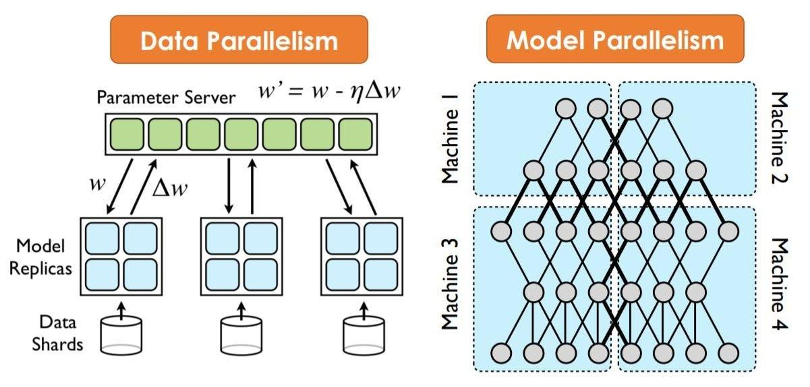

## Table of Contents

## What is Asynchronous Pipeline Parallelism in the context of machine learning?

Asynchronous Pipeline Parallelism is a technique used in machine learning to speed up the training of large models by breaking the model into smaller parts, called stages, and processing them at the same time. Imagine you have a long assembly line where each worker does a specific job. Instead of waiting for the first worker to finish before the second starts, in asynchronous pipeline parallelism, each worker starts their job as soon as they receive the necessary input, even if the previous worker hasn't finished all their tasks. This means that different parts of the model can be trained simultaneously, which can save a lot of time.

In the context of neural networks, a model might be split into several layers, and each layer can be assigned to a different device, like a GPU. While one layer is processing its data, the next layer can start working on the data it has received so far, without waiting for the entire batch from the previous layer. This approach can lead to faster training times, but it also introduces some challenges, such as managing the flow of data between stages and ensuring that the model's performance isn't negatively affected by the asynchronous nature of the training. Overall, asynchronous pipeline parallelism can be a powerful tool for scaling up machine learning models to handle larger datasets and more complex tasks.

## How does Asynchronous Pipeline Parallelism differ from traditional synchronous methods?

Asynchronous Pipeline Parallelism and traditional synchronous methods differ mainly in how they handle the flow of data during the training of machine learning models. In synchronous methods, all parts of the model, or stages, work in a coordinated way. Each stage waits for the previous stage to finish processing all its data before starting its own work. This means that if you have a model split into three stages, stage two won't start until stage one is completely done, and stage three won't start until stage two is done. This can be slower because each stage has to wait, but it's easier to manage because everything is in sync.

In contrast, Asynchronous Pipeline Parallelism allows each stage to start working as soon as it gets some data, without waiting for the previous stage to finish all its work. Imagine stage one is processing data and sends some of it to stage two. Stage two can start working on that data right away, even if stage one hasn't finished with the rest of the data. This can make the training process faster because stages don't have to wait for each other. However, it can be more complex to manage because the stages are not in sync, and you need to make sure that the model still learns correctly with this approach.

## What are the main benefits of using Asynchronous Pipeline Parallelism in machine learning?

The main benefit of using Asynchronous Pipeline Parallelism in machine learning is that it can speed up the training process. When you break a big model into smaller parts and let each part work at the same time, you don't have to wait for one part to finish before another starts. This can save a lot of time, especially with very large models that take a long time to train. For example, if you have a model with many layers, each layer can start working as soon as it gets some data, without waiting for the previous layer to finish all its work.

Another benefit is that Asynchronous Pipeline Parallelism can make better use of hardware resources. If you have multiple GPUs or other processing units, you can assign different parts of the model to different devices. This means that all your hardware can be working at the same time, which can make the training process more efficient. However, it's important to manage the flow of data carefully to make sure that the model still learns correctly, even though the parts are working asynchronously.

## Can you explain the concept of PipeDream and its role in Asynchronous Pipeline Parallelism?

PipeDream is a way to make machine learning models train faster by using Asynchronous Pipeline Parallelism. It breaks the model into smaller parts, called stages, and lets each stage work on its own as soon as it gets some data. Imagine a big puzzle where each piece can start being put together as soon as it arrives, without waiting for the whole puzzle to be complete. This means that different parts of the model can be trained at the same time, which can save a lot of time.

In PipeDream, the stages don't wait for each other to finish all their work. For example, if stage one is processing some data and sends part of it to stage two, stage two can start working right away, even if stage one hasn't finished with the rest of the data. This can make the training process much faster, but it also means you need to be careful to make sure the model learns correctly. PipeDream helps manage this by keeping track of the data flow and making sure each stage gets what it needs to keep working without too much waiting.

## What improvements does PipeDream-2BW bring over the original PipeDream?

PipeDream-2BW brings several improvements over the original PipeDream to make training machine learning models even faster and more efficient. One big change is that PipeDream-2BW uses two different ways to send data between the stages of the model. This is called bidirectional data flow. Instead of data only moving forward from one stage to the next, it can also move backward. This helps the model learn faster because it can get feedback and updates more quickly.

Another improvement is that PipeDream-2BW is better at managing how the stages work together. It can figure out the best way to split up the work so that each stage is busy but not overwhelmed. This means the model can use the computer's resources more efficiently. Overall, these changes help make the training process smoother and faster, which is really important when you're working with big and complex models.

## How does PipeMare enhance the efficiency of asynchronous pipeline parallelism?

PipeMare is a technique that makes asynchronous pipeline parallelism even better by focusing on how to handle the data moving between the different parts of the model. It uses something called "elastic pipelining" which means it can adjust how fast each part of the model works based on how much data is coming in and going out. This helps to keep the whole system running smoothly without any part getting too busy or too idle. By doing this, PipeMare can make the training process faster and use the computer's resources more efficiently.

One of the key ways PipeMare improves efficiency is by reducing the time parts of the model have to wait for data. In traditional methods, if one part finishes its job early, it has to wait for the next part to catch up. PipeMare solves this by letting parts of the model work on different pieces of data at the same time, so there's less waiting around. This means the model can keep working without breaks, which speeds up the training and makes better use of the computer's power.

## What is Pipelined Backpropagation and how does it integrate with asynchronous pipelines?

Pipelined Backpropagation is a way to make training machine learning models faster by splitting the work into smaller parts that can be done at the same time. In traditional backpropagation, the model goes through all the data forward and then backward to learn from its mistakes. But in pipelined backpropagation, the model is broken into stages, and each stage can start working as soon as it gets some data. This means that while one part of the model is moving forward with new data, another part can be moving backward with older data, all at the same time.

When you use pipelined backpropagation with asynchronous pipelines, it can make the training process even faster. In an asynchronous pipeline, each stage doesn't wait for the others to finish their work. So, if stage one is sending data to stage two, stage two can start working right away, even if stage one hasn't finished with all its data. This can save a lot of time because different parts of the model are working together but not waiting for each other. By combining pipelined backpropagation with asynchronous pipelines, you can keep the whole model busy and make the best use of your computer's resources.

## What are the common challenges faced when implementing Asynchronous Pipeline Parallelism?

One of the main challenges when implementing Asynchronous Pipeline Parallelism is managing the flow of data between the different stages of the model. Since each stage can start working as soon as it gets some data, it's important to make sure that the data is sent and received correctly. If one stage finishes its job too quickly and has to wait for data from the previous stage, it can slow down the whole process. Also, if the stages are not well-balanced, some might be working too hard while others are idle, which can lead to inefficiency.

Another challenge is ensuring that the model learns correctly even though the training is happening asynchronously. In traditional synchronous training, all parts of the model work together in a coordinated way, so it's easier to keep track of how the model is learning. But in Asynchronous Pipeline Parallelism, the stages are working on different pieces of data at the same time, which can make it harder to manage the learning process. This means you need to use special techniques, like careful scheduling and data management, to make sure the model still learns well and doesn't get confused by the asynchronous nature of the training.

## How can one measure the performance of an Asynchronous Pipeline Parallel system?

To measure the performance of an Asynchronous Pipeline Parallel system, you can look at how fast it trains the model. This means checking the time it takes to complete one full pass through the data, called an epoch. You can compare this time with the time it takes using traditional methods to see if the asynchronous approach is faster. Another way to measure performance is by looking at how well the model learns. You can use metrics like accuracy, loss, or any other relevant performance indicator to see if the model is learning as well or better than it would with a synchronous method.

In addition to speed and learning performance, you can also measure how well the system uses the computer's resources. This includes checking the usage of GPUs or other processing units to see if they are working efficiently. If the system is using all the resources well, it means the asynchronous pipeline is balanced and each stage is working without too much waiting. You can also look at how much memory the system is using and how often data is being sent between stages to make sure the data flow is managed well. By considering these different aspects, you can get a good idea of how well the Asynchronous Pipeline Parallel system is performing.

## What are some real-world applications where Asynchronous Pipeline Parallelism has been successfully implemented?

Asynchronous Pipeline Parallelism has been used successfully in training large language models like those used in natural language processing. For example, companies like Google and Microsoft have used this technique to speed up the training of their AI models that power services like Google Translate and Microsoft's Bing search engine. By breaking the model into smaller parts and letting them work at the same time, these companies can train their models much faster, which helps them improve their services more quickly.

Another real-world application is in the field of computer vision, where Asynchronous Pipeline Parallelism helps train models that can recognize objects in images or videos. For instance, self-driving car companies use this technique to train their models to identify road signs, pedestrians, and other vehicles. By using asynchronous pipelines, these companies can process large amounts of data more efficiently, which is crucial for developing safe and reliable autonomous driving systems.

## How does the choice of hardware affect the performance of Asynchronous Pipeline Parallel systems?

The choice of hardware plays a big role in how well Asynchronous Pipeline Parallel systems work. If you have powerful GPUs or other processing units, you can split your model into more stages and let each stage work on a different piece of hardware. This means the model can train faster because all the hardware is busy at the same time. But if your hardware isn't strong enough, it might struggle to handle all the stages working together, which can slow things down. So, choosing the right hardware is important to make sure the system runs smoothly and efficiently.

Also, the way the hardware communicates with each other matters a lot. If the hardware can send and receive data quickly, the stages in the pipeline can start working as soon as they get some data, without waiting too long. This helps keep the whole system running smoothly. But if the hardware has slow connections, it can create bottlenecks where some stages have to wait for data, which can make the training process slower. So, when you're setting up an Asynchronous Pipeline Parallel system, you need to think about both the power of your hardware and how well it can communicate to get the best performance.

## What future developments can we expect in the field of Asynchronous Pipeline Parallelism for machine learning?

In the future, we can expect Asynchronous Pipeline Parallelism to become even better at training big machine learning models. One exciting development might be smarter ways to split the model into stages. This means the system could figure out the best way to break the model apart so that each part works at the right speed, without waiting too much for data. Also, new methods could help manage the data flow even better, making sure each stage gets what it needs right away. This could make training models much faster and more efficient, helping us create even bigger and better AI systems.

Another area of improvement could be in how well Asynchronous Pipeline Parallelism works with different types of hardware. Right now, it works well with GPUs, but in the future, it might be easier to use with other kinds of processing units too. This would mean that even if you don't have the most powerful GPUs, you could still use Asynchronous Pipeline Parallelism to speed up your model training. Plus, better ways to connect hardware could help reduce waiting times between stages, making the whole system run smoother and faster. These advancements could make machine learning more accessible and efficient for everyone.