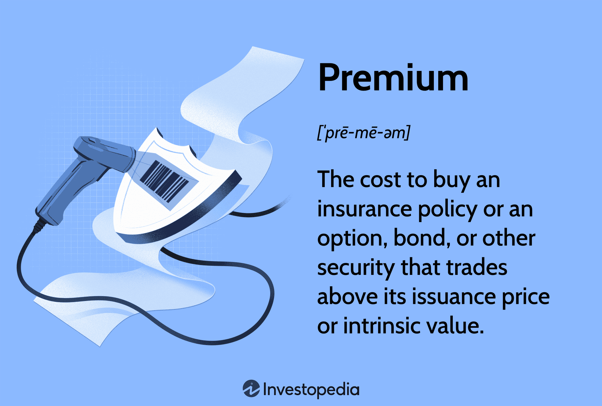

## Table of Contents

## What does 'at a premium' mean in simple terms?

When something is sold 'at a premium,' it means it costs more than its usual or normal price. Imagine if a toy that normally costs $10 is being sold for $15 because it's really popular or hard to find. That toy is being sold at a premium.

People might be willing to pay this higher price because the item is special, rare, or in high demand. For example, during a big sports event, tickets might be sold at a premium because everyone wants to go, and there aren't enough tickets for everyone. So, if you really want to go, you might have to pay more than the regular price.

## Can you give an example of something that is sold at a premium?

One example of something sold at a premium is limited edition sneakers. Imagine a new pair of sneakers that a famous brand makes, but they only make a small number of them. Because they're hard to get and lots of people want them, these sneakers can be sold for much more money than regular sneakers. If a normal pair of sneakers costs $100, these special ones might be sold for $300 or even more.

Another example is tickets to a big concert. Let's say your favorite band is coming to town, but the concert is sold out. Some people who got tickets might decide to sell them to others who missed out. Because so many fans still want to go, these tickets can be sold at a premium. If the original ticket price was $50, someone might sell it for $150 or more. People pay the extra money because they really want to see the band perform.

## How does the term 'at a premium' differ from 'at a discount'?

When something is sold 'at a premium,' it means the price is higher than what is normal or usual. This happens because the item might be rare, in high demand, or considered special. For example, if a popular toy that normally costs $20 is being sold for $50 because everyone wants it, that toy is being sold at a premium. People are willing to pay more because they really want the item or because it's hard to find.

On the other hand, when something is sold 'at a discount,' it means the price is lower than what is normal or usual. This can happen for many reasons, like the store wanting to clear out old stock, or during a sale event. For instance, if that same toy that normally costs $20 is being sold for $15 because the store is having a sale, that toy is being sold at a discount. People like buying things at a discount because they can save money.

## In what contexts is the phrase 'at a premium' commonly used?

The phrase 'at a premium' is often used when talking about things that are hard to get or really wanted by a lot of people. For example, during a big sports event like the Super Bowl, tickets can be sold at a premium. This means they cost more than usual because so many people want to go and there aren't enough tickets for everyone. Another common context is with special or limited edition products, like a new smartphone model that only a few people can buy. These items can be sold at a premium because they're rare and people are willing to pay more to get them.

Another context where you might hear 'at a premium' is in the world of investments. Sometimes, stocks or other investments that are doing really well or are expected to do well in the future are sold at a premium. This means investors are willing to pay more for them because they think they will make a lot of money later. In real estate, too, a house in a popular neighborhood might be sold at a premium because many people want to live there, and there are not many houses available. So, the price goes up because of the high demand.

## What factors contribute to a product or service being priced at a premium?

Several factors can make a product or service be priced at a premium. One big reason is high demand. When a lot of people want something, but there isn't enough of it to go around, the price can go up. For example, if a new toy is really popular and stores can't keep it in stock, people might be willing to pay more to get it. Another [factor](/wiki/factor-investing) is rarity. If something is hard to find or only made in small numbers, like a limited edition sneaker, it can be sold at a premium because it's special and not everyone can have it.

Another reason for premium pricing is the perceived value of the product or service. If people think something is really good or high quality, they might be willing to pay more for it. For instance, a fancy restaurant might charge more for its meals because people believe the food and service are worth the extra cost. Brand reputation also plays a role. If a brand is well-known and trusted, like a famous designer, their products can be sold at a premium because people are willing to pay more for the name and the quality they expect from it.

In some cases, the context or timing can lead to premium pricing. During special events or holidays, like a big concert or Christmas, items related to those events can be sold at a premium. For example, tickets to a popular music festival might cost more because it's a one-time event and everyone wants to go. Also, in certain industries like real estate or investments, if something is expected to increase in value in the future, it might be sold at a premium now because people see it as a good investment.

## How does the concept of 'at a premium' apply in the stock market?

In the stock market, when a stock is sold 'at a premium,' it means the price is higher than its usual or expected value. This can happen for many reasons. One big reason is if people think the company will do really well in the future. For example, if a company comes up with a new product that everyone wants, investors might be willing to pay more for the stock because they think the company will make a lot of money. Another reason is if the stock pays good dividends, which are like little payments to shareholders. If the dividends are high, people might pay more for the stock to get those payments.

Another situation where stocks are sold at a premium is during a takeover or merger. If one company wants to buy another company, they might offer to buy the stock at a higher price than it's currently worth. This is called a premium because the price is above the normal market value. Investors might be happy to sell their stock at this higher price because it's a good deal for them. So, in the stock market, 'at a premium' means the stock is worth more than usual because of good future expectations, high dividends, or special events like takeovers.

## What is the economic impact of goods being sold at a premium?

When goods are sold at a premium, it means they cost more than usual. This can have a big effect on the economy. For the people selling the goods, it's good news because they make more money. They can use this extra money to grow their business, hire more people, or invest in new projects. This can help the economy grow because more money is moving around. But for the people buying the goods, it can be tough. They have to spend more money, which might mean they have less to spend on other things. If lots of things are sold at a premium, it can make life more expensive for everyone.

Another impact is on the overall market. When goods are sold at a premium, it can make other sellers want to raise their prices too. This can lead to inflation, which means the general level of prices goes up. If inflation gets too high, it can make it hard for people to afford things they need. On the other hand, selling goods at a premium can also show that the economy is doing well. If people are willing to pay more for things, it might mean they have more money to spend and feel confident about the future. So, while selling goods at a premium can help some parts of the economy, it can also create challenges for others.

## How do consumer perceptions influence the pricing at a premium?

Consumer perceptions play a big role in why some things are sold at a premium. If people think a product is really good, special, or hard to get, they might be willing to pay more for it. For example, if a company makes a new phone that everyone thinks is the best ever, they can charge more for it because people really want it. Also, if a brand is famous and people trust it, they might pay more just because of the name. It's like how some people will pay more for a shirt if it has a famous designer's name on it, even if it's not that different from a cheaper shirt.

Sometimes, the way a product is marketed can make people think it's worth more. If a company says a product is limited edition or only available for a short time, people might rush to buy it and be okay with paying a higher price. It's all about how the product is seen by consumers. If they think it's valuable or special, they'll be more likely to pay a premium price. This shows that what people think and feel about a product can make a big difference in how much it can be sold for.

## Can 'at a premium' be applied to non-tangible items like services or experiences?

Yes, 'at a premium' can be used for services and experiences too. When a service is sold at a premium, it means it costs more than what you would normally pay. For example, if you need a plumber to fix a problem right away on a holiday, they might charge more because they're working when most people are off. People might be okay with paying more because they really need the service or because it's hard to find someone to do it at that time.

The same goes for experiences. If you want to go to a big concert or a special event, the tickets might be sold at a premium. This means the tickets cost more than usual because a lot of people want to go, and there aren't enough tickets for everyone. People are willing to pay more because the experience is special or hard to get. So, just like with things you can touch, services and experiences can be sold at a premium when they're in high demand or seen as valuable.

## What are the marketing strategies used to justify premium pricing?

Companies use different ways to make people think it's okay to pay more for their products. One way is to make the product seem special or rare. They might say it's a limited edition or only available for a short time. This makes people want to buy it more and be okay with paying a higher price. Another way is to use famous people or influencers to talk about the product. If someone people like or trust says the product is great, people might think it's worth the extra money. Also, companies might spend a lot on making the product look nice, like using fancy packaging or showing it in cool ads. This can make people think the product is worth more.

Another strategy is to focus on how good or high-quality the product is. Companies might talk a lot about the materials they use or how they make the product. If people think the product is really well-made, they might be happy to pay more for it. Also, companies might use their brand name to justify the higher price. If the brand is well-known and trusted, people might think it's worth paying more just because of the name. Finally, companies might offer special services or extras with the product, like free delivery or a long warranty. These extras can make people feel like they're getting more for their money, even if the product itself costs more.

## How does the concept of 'at a premium' vary across different industries?

The idea of selling things 'at a premium' can be different depending on the industry. In the fashion world, for example, a designer might charge more for a dress because it's a limited edition or because it has a famous name on it. People are willing to pay more because they think the dress is special or because they want to show off the brand. In the tech industry, a new smartphone might be sold at a premium because it has the latest features and everyone wants it. The high price shows that it's the best and newest, and people are okay with paying more to have the latest technology.

In the entertainment industry, tickets to a big concert or a special event might be sold at a premium. This happens because a lot of people want to go, but there aren't enough tickets for everyone. People are willing to pay more because the experience is rare or exciting. In the real estate market, a house in a popular neighborhood might be sold at a premium because it's in high demand and there aren't many houses available. The high price shows that it's a good place to live and people are willing to pay more to live there. Each industry uses the idea of 'at a premium' to show that something is special, rare, or in high demand, but the reasons and the things being sold can be very different.

## What are the ethical considerations of pricing products at a premium?

When companies sell things at a premium, they need to think about what's fair. It can be okay to charge more if the product is special or hard to find, but it's not right to take advantage of people. For example, if a store raises prices a lot during a big storm because everyone needs supplies, that's not fair. It's called price gouging, and it can hurt people who really need those things but can't afford to pay so much. Companies should be honest about why they're charging more and make sure they're not just trying to make more money from people who don't have a choice.

Also, companies should think about how premium pricing can affect different groups of people. If a product is sold at a premium, it might be too expensive for some people, like those with less money. This can make it hard for them to get things they need or want. Companies should try to balance making money with being fair to everyone. They can do this by offering different versions of a product at different prices or by being clear about why the price is higher. This way, people can make good choices and feel like they're being treated fairly.

## What are the essential financial terms in algo trading?

Key financial terms such as alpha, beta, and risk premium are critical for traders employing algorithmic strategies. These metrics provide insights into the performance and risk profile of investments, aiding in the optimization of trading strategies and portfolio management.

Alpha (α) represents the excess return of an investment relative to the return of a benchmark index. It measures the value that a trader or investment strategy adds to the portfolio. A positive alpha indicates that the investment has outperformed the market index, while a negative alpha suggests underperformance. Mathematically, alpha can be expressed as:

$$
\alpha = R - (R_f + \beta \times (R_m - R_f))
$$

where $R$ is the return of the portfolio, $R_f$ is the risk-free rate, $\beta$ is the beta of the portfolio, and $R_m$ is the return of the market.

Beta (β) assesses the [volatility](/wiki/volatility-trading-strategies) or systematic risk of a security or portfolio in relation to the overall market. A beta greater than one indicates higher volatility and thus higher risk than the market, while a beta less than one indicates lower volatility. This measure helps traders understand market risk exposure and adjust strategies accordingly. The formula for calculating beta is:

$$
\beta = \frac{\text{Cov}(R_i, R_m)}{\text{Var}(R_m)}
$$

where $\text{Cov}(R_i, R_m)$ is the covariance between the asset return and the market return, and $\text{Var}(R_m)$ is the variance of the market return.

Risk premium is the return above the risk-free rate that investors require to compensate for the additional risks inherent in a security or portfolio. It serves as a vital component in evaluating the potential returns adjusted for risk and assists traders in making informed decisions on asset allocation.

Understanding these terms allows algorithmic traders to refine their strategies by predicting market movements and adjusting their models to exploit inefficiencies. A proficient grasp of alpha, beta, and risk premium ensures that traders can navigate market dynamics effectively, enhancing their ability to generate superior trading outcomes.

## What is the impact of premium prices on algo trading?

Premium prices can significantly influence the effectiveness of [algorithmic trading](/wiki/algorithmic-trading) strategies by impacting the balance between expected returns and actual costs. When assets are traded at high premiums—prices exceeding their intrinsic value—traders may face challenges in maintaining profitability. This scenario requires a recalibration of algorithms to account for additional costs introduced by premium pricing.

For instance, if an algorithm anticipates an asset's intrinsic value as $V$, and the asset is trading at a premium $P$, the market price $M$ can be represented as:

$$
M = V + P
$$

In this case, the algorithm needs to adjust its parameters and decision models to account for the additional cost $P$ in the expected profits equation. Failure to accommodate these adjustments may result in suboptimal trading decisions, ultimately affecting the trader's bottom line.

Adaptation is essential for algorithmic trading systems to effectively navigate environments characterized by premium pricing. Algorithms must be dynamically adjusted to reflect these additional costs over time, which involves reassessing risk parameters and return expectations. This ongoing recalibration process ensures that trading strategies remain viable and can sustain long-term success despite the elevated costs associated with trading premiums.

To automate this process, traders might employ [machine learning](/wiki/machine-learning) techniques to recognize patterns in premium pricing and adjust their strategies accordingly. A simple Python model illustrating this concept could involve adjusting a trading threshold based on historical premium data:

```python
def adjust_threshold(premium_data, base_threshold):
    # Calculate the average premium
    avg_premium = sum(premium_data) / len(premium_data)

    # Adjust threshold based on average premium
    adjusted_threshold = base_threshold + avg_premium
    return adjusted_threshold

# Example usage
premium_data = [1.5, 2.0, 2.5]  # Example premium points collected
base_threshold = 100  # Initial threshold for trading
new_threshold = adjust_threshold(premium_data, base_threshold)
print(f"Adjusted Trading Threshold: {new_threshold}")
```

The example above demonstrates a basic approach where a threshold value is adjusted based on historical premium data, allowing the algorithm to take account of premium pricing in its trading decisions. Advanced models can further enhance this by integrating larger datasets and complex pricing dynamics into their calibration processes.

In conclusion, embracing adaptive strategies is crucial for algorithmic traders contending with premium pricing. By effectively modifying algorithms in response to market conditions, traders can optimize their return potentials while mitigating risks associated with premium costs.

## References & Further Reading

[1]: Bergstra, J., Bardenet, R., Bengio, Y., & Kégl, B. (2011). ["Algorithms for Hyper-Parameter Optimization."](https://dl.acm.org/doi/10.5555/2986459.2986743) Advances in Neural Information Processing Systems 24.

[2]: ["Advances in Financial Machine Learning"](https://www.amazon.com/Advances-Financial-Machine-Learning-Marcos/dp/1119482089) by Marcos Lopez de Prado

[3]: ["Evidence-Based Technical Analysis: Applying the Scientific Method and Statistical Inference to Trading Signals"](https://www.amazon.com/Evidence-Based-Technical-Analysis-Scientific-Statistical/dp/0470008741) by David Aronson

[4]: ["Machine Learning for Algorithmic Trading"](https://github.com/stefan-jansen/machine-learning-for-trading) by Stefan Jansen

[5]: ["Quantitative Trading: How to Build Your Own Algorithmic Trading Business"](https://www.amazon.com/Quantitative-Trading-Build-Algorithmic-Business/dp/1119800064) by Ernest P. Chan