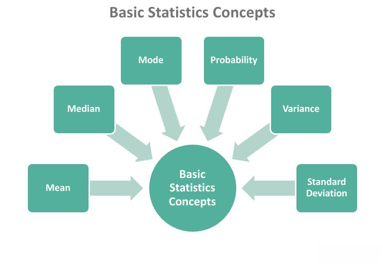

The advent of algorithmic trading has fundamentally transformed the execution of trades in modern financial markets. Algorithmic trading involves the use of complex algorithms to automate trading strategies, enabling high-speed and high-frequency trade executions that were not possible with manual trading methods. This transformation has brought about significant changes in trading dynamics, where speed, accuracy, and strategic precision are paramount.

Among the critical concepts in algorithmic trading is the understanding of specific order types, such as 'at-or-better' orders. An 'at-or-better' order is a directive where trades must be executed at a predetermined price or at a more favorable price. This type of order distinguishes itself by setting a price ceiling, thereby ensuring that trades occur under specific, advantageous conditions for the trader. Unlike market orders, which prioritize immediate execution at the current market price, 'at-or-better' orders emphasize fulfilling the trade at a price that meets or exceeds the trader's specific criteria.



Understanding terminologies like 'at-or-better' orders is vital for navigating the fast-paced environment of modern trading. These orders are a cornerstone in algorithmic trading, offering traders enhanced control over their trading activities and allowing for the implementation of sophisticated trading strategies. As such, comprehending 'at-or-better' orders and their application is essential for engaging effectively in today's algorithm-driven markets.

This article aims to explore the definition and relevance of the 'at-or-better' order within the context of algorithmic trading. The discussion will illuminate how this order type integrates into broader trading strategies, optimizing trade executions amidst the challenges and opportunities presented by the rapid evolution of financial technology.

## Table of Contents

## What is 'At-or-Better'?

'At-or-better' orders in trading are executed at a predetermined price or a more advantageous one. These orders are a subset of limit orders, signifying that a trade will only be executed if the specified price, or a better one, is available. This concept ensures the trade is conducted under favorable financial conditions, contrasting distinctly from market orders that prioritize the speed of execution over the price at which the trade is performed.

A limit order, including 'at-or-better,' is crucial in scenarios where the trader wants to control the entry or [exit](/wiki/exit-strategy) price for a particular transaction. For instance, if a trader places a buy 'at-or-better' order at $50, the transaction will only execute if the market price is $50 or less. Conversely, for a sell order, the trade will be executed at prices $50 or more, ensuring favorable conditions for the seller.

Distinct from market orders, which are executed immediately at the best available current price, 'at-or-better' orders require patience and may not execute if the market does not reach the specified criteria. This distinction is vital since it allows traders to define and stick to their price goals, reducing exposure to unfavorable market movements.

The importance of 'at-or-better' orders is highlighted in the cost and risk management of trading strategies. By setting a maximum or minimum price threshold, traders can navigate market [volatility](/wiki/volatility-trading-strategies) with greater control. This feature aligns with strategic objectives, aiming for trades that meet or exceed personal benchmarks for success. The ability to set these limits introduces a calculated approach to trading activities, commonly utilized in both high-frequency trading systems and traditional long-term investment strategies.

## Understanding the 'At-or-Better' Order

'At-or-better' orders are a subtype of limit orders that ensure execution only at the specified price or better, safeguarding traders from unfavorable market movements. Unlike market orders, which focus on execution speed by filling orders at the best available current price, 'at-or-better' orders prioritize price precision and control. This distinction is paramount for traders focused on minimizing cost and maximizing strategy effectiveness.

Limit orders permit traders to set a maximum purchase price or a minimum sale price. The 'at-or-better' condition implies that a trader will only buy at or below a certain price limit, offering protection against volatility. By placing such an order, traders avoid the unpredictability of market orders, which can result in substantial slippage—executing at prices significantly different from the last seen price due to rapid market fluctuations.

Consider the mathematical function for an 'at-or-better' buy order:
$$
P_{\text{execution}} \leq P_{\text{limit}}
$$

where $P_{\text{execution}}$ is the price at which the trade is executed, and $P_{\text{limit}}$ is the pre-specified limit price. This formula illustrates that the trade executes only if the execution price meets the set condition of being at or below the limit price.

'At-or-better' orders demand additional consideration and understanding of market dynamics. These orders can dominate trading strategies by embodying a disciplined approach that restricts execution to favorable conditions. This control is particularly relevant in algorithmic trading strategies where computational algorithms execute trades based on pre-designed criteria.

Furthermore, algorithmic traders can employ 'at-or-better' orders as part of a comprehensive strategy that accommodates various order types to adjust for different market conditions. In coding terms, an algorithm might look like:

```python
def execute_limit_order(price, limit):
    if price <= limit:
        execute_trade(price)
    else:
        hold_position()
```

This code exemplifies how algorithms facilitate the execution of 'at-or-better' orders, thus incorporating strategic depth and disciplined execution into trading operations. By integrating such controls, traders can enhance their ability to navigate complex and volatile market environments with precision and confidence.

## Importance in Algorithmic Trading

Algorithmic trading has revolutionized the way financial markets operate, with 'at-or-better' orders playing a crucial role in optimizing trade execution. These orders allow traders to establish conditions under which trades are automatically executed, thereby enhancing the efficiency of trading strategies. By setting predefined parameters, traders can ensure that trades are executed at a specified price or better, which is vital in markets characterized by rapid price fluctuations.

The implementation of 'at-or-better' orders in [algorithmic trading](/wiki/algorithmic-trading) contributes significantly to aligning trades with pre-defined targets, even under volatile market conditions. This is particularly beneficial as it reduces the risk of executing trades at undesirable prices. For instance, a trader looking to buy shares can set an 'at-or-better' order to limit the purchase price to a maximum threshold. This approach mitigates the risk of purchasing at inflated prices during sudden market upswings.

Automation is another critical advantage of using 'at-or-better' orders. By embedding these orders within algorithmic trading strategies, traders can effectively manage a higher [volume](/wiki/volume-trading-strategy) of trades without constant manual oversight. This automation facilitates timely execution of trades, ensuring that the specified criteria are met, especially in high-frequency trading environments where speed is paramount.

Utilizing such orders also aids in maintaining control over investment strategies. By dictating the conditions under which trades are executed, traders can better manage risk and maximize the returns based on their specific trading objectives. This level of precision is often unattainable with market orders, which prioritize speed over price and expose traders to potential price risks.

In summary, 'at-or-better' orders enhance algorithmic trading by providing a mechanism to automate and optimize trade execution. They enable traders to maintain strategic alignments with their trading goals even amidst market volatility, thereby securing a tactical advantage in the competitive landscape of financial markets.

## Challenges and Considerations

Limit orders, particularly 'at-or-better' orders, offer a significant advantage by ensuring trades are executed at specified prices or better; however, they present distinct challenges and considerations. One of the principal challenges involves the potential for longer execution times. Unlike market orders, which are executed almost immediately at the current market price, limit orders wait until the market conditions align with the specified price, which might extend the time for execution, especially if the market is moving away from the order's limit price. This delay can be a critical [factor](/wiki/factor-investing) in fast-moving markets, where timely execution is crucial.

In addition to potential delays, traders must consider the possibility of higher brokerage fees associated with limit orders. The complexity and the conditions attached to executing limit orders often lead to additional costs. Traders must weigh these costs against the potential benefits of achieving a more favorable price, such as mitigating the risk of paying an unfavorable price during a market swing.

For traders employing 'at-or-better' orders, it's crucial to evaluate if these orders align with their overall risk-return strategy. The decision to use such orders should be based on the trader's comfort with waiting for a better price versus the risk of not executing at all if the market does not reach the set limit price. The balance between achieving the targeted return and maintaining an acceptable risk level is essential.

Moreover, technology significantly influences the speed and effectiveness of order execution. In high-frequency trading ([HFT](/wiki/high-frequency-trading-strategies)), where decisions are made in microseconds, the technology stack underpinning trading operations can determine the success or failure of executing a strategy. Advanced algorithms and high-speed data processing systems are necessary to ensure that 'at-or-better' orders are executed optimally within this rapidly changing environment.

Ultimately, traders must integrate both the strategic and technological components of trading when opting for 'at-or-better' orders to ensure these tools contribute positively to their trading objectives. The careful consideration of these factors will allow traders to harness the benefits of precision and control while minimizing the drawbacks of potential delays and costs.

## Additional Related Terminologies

In the dynamic landscape of trading, understanding various order types is indispensable for refining trading strategies. Among these, 'stop orders' and 'stop-limit orders' are instrumental for traders seeking precision and control over their trade executions. 

A 'stop order', also known as a stop-loss order, transforms into a market order once a specified price, known as the stop price, is reached. This mechanism allows traders to limit potential losses or protect profits by triggering a sell (or buy) when the market hits the pre-set stop price. For instance, if a trader holds a stock currently priced at $50 and wants to automatically sell if the price falls to $45, placing a stop order at $45 will achieve this. The stop order becomes a market order when the price drops to $45, ensuring the stock is sold at the best available market price.

Complementing stop orders, 'stop-limit orders' add an additional layer of control by combining a stop order with a limit order. A stop-limit order consists of two prices: the stop price, which converts the order into a sell (or buy) order, and the limit price, which sets the minimum (or maximum) price at which the order can be executed. This strategy is advantageous in volatile markets where large price swings could result in a simple stop order being executed at an unfavorable price. For example, in the same scenario as above, a trader could place a stop-limit order with a stop price of $45 and a limit price of $44 to ensure that the order will only execute if the trade can be made above $44.

Traders, particularly those engaged in [day trading](/wiki/day-trading-spy) or utilizing automated trading systems, rely on these order types to navigate diverse market conditions efficiently. The nuanced application of stop and stop-limit orders can significantly enhance a trader's ability to manage risk and execute strategies aligned with their market forecasts.

In the constantly evolving trading environment, proficiency with a range of order types, including 'at-or-better', stop, and stop-limit orders, equips traders with a crucial toolkit for optimizing trade execution and maintaining strategic flexibility in response to market movements.

## Conclusion

'At-or-better' orders play a critical role in executing trading strategies with precision and control. These orders provide traders with the assurance that their trades will be executed at a predetermined price or better, thus aligning execution with their trading objectives. This form of order is particularly valuable in algorithmic trading, where precision and the ability to automate strategies are paramount. 

For individuals involved in algorithmic trading, comprehending how 'at-or-better' orders function is of significant importance. In a market environment characterized by rapid price fluctuations, such orders empower traders to maintain control over executed prices, contributing to the stability of their strategies. This is particularly relevant in volatile markets where speed and precision must be balanced effectively to achieve desired outcomes.

As trading continues to evolve with advancing technology, gaining a comprehensive understanding of these tools becomes an asset. Traders who are well-versed in the various types of orders and their functionalities can craft more nuanced and adaptable trading strategies. Embracing these capabilities offers a competitive edge, enabling traders to execute orders that align tightly with their risk tolerance and return objectives. An adept grasp of 'at-or-better' orders, coupled with other order types and technologies, strengthens a trader’s ability to compete and succeed in today's fast-evolving financial markets.

## References & Further Reading

[1]: Bergstra, J., Bardenet, R., Bengio, Y., & Kégl, B. (2011). ["Algorithms for Hyper-Parameter Optimization."](https://papers.nips.cc/paper/4443-algorithms-for-hyper-parameter-optimization) Advances in Neural Information Processing Systems 24.

[2]: ["Advances in Financial Machine Learning"](https://www.amazon.com/Advances-Financial-Machine-Learning-Marcos/dp/1119482089) by Marcos Lopez de Prado

[3]: ["Evidence-Based Technical Analysis: Applying the Scientific Method and Statistical Inference to Trading Signals"](https://www.amazon.com/Evidence-Based-Technical-Analysis-Scientific-Statistical/dp/0470008741) by David Aronson

[4]: ["Machine Learning for Algorithmic Trading"](https://github.com/stefan-jansen/machine-learning-for-trading) by Stefan Jansen

[5]: ["Quantitative Trading: How to Build Your Own Algorithmic Trading Business"](https://www.amazon.com/Quantitative-Trading-Build-Algorithmic-Business/dp/1119800064) by Ernest P. Chan