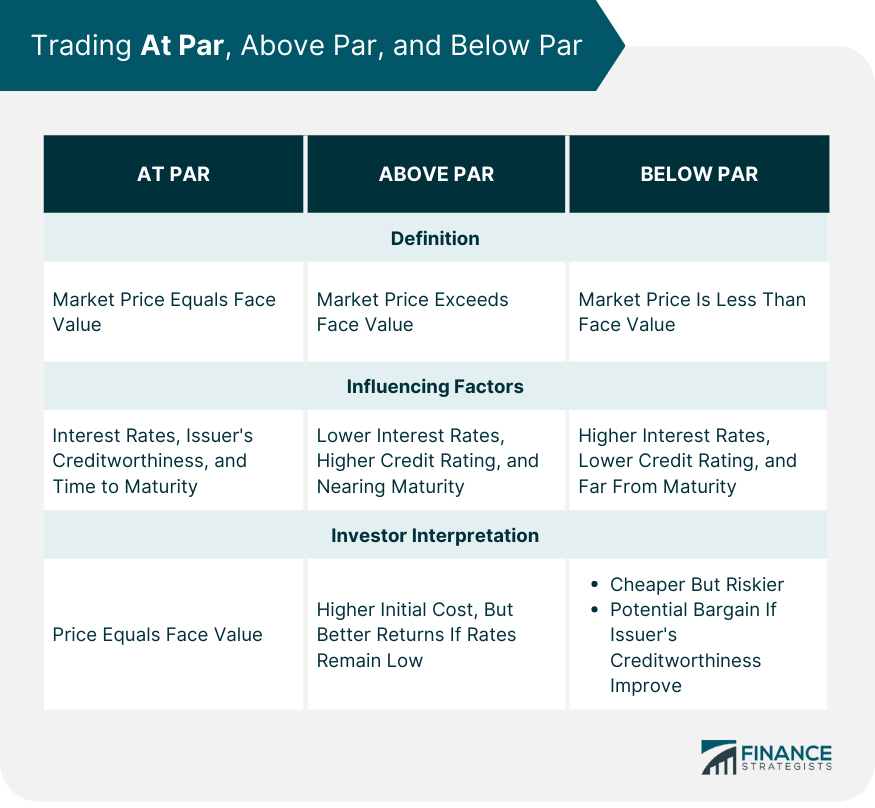

## Table of Contents

## What does 'at par' mean in financial terms?

In financial terms, 'at par' means that a bond or a stock is trading at its face value or nominal value. This is the value that is printed on the bond or stock certificate. For example, if a bond has a face value of $1,000 and it is trading at par, it means the bond is being bought and sold for exactly $1,000.

The term 'at par' is important because it helps investors understand whether they are getting a good deal or not. If a bond is trading above its face value, it is said to be trading at a premium. If it is trading below its face value, it is trading at a discount. Knowing whether a bond is at par, at a premium, or at a discount can help investors make better decisions about buying or selling.

## How is 'at par' different from 'above par' and 'below par'?

When a bond or stock is 'at par,' it means it is trading at its face value, which is the amount written on the certificate. For example, if a bond says it's worth $1,000, and you can buy it for $1,000, then it's at par. This is important because it shows that the bond or stock is being sold for exactly what it's supposed to be worth.

If a bond or stock is 'above par,' it means it's trading for more than its face value. So, if that same $1,000 bond is being sold for $1,100, it's above par. People might be willing to pay more if they think the bond is a good investment. On the other hand, if it's 'below par,' it's trading for less than its face value. If you can buy the $1,000 bond for $900, it's below par. This might happen if people think the bond is riskier or not as good an investment.

## Can you provide a simple example of a bond being sold at par?

Imagine you want to buy a bond from a company called ABC Corp. The bond has a face value of $1,000, which means that's the amount written on the bond. If you go to the market and find that you can buy this bond for exactly $1,000, then the bond is being sold at par.

In this case, you're paying exactly what the bond is worth according to its face value. This means you're getting the bond at its standard price, without paying more or less than what it says on the bond certificate.

## What factors determine whether a bond is sold at par?

Several things can affect whether a bond is sold at par. One big factor is the interest rate the bond offers compared to other bonds out there. If a bond's interest rate is the same as what other similar bonds are offering, it's more likely to be sold at par. Another factor is how safe people think the bond is. If people believe the company or government that issued the bond will pay back the money, the bond is more likely to be sold at par.

The bond's time until it matures also plays a role. If a bond is going to mature soon, it's more likely to be sold at or close to its face value because there's less time for things to go wrong. On the other hand, if the bond has a long time before it matures, its price might change more, making it less likely to be sold at par. Overall, a bond is most likely to be sold at par when its interest rate is competitive, it's seen as safe, and it's close to maturing.

## How does the concept of 'at par' apply to stocks?

The concept of 'at par' can apply to stocks just like it does to bonds. For stocks, 'at par' means the stock is trading at its face value, which is the value written on the stock certificate. For example, if a stock has a face value of $10 and it's trading for exactly $10, it's at par. This is different from when a stock is trading above or below its face value.

However, in practice, stocks usually don't have a face value that people pay attention to like bonds do. Instead, stocks are more often talked about in terms of their market price, which can be much higher or lower than any face value. So while the idea of 'at par' can be used for stocks, it's not as common or important as it is for bonds.

## What are the implications of buying a security at par for an investor?

Buying a security at par means you're paying exactly what it's worth according to its face value. For an investor, this can be a good thing because it means you're not overpaying for the security. If you buy a bond at par, you know you're getting the interest rate that was promised when the bond was issued. This can make it easier to plan your investments because you know exactly what you're getting.

However, buying at par doesn't always mean you're getting the best deal. If interest rates have gone up since the bond was issued, a bond bought at par might not be as good an investment as a new bond with a higher interest rate. Also, if the security is seen as risky, buying it at par might not be a smart move because you could lose money if the company or government can't pay you back. So, while buying at par can be straightforward, it's important to look at other factors too.

## How do interest rates affect whether a bond is sold at par?

Interest rates play a big role in whether a bond is sold at par. When a bond is first issued, its interest rate is set based on what's happening in the market at that time. If interest rates stay the same, the bond will likely be sold at par because its interest rate is still competitive with other bonds. But if interest rates go up after the bond is issued, the bond's interest rate might not look as good anymore. People might want to buy new bonds with higher interest rates, so the old bond might have to be sold for less than its face value to attract buyers.

On the other hand, if interest rates go down after a bond is issued, the bond's interest rate becomes more attractive. People might be willing to pay more than the face value to get that higher interest rate, so the bond could be sold above par. This is because the bond's interest rate is better than what's available on new bonds. So, interest rates can push a bond's price up or down, making it less likely to be sold at par if they change a lot.

## What role does the credit rating of a bond issuer play in selling bonds at par?

The credit rating of a bond issuer is very important when it comes to selling bonds at par. A credit rating is like a report card that tells investors how likely it is that the issuer will pay back the money they borrowed. If a bond issuer has a high credit rating, it means people think they're safe and will pay back the bond. When people trust the issuer, they're more likely to buy the bond at its face value, which means the bond can be sold at par.

On the other hand, if the bond issuer has a low credit rating, it means people think there's a higher chance the issuer might not pay back the money. This makes the bond riskier. Because of this risk, people might not want to pay the full face value for the bond. They might want to pay less, which means the bond would be sold below par. So, a high credit rating helps a bond be sold at par, while a low credit rating makes it harder.

## Can you explain how 'at par' is used in foreign exchange markets?

In foreign exchange markets, 'at par' means that two currencies are trading at the same value. For example, if one US dollar is equal to one Canadian dollar, they are trading at par. This is important because it shows that the two currencies are worth the same amount when you exchange them. When currencies are at par, it makes trading between them very straightforward because you don't lose or gain value when you switch from one to the other.

However, currencies are rarely at par for long periods because their values are always changing based on things like interest rates, inflation, and how well the countries' economies are doing. If a currency is usually not at par with another but suddenly becomes so, it might mean that something big is happening in one of the countries. For example, if the US dollar and the Canadian dollar are usually not at par but suddenly are, it might mean that the US and Canadian economies are doing similarly well or poorly.

## How do market conditions influence the likelihood of securities being sold at par?

Market conditions can really change whether securities like bonds or stocks are sold at par. If the market is doing well and people feel confident, they might be more likely to buy securities at their face value. This is because they think the companies or governments that issued the securities will be able to pay them back. Also, if interest rates are steady, bonds are more likely to be sold at par because their interest rates are still good compared to other bonds.

But if the market is shaky and people are worried, they might not want to pay the full face value for securities. They might think there's a bigger chance the issuer won't be able to pay them back, so they want to pay less. If interest rates go up, bonds that were issued earlier might not look as good anymore, so they might have to be sold for less than their face value. So, market conditions like how people feel about the economy and changes in interest rates can make it harder or easier for securities to be sold at par.

## What are some advanced strategies investors might use when dealing with securities at par?

When dealing with securities at par, some investors might use a strategy called bond laddering. This means they buy bonds that mature at different times. By doing this, they can make sure they always have some bonds that are close to maturing and likely to be sold at par. This can help them get a steady income and reduce the risk of losing money if interest rates change a lot. It's like having a bunch of timers set to go off at different times, so you always have some money coming in.

Another strategy is to look at the yield to maturity (YTM) of bonds. This tells you what you can expect to earn if you hold the bond until it matures. If a bond is at par, its YTM is the same as its coupon rate. But if you think interest rates might go down, you might want to buy bonds at par now because their YTM could become more attractive later. This way, you can lock in a good rate before it changes. It's like buying a ticket to a show that might get more expensive later.

## How can understanding 'at par' help in portfolio diversification and risk management?

Understanding 'at par' can help investors make smarter choices about their portfolios. When a security is at par, it means you're paying exactly what it's worth. This can help you spread your investments across different types of securities without overpaying. For example, if you're buying bonds, knowing which ones are at par can help you pick bonds that are a good fit for your investment goals. By including securities at par in your portfolio, you can balance out riskier investments and create a more stable mix of assets.

In terms of risk management, knowing about 'at par' can help you understand the market better. If a bond is at par, it might mean that the market thinks the bond is safe and likely to be paid back. This can help you decide how much risk you want to take. If you see that a lot of bonds are not at par, it might mean the market is worried about something, and you might want to adjust your investments to be safer. By keeping an eye on which securities are at par, you can make better decisions about how to protect your money and manage risk.

## What are examples of 'At Par' in financial contexts?

Consider a scenario where a bond is issued with a face value and a coupon rate of 5% at a time when prevailing market yields for comparable bonds are also 5%. In this situation, the bond is said to trade at par because its market price equals its face value. This can be expressed mathematically as:

$$
\text{Price at Par} = \text{Face Value}
$$

The trading dynamics of bonds fluctuate with changes in market interest rates. When market interest rates rise to 6%, the bond’s fixed coupon rate becomes less attractive, causing its price to drop below par to adjust for the availability of new bonds yielding higher returns. This adjustment reflects the present value of the bond's cash flows, discounted by the new market rate, resulting in:

$$
P = \frac{C}{1+r} + \frac{C}{(1+r)^2} + \ldots + \frac{C+FV}{(1+r)^n}
$$

Where $P$ is the bond's price, $C$ is the annual coupon payment, $r$ is the market interest rate, and $FV$ is the face value of the bond. Given the new market rate of 6%, the bond is more likely to trade below par to align its yield with market conditions.

Conversely, if market interest rates fall to 4%, the bond's 5% coupon rate becomes relatively more attractive. Consequently, the bond's price will rise above par, as investors are willing to pay a premium for the higher yield in a lower-rate environment. This increase in price reflects the additional income provided relative to the current market rate environment.

Investors analyze these price fluctuations to evaluate the attractiveness of different bonds. When choosing bonds, they consider the yield to maturity (YTM), which takes into account the bond’s current price, coupon payments, and time to maturity. An understanding of these dynamics allows investors to identify potential investment opportunities and make decisions that align with their income objectives and risk tolerance.

Understanding the trading behavior of bonds in relation to 'at par' pricing enables investors to predict possible advantages or disadvantages in bond investments. This knowledge is critical in making informed investment decisions and optimizing portfolio value in response to interest rate changes.

## References & Further Reading

[1]: Bodie, Z., Kane, A., & Marcus, A. J. (2014). ["Investments."](https://www.mheducation.com/highered/product/Investments-Bodie.html) McGraw-Hill Education. This book provides a comprehensive overview of investment strategies, including discussions on bond pricing and market dynamics.

[2]: Fabozzi, F. J. (2007). ["Bond Markets, Analysis, and Strategies."](https://books.google.com/books/about/Bond_Markets_Analysis_and_Strategies_ten.html?id=bQpNEAAAQBAJ) Pearson. A detailed exploration of bond markets and the concept of trading at par.

[3]: Murphy, J. J. (1999). ["Technical Analysis of the Financial Markets: A Comprehensive Guide to Trading Methods and Applications."](https://archive.org/details/technicalanalysi0000murp) New York Institute of Finance. Offers insights into market analysis, useful for algorithmic trading strategies.

[4]: Harris, L. (2003). ["Trading and Exchanges: Market Microstructure for Practitioners."](https://www.amazon.com/Trading-Exchanges-Market-Microstructure-Practitioners/dp/0195144708) Oxford University Press. This book explains the mechanics of trading, including algorithmic trading.

[5]: Dacorogna, M. M., Gençay, R., Müller, U. A., Olsen, R. B., & Pictet, O. V. (2001). ["An Introduction to High-Frequency Finance."](https://archive.org/details/an-introduction-to-high-frequency-finance) Academic Press. A book focused on the principles of high-frequency trading, which includes algorithmic trading strategies.

[6]: Aldridge, I. (2013). ["High-Frequency Trading: A Practical Guide to Algorithmic Strategies and Trading Systems."](https://onlinelibrary.wiley.com/doi/pdf/10.1002/9781119203803.fmatter) Wiley. This reference discusses the intricacies of algorithmic constraints and efficiencies in trading.