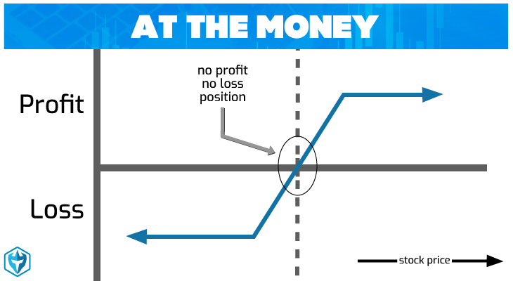

## Table of Contents

## What does 'At the Money' mean in options trading?

In options trading, 'At the Money' (ATM) refers to a situation where the strike price of an option is exactly the same as the current market price of the underlying asset. For example, if a stock is trading at $50 and you have an option with a strike price of $50, that option is considered to be at the money. This term is used for both call options and put options.

Being at the money is important because it often represents a point of balance where the option has an equal chance of ending up in-the-money or out-of-the-money at expiration. This can affect the option's premium, as at-the-money options typically have higher premiums due to their higher likelihood of becoming profitable. Traders use this information to make decisions about buying or selling options based on their predictions of future price movements.

## How is an 'At the Money' option different from 'In the Money' and 'Out of the Money' options?

An 'At the Money' (ATM) option is when the strike price of the option is the same as the current price of the stock. For example, if a stock is trading at $50 and the option's strike price is also $50, it's at the money. This means the option is right on the edge of being profitable or not, depending on which way the stock price moves next.

An 'In the Money' (ITM) option is different because it already has some value. For a call option, this happens when the stock price is above the strike price. For a put option, it's when the stock price is below the strike price. If a stock is at $50 and you have a call option with a strike price of $45, it's in the money because you could buy the stock for less than it's currently worth. An 'Out of the Money' (OTM) option has no immediate value. For a call option, this is when the stock price is below the strike price. For a put option, it's when the stock price is above the strike price. If a stock is at $50 and you have a call option with a strike price of $55, it's out of the money because the stock would need to go up for the option to become valuable.

These terms help traders understand the potential profitability of their options. At the money options are often seen as having a balanced risk and reward, while in the money options are more likely to be profitable but cost more, and out of the money options are cheaper but less likely to pay off.

## What is the significance of an 'At the Money' option in terms of the strike price and the current market price?

An 'At the Money' option is when the strike price of the option is the same as the current price of the stock. This means if you have an option to buy or sell a stock at a certain price, and that price is exactly what the stock is worth right now, then your option is at the money. For example, if a stock is trading at $50 and your option lets you buy it at $50, you're at the money.

Being at the money is important because it shows that the option is right on the edge of being worth something or not. It's like a coin toss; the stock could go up and make your option valuable, or it could go down and make it worthless. This balance affects how much people are willing to pay for the option. At the money options usually cost more than options that are out of the money because they have a better chance of becoming profitable, but they're cheaper than in the money options which already have some value.

## How does being 'At the Money' affect the premium of an option?

When an option is 'At the Money', it means the strike price is the same as the current market price of the stock. This situation affects the option's premium, which is the price you pay for the option. At the money options usually have a higher premium compared to options that are out of the money. This is because at the money options have a better chance of becoming profitable. They are right on the edge, so if the stock price moves just a little in the right direction, the option could become valuable.

However, at the money options are usually cheaper than options that are already in the money. In the money options have some value right away because you could use them to buy or sell the stock at a better price than the current market. At the money options don't have this immediate value, but they have a higher potential for gain if the stock price moves favorably. So, the premium for an at the money option is a balance between the cost of an in the money option and the lower cost of an out of the money option, reflecting the equal chance of the option becoming profitable or not.

## Can you explain the role of 'At the Money' options in option pricing models like the Black-Scholes model?

In the Black-Scholes model, which is a famous way to figure out how much an option should cost, 'At the Money' options play a big role. The model uses something called 'delta' to show how much the option's price changes when the stock price changes. For an at the money option, the delta is about 0.5 for a call option and -0.5 for a put option. This means if the stock price goes up by $1, the price of an at the money call option goes up by about $0.50, and the price of an at the money put option goes down by about $0.50. This is because at the money options are right on the edge of being valuable, so small changes in the stock price can make a big difference.

The Black-Scholes model also considers other things like how much time is left until the option expires and how much the stock price might move around (called [volatility](/wiki/volatility-trading-strategies)). For at the money options, time and volatility are really important. If there's a lot of time left before the option expires, or if the stock price is expected to move a lot, the option's price goes up. This is because there's more chance for the stock to move in a way that makes the option valuable. So, at the money options often have higher prices because they are sensitive to these factors, and the Black-Scholes model helps to figure out exactly how much these factors should affect the price.

## What are the strategic uses of 'At the Money' options for traders?

Traders often use 'At the Money' options as a way to bet on the future price movement of a stock without spending too much money. Since at the money options are cheaper than in the money options but have a better chance of becoming profitable than out of the money options, they offer a good balance of risk and reward. Traders might buy at the money call options if they think the stock price will go up, or at the money put options if they think it will go down. This way, they can make money if their guess about the stock's direction is right, without having to pay a high premium for an option that's already in the money.

Another strategic use of at the money options is for hedging. If a trader owns a stock and wants to protect against a drop in its price, they might buy at the money put options. This gives them the right to sell the stock at the current price, even if the market price falls. On the other hand, if a trader has sold a stock short and wants to protect against a rise in its price, they might buy at the money call options. This strategy can help limit potential losses while still allowing for gains if the stock moves in the expected direction.

## How do 'At the Money' options behave in terms of time decay (theta)?

'At the Money' options are affected a lot by time decay, which is also called theta. Time decay means that as the time left until the option expires gets shorter, the option's value goes down. This happens because the less time there is, the less chance there is for the stock price to move in a way that makes the option valuable. At the money options feel this effect more than in the money or out of the money options because they are right on the edge of being valuable. If the stock price doesn't move in the right direction quickly, the option's value can drop fast as it gets closer to expiring.

Traders need to think about time decay when they buy or sell at the money options. If they buy an at the money option, they want the stock price to move in their favor quickly to make up for the time decay. If they sell an at the money option, they can benefit from time decay because the option's value will go down as time passes, as long as the stock price doesn't move too much. So, time decay can be a big part of the strategy when dealing with at the money options.

## What is the impact of implied volatility on 'At the Money' options?

Implied volatility is a big deal for 'At the Money' options. It's a guess about how much a stock's price might move up or down in the future. When implied volatility goes up, it means people think the stock might move a lot, so the price of at the money options goes up too. This is because there's a bigger chance the stock will move enough to make the option valuable. On the other hand, if implied volatility goes down, it means people think the stock won't move much, so the price of at the money options goes down because there's less chance the stock will move enough to make the option worth something.

Traders pay attention to implied volatility because it can help them decide if an at the money option is a good buy or sell. If they think implied volatility is going to go up, they might buy at the money options because they expect the price to go up too. If they think implied volatility is going to go down, they might sell at the money options to take advantage of the expected drop in price. So, implied volatility is a key thing to watch when trading at the money options.

## How do 'At the Money' options influence the delta of an options contract?

When an option is 'At the Money', it means the strike price is the same as the current price of the stock. This situation has a big impact on the delta of the option. Delta is a number that shows how much the option's price will change when the stock's price changes. For an at the money option, the delta is about 0.5 for a call option and -0.5 for a put option. This means if the stock price goes up by $1, the price of an at the money call option goes up by about $0.50, and the price of an at the money put option goes down by about $0.50.

The reason at the money options have a delta of around 0.5 is because they are right on the edge of being valuable. If the stock price moves just a little in the right direction, the option could become profitable. This makes the option very sensitive to changes in the stock price, which is why the delta is higher than for out of the money options but lower than for in the money options. Traders use this information to understand how their options will react to changes in the stock price and to make decisions about buying or selling options based on their predictions of future price movements.

## What are the considerations for using 'At the Money' options in a hedging strategy?

When using 'At the Money' options for hedging, traders need to think about how much the option costs and how much the stock price might move. At the money options are cheaper than in the money options, so they can be a good choice if you want to protect your stock without spending a lot of money. But they also have a higher risk because they are right on the edge of being valuable. If the stock price doesn't move in the right direction quickly, the option might not help you much. So, you need to decide if the lower cost is worth the higher risk.

Another thing to consider is how long you want to keep the hedge in place. At the money options lose value over time, especially as they get closer to expiring. This means if you're using them to protect your stock for a long time, you might need to buy new options as the old ones lose value. You also need to think about how much the stock price might move up or down. If you expect big moves, at the money options could be a good choice because they are sensitive to these changes. But if you think the stock will stay pretty steady, they might not be the best option for hedging.

## How do market conditions affect the decision to trade 'At the Money' options?

Market conditions play a big role in deciding whether to trade 'At the Money' options. If the market is very up and down, with lots of changes in stock prices, at the money options can be a good choice. This is because they are sensitive to these changes and can become valuable quickly if the stock price moves in the right direction. Traders might buy at the money options to take advantage of these big moves, hoping to make money if their guess about the stock's direction is right.

On the other hand, if the market is calm and not moving much, at the money options might not be the best choice. In these conditions, the stock price might not move enough to make the option valuable before it expires. Traders might look at other options or different strategies that work better when the market is steady. So, understanding the current market conditions is key to deciding whether to trade at the money options.

## Can you discuss advanced trading strategies that involve 'At the Money' options, such as straddles or strangles?

A straddle is a strategy where a trader buys both an at the money call option and an at the money put option on the same stock at the same time. The idea is to make money no matter which way the stock price moves, as long as it moves a lot. If the stock price goes up a lot, the call option becomes valuable and makes money. If the stock price goes down a lot, the put option becomes valuable and makes money. Traders use straddles when they think the stock price will move a lot but they're not sure which way. The downside is that if the stock price doesn't move much, both options can lose value because of time decay, and the trader can lose money.

A strangle is similar to a straddle but uses out of the money options instead of at the money options. A trader buys an out of the money call option and an out of the money put option. The call option has a strike price a bit higher than the current stock price, and the put option has a strike price a bit lower. This strategy is cheaper than a straddle because out of the money options cost less, but it needs the stock price to move even more to be profitable. Like a straddle, a strangle can make money if the stock price moves a lot in either direction, but it's riskier because the stock has to move more to make the options valuable. Both strategies are used when traders expect big moves in the market but are unsure of the direction.

## References & Further Reading

[1]: Bergstra, J., Bardenet, R., Bengio, Y., & Kégl, B. (2011). ["Algorithms for Hyper-Parameter Optimization."](https://dl.acm.org/doi/10.5555/2986459.2986743) Advances in Neural Information Processing Systems 24.

[2]: ["Advances in Financial Machine Learning"](https://www.amazon.com/Advances-Financial-Machine-Learning-Marcos/dp/1119482089) by Marcos Lopez de Prado

[3]: ["Evidence-Based Technical Analysis: Applying the Scientific Method and Statistical Inference to Trading Signals"](https://www.amazon.com/Evidence-Based-Technical-Analysis-Scientific-Statistical/dp/0470008741) by David Aronson

[4]: ["Machine Learning for Algorithmic Trading"](https://github.com/stefan-jansen/machine-learning-for-trading) by Stefan Jansen

[5]: ["Quantitative Trading: How to Build Your Own Algorithmic Trading Business"](https://www.amazon.com/Quantitative-Trading-Build-Algorithmic-Business/dp/1119800064) by Ernest P. Chan