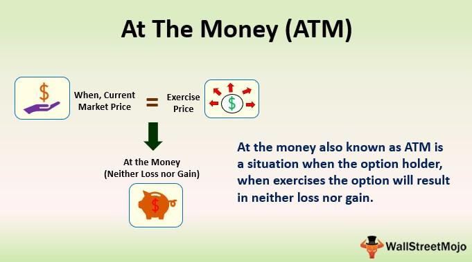

## Table of Contents

## What does 'At The Money' mean in options trading?

In options trading, 'At The Money' (ATM) refers to an option where the strike price is the same as the current market price of the underlying asset. For example, if a stock is trading at $50, an option with a strike price of $50 would be considered at the money. This term is important because it helps traders understand the potential value and risk of an option at a given time.

When an option is at the money, it has no intrinsic value, meaning the option wouldn't be worth anything if it were exercised immediately. However, it still has time value, which is the potential for the option to become profitable before it expires. Traders often look at ATM options because they can be a good balance between cost and potential profit, depending on their predictions about future market movements.

## How is an 'At The Money' option different from 'In The Money' and 'Out of The Money' options?

An 'At The Money' (ATM) option is when the strike price is the same as the current market price of the stock. For example, if a stock is at $50, an ATM option would have a strike price of $50. This kind of option has no intrinsic value because if you exercised it right away, you wouldn't gain anything. But it does have time value, which means it could become profitable if the stock price changes before the option expires.

An 'In The Money' (ITM) option is different. It has intrinsic value because exercising it would be profitable right away. If the stock is at $50, an ITM call option would have a strike price below $50, like $45. For a put option, it would be above $50, like $55. ITM options are more expensive because they already have value, but they also have a higher chance of staying profitable.

An 'Out of The Money' (OTM) option has no intrinsic value and wouldn't be profitable if exercised immediately. If the stock is at $50, an OTM call option would have a strike price above $50, like $55, and an OTM put option would have a strike price below $50, like $45. These options are cheaper to buy, but they also have a lower chance of becoming profitable because the stock price needs to move more to make them worthwhile.

## Can you explain the concept of 'At The Money' with a simple example?

Imagine you have a friend who wants to buy a toy from you. The toy costs $10, and your friend is willing to pay exactly $10 for it. Right now, the price you and your friend agree on is $10. This situation is like an 'At The Money' option in trading. In options trading, if a stock is priced at $50 and you have an option to buy or sell that stock at $50, that option is 'At The Money' because the price to buy or sell (the strike price) matches the current price of the stock.

If you decide to trade the toy right now, neither you nor your friend would make or lose money because you're trading at the exact price you agreed on. Similarly, with an 'At The Money' option, if you were to exercise it right away, you wouldn't gain or lose anything because the stock price and the strike price are the same. But, if the stock price changes before the option expires, the option could become more valuable or lose value depending on which way the stock price moves.

## What is the significance of an 'At The Money' option for a trader?

An 'At The Money' option is important for traders because it's like a middle ground. It means the option's strike price is the same as the stock's current price. This can be a sweet spot for traders because these options are cheaper than 'In The Money' options but still have a good chance of becoming profitable if the stock price moves in the right direction. Traders often use 'At The Money' options when they think the stock will move a lot but aren't sure which way it will go.

The other big thing about 'At The Money' options is that they have what's called 'time value.' This means that even though they wouldn't be worth anything if you used them right away, they could become valuable before they expire. Traders might buy 'At The Money' options if they think the stock will make a big move soon. They're betting on the stock's future movement, not its current price. So, 'At The Money' options can be a good choice for traders looking to balance cost and potential profit.

## How does the price of an 'At The Money' option compare to its intrinsic value?

An 'At The Money' option has no intrinsic value. Intrinsic value is what you'd get if you used the option right away. If a stock is at $50 and your option lets you buy or sell at $50, you wouldn't make any money by using it right now. So, the intrinsic value is zero.

But, even though it has no intrinsic value, an 'At The Money' option still has a price. This price comes from something called 'time value.' Time value is the chance that the option could become worth something before it expires. If you think the stock might move a lot soon, you might pay for an 'At The Money' option because it could become valuable if the stock price changes. So, while an 'At The Money' option has no intrinsic value, it can still cost money because of its time value.

## What factors influence the decision to buy or sell an 'At The Money' option?

When deciding whether to buy or sell an 'At The Money' option, traders look at several things. One big thing is how much they think the stock price will move before the option expires. If they think the stock will move a lot, buying an 'At The Money' option could be a good choice because it's cheaper than an 'In The Money' option but still has a good chance of becoming profitable. Traders also consider how long they have until the option expires. The more time left, the more time value the option has, which means it could be worth more if the stock price moves the right way.

Another [factor](/wiki/factor-investing) is how much risk the trader is willing to take. 'At The Money' options are a bit riskier than 'In The Money' options because they need the stock price to move to be profitable. But they're also less risky than 'Out of The Money' options because they don't need as big a move. Traders also think about how much they're willing to pay for the option. 'At The Money' options are cheaper than 'In The Money' options but more expensive than 'Out of The Money' options, so it's a balance between cost and potential profit.

## How does the time to expiration affect the value of an 'At The Money' option?

The time to expiration is really important for the value of an 'At The Money' option. When an option has a lot of time left before it expires, it's worth more because there's more time for the stock price to move and make the option profitable. This extra time is called time value. So, if you have an 'At The Money' option with a long time until it expires, you might pay more for it because it has a bigger chance of becoming valuable.

As the time to expiration gets shorter, the value of an 'At The Money' option goes down. This is because there's less time for the stock price to move in a way that makes the option profitable. If the option is about to expire and the stock price hasn't moved much, the option's time value drops a lot. Traders need to think about this when they're deciding whether to buy or sell 'At The Money' options, because the time left can make a big difference in what they might gain or lose.

## What are the risks associated with trading 'At The Money' options?

Trading 'At The Money' options can be risky because they have no intrinsic value. This means if you use the option right away, you won't make any money. The value of an 'At The Money' option comes from the chance that the stock price will move in the right direction before the option expires. If the stock price doesn't move much, the option could lose all its value. So, if you're wrong about how the stock will move, you could lose all the money you spent on the option.

Another risk is that 'At The Money' options lose value as time goes on. This is called time decay. The closer the option gets to expiring, the less time value it has. If you're holding an 'At The Money' option and the stock price doesn't move in your favor quickly enough, the option can become worthless even if the stock price eventually goes the right way. So, timing is really important when trading these options, and if you get it wrong, you could lose your investment.

## How do implied volatility changes impact 'At The Money' options?

Implied [volatility](/wiki/volatility-trading-strategies) is a big deal when it comes to 'At The Money' options. It's like a guess about how much a stock's price might move in the future. When implied volatility goes up, it means people think the stock price could move a lot, so 'At The Money' options become more expensive. That's because there's a bigger chance the stock price will move enough to make the option profitable. So, if you're thinking about buying an 'At The Money' option and implied volatility goes up, you might have to pay more for it.

On the other hand, if implied volatility goes down, it means people think the stock price won't move as much. This makes 'At The Money' options cheaper because there's less chance they'll become profitable. If you already own an 'At The Money' option and implied volatility drops, the value of your option could go down even if the stock price stays the same. So, changes in implied volatility can really shake things up for traders dealing with 'At The Money' options.

## What strategies can be employed using 'At The Money' options?

One strategy using 'At The Money' options is called a straddle. This is when you buy both a call and a put option with the same strike price and expiration date. You do this when you think the stock price will move a lot but you're not sure which way. If the stock price goes up a lot, the call option becomes profitable. If it goes down a lot, the put option makes money. It's like betting on big movement without [picking](/wiki/asset-class-picking) a direction.

Another strategy is called a strangle. This is similar to a straddle, but instead of buying options at the same strike price, you buy an 'At The Money' call option and an 'At The Money' put option with different strike prices. The call option has a strike price a bit higher than the current stock price, and the put option has a strike price a bit lower. This strategy is cheaper than a straddle but needs a bigger move in the stock price to be profitable. It's another way to bet on big movement without picking a direction.

A third strategy is using 'At The Money' options for hedging. If you own a stock and you're worried it might go down, you can buy an 'At The Money' put option. This gives you the right to sell the stock at the current price, which can protect you if the stock price falls. It's like buying insurance for your stock. This way, you can keep your stock but limit how much you could lose if things go wrong.

## How can 'At The Money' options be used in hedging strategies?

'At The Money' options can be used in hedging strategies to protect against potential losses in a stock you own. If you have a stock and you're worried it might go down in price, you can buy an 'At The Money' put option. This put option gives you the right to sell your stock at the current price, even if the stock price drops. It's like buying insurance for your stock. By doing this, you can keep your stock but limit how much you could lose if the stock price goes down.

For example, if you own a stock that's currently worth $50 and you're worried it might drop, you could buy an 'At The Money' put option with a strike price of $50. If the stock price falls to $40, you can use your put option to sell the stock at $50, saving you from losing as much money. This way, you're protected against a big drop in the stock's value. It's a smart way to manage risk while still holding onto your stock, hoping it will go up in the future.

## What advanced analytics or models are used to price 'At The Money' options accurately?

To price 'At The Money' options accurately, traders often use the Black-Scholes model. This model looks at things like the stock's current price, the option's strike price, how long the option has until it expires, the risk-free [interest rate](/wiki/interest-rate-trading-strategies), and the stock's expected volatility. The Black-Scholes model helps figure out how much an 'At The Money' option should cost based on these factors. Since 'At The Money' options have no intrinsic value, their price comes mostly from their time value, which this model can help calculate.

Another model that traders use is the Binomial Option Pricing Model. This model breaks down the time until the option expires into smaller steps and looks at how the stock price might move at each step. It's like playing out different scenarios to see what the option might be worth at the end. The Binomial Model is good for 'At The Money' options because it can handle changes in volatility and other factors over time, which can affect the option's price. Both models help traders make better guesses about how much an 'At The Money' option should cost, which is important for buying and selling them.

## References & Further Reading

[1]: Hull, J. C. (2017). ["Options, Futures, and Other Derivatives."](https://www.semanticscholar.org/paper/Options%2C-Futures%2C-and-Other-Derivatives-Hull/89bdee500c8623864fc9eb7a471546aa713acc44) Pearson.

[2]: Lopez de Prado, M. (2018). ["Advances in Financial Machine Learning."](https://www.amazon.com/Advances-Financial-Machine-Learning-Marcos/dp/1119482089) Wiley.

[3]: Jansen, S. (2018). ["Machine Learning for Algorithmic Trading."](https://github.com/stefan-jansen/machine-learning-for-trading) Packt Publishing.

[4]: Chan, E. P. (2008). ["Quantitative Trading: How to Build Your Own Algorithmic Trading Business."](https://github.com/ftvision/quant_trading_echan_book) Wiley.

[5]: Aronson, D. R. (2006). ["Evidence-Based Technical Analysis: Applying the Scientific Method and Statistical Inference to Trading Signals."](https://www.amazon.com/Evidence-Based-Technical-Analysis-Scientific-Statistical/dp/0470008741) Wiley.