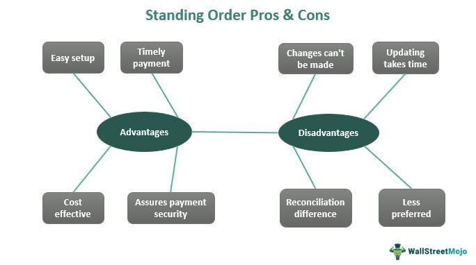

Stock market trading strategies have evolved significantly, encompassing a wide range of order types that cater to different trading objectives and risk appetites. Understanding these order types is crucial for traders seeking to optimize their trading outcomes. Common order types include market orders, which enable immediate execution at the current market price, limit orders, which set a predetermined price for buying or selling, and stop orders, which trigger a trade once a specific price is reached. Each order type comes with its own set of advantages and limitations, making the choice of order type a critical component of effective trading strategies.

In modern financial markets, algorithmic trading has gained prominence for its ability to execute trades with high precision and speed. Algorithms, driven by mathematical models and statistical analyses, can process large volumes of data to make informed trading decisions automatically. This reduces the impact of human emotions and errors, providing a systematic approach to trading. Algorithmic trading employs various strategies, including arbitrage, trend following, and mean reversion, to achieve desired trading outcomes efficiently.

Among the different order types, the 'at-the-opening order' holds particular relevance. An at-the-opening order is designed to buy or sell a security at the market's open. It ensures that the order is executed at the beginning of the trading session, capitalizing on opportunities that arise from overnight news or pre-market developments. These orders are particularly useful in volatile markets, where significant price movements can occur right at the opening bell.

Incorporating at-the-opening orders into trading strategies can be advantageous for traders seeking to seize opportunities presented by market openings. By using this order type, investors can position themselves to benefit from the day's initial price actions, which can be influenced by earnings announcements, geopolitical events, and other market-moving news released after the previous day's close.

## Table of Contents

## Understanding Stock Market Orders

Stock market orders are the cornerstone of trading, offering distinct methods to transact financial securities. Each order type serves a particular purpose and can significantly affect the outcome of a trading strategy. Understanding the differences and applications of these orders is crucial for traders aiming for successful market participation.

**Market Orders**

A market order is an instruction to buy or sell a security immediately at the best available current price. They guarantee execution but not the price. As the simplest type of order, market orders are often used when immediate execution is a priority over price control. Traders typically use market orders when they need to enter or [exit](/wiki/exit-strategy) a position quickly, particularly in highly liquid stocks where price movements are generally minimal between the initiation and execution of the order.

**Limit Orders**

Limit orders specify the maximum price at which a trader is willing to buy a security or the minimum price at which they are willing to sell it. Unlike market orders, limit orders do not guarantee execution. Instead, they are executed only when the market price meets the specified limit price. This feature makes limit orders a vital tool for traders who prioritize price control over the speed of execution. For instance, a trader looking to buy shares of a company might set a limit order slightly below the current market price to exploit potential market dips, thus achieving a lower acquisition cost.

**Stop Orders**

Stop orders, also known as stop-loss orders, are designed to limit an investor's loss on a security position. A stop order becomes a market order once the security hits a specified stop price. When the stop price is reached, a sell stop order triggers the sale of the stock, minimizing further loss from a position that is moving unfavorably for the trader. Conversely, a buy stop order can be used to enter a position when a stock rallies above a certain price, potentially capitalizing on upward [momentum](/wiki/momentum).

**Using Orders in Trading Strategies**

Different trading strategies leverage these orders based on the trader’s objectives. For instance, a [scalping](/wiki/gamma-scalping) strategy, which involves making numerous trades within a day for small profits, might heavily utilize market orders due to the necessity for rapid execution. On the other hand, value investing strategies, where investors aim for long-term gains from undervalued stocks, might rely more on limit orders to ensure purchase at a favorable price.

Choosing the correct order type is pivotal in aligning with a trader's strategic goals. Factors such as market [volatility](/wiki/volatility-trading-strategies), [liquidity](/wiki/liquidity-risk-premium), and specific trading goals must be considered to achieve optimal results. Market orders are appropriate in conditions of high liquidity and low bid-ask spreads, where swift execution is crucial. Limit orders, however, might be more suitable in volatile markets, allowing traders to enter or exit positions at defined price levels, thereby managing the risk of unfavorable price movements.

In summary, mastering the use of different stock market orders enhances a trader's ability to craft strategies that precisely match their financial goals and risk tolerance. By wisely selecting the appropriate order type based on market conditions and individual strategy, traders can significantly improve their chances of success in the financial markets.

 to At-the-Opening Orders

At-the-opening orders are a specific type of stock market order designed to be executed precisely at the market open. These orders are submitted before the opening bell and are queued for execution at the first available trade price when trading officially begins. They play a crucial role for traders who aim to take advantage of the price movements that typically occur at the market open, due to the influx of new information released during non-market hours.

One of the unique characteristics of at-the-opening orders is their time-sensitive nature. Unlike regular market orders that can be placed and executed throughout the trading day, at-the-opening orders are exclusively designed to be executed during the initial moments of trading. If these orders are not executed at the open, they are typically canceled. This characteristic makes them particularly useful for traders who wish to establish positions based on overnight developments or pre-market trends.

Traders use at-the-opening orders in scenarios where they expect significant price movements at the start of the trading day. These situations often arise following major news events, earnings announcements, or geopolitical developments that occur after the previous market close. By executing orders as soon as the market opens, traders can capitalize on the initial revaluation of asset prices that reflects the new information.

For instance, a trader expecting a stock to surge due to positive earnings results released after market hours might use an at-the-opening order to secure shares as the market reacts to the news. Similarly, in a volatile market environment where early-day price swings are anticipated, these orders allow traders to position themselves to harness these rapid changes.

Scenarios where at-the-opening orders can be beneficial include the aftermath of significant economic data releases, legislative changes affecting specific sectors, or sudden industry-specific developments like technological breakthroughs or regulatory adjustments. Traders who need to adjust their portfolios swiftly to such events often rely on at-the-opening orders to ensure timely execution as the market responds.

## Algorithmic Trading Strategies

Algorithmic trading has become a cornerstone in modern financial markets, significantly influencing the dynamics of stock trading. This method leverages computer programs and algorithms to execute trades at high speeds and volumes, often more efficiently than human traders can. Algorithmic trading is particularly beneficial in executing complex trading strategies, reducing manual errors, and optimizing trade execution timing.

### Overview of Algorithmic Trading

Algorithmic trading utilizes a set of rules, defined by computational algorithms, to make trading decisions in financial markets. These algorithms can analyze numerous market variables, such as stock prices, trading [volume](/wiki/volume-trading-strategy), and historical data, allowing traders to exploit market inefficiencies or capitalize on predefined trading opportunities. The growing sophistication of technology and increased access to data have propelled the popularity and applicability of [algorithmic trading](/wiki/algorithmic-trading) across different sectors of the stock market.

Algorithmic trading strategies can be classified into various types based on their underlying principles and goals, including market-making, statistical [arbitrage](/wiki/arbitrage), trend-following, and mean reversion. Each type of strategy utilizes algorithms to make data-driven decisions that aim to optimize trading performance.

### Incorporating At-the-Opening Orders

One particular aspect of algorithmic trading involves specific order types, such as at-the-opening orders. These orders are designed to be executed at the market's open, taking advantage of the volatility and liquidity typically present during this time. At-the-opening orders can be incorporated into several algorithmic trading strategies, such as [day trading](/wiki/day-trading-spy) and momentum trading. 

For instance, a momentum-based algorithm might use historical data and pre-market indicators to predict opening price movements. The algorithm can then place at-the-opening orders to enter or exit positions when the market opens, potentially capitalizing on anticipated price swings. Similarly, in day trading, traders may rely on algorithms to identify stocks with significant pre-market activity, placing at-the-opening orders to capitalize on expected opening bell volatility.

### Benefits of Using Algorithmic Trading with At-the-Opening Orders

Incorporating at-the-opening orders within algorithmic trading strategies offers several benefits:

1. **Speed and Precision**: Algorithms can evaluate large datasets in real-time and execute trades instantaneously at the market open, reducing latency and improving execution speed.

2. **Reduced Emotional Bias**: Automated execution through algorithms eliminates human emotional biases, leading to more consistent and objective trading behavior.

3. **Enhanced Market Analysis**: Algorithms can incorporate a wide array of market signals and data points, providing a more comprehensive analysis for placing at-the-opening orders.

4. **Execution of Complex Strategies**: Algorithms can handle intricate trading strategies that involve multiple parameters, like stop-loss and take-profit levels, and adjust dynamically based on market conditions as soon as the market opens.

5. **Scalability**: Algorithmic trading allows for the scalability of trading operations, enabling traders to manage and execute a large number of trades simultaneously as the market opens.

Overall, the integration of at-the-opening orders into algorithmic trading strategies enhances the ability of traders to exploit early market movements, increasing their potential for gains while managing their risk exposure effectively. As technology advances and market complexity increases, the reliance on algorithmic trading strategies is expected to grow, with at-the-opening orders playing a crucial role in traders' toolkits.

## Advantages and Disadvantages of At-the-Opening Orders

At-the-opening orders are a distinct type of stock market order utilized by traders to partake in transactions at the precise moment the market opens. This order type offers unique advantages and poses certain risks and challenges that traders need to consider.

### Advantages of At-the-Opening Orders

1. **Precision in Execution**: At-the-opening orders are designed to be executed at the first available price when the market opens. This precision allows traders to capitalize on specific opening price points that they anticipate will be beneficial based on their analysis. For instance, if news likely to impact a stock becomes public after the market closes, traders can strategically place at-the-opening orders to capitalize on potential price shifts at the start of the next trading day.

2. **Market Entry Point Control**: By ensuring participation in the market as soon as it opens, traders can strategically position themselves to benefit from overnight news or global economic developments that could impact stock prices. This is particularly advantageous in a volatile market, where early morning price movements can be significant.

3. **Time Efficiency**: At-the-opening orders enable traders to place orders with the assurance that they will execute immediately at market open, thereby allowing them to pursue other activities without having to monitor the market continuously from the opening bell.

### Disadvantages of At-the-Opening Orders

1. **Higher Volatility Risk**: The market open is often characterized by heightened volatility as traders react to news and overnight developments. This can lead to substantial price swings, which may result in at-the-opening orders being executed at unfavorably low or high prices compared to expectations.

2. **Missed Opportunities**: Since at-the-opening orders are executed without considering intraday price changes, traders using this order type may miss out on better prices that could emerge later in the trading session. For example, if a stock price falls post-opening, traders who executed at-the-opening orders may not benefit from buying at this lower price.

### Strategies to Mitigate Risks

1. **Thorough Pre-market Analysis**: To mitigate risks associated with at-the-opening orders, traders should conduct comprehensive research and analysis before placing their orders. This includes assessing overnight news, global market trends, and any relevant economic indicators that might influence stock prices at the open.

2. **Combining with Limit Orders**: Traders can set at-the-opening orders alongside limit orders to define a maximum acceptable price for buying or a minimum price for selling. This strategy can help prevent trades from executing at extreme prices due to volatility.

3. **Algorithmic Trading Integration**: Incorporating algorithmic trading technology can enhance the precision and efficiency of executing at-the-opening orders. Algorithms can rapidly analyze pre-market data and adjust order parameters dynamically, balancing speed with price accuracy.

In conclusion, while at-the-opening orders provide valuable benefits in terms of execution precision and strategic market entry, they also require careful consideration of potential risks and prudent management strategies. By leveraging analytical tools and vigilant market research, traders can enhance the effectiveness of this order type within their broader trading strategies.

## Implementing At-the-Opening Orders in Trading Strategies

Implementing at-the-opening orders in trading strategies requires a methodical approach to ensure optimal results and risk management. These orders, executed at the market's opening, are designed to capitalize on overnight developments and pre-market activities, allowing traders to leverage the initial market momentum. The following provides a step-by-step guide on how to implement them effectively, along with considerations and real-world examples.

### Step-by-Step Guide

1. **Market Analysis and Preparation**  
   Before placing at-the-opening orders, perform a comprehensive analysis of market conditions. This includes evaluating pre-market news, overnight market developments, and global financial events that might influence the opening price.

2. **Define Trading Objectives**  
   Clearly articulate the goals of using at-the-opening orders. These objectives might include entering a position swiftly to capitalize on early price movements or exiting a position to minimize losses due to expected adverse opening trends.

3. **Order Placement Strategy**  
   Determine the number of shares or contracts to trade based on risk tolerance and portfolio size. For an automated approach, consider using trading platforms that allow for pre-market order entry. Ensure that the system can handle the specified order type effectively.

4. **Risk Management Techniques**  
   Incorporate risk management strategies to protect against adverse price movements. This may involve setting pre-defined stop losses or utilizing options as a hedge.

5. **Monitor Market Volatility**  
   Assess historical volatility and expected market movements at the opening to adjust the order parameters accordingly. High volatility might necessitate wider price thresholds or reduced order sizes.

6. **Execution and Evaluation**  
   After order execution, evaluate the trade's outcome against defined objectives. Document the performance and any insights gained for future strategy refinement.

### Considerations for Traders

- **Market Conditions**: Understand that at-the-opening orders are subject to increased volatility and unpredictability. This requires a robust analysis and adaptation strategy.

- **Transaction Costs**: Be aware that frequent use of at-the-opening orders can lead to higher transaction costs due to potential price slippage and brokerage fees.

- **Tools and Platforms**: Choose a reliable trading platform that provides necessary tools for order entry and management, ensuring it supports automated trading for swift execution at market open.

### Real-World Examples

1. **Earnings Announcements**: A trader anticipates a favorable earnings report for a particular stock released after market hours. By using an at-the-opening order, the trader can swiftly capitalize on the positive sentiment expected at the market open.

2. **Global Economic News**: Following significant overnight economic events, such as changes in interest rates or geopolitical developments, a trader might leverage at-the-opening orders to adjust positions according to expected market reactions.

3. **Technical Strategy Integration**: Implementing a technical strategy that historically performs well during the first 30 minutes of trading can involve placing at-the-opening orders to maximize the profits from anticipated patterns.

Through careful consideration and strategic implementation, at-the-opening orders can be a potent tool in a trader's arsenal. Understanding the nuances of this order type allows traders to harness significant advantages while mitigating associated risks.

## Conclusion and Best Practices

In conclusion, stock market orders play a crucial role in trading strategies. Understanding the different types, such as market orders, limit orders, stop orders, and at-the-opening orders, allows traders to execute their strategies effectively. At-the-opening orders, in particular, have distinctive features that make them appealing to certain types of traders. They are executed at the market's opening price, allowing traders to take advantage of the volatility and price movements that typically occur when the market opens. This type of order can be beneficial for traders looking to establish positions based on overnight news or pre-market indicators.

Best practices for using at-the-opening orders involve careful planning and strategy alignment. Traders should assess their risk tolerance and market conditions before using at-the-opening orders, as they can result in higher volatility and unexpected price swings. Utilizing algorithmic trading can enhance the precision and speed of executing at-the-opening orders. By programming algorithms to assess pre-market conditions and automatically place orders at the opening, traders can reduce human error and capitalize on strategic opportunities.

Looking forward, algorithmic trading is expected to continue expanding. Advances in [machine learning](/wiki/machine-learning) and [artificial intelligence](/wiki/ai-artificial-intelligence) will likely lead to more sophisticated algorithms capable of making complex trading decisions based on large datasets and predictive analytics. Consequently, the use of at-the-opening orders in algorithmic strategies is likely to evolve, possibly integrating more real-time data analysis to refine their execution and efficiency. As technology progresses, traders employing at-the-opening orders will need to adapt by continually refining their algorithms and staying attuned to technological advances in the financial markets.

## Additional Resources

### Additional Resources

#### Books and Articles for Further Learning

1. **"Algorithmic Trading: Winning Strategies and Their Rationale" by Ernest P. Chan**  
   This book provides an insightful exploration into the mechanics of algorithmic trading, offering guidelines on forming strategies, understanding risks, and implementing them effectively in real-world trading.

2. **"Quantitative Trading: How to Build Your Own Algorithmic Trading Business" by Ernie Chan**  
   A comprehensive guide for those interested in building their own algorithmic trading systems. Chan investigates into the nuts and bolts of strategy development, [backtesting](/wiki/backtesting), risk management, and implementation.

3. **"Market Microstructure in Practice" by Laruelle S., et al.**  
   This article offers a foundational understanding of market microstructure, focusing particularly on how algorithmic trading operates within financial markets. It explains the dynamics at an intraday scale, providing valuable insights for traders using at-the-opening orders.

4. **Online Article: "Understanding Order Types and How They Work" - Investopedia**  
   An educational article that breaks down the complexity of various stock market order types, including at-the-opening orders, offering readers a practical guide to improve their trading decisions.

#### Trading Platforms and Simulation Tools

1. **Interactive Brokers**  
   [Interactive Brokers](/wiki/interactive-brokers-api) provides a comprehensive trading platform that supports advanced order types, including at-the-opening orders. They also offer tools for algorithmic trading strategy development and backtesting.

2. **Thinkorswim by TD Ameritrade**  
   Thinkorswim is a robust trading platform known for its powerful charting capabilities, numerous indicators, and support for different order types. It includes a paper trading feature for simulation.

3. **TradingView**  
   Known for its advanced charting tools, TradingView allows users to simulate trades and backtest their strategies. The community-driven platform also provides real-time market data and social sharing features for collaborative insights.

4. **QuantConnect**  
   A platform dedicated to algorithmic trading, QuantConnect offers backtesting, strategy development, and live trading capabilities using Python. It's ideal for traders looking to develop intricate algorithmic strategies, including those involving at-the-opening orders.

#### Trader Communities and Forums

1. **Elite Trader**  
   Elite Trader is a well-established forum where traders from varying levels of expertise discuss strategies, market trends, and trading tips. It serves as a valuable resource for learning and networking with other traders.

2. **Traders Laboratory**  
   An active forum that provides a platform for traders to share insights, discuss strategies, and learn from each other's experiences. It covers a wide range of topics, including algorithmic and systematic trading methods.

3. **Reddit – r/algotrading**  
   A subreddit dedicated to algorithmic trading, r/algotrading is a vibrant community where members discuss everything from strategy development to coding and market analysis.

By exploring these resources, traders can deepen their understanding of trading strategies, specifically those involving at-the-opening orders, and refine their approach to the financial markets.

## References & Further Reading

[1]: Chan, E. (2009). ["Quantitative Trading: How to Build Your Own Algorithmic Trading Business."](https://github.com/ftvision/quant_trading_echan_book) John Wiley & Sons.

[2]: Chan, E. (2008). ["Algorithmic Trading: Winning Strategies and Their Rationale."](https://github.com/ftvision/quant_trading_echan_book) Wiley.

[3]: Investopedia. ["Understanding Order Types and How They Work."](https://www.investopedia.com/trading-order-types-and-processes-4689649)

[4]: Laruelle, S., Lehéricy, Y., & Rosenbaum, M. (2017). ["Market Microstructure in Practice"](https://books.google.com/books/about/Market_Microstructure_In_Practice.html?id=Y0i7CgAAQBAJ) World Scientific.

[5]: Jansen, S. (2020). ["Machine Learning for Algorithmic Trading."](https://github.com/stefan-jansen/machine-learning-for-trading) Packt Publishing.