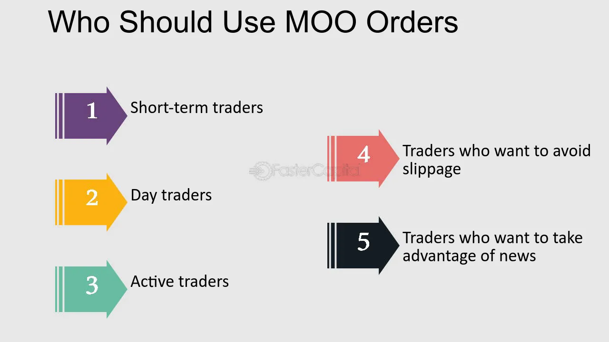

## Table of Contents

## What is an At-The-Opening Order?

An At-The-Opening Order is a type of stock market order that investors use to buy or sell a stock at the opening price of the trading day. When you place this order, it tells the stock exchange to execute the trade as soon as the market opens. This can be useful if you want to take advantage of any news or events that happened after the market closed the previous day, which might affect the stock's opening price.

For example, if a company announces good news after the market closes, its stock might open higher the next day. By using an At-The-Opening Order, you can try to buy the stock at that higher opening price. However, there's a risk involved because the opening price can be different from what you expect. If the order cannot be filled at the opening, it is usually canceled, unless you specify otherwise.

## How does an At-The-Opening Order differ from other types of orders?

An At-The-Opening Order is different from other types of orders because it is specifically designed to be executed at the very start of the trading day. When you place an At-The-Opening Order, you're telling the stock exchange to buy or sell your stock at the opening price, which is the first price set for the day. This is useful if you want to react quickly to news or events that happened after the market closed the previous day. If the order can't be filled at the opening, it is usually canceled unless you say otherwise.

Other common types of orders include Market Orders, Limit Orders, and Stop Orders. A Market Order is executed at the best available price as soon as possible, which might not be at the opening. A Limit Order lets you set a specific price at which you want to buy or sell, and it can be executed at any time during the trading day, not just at the opening. A Stop Order becomes active only when the stock reaches a certain price, which can also happen at any time during the day. Each of these orders serves different purposes and is used based on what the investor wants to achieve.

## What are the main purposes of using an At-The-Opening Order?

One main purpose of using an At-The-Opening Order is to quickly react to news or events that happen after the market closes. If a company announces something important after the market is closed, it can affect the stock's price when the market opens the next day. By using an At-The-Opening Order, you can buy or sell the stock right at the start of the trading day, trying to take advantage of the new price.

Another purpose is to reduce the risk of price changes during the trading day. The stock market can be unpredictable, and prices can go up and down a lot. By placing an At-The-Opening Order, you make sure your trade happens at the opening price, which can be more predictable than waiting until later in the day. This can be helpful if you want to avoid the ups and downs that might happen as the day goes on.

## Can you explain the process of placing an At-The-Opening Order?

To place an At-The-Opening Order, you need to use a trading platform or contact your broker. When you're ready to make the order, you'll tell them you want to buy or sell a certain stock, and you'll specify that you want it to happen at the opening of the market. You'll need to say how many shares you want to trade and whether you're buying or selling. Once you've given all this information, your broker or the trading platform will send the order to the stock exchange.

The stock exchange will then try to execute your order right when the market opens. The opening price is set based on all the orders that come in before the market opens. If there are enough buyers and sellers at the opening, your order will be filled at that price. If there aren't enough people on the other side of your trade, your order might not get filled and could be canceled. It's important to understand that the opening price can be different from what you expect, so there's always some risk involved.

## What are the potential risks associated with At-The-Opening Orders?

One risk with At-The-Opening Orders is that the opening price might not be what you expect. News or events that happen after the market closes can make the stock price go up or down a lot when the market opens. If you're trying to buy or sell based on this news, the price might not be what you thought it would be, and you might end up with a worse deal than you wanted.

Another risk is that your order might not get filled at all. If there aren't enough people wanting to buy or sell the stock at the opening price, your order could be canceled. This can be frustrating if you were counting on the trade happening right at the start of the day. It's important to be ready for this possibility and have a backup plan.

## How can an At-The-Opening Order impact the opening price of a stock?

An At-The-Opening Order can impact the opening price of a stock because it adds to the total number of buy or sell orders that are waiting to be filled when the market opens. If a lot of people place At-The-Opening Orders to buy a stock, it can push the opening price higher because there's more demand for the stock. On the other hand, if many people want to sell a stock at the opening, it can push the price lower because there's more supply.

This impact is part of how the opening price is set. The stock exchange looks at all the orders that come in before the market opens and tries to find a price that will let as many orders as possible be filled. If there are a lot of At-The-Opening Orders, they can really affect what that price ends up being. So, these orders can help decide where the stock starts trading at the beginning of the day.

## Are there specific markets or exchanges where At-The-Opening Orders are more commonly used?

At-The-Opening Orders are commonly used in the major stock exchanges like the New York Stock Exchange (NYSE) and the NASDAQ. These exchanges have a lot of trading happening every day, and investors often want to make quick decisions based on news or events that happen after the market closes. Using an At-The-Opening Order can help them buy or sell stocks right at the start of the trading day, which can be important in these busy markets.

In addition to the NYSE and NASDAQ, At-The-Opening Orders are also used in other markets where stocks are traded, like the Toronto Stock Exchange in Canada or the London Stock Exchange in the UK. Any market that has a clear opening time for trading can see these types of orders being used. They are especially helpful in markets where a lot of trading happens and where the opening price can be affected by news or events from the previous day.

## What strategies can traders employ with At-The-Opening Orders to maximize their benefits?

Traders can use At-The-Opening Orders to quickly react to news or events that happen after the market closes. If a company announces something good, like better profits or a new product, its stock might go up when the market opens. By placing an At-The-Opening Order, a trader can buy the stock right at the start of the day, hoping to get it at a good price before it goes up even more. This strategy is useful if you think the news will make the stock more popular and you want to be one of the first to buy it.

Another strategy is to use At-The-Opening Orders to reduce the risk of price changes during the day. The stock market can be unpredictable, with prices going up and down a lot. By placing an order to buy or sell at the opening, traders can avoid some of this uncertainty. They know exactly what price they will get, which can be important if they want to make sure they buy or sell at a certain price. This can help them plan their trades better and feel more in control of what happens to their money.

## How do market conditions affect the execution of At-The-Opening Orders?

Market conditions can really change how well At-The-Opening Orders work. If the market is busy with a lot of people wanting to buy or sell, it can affect the opening price. If many people want to buy a stock at the opening because of good news, the price might go up a lot. This means your At-The-Opening Order to buy might get filled at a higher price than you thought. On the other hand, if everyone wants to sell, the price might go down, and your order to sell could get a lower price than you hoped.

Sometimes, the market can be less busy, and there might not be enough people wanting to buy or sell to fill all the At-The-Opening Orders. If this happens, your order might not get filled at all and could be canceled. This can be frustrating if you were counting on the trade happening right at the start of the day. So, it's important to think about what the market might be like when you place your At-The-Opening Order, because it can make a big difference in whether your order works out the way you want.

## What are the regulatory considerations for using At-The-Opening Orders?

When you use At-The-Opening Orders, you need to know about the rules that the stock market follows. The main rule is that all orders, including At-The-Opening Orders, must be handled fairly. This means that the stock exchange has to make sure everyone's orders are treated the same way. They can't favor one person's order over another. Also, the stock exchange has to be clear about how they set the opening price. They have to explain how they use all the orders to find the best price for everyone.

Another thing to think about is that some markets have special rules about what you can do with At-The-Opening Orders. For example, some markets might say you can't cancel your order once you've placed it, or they might have rules about how long your order stays good for if it doesn't get filled right away. It's important to read the rules of the market you're trading in so you know what you can and can't do with your orders. This helps make sure you're following the rules and that your trading goes smoothly.

## Can you discuss any historical examples where At-The-Opening Orders significantly influenced market movements?

One famous example of At-The-Opening Orders affecting the market was on October 19, 1987, known as Black Monday. Many investors placed At-The-Opening Orders to sell their stocks because they were worried about the market falling. When the market opened, there were so many sell orders that the stock prices dropped a lot right away. The Dow Jones Industrial Average fell by more than 22% in one day, which was the biggest one-day drop in its history at that time. The rush of At-The-Opening Orders to sell made the opening prices much lower than people expected, causing a big panic in the market.

Another example happened on August 24, 2015, when the market was already feeling nervous about the economy in China. Many investors placed At-The-Opening Orders to sell their stocks, hoping to get out before things got worse. When the market opened, the huge number of sell orders caused the opening prices to drop a lot. The Dow Jones Industrial Average fell by almost 1,000 points in the first few minutes of trading. This showed how At-The-Opening Orders can make the market move a lot if a lot of people are trying to do the same thing at the same time.

## What advanced techniques can expert traders use to optimize the use of At-The-Opening Orders?

Expert traders can use a technique called "order slicing" to optimize their At-The-Opening Orders. This means they split their big order into smaller pieces and place them at different times before the market opens. By doing this, they can help make sure their order gets filled without making the opening price go up or down too much. It's like trying to fill a bucket slowly so it doesn't overflow. This can be really helpful if you're trading a lot of shares and want to avoid making a big splash in the market right at the opening.

Another technique is using "[algorithmic trading](/wiki/algorithmic-trading)" to place At-The-Opening Orders. This means using computer programs to decide when and how to place the orders based on a lot of data and math. The computer can look at what's happening in the market and figure out the best way to place the order to get the best price. This can be really useful because it takes away some of the guesswork and can help traders make better decisions. By using these advanced techniques, expert traders can get more out of their At-The-Opening Orders and do better in the market.

## References & Further Reading

[1]: Chan, E. (2009). ["Quantitative Trading: How to Build Your Own Algorithmic Trading Business."](https://github.com/ftvision/quant_trading_echan_book) John Wiley & Sons.

[2]: Chan, E. (2008). ["Algorithmic Trading: Winning Strategies and Their Rationale."](https://github.com/ftvision/quant_trading_echan_book) Wiley.

[3]: Investopedia. ["Understanding Order Types and How They Work."](https://www.investopedia.com/trading-order-types-and-processes-4689649)

[4]: Laruelle, S., Lehéricy, Y., & Rosenbaum, M. (2017). ["Market Microstructure in Practice"](https://books.google.com/books/about/Market_Microstructure_In_Practice.html?id=Y0i7CgAAQBAJ) World Scientific.

[5]: Jansen, S. (2020). ["Machine Learning for Algorithmic Trading."](https://github.com/stefan-jansen/machine-learning-for-trading) Packt Publishing.