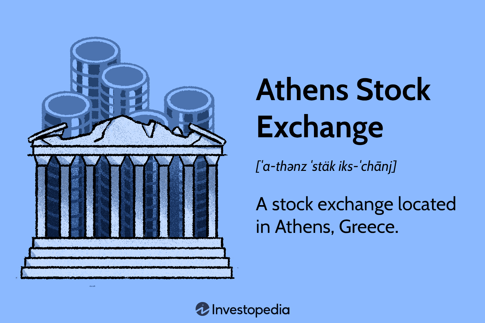

The Athens Stock Exchange (ATHEX) serves as a central pillar of Greece's financial system, providing a vital platform for securities trading and contributing to the nation's economic development. Established as a key institution, the ATHEX facilitates the raising of capital by connecting investors with companies, thereby stimulating economic growth and innovation within Greece. This article examines the historical journey and transformation of the Athens Stock Exchange, highlighting how it has adapted to the changing landscapes of global financial markets.

Since its inception, the ATHEX has continually evolved, incorporating modern trading technologies and practices to enhance its competitiveness. Notably, the advent of algorithmic trading has revolutionized its operations, allowing for faster and more efficient trade executions. This shift towards technology-driven trading reflects broader trends in global financial markets, where automation and sophisticated algorithms optimize trading strategies.

Understanding both the historical context and present dynamics of the Athens Stock Exchange provides investors with valuable insights. By grasping the mechanisms and influences shaping the market, investors can make informed decisions and capitalize on emerging opportunities. As we embark on this exploration, we aim to provide a comprehensive understanding of ATHEX, from its origin to its modern-day function, laying the groundwork for navigating its future trajectory.

## Table of Contents

## The Origins and Development of ATHEX

The Athens Stock Exchange (ATHEX) began its operations in the late 1870s, emerging as a vital component of Greece's burgeoning financial infrastructure. Originally functioning as a self-regulated public organization, the exchange laid the foundational framework for public trading activities in the country. This initial phase was marked by informal trading practices, predominantly focusing on government bonds and a limited number of private company shares.

In 1918, a significant transformation occurred when ATHEX transitioned into a public entity. This change was pivotal, as it formalized the trading processes and provided a structured platform for securities exchange. The establishment of ATHEX as a public entity facilitated the growth of the national economy by providing companies with access to much-needed capital, thereby fostering industrial growth and development.

Throughout its history, ATHEX has played a critical role in supporting and developing Greece's capital markets. It has served as the primary venue for raising capital for numerous Greek enterprises, contributing to economic growth and financial stability. The expansion of listed companies and diversification of financial instruments were notable achievements during the 20th century, reflecting the exchange's adaptability and resilience.

Key milestones in the development of ATHEX include the introduction of electronic trading systems, which modernized the exchange and improved trading efficiency. The shift from manual to electronic trading platforms facilitated faster and more accurate order matching, enhanced [liquidity](/wiki/liquidity-risk-premium), and broadened market access for domestic and international investors. This technological advancement marked a transformative epoch in ATHEX's evolution, aligning it with global stock exchange practices.

Another significant milestone was the launch of derivatives trading, which added depth and sophistication to the market offerings. The introduction of financial derivatives such as futures and options allowed investors to hedge risks and speculate on price movements, thereby contributing to the overall financial stability and development of the Greek market. This diversification of tradable instruments provided new opportunities for risk management and investment strategies, appealing to a wider array of market participants.

In conclusion, the origins and development of the Athens Stock Exchange underscore its integral role in economic progress. From its inception in the 19th century to its modernization in the digital age, ATHEX has continuously adapted to the changing needs of the financial landscape, supporting Greece's capital market and bolstering investor confidence.

## Main Markets and Regulatory Framework

The Athens Stock Exchange (ATHEX) serves as a central hub for securities trading in Greece, facilitating the operations of its Main Market, which stands in compliance with European Union (EU) standards. This alignment ensures that the exchange upholds the integrity and efficiency required to participate in the global market. The Main Market predominantly supports mid-to-large capitalization companies, offering a platform for those with promising growth prospects to engage with investors. This focus on such companies not only promotes economic development within Greece but also attracts foreign investment, contributing to the country's overall financial stability.

Underpinning this robust market infrastructure is the regulatory oversight provided by the Hellenic Capital Market Commission (HCMC). The HCMC is responsible for ensuring that the market operates fairly and efficiently, enforcing rules and regulations that align with broader EU directives. This governance is pivotal in maintaining market confidence, as it assures investors that their transactions are conducted transparently and securely.

The regulatory framework established by the HCMC is designed to enhance investor confidence by safeguarding against market abuses, such as insider trading and price manipulation. This framework is continuously updated to adapt to evolving market conditions and technological advancements, ensuring that ATHEX remains competitive and resilient in the face of global financial challenges.

Overall, the Main Market at ATHEX, supported by rigorous regulatory oversight, plays an instrumental role in underpinning the stability and growth of Greece's capital market. By adhering to EU standards and fostering a transparent trading environment, ATHEX is positioned as a key player in the international financial landscape, offering diverse opportunities for investment and economic progression.

## Emergence of Algorithmic Trading

Algorithmic trading, also known as algo trading, has become an integral component of modern financial markets, and the Athens Stock Exchange (ATHEX) is no exception. Algorithmic trading involves the use of advanced algorithms and software to execute trades at speeds and frequencies that far surpass human capability. These algorithms analyze market data and execute orders based on pre-defined criteria, which can include timing, price, or even complex mathematical models.

ATHEX, in its pursuit of maintaining a competitive and efficient trading environment, has incorporated [algorithmic trading](/wiki/algorithmic-trading) into its market operations. The adoption of such systems at ATHEX enables participants to capitalize on market opportunities through quicker and more accurate trade executions. This not only enhances trading efficiency but also contributes to overall market liquidity.

The advent of algorithmic trading has significantly altered market dynamics on ATHEX. With algorithms executing trades, market [volatility](/wiki/volatility-trading-strategies) can decrease, as large volumes of shares can be bought or sold without substantial market impact. Moreover, the continuous flow of orders generated by algorithmic systems provides a consistent layer of liquidity, making it easier for large institutional investors to enter or [exit](/wiki/exit-strategy) positions without causing significant price disruptions.

Algorithmic trading also introduces more complex strategies, such as [arbitrage](/wiki/arbitrage) and high-frequency trading ([HFT](/wiki/high-frequency-trading-strategies)). These strategies seek to exploit price discrepancies between different markets or financial instruments, often yielding profits through rapid, small-margin trades. Although these strategies can lead to more efficient price discovery, they also raise concerns about market stability and the potential for creating an uneven playing field.

Furthermore, the impact of algorithmic trading on ATHEX extends beyond liquidity. It also influences market dynamics by shifting focus toward short-term market signals, which could potentially lead to increased market fragmentation. As algorithms become more prevalent, their ability to predict and react to market movements can change the nature of trading, making the market more responsive to new information.

To manage these changes and safeguard market integrity, ATHEX, supervised by the Hellenic Capital Market Commission (HCMC), has adopted rigorous regulatory frameworks. These frameworks aim to ensure fair trading practices and mitigate any adverse effects arising from the proliferation of algorithmic trading.

In conclusion, algorithmic trading is a major force shaping the Athens Stock Exchange today. By integrating advanced technologies, ATHEX has positioned itself as a forward-looking market platform that not only maintains its competitiveness but also contributes to the global financial market's overall stability and efficacy.

## The Role of Derivatives and Alternative Markets

The Athens Stock Exchange (ATHEX) offers a comprehensive derivatives market, featuring a variety of financial instruments such as futures and options. These derivatives are essential tools for hedging and risk management, providing market participants with opportunities to manage price volatility and speculate on future price movements. By allowing investors to take positions on underlying assets without directly owning them, derivatives facilitate greater flexibility and enhanced portfolio management strategies.

ATHEX Clear, the clearing house of the Athens Stock Exchange, is pivotal in ensuring the efficiency and safety of derivatives transactions. It accomplishes this by acting as an intermediary between buyers and sellers, thereby minimizing counterparty risk. ATHEX Clear performs essential functions such as trade matching, clearing, and settlement, guaranteeing that trades are executed smoothly and that market participants meet their obligations. The clearing house also ensures that all positions are adequately collateralized, thereby maintaining financial stability.

In addition to its derivatives market, ATHEX also supports the Alternative Market (ENA), designed to cater to innovative and rapidly growing sectors that may pose larger risks compared to more established industries. The ENA provides a platform for companies that might not meet the stringent listing requirements of the Main Market, thereby encouraging entrepreneurial growth and supporting the diversification of investment opportunities.

Both the derivatives market and the Alternative Market are integral components of ATHEX, offering diverse opportunities for investors and companies. These markets contribute to the vibrant ecosystem of ATHEX by enhancing liquidity, broadening access to capital, and fostering innovation in financial products and services.

## Modern Developments and Future Perspectives

Recent advancements in the Athens Stock Exchange (ATHEX) demonstrate a commitment to modernization and alignment with global financial trends. One significant development is the rise of digital trading platforms, which have revolutionized access to financial markets. These platforms have improved the speed and efficiency of trade execution, while also reducing costs and barriers to entry for investors. Leveraging cutting-edge technologies and user-friendly interfaces, they cater to a diverse range of market participants, from individual investors to large institutional players.

The focus on sustainability and Environmental, Social, and Governance ([ESG](/wiki/esg-investing)) factors has become increasingly important in shaping market trends at ATHEX. Investors are progressively integrating ESG considerations into their decision-making processes, driven by the recognition that sustainable practices can lead to long-term financial performance and reduced risk. ATHEX has responded to this demand by supporting companies that demonstrate strong ESG credentials and by promoting transparency and corporate responsibility.

ATHEX's ability to adapt to global financial innovations and regulatory changes is critical to its resilience and competitiveness. The exchange continuously embraces new technologies, such as blockchain, [artificial intelligence](/wiki/ai-artificial-intelligence), and big data analytics, to enhance market operations and improve security measures. Additionally, compliance with evolving European and international regulatory frameworks ensures that ATHEX maintains a stable and efficient market environment, thereby fostering investor confidence.

Looking forward, the Athens Stock Exchange is poised for future growth through technological progress and market diversification. By expanding its range of financial instruments and exploring new product offerings, ATHEX can attract a broader spectrum of domestic and international investors. Emphasis on technological innovation will not only streamline existing processes but also open new opportunities for growth, such as incorporating fintech solutions that offer more personalized and data-driven investment insights.

In conclusion, the modern developments at ATHEX illustrate a dynamic financial institution that is both forward-thinking and adaptive. Its strategic focus on digital advancement, sustainability, and compliance positions it well to thrive amid the rapidly changing global financial landscape.

## Conclusion

The Athens Stock Exchange (ATHEX) boasts a rich historical foundation that continues to shape its present and future trajectory. As a vital component of Greece's financial system, it has adapted to numerous changes over the decades, demonstrating resilience and adaptability. One of the most significant advancements influencing ATHEX is the incorporation of algorithmic trading. This technological innovation signifies a forward-looking shift aimed at enhancing trading efficiency and market competitiveness. Algorithmic trading enables rapid execution of trades based on complex algorithms, thus optimizing transaction speed and accuracy, which is crucial in today's fast-paced trading environment.

Understanding the historical progression and previous developments of ATHEX provides invaluable insights for investors looking to navigate future market challenges. The exchange has expanded beyond traditional securities to include derivatives and alternative markets, offering diverse investment opportunities that cater to various risk appetites. This historical awareness equips stakeholders with the necessary context to anticipate and adapt to evolving market conditions.

ATHEX remains a key player within the global financial market ecosystem by continually modernizing its infrastructure and regulatory framework. It aligns with international standards while promoting market stability and investor confidence, thus retaining its competitive edge. By leveraging technological advancements and embracing sustainable practices, ATHEX positions itself for sustainable growth and relevancy in the ever-changing global financial landscape.

## References & Further Reading

[1]: Gourinchas, P.-O., & Parker, J. A. (2002). ["Consumption Over the Life Cycle."](https://onlinelibrary.wiley.com/doi/abs/10.1111/1468-0262.00269) The Quarterly Journal of Economics, 117(1), 47-97.

[2]: Chlistalla, M. (2011). ["High-Frequency Trading: Better than its reputation?"](https://c.mql5.com/forextsd/forum/168/high-frequency_trading_-_better_than_its_reputation.pdf) Deutsche Bank Research.

[3]: Menkveld, A. J. (2013). ["High Frequency Trading and the New-Market Makers."](https://www.sciencedirect.com/science/article/pii/S1386418113000281) The Review of Financial Studies, 27(8), 2098-2134.

[4]: Marucci, J. (2010). ["The Role of Algorithmic Trading in High-Frequency Trading."](https://conference.nber.org/confer/2010/MMf10/Brogaard.pdf) Business Know-How.

[5]: Athens Exchange Group. ["Athens Stock Exchange: Markets and Services."](http://athexgroup.gr/)