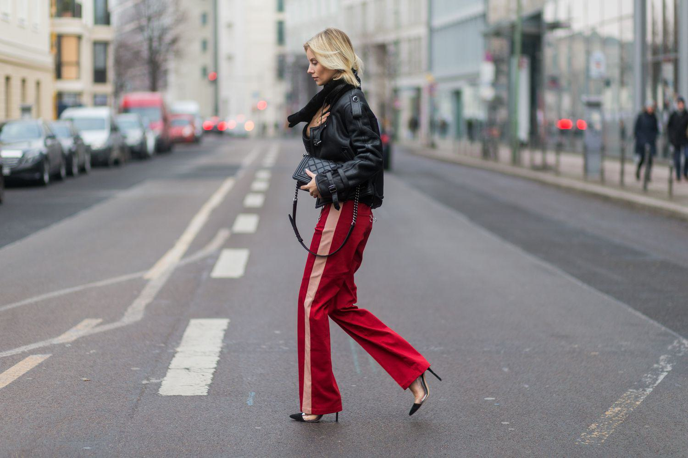

In today's rapidly evolving fashion landscape, athleisure has firmly established its presence as a major trend. This versatile style, blending athletic elements with leisurewear, has captured the interest of a wide demographic, facilitating a broader shift toward comfort-driven fashion. The growing inclination towards this style highlights a significant transformation in consumer preferences, driven by a desire for clothing that is both functional and fashionable.

This article explores the convergence of two dynamic fields: athleisure fashion and advanced activewear, with insights into how algorithmic trading impacts this vibrant market. The modern apparel industry is not just defined by the clothes people wear but also by underlying technological and financial mechanisms that impact market dynamics. The advent of algorithmic trading—a process where pre-defined algorithms automate stock trading—mirrors the high-performance strategies seen in the athleisure sector, where innovation and rapid adaptation are key.



We will explore the history of athleisure, touching upon its emergence in the 2010s, signified by the rise of key brands and a shift in societal norms. Current trends in activewear will be mapped alongside technological advancements, showcasing how fabric innovations and design thinking are meeting the demands of the health-conscious consumer. At the same time, algorithmic trading techniques share similarities with these developments, utilizing cutting-edge technology to execute transactions with precision and speed.

Join us as we explore how these seemingly distinct domains intersect and what it means for both consumers and investors. By examining the parallels between athleisure’s market development and algorithmic trading strategies, we unveil a world where fashion decisions can influence economic outcomes. This dual approach provides insights into understanding how trade apparel markets can adapt to consumer needs while remaining financially viable.

Discover how fashion trends and technology-driven trading are shaping and influencing available opportunities. As athleisure continues to impact global fashion, recognizing its significance extends beyond pure style. The implications for investment strategies within the apparel industry hint at a growing intersection between lifestyle trends and financial markets, offering innovative avenues for growth and diversification. The evolving synergy between these domains illustrates a broader narrative, where high-tech solutions inform and enhance the fashion realm, paving the way for future developments that trod the line between creativity and commerce.

## Table of Contents

## The Rise of Athleisure Fashion

Athleisure is a fashion trend that successfully merges the comfort of athletic wear with the style of casual outfits, making it highly appealing for modern consumers prioritizing both function and aesthetic. This trend has seen significant evolution since its emergence in the 2010s, with notable contributions from brands like Lululemon Athletica. These companies pioneered the movement, showcasing products that seamlessly transition from gym wear to everyday attire, thereby capturing the appetite for versatility in fashion.

The surge in athleisure's popularity is closely aligned with shifts in consumer lifestyles. As society places increasing value on convenience and adaptability, the demand for clothing that supports a wide range of activities, from exercise to casual outings, has escalated. This transition is supported by a growing interest in health and wellness, encouraging individuals to seek clothing that accommodates their fitness routines while maintaining a stylish appearance. 

Advancements in fabric technology also play a crucial role in the rise of athleisure. The development of materials that offer enhanced moisture-wicking properties, breathability, and durability has transformed athletic wear into viable everyday wear options. These technical improvements not only enhance wearer comfort but also expand the functional applications of these garments. For instance, fabrics that incorporate elastane enable stretch and flexibility, essential for both athletic and leisure activities.

As athleisure continues to embed itself in mainstream fashion, it prompts significant implications for the apparel industry. Traditional clothing lines are increasingly integrating elements of athleisure, reflecting consumer preference shifts and driving competition among brands to innovate continually. The blending of athletic and casual wear principles challenges apparel companies to rethink design paradigms, focusing on creating pieces that are both aesthetically pleasing and technically proficient.

The rise of athleisure underscores a broader trend within the fashion sector toward products that offer practicality without compromising on style. For the industry, this represents not only a response to consumer demand but also an opportunity to explore new niches and revenue streams. As athleisure becomes a staple in everyday wear, it represents a convergence of market trends, consumer preferences, and technological advancements, reshaping how fashion is conceived, marketed, and consumed.

## Current Activewear Trends and Innovations

Activewear has undergone significant transformation, continuously reshaping itself to align with modern consumer values, particularly sustainability and performance. The demand for eco-friendly and technologically advanced apparel is a defining feature of current trends. Brands like Nike and Adidas are at the forefront, pushing the boundaries by integrating sustainable materials and innovations that enhance both aesthetic appeal and functionality.

A key trend is the incorporation of eco-friendly materials, responding to the growing consumer awareness around environmental issues. This includes using recycled polyester, organic cotton, and other sustainable fibers that reduce the ecological footprint. The focus on sustainability extends beyond materials, influencing manufacturing processes and packaging to minimize environmental impact.

Vibrant color palettes characterize many modern activewear collections, reflecting a shift toward more expressive and individualistic fashion choices. Bold colors and patterns are increasingly popular, allowing consumers to make a statement with their activewear and seamlessly transition from exercise to leisure.

Multifunctional accessories have become integral to activewear, providing utility without compromising style. These accessories, including convertible bags and versatile headbands or scarves, offer convenience for individuals with active lifestyles, emphasizing the blend of practicality and fashion.

Brands are not only focusing on aesthetics but also on enhancing performance through technology. Innovations such as smart fabrics and wearable technology are key developments. Smart fabrics, for instance, regulate temperature or wick moisture more efficiently, enhancing comfort during physical activities. Wearable technology, integrated into garments, like sensors that monitor biometric data, exemplifies the merging of fashion with high-tech functionality.

Achieving a balance between fashion-forward innovations and the technical specifications required for performance is critical. This involves ensuring that fabrics are durable, breathable, and flexible, meeting the high demands of athletic activities while still appealing visually. The challenge lies in maintaining this balance to cater to both fashion-conscious consumers and athletes seeking performance-optimized gear.

In summary, activewear brands are driving innovation by adopting sustainable practices, vibrant designs, and multifunctional products, all while leveraging technology to enhance functionality. This synergy between fashion and performance technology solidifies the position of activewear as a versatile and essential component of contemporary wardrobes.

## Algorithmic Trading: A Parallel in High-Performance Strategies

Algorithmic trading utilizes advanced computer algorithms to execute trades at speeds and frequencies far beyond the capability of human traders. These algorithms can analyze vast datasets, identify trends, and make decisions in milliseconds, making them especially effective in high-frequency trading environments. This approach bears striking similarities to the rapid development and innovation within the activewear industry.

Both fields benefit immensely from statistical analysis and the integration of big data. In [algorithmic trading](/wiki/algorithmic-trading), sophisticated models analyze market data to predict price movements and optimize trade strategies. Similarly, the activewear industry uses data analytics to understand consumer preferences, monitor fashion trends, and innovate product designs. For instance, data-driven insights into consumer behavior can lead to the development of activewear that aligns closely with market demands.

Technological integration is another common aspect. Algorithmic trading platforms leverage high-speed internet, advanced computing power, and real-time data feeds to execute trades at lightning speed. In parallel, activewear brands incorporate technology to enhance garment functionality, such as using smart fabrics that monitor body metrics or integrating wearable technology. The focus on performance and efficiency is central to both domains, requiring constant technological advancement and adaptation.

Trends in fashion and market strategies often benefit from systematic, data-driven approaches. For example, fashion companies might employ algorithms to predict upcoming style shifts based on historical data and social media analysis, similar to how trading algorithms predict stock price movements. This systematic approach can lead to more informed decisions, reducing risk and increasing opportunities for profitable outcomes.

Investment firms have recognized the financial potential within the fashion industry, particularly in sectors like athleisure that display rapid growth and substantial public interest. By analyzing fashion trends through algorithmic models, these firms can make strategic financial maneuvers. For example, an investment firm might use algorithms to assess the potential success of a new athleisure line based on current market demand and historical sales data, allowing them to tailor their investment strategies accordingly.

The convergence of algorithmic trading strategies and activewear development is marked by a shared reliance on data analytics, speed, and technological integration. Both fields demand an ability to swiftly adapt to market changes, highlighting the value of systematic approaches in enhancing decision-making and performance outcomes. These parallels underscore the innovative and dynamic nature of each industry, presenting opportunities for cross-disciplinary learning and growth.

## Athleisure Investment Opportunities

The athleisure market has experienced remarkable growth, paving the way for significant investment opportunities and expansion within the fashion industry. This expansion is primarily driven by evolving consumer preferences, increased participation in fitness activities, and a societal shift towards casual and comfortable clothing choices. Key players and potential disruptors in the athleisure sector are constantly sculpting the landscape by introducing innovative products and strategic collaborations.

### Major Players and Market Disruptors

Prominent companies like Lululemon Athletica, Nike, and Adidas have been pivotal in shaping the athleisure market. Lululemon, renowned for its yoga-inspired athletic apparel, continues to innovate with unique fibers and sustainability initiatives. Nike remains a powerhouse, combining performance with style through its extensive product lines and emphasis on technological enhancements. Adidas' "athleisure" offerings, including collaborations with fashion designers, showcase a seamless blend of sport and fashion.

Emerging brands such as Outdoor Voices and Alo Yoga are increasingly recognized as potential market disruptors. Their focus on minimalist designs and engaging direct-to-consumer sales strategies have resonated well with younger demographics. These companies capitalize on niche marketing strategies and collaborations, positioning themselves as formidable competitors against established giants.

### Stock Performance and Market Trends

The stock performance of leading athleisure brands typically correlates with broader market trends and consumer behavior. The athleisure sector demonstrates resilience, often attributed to its emphasis on lifestyle integration and brand loyalty. For instance, Lululemon's innovative marketing strategies and robust product lines have contributed to its robust stock performance over the years. 

To quantitatively analyze stock performance, investors often utilize statistical measures to assess the correlation between stock returns and market indices. For example, the correlation coefficient $\rho(X, Y)$ between an athleisure brand's returns $X$ and a relevant consumer discretionary index $Y$ provides insights into investment risk and diversification potential.

```python
import numpy as np

# Example stock return data
brand_returns = np.array([0.02, 0.03, 0.01, 0.04])
market_index_returns = np.array([0.015, 0.025, 0.02, 0.035])

# Calculate correlation coefficient
correlation_coefficient = np.corrcoef(brand_returns, market_index_returns)[0, 1]
print("Correlation Coefficient:", correlation_coefficient)
```

### Strategies for Growth Investors

Growth investors can capitalize on the emerging segments within the athleisure and activewear markets by focusing on companies that prioritize sustainability and technological integration. Companies that innovate in sustainable fabrics and supply chain transparency are increasingly attractive, as environmental consciousness among consumers grows. Additionally, the integration of wearable technology in activewear is a promising area for growth, with potential applications spanning health monitoring and enhanced user experiences.

### Role of Algorithmic Trading

Algorithmic trading is becoming instrumental in identifying and exploiting investment opportunities within the fashion sector. These algorithms analyze vast amounts of financial data and patterns to predict stock movement and execute trades with precision. For athleisure investments, algorithms can be designed to track consumer sentiment, online engagement metrics, and seasonal sales patterns to optimize investment decisions.

Algorithmic trading systems often utilize predictive modeling techniques, like logistic regression or neural networks, to forecast stock price movements based on historical data and market dynamics.

In conclusion, the athleisure market offers a plethora of investment opportunities fueled by innovative trends and consumer-centric business models. By leveraging advancements in technology and data analytics, investors can strategically position themselves to benefit from this lucrative market. Prominent brands and emerging challengers alike present viable avenues for growth, with algorithmic trading offering an analytical edge in navigating this vibrant sector.

## Challenges and Considerations

Athleisure brands operating within a bustling market face significant competition. The proliferation of brands in this segment, driven by the sector's burgeoning popularity, makes differentiation challenging. Established entities like Lululemon Athletica and new entrants alike must continually innovate in product design, marketing strategies, and customer experience to maintain and grow their market share. To navigate this crowded space, companies often leverage advanced fabric technologies, unique brand narratives, and strategic collaborations.

When considering algorithmic trading, particularly within the fashion industry, distinct risks emerge. Algorithmic trading relies on high-speed data processing and automated decision-making to optimize financial transactions. However, this comes with vulnerabilities: systematic errors, data inaccuracies, and sudden market shifts can lead to significant losses at unprecedented speeds. Investors in fashion-centric stocks, particularly within volatile markets like athleisure, must consider these risks, often ensuring robust [backtesting](/wiki/backtesting) and diversification strategies to mitigate potential losses.

Sustainability presents another formidable challenge for athleisure brands. The fashion industry is under increasing scrutiny for its environmental impact. Brands are driven to adopt sustainable practices through the use of recycled materials, reduction of carbon footprints, and transparent supply chains. Despite these initiatives, achieving genuine sustainability can be costly and complex, requiring continuous innovation and commitment.

Maintaining a balance between rapid innovation and brand integrity is crucial. Consumers increasingly demand novel, high-performance products, yet excessive focus on innovation can dilute a brand’s core identity. Brands need to strategically choose which innovations align with their established values and market positioning to build authentic connections with consumers.

For investors in the fashion industry, especially within the volatile athleisure market, informed decision-making is paramount. This landscape requires a nuanced understanding of both fashion trends and algorithmic insights. Investors should conduct thorough market analyses, which could involve statistical models or [machine learning](/wiki/machine-learning) algorithms, to identify patterns and forecast trends effectively. For example, using Python, one might deploy a time series analysis with ARIMA models to predict stock performance based on historical data.

As investors and brands navigate these challenges, the interplay between fashion and technology continues to unfold, presenting both obstacles and opportunities. Such an environment encourages strategic approaches that harmonize consumer desires, market conditions, and technological advancements.

## Conclusion

The convergence of athleisure fashion and advanced activewear has significantly reshaped the fashion landscape, symbolizing a modern lifestyle that values both functionality and style. This intersection reflects a broader trend where consumers prioritize versatile, comfortable clothing that aligns with active, health-conscious living. Athleisure's influence on the industry is profound, having transformed casual wear and instigated innovations in fabric technology and design aesthetics. This trend, marked by its adaptability and mass appeal, underscores a shift towards apparel that seamlessly integrates into various activities, thereby broadening its consumer base.

Technological advancements in trading, particularly algorithmic trading, offer valuable insights into how data-driven approaches can be harnessed in fashion investments. The parallels between swift market strategies and the rapidly evolving activewear sector illustrate how systematic analysis and statistical insights can optimize decision-making. Algorithmic trading methodologies, with their reliance on real-time data processing and predictive analytics, provide a template for effectively navigating and capitalizing on fashion trends. The integration of these technologies into investment strategies amplifies the potential for profitability, underscoring the importance of aligning cutting-edge trading techniques with industry trends.

Looking ahead, the trajectory of athleisure and activewear is poised for continued growth, driven by an increased focus on sustainability, technological integration, and innovative design. Stakeholders, including brands, investors, and consumers, stand to benefit from these developments. For investors, particularly, embracing diverse strategies that integrate fashion trends with advanced trading technologies can unlock new lucrative opportunities. By leveraging algorithmic insights and market tendencies, investors can better anticipate shifts and capitalize on emerging areas within the fashion sector.

Ultimately, athleisure and activewear will persist as lasting trends, reflecting broader societal movements towards wellness and technological innovation. This fusion of fashion with high-tech elements not only transforms consumer habits but also redefines investment paradigms, highlighting the intricate connections between lifestyle changes and financial prospects. Such developments signify a future where fashion does not exist in isolation but interacts dynamically with advancements in finance and technology.

## References & Further Reading

[1]: ["Sweat Equity: Inside the New Economy of Mind and Body"](https://www.amazon.com/Sweat-Equity-Inside-Economy-Bloomberg/dp/1118914597) by Jason Kelly

[2]: ["The Rise of Athleisure"](https://www.forbes.com/councils/forbescommunicationscouncil/2021/05/03/the-rise-of-athleisure-in-the-fashion-industry-and-what-it-means-for-brands/) - Business of Fashion

[3]: ["Fashionopolis: The Price of Fast Fashion and the Future of Clothes"](https://books.google.com/books/about/Fashionopolis.html?id=_BmtDwAAQBAJ) by Dana Thomas

[4]: ["The Incredible Rise of Lululemon: From a Yoga Studio to a $40 Billion Fortune"](https://indoorgem.com/chip-wilson-from-yoga-pant-to-a-48-billion/) - Inc. Magazine

[5]: ["Advances in Financial Machine Learning"](https://www.amazon.com/Advances-Financial-Machine-Learning-Marcos/dp/1119482089) by Marcos Lopez de Prado