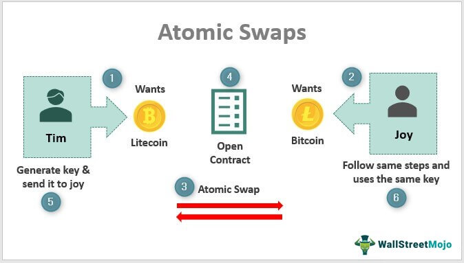

## Table of Contents

## What is an atomic swap in cryptocurrency trading?

An atomic swap is a way to trade one cryptocurrency for another directly, without using a middleman like an exchange. It's like swapping toys with a friend, but with digital money. The special thing about atomic swaps is that they use smart contracts, which are like digital agreements, to make sure the trade happens fairly and safely. If something goes wrong, the trade doesn't happen at all, and no one loses their money.

This method is great because it can save you money on fees that exchanges charge. Plus, it gives you more control over your trades. You don't have to trust a third party to hold your money while you trade. Instead, you and the person you're trading with work together directly. Atomic swaps can make trading between different types of cryptocurrencies easier and more secure.

## How does an atomic swap work?

An atomic swap works by using special digital agreements called smart contracts. Imagine you want to trade your Bitcoin for someone else's Ethereum. You both agree on the trade and set up a smart contract on your respective blockchains. This contract acts like a promise that says, "If you give me your Ethereum, I'll give you my Bitcoin." The smart contract makes sure that the trade happens at the same time for both of you, or not at all.

Here's how it goes: You lock your Bitcoin in the smart contract on the Bitcoin blockchain, and the other person locks their Ethereum in a smart contract on the Ethereum blockchain. Both smart contracts are linked together using a secret code. If everything goes well, you use the secret code to unlock the Ethereum, and the other person uses the same code to unlock the Bitcoin. If something goes wrong, like if one of you tries to back out, the smart contracts will return the locked cryptocurrencies to their original owners. This way, the swap is either completed fully, or it's canceled, making it safe for both traders.

## What are the benefits of using atomic swaps?

Atomic swaps let you trade one [cryptocurrency](/wiki/cryptocurrency) for another without needing a middleman like a traditional exchange. This means you don't have to pay the fees that exchanges usually charge, which can save you money. Plus, you don't have to trust a third party with your money, which can be risky. With atomic swaps, you're in control of your own trades, making them more secure and private.

Another big benefit is that atomic swaps can make trading between different types of cryptocurrencies easier. Sometimes, it's hard to find a direct trading pair on an exchange, but with atomic swaps, you can trade directly with someone else, no matter what kind of cryptocurrency they have. This opens up more trading options for you and can make the whole process smoother and faster.

## What are the risks associated with atomic swaps?

Even though atomic swaps have many benefits, they also come with some risks. One big risk is that the technology is still pretty new and not used a lot yet. This means there might be bugs or problems with the smart contracts that could cause the trade to fail or go wrong. If you're not careful and don't know how to use the technology properly, you could lose your money.

Another risk is that you have to trust the person you're trading with. Even though the smart contract makes sure the trade is fair, you still need to find someone who wants to trade with you and who you can trust. If the other person decides not to go through with the trade after you've locked your cryptocurrency in the smart contract, you might have to wait a while before you can get your money back. This can be frustrating and might make you think twice about using atomic swaps.

## Which cryptocurrencies support atomic swaps?

Atomic swaps work with many different cryptocurrencies, but they need to use the right kind of technology. Some popular ones that support atomic swaps are Bitcoin, Litecoin, and Ethereum. These cryptocurrencies use something called the Hash Time-Locked Contract (HTLC), which is a special type of smart contract that makes atomic swaps possible.

Other cryptocurrencies that can do atomic swaps include Decred, Komodo, and Vertcoin. Each of these has its own way of making sure the swaps are safe and fair. Not all cryptocurrencies support atomic swaps yet, so you need to check if the ones you want to trade are compatible before you start.

The list of cryptocurrencies that support atomic swaps might grow as more people use this technology and more developers work on making it easier to use. Right now, it's a good idea to stick with the ones that are known to work well with atomic swaps to avoid any problems.

## What is the difference between atomic swaps and traditional exchanges?

Atomic swaps and traditional exchanges are two different ways to trade cryptocurrencies. With atomic swaps, you trade directly with another person without using a middleman like an exchange. You use smart contracts to make sure the trade is fair and safe. If something goes wrong, the trade doesn't happen, and you get your money back. This means you don't have to pay fees to an exchange, and you have more control over your trades.

Traditional exchanges, on the other hand, act as a middleman between buyers and sellers. You deposit your cryptocurrency into the exchange, and they hold it while you trade. This can be risky because if the exchange gets hacked or goes bankrupt, you could lose your money. Exchanges also charge fees for their services, which can add up. But they are often easier to use because they have a lot of different cryptocurrencies and trading pairs available.

In summary, atomic swaps give you more control and can save you money on fees, but they can be more complicated to use. Traditional exchanges are easier to use and offer more trading options, but they come with risks and fees. Which one you choose depends on what's most important to you.

## How can one initiate an atomic swap?

To start an atomic swap, you first need to find someone who wants to trade the same amount of one cryptocurrency for another. You both need to agree on the trade and use wallets that support atomic swaps. Once you've found a trading partner, you'll set up a smart contract on each of the blockchains involved in the trade. For example, if you're trading Bitcoin for Litecoin, you'll set up a smart contract on the Bitcoin blockchain and another on the Litecoin blockchain.

After setting up the smart contracts, you'll lock your cryptocurrency into the contract on your blockchain, and your trading partner will do the same on their blockchain. Both contracts are linked with a secret code. If everything goes well, you'll use the secret code to unlock the other person's cryptocurrency, and they'll use it to unlock yours. This makes sure the trade happens at the same time for both of you. If something goes wrong, like if one of you tries to back out, the smart contracts will return the locked cryptocurrencies to their original owners, keeping the trade safe and fair.

## What technical requirements are needed to perform an atomic swap?

To do an atomic swap, you need to use special wallets that can handle smart contracts. These wallets are different from the usual ones because they can work with the technology needed for atomic swaps. You also need to use cryptocurrencies that support atomic swaps, like Bitcoin, Litecoin, or Ethereum. These cryptocurrencies use a thing called Hash Time-Locked Contracts (HTLCs), which are like digital agreements that make sure the trade happens safely.

Once you have the right wallet and cryptocurrency, you need to find someone who wants to trade with you. You both need to set up smart contracts on your respective blockchains. These contracts are linked with a secret code that makes sure the trade happens at the same time for both of you. If everything goes well, you use the secret code to unlock the other person's cryptocurrency, and they use it to unlock yours. If something goes wrong, the smart contracts will give your money back, keeping the trade safe.

## Can atomic swaps be used for cross-chain trading?

Yes, atomic swaps can be used for cross-chain trading. This means you can trade one type of cryptocurrency for another, even if they are on different blockchains. For example, you can trade Bitcoin on the Bitcoin blockchain for Litecoin on the Litecoin blockchain. The special thing about atomic swaps is that they use smart contracts to make sure the trade is fair and safe. These smart contracts are set up on both blockchains and are linked together with a secret code.

If everything goes well, you use the secret code to unlock the other person's cryptocurrency, and they use it to unlock yours. This way, the trade happens at the same time for both of you. If something goes wrong, like if one of you tries to back out, the smart contracts will return the locked cryptocurrencies to their original owners. This makes cross-chain trading with atomic swaps safe and reliable, even though it can be a bit tricky to set up.

## What role do smart contracts play in atomic swaps?

Smart contracts are super important for atomic swaps. They are like digital agreements that make sure the trade happens fairly and safely. When you want to trade one cryptocurrency for another, you and the other person set up smart contracts on your blockchains. These contracts are linked together with a special secret code. The smart contract says, "If you give me your cryptocurrency, I'll give you mine." This way, you can be sure that the trade will happen at the same time for both of you.

If everything goes well, you use the secret code to unlock the other person's cryptocurrency, and they use it to unlock yours. But if something goes wrong, like if one of you tries to back out, the smart contracts will return the locked cryptocurrencies to their original owners. This makes atomic swaps safe because you don't have to worry about losing your money if the trade doesn't work out. Smart contracts are what make atomic swaps possible and trustworthy.

## How do atomic swaps enhance privacy and security in trading?

Atomic swaps help keep your trades private and safe. When you use an atomic swap, you trade directly with another person without using a middleman like a traditional exchange. This means you don't have to give your personal information to an exchange, which can make your trades more private. Since you're in control of your own cryptocurrencies during the trade, you don't have to worry about an exchange getting hacked and losing your money.

Smart contracts also make atomic swaps secure. These contracts are like digital promises that make sure the trade happens at the same time for both people, or not at all. If something goes wrong, the smart contracts will give your money back. This means you don't have to trust the other person completely because the technology makes sure the trade is fair. Atomic swaps can make trading safer and more private than using traditional exchanges.

## What future developments can we expect in the technology of atomic swaps?

In the future, we might see atomic swaps becoming easier to use. Right now, they can be a bit tricky to set up because you need to find someone to trade with and use special wallets that support smart contracts. But as more people start using atomic swaps, developers might create simpler tools and apps that make it easier for anyone to trade directly with others. This could mean more people using atomic swaps and less need for traditional exchanges.

Another thing we might see is atomic swaps working with more types of cryptocurrencies. Right now, they work with some popular ones like Bitcoin and Ethereum, but not all cryptocurrencies support them yet. As the technology gets better, we could see more cryptocurrencies adding the ability to do atomic swaps. This would make it easier to trade between different types of digital money without needing a middleman, making trading even more secure and private.

## References & Further Reading

[1]: Antonopoulos, A. M. (2017). ["Mastering Bitcoin: Unlocking Digital Cryptocurrencies."](https://books.google.com/books/about/Mastering_Bitcoin.html?id=IXmrBQAAQBAJ) O'Reilly Media.

[2]: Narayanan, A., Bonneau, J., Felten, E., Miller, A., & Goldfeder, S. (2016). ["Bitcoin and Cryptocurrency Technologies."](https://press.princeton.edu/books/hardcover/9780691171692/bitcoin-and-cryptocurrency-technologies) Princeton University Press.

[3]: ["Cryptocurrency: How Bitcoin and Digital Money are Challenging the Global Economic Order"](https://dl.acm.org/doi/10.5555/2717097) by Paul Vigna and Michael J. Casey

[4]: ["Blockchain Basics: A Non-Technical Introduction in 25 Steps"](https://link.springer.com/book/10.1007/978-1-4842-2604-9) by Daniel Drescher

[5]: ["Algorithmic Trading: Winning Strategies and Their Rationale"](https://www.wiley.com/en-us/Algorithmic+Trading%3A+Winning+Strategies+and+Their+Rationale-p-9781118460146) by Ernest P. Chan