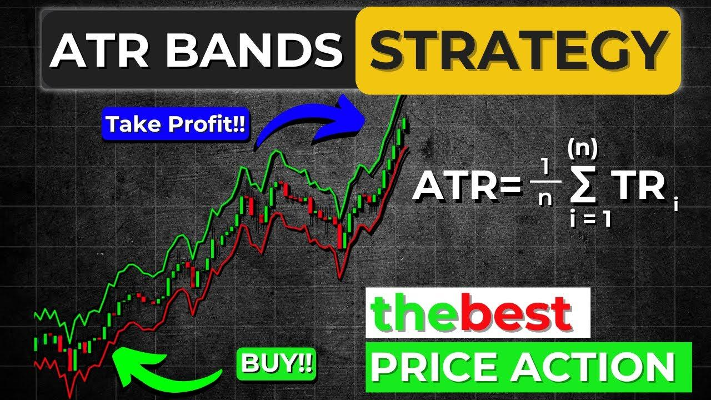

## Table of Contents

## What are ATR Bands and how do they work?

ATR Bands, or Average True Range Bands, are a technical analysis tool used by traders to understand market volatility and potential price movements. They are created by plotting lines above and below a moving average of a security's price, with the distance between these lines determined by the Average True Range (ATR) value. The ATR is a measure of market volatility that takes into account the range of price movement within a given period, including any gaps from the previous close.

These bands help traders identify potential entry and exit points for trades. When the price touches or moves outside the upper band, it might suggest that the security is overbought, and a price reversal could be imminent. Conversely, if the price touches or moves below the lower band, it might indicate an oversold condition, hinting at a possible upward price movement. By using ATR Bands, traders can better gauge the market's volatility and make more informed decisions based on the current price action relative to these volatility-adjusted levels.

## How can ATR Bands be used to identify market volatility?

ATR Bands help traders see how much a stock's price is moving around. The bands are made by drawing lines above and below the average price of the stock. The space between these lines changes based on something called the Average True Range (ATR). The ATR looks at how much the price moves in a day, including any big jumps from the last close. When the ATR is big, it means the price is moving a lot, and the bands will be farther apart. When the ATR is small, the price isn't moving as much, and the bands will be closer together.

By looking at how far apart the ATR Bands are, traders can tell if the market is calm or if it's getting wild. If the bands are spread out wide, it means the market is very volatile, and the price could change a lot very quickly. If the bands are close together, it means the market is not very volatile, and the price is staying pretty steady. Traders use this information to decide when to buy or sell, knowing that wider bands mean bigger potential price swings.

## What are the basic steps to implement an ATR Bands trading strategy?

To start using ATR Bands in your trading strategy, first, you need to calculate the Average True Range (ATR) for the stock you're looking at. The ATR measures how much the price moves each day, including any gaps from the previous close. Once you have the ATR, you can set up the bands around a moving average of the stock's price. The upper band is placed above the moving average by a multiple of the ATR, and the lower band is placed below it by the same multiple. You can choose this multiple based on how sensitive you want your strategy to be, but a common choice is 2 times the ATR.

After setting up the ATR Bands, you can use them to make trading decisions. If the price of the stock touches or goes above the upper band, it might mean the stock is overbought, and it could be a good time to sell or short sell. On the other hand, if the price touches or goes below the lower band, it might mean the stock is oversold, and it could be a good time to buy. Also, watch how the bands move. If they start to spread out, it means the market is getting more volatile, and if they come closer together, it means the market is calming down. By paying attention to these signals, you can make better choices about when to enter or [exit](/wiki/exit-strategy) trades.

## How do you calculate the Average True Range (ATR) for ATR Bands?

To calculate the Average True Range (ATR) for ATR Bands, you first need to find the True Range for each day. The True Range is the biggest of three values: the difference between today's high and low, the difference between today's high and yesterday's close, or the difference between today's low and yesterday's close. Once you have the True Range for each day, you take an average of these values over a certain number of days, usually 14 days. This average is the ATR.

After you have the ATR, you can use it to set up the ATR Bands. You take a moving average of the stock's price, and then you add and subtract a multiple of the ATR from this moving average to create the upper and lower bands. A common multiple to use is 2, but you can adjust it based on how sensitive you want your strategy to be. The ATR Bands help you see how much the stock's price is moving around, and they can guide you on when to buy or sell based on whether the price is touching or going beyond these bands.

## What are the typical settings for ATR Bands and how can they be adjusted?

The typical settings for ATR Bands include using a 14-day period to calculate the Average True Range (ATR) and a multiplier of 2 to set the distance of the bands from the moving average. The moving average used is often a simple moving average (SMA) of the stock's closing prices, also calculated over 14 days. These settings are common because they provide a good balance between sensitivity to price movements and smoothing out short-term fluctuations. However, traders can adjust these settings based on their trading style and the specific market they are trading in.

Adjusting the settings of ATR Bands can help traders better fit the tool to their needs. If you want the bands to be more sensitive to price changes, you can use a shorter period for the ATR calculation, like 10 days, or increase the multiplier to something like 2.5 or 3. This will make the bands wider and more responsive to recent price movements. On the other hand, if you want the bands to be less sensitive and smoother, you can use a longer period, like 20 days, or decrease the multiplier to 1.5 or even 1. This will make the bands narrower and less reactive to short-term price swings. By tweaking these settings, traders can customize the ATR Bands to better match their trading strategy and the volatility of the market they are trading in.

## How can ATR Bands help in setting stop-loss and take-profit levels?

ATR Bands can help traders set stop-loss and take-profit levels by showing how much a stock's price is moving. When you set up ATR Bands, you can use the distance between the bands to decide where to place your stop-loss. If you're buying a stock, you might set your stop-loss just below the lower band. This way, if the price drops a lot and goes below the band, your stop-loss will kick in, and you'll sell the stock to limit your loss. For selling a stock, you'd set your stop-loss just above the upper band, so if the price goes up a lot and breaks the band, you'll buy back the stock to limit your loss.

For take-profit levels, ATR Bands can also be useful. If you're buying a stock, you might set your take-profit near the upper band. This means if the price goes up and touches the upper band, you'll sell the stock to lock in your profit. If you're selling a stock, you'd set your take-profit near the lower band. So, if the price goes down and touches the lower band, you'll buy back the stock to make a profit. By using the ATR Bands, you can set these levels based on the stock's volatility, which helps you manage your trades better.

## What are the advantages of using ATR Bands in trading?

Using ATR Bands in trading can help traders see how much a stock's price is moving around. The bands show the stock's volatility by drawing lines above and below the average price. When these lines are far apart, it means the price is moving a lot, and when they are close together, it means the price is not moving much. This can help traders decide when to buy or sell. If the price touches the top band, it might mean the stock is too expensive and could go down soon, so it's a good time to sell. If the price touches the bottom band, it might mean the stock is too cheap and could go up, so it's a good time to buy.

ATR Bands also help traders set stop-loss and take-profit levels. A stop-loss is a price where you sell a stock to limit your loss if the price goes down a lot. A take-profit is a price where you sell a stock to lock in your profit if the price goes up a lot. By using the distance between the ATR Bands, traders can set these levels based on how much the stock's price is moving. This way, they can manage their trades better and reduce the risk of losing money. Overall, ATR Bands give traders a clear way to see market volatility and make better trading decisions.

## What are the potential pitfalls or limitations of using ATR Bands?

Using ATR Bands can have some problems. One big issue is that they might give you false signals. This means the price might touch the top or bottom band, making you think it's time to buy or sell, but then the price keeps going the same way instead of turning around. This can happen a lot in markets that are moving fast or when there's a big trend. Also, ATR Bands are based on past data, so they might not always predict what will happen next. If the market changes a lot, the bands might not adjust fast enough to be useful.

Another limitation is that ATR Bands don't tell you everything about the market. They only show you how much the price is moving, but they don't say why it's moving or what might happen next. You need to use other tools and information along with ATR Bands to make good trading decisions. Also, the settings for ATR Bands, like how many days to use for the average or how far apart to set the bands, can be hard to get right. If you don't set them correctly, the bands might not help you as much as they could.

## How can ATR Bands be combined with other technical indicators for a more robust strategy?

ATR Bands can be used along with other tools to make your trading strategy better. One way is to use them with the Relative Strength Index (RSI). The RSI helps you see if a stock is overbought or oversold. When the price touches the upper ATR Band and the RSI is above 70, it might be a good time to sell because the stock could be too expensive. If the price touches the lower ATR Band and the RSI is below 30, it might be a good time to buy because the stock could be too cheap. By looking at both the ATR Bands and the RSI, you can make better decisions about when to buy or sell.

Another tool you can use with ATR Bands is the Moving Average Convergence Divergence (MACD). The MACD helps you see if the stock's price is going up or down. If the price touches the upper ATR Band and the MACD line crosses above the signal line, it might be a strong sign to sell. If the price touches the lower ATR Band and the MACD line crosses below the signal line, it might be a strong sign to buy. Using ATR Bands with the MACD can help you spot good times to enter or exit trades based on both the stock's volatility and its trend.

## Can you provide examples of successful trades using ATR Bands?

One example of a successful trade using ATR Bands happened when a trader noticed that the price of a stock was touching the lower band. The stock had been moving down for a while, but the ATR Bands showed that the price was now at a level where it might start going up again. The trader decided to buy the stock right when it touched the lower band. A few days later, the price did start to go up, and when it reached the upper band, the trader sold the stock and made a good profit. By using the ATR Bands, the trader was able to see that the stock was oversold and likely to bounce back.

Another example was when a trader used ATR Bands to sell a stock that was getting too expensive. The stock's price had been going up for a while, and it finally touched the upper band. The trader saw this as a sign that the stock might be overbought and could start going down soon. So, the trader sold the stock right when it touched the upper band. Sure enough, the price did start to drop after that, and the trader avoided a big loss. The ATR Bands helped the trader see that the stock was at a high point and it was a good time to sell.

## How does the performance of ATR Bands vary across different market conditions?

ATR Bands can work differently depending on whether the market is moving a lot or staying calm. In a market that's moving a lot, the bands will be far apart because the Average True Range (ATR) will be high. This can help traders see good times to buy or sell because the price might bounce off the bands more often. But, it can also lead to more false signals, where the price touches a band but keeps going the same way instead of turning around. So, in a very active market, traders need to be careful and might want to use other tools along with ATR Bands to make better decisions.

In a calm market, the ATR Bands will be close together because the ATR will be low. This can make it harder to spot good trading opportunities because the price might not touch the bands as often. But, when the price does touch a band in a calm market, it can be a strong signal that the price might start moving the other way. So, in a calm market, ATR Bands can still be useful, but traders might need to wait longer for the right moment to trade. Using other tools like the Relative Strength Index (RSI) or Moving Average Convergence Divergence (MACD) can help make the strategy work better in different market conditions.

## What advanced techniques can be applied to optimize an ATR Bands trading strategy?

To make your ATR Bands trading strategy better, you can try using different settings for the bands. Instead of using the usual 14 days to figure out the Average True Range (ATR), you might use a shorter time like 10 days or a longer time like 20 days. This can make the bands more or less sensitive to price changes. You can also change the number you use to set how far apart the bands are from the moving average. Instead of using 2, you might use 1.5 or 2.5. By trying different settings, you can see what works best for the stock you're trading and the market conditions.

Another way to improve your ATR Bands strategy is to use other tools along with the bands. For example, you can use the Relative Strength Index (RSI) to see if a stock is overbought or oversold. If the price touches the upper band and the RSI is over 70, it might be a good time to sell. If the price touches the lower band and the RSI is under 30, it might be a good time to buy. You can also use the Moving Average Convergence Divergence (MACD) to see if the stock's price is going up or down. By combining ATR Bands with other tools, you can make better trading decisions and reduce the chance of making a mistake.

## What are ATR Bands?

ATR bands are a form of technical analysis tool used to capture and analyze market volatility, relying on the Average True Range (ATR) to create a dynamic framework of support and resistance around an asset's price movements. These bands comprise an upper and a lower band, each plotted symmetrically above and below a central moving average line. The calculation of these bands begins with the formulation of the Average True Range, developed by J. Welles Wilder Jr., which quantifies market volatility by measuring the range within which an asset's price fluctuates over a specific period.

To construct ATR bands, it is essential first to understand the concept of True Range (TR), defined as the highest of the following values over a given period:
- The difference between the current high and the current low.
- The absolute difference between the current high and the previous close.
- The absolute difference between the current low and the previous close.

The Average True Range (ATR) is then computed as a moving average of this True Range, often utilizing a 14-period average as the default setting. This moving average smoothens the True Range data to provide traders with an ongoing measure of [volatility](/wiki/volatility-trading-strategies).

The ATR bands are derived by incorporating this ATR measure into the band calculation. A common method is to add and subtract a multiple of the ATR value from a chosen moving average of the asset's price, typically a simple moving average (SMA), resulting in the upper and lower bands:

$$
\text{Upper Band} = \text{SMA}_{n} + k \times \text{ATR}_n
$$

$$
\text{Lower Band} = \text{SMA}_{n} - k \times \text{ATR}_n
$$

Here, $n$ represents the period over which the SMA and ATR are calculated, and $k$ is the multiplier reflecting the trader's specific volatility threshold and risk tolerance. By adjusting $k$, traders can fine-tune the bands' sensitivity, making them narrower or wider based on desired strategy criteria.

ATR bands serve crucial roles in identifying potential reversal points through their capacity to adjust dynamically in response to market fluctuations. Their alignment with volatility allows them to effectively indicate potential areas where prices may encounter support (lower band) or resistance (upper band), thereby aiding traders in making informed trading decisions across various market conditions—ranging from trending to range-bound and even highly volatile settings. Although their adaptability makes them versatile tools, it is vital to integrate ATR bands within a broader trading strategy, ensuring they complement other technical indicators to provide more consistent and reliable signals.

## References & Further Reading

[1]: Wilder, J. W. (1978). ["New Concepts in Technical Trading Systems"](https://books.google.com/books/about/New_Concepts_in_Technical_Trading_System.html?id=WesJAQAAMAAJ) by J. Welles Wilder Jr.

[2]: Lopez de Prado, M. (2018). ["Advances in Financial Machine Learning"](https://www.amazon.com/Advances-Financial-Machine-Learning-Marcos/dp/1119482089). Wiley.

[3]: Jansen, S. (2020). ["Machine Learning for Algorithmic Trading"](https://github.com/stefan-jansen/machine-learning-for-trading). Packt Publishing.

[4]: Aronson, D. R. (2007). ["Evidence-Based Technical Analysis: Applying the Scientific Method and Statistical Inference to Trading Signals"](https://onlinelibrary.wiley.com/doi/book/10.1002/9781118268315). Wiley.

[5]: Chan, E. P. (2008). ["Quantitative Trading: How to Build Your Own Algorithmic Trading Business"](https://github.com/ftvision/quant_trading_echan_book). Wiley.

[6]: Bergstra, J., Bardenet, R., Bengio, Y., & Kégl, B. (2011). ["Algorithms for Hyper-Parameter Optimization."](https://dl.acm.org/doi/10.5555/2986459.2986743) Advances in Neural Information Processing Systems 24.