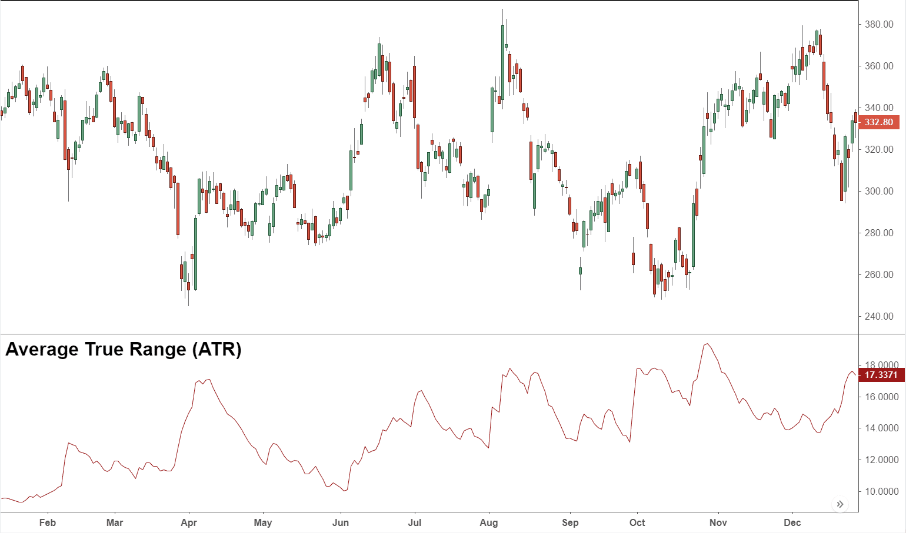

In the world of algorithmic trading, technical indicators are fundamental tools for developing strategies and analyzing market trends. Among these, the ATR Bands Indicator has garnered significant attention from traders seeking to incorporate volatility measures into their trading frameworks. The Average True Range (ATR), introduced by J. Welles Wilder in his book "New Concepts in Technical Trading Systems" (1978), serves as the foundation for ATR Bands. It quantifies market volatility by analyzing the range of asset price movements over a specified period.

The ATR Bands Indicator extends the ATR concept by plotting bands around a moving average of price. These bands consist of an upper and a lower band, which are calculated by adding and subtracting a multiple of the ATR from the moving average, respectively. This setup allows traders to visualize and anticipate potential price reversals, volatility changes, and dynamic support and resistance levels. Such features render ATR Bands highly useful in various market conditions, including trending, range-bound, and volatile scenarios.



This article will examine the role of ATR Bands in algorithmic trading, highlighting their benefits and the ways they can enhance trading strategies. Key aspects such as the mathematical calculation of ATR Bands, their application in trading algorithms, and their inherent limitations will be explored. Incorporating ATR Bands into trading systems can provide traders with insights into market conditions, enabling more informed decision-making.

By understanding the operational mechanics and strategic applications of ATR Bands, traders can effectively integrate this indicator into their algorithmic trading systems, achieving a balance between maximizing returns and managing risks.

## Table of Contents

## What are ATR Bands?

ATR bands are a form of technical analysis tool used to capture and analyze market volatility, relying on the Average True Range (ATR) to create a dynamic framework of support and resistance around an asset's price movements. These bands comprise an upper and a lower band, each plotted symmetrically above and below a central moving average line. The calculation of these bands begins with the formulation of the Average True Range, developed by J. Welles Wilder Jr., which quantifies market volatility by measuring the range within which an asset's price fluctuates over a specific period.

To construct ATR bands, it is essential first to understand the concept of True Range (TR), defined as the highest of the following values over a given period:
- The difference between the current high and the current low.
- The absolute difference between the current high and the previous close.
- The absolute difference between the current low and the previous close.

The Average True Range (ATR) is then computed as a moving average of this True Range, often utilizing a 14-period average as the default setting. This moving average smoothens the True Range data to provide traders with an ongoing measure of [volatility](/wiki/volatility-trading-strategies).

The ATR bands are derived by incorporating this ATR measure into the band calculation. A common method is to add and subtract a multiple of the ATR value from a chosen moving average of the asset's price, typically a simple moving average (SMA), resulting in the upper and lower bands:

$$
\text{Upper Band} = \text{SMA}_{n} + k \times \text{ATR}_n
$$

$$
\text{Lower Band} = \text{SMA}_{n} - k \times \text{ATR}_n
$$

Here, $n$ represents the period over which the SMA and ATR are calculated, and $k$ is the multiplier reflecting the trader's specific volatility threshold and risk tolerance. By adjusting $k$, traders can fine-tune the bands' sensitivity, making them narrower or wider based on desired strategy criteria.

ATR bands serve crucial roles in identifying potential reversal points through their capacity to adjust dynamically in response to market fluctuations. Their alignment with volatility allows them to effectively indicate potential areas where prices may encounter support (lower band) or resistance (upper band), thereby aiding traders in making informed trading decisions across various market conditions—ranging from trending to range-bound and even highly volatile settings. Although their adaptability makes them versatile tools, it is vital to integrate ATR bands within a broader trading strategy, ensuring they complement other technical indicators to provide more consistent and reliable signals.

## How ATR Bands Work in Algo Trading

Algorithmic trading, or algo trading, uses automated pre-programmed trading instructions to execute orders at high speed and [volume](/wiki/volume-trading-strategy). Within this context, ATR (Average True Range) bands can play a critical role in optimizing trading strategies and risk management. ATR bands utilize the Average True Range, a measure of market volatility, to create upper and lower trading bands around a moving average. This enables traders to adjust their strategies dynamically based on market volatility.

### Setting Stop-Loss Levels and Managing Risk

ATR bands can be instrumental in defining stop-loss levels, which help manage risk by limiting potential losses on a trading position. Traders can calculate stop-loss points by adding or subtracting a multiple of the ATR from the entry price. For instance, a trader might set a stop-loss at 1.5 times the ATR below the entry price, allowing for flexibility and accommodation of market volatility. Similarly, ATR bands can aid in dynamic position sizing, wherein the trade size is adjusted based on current market volatility. This approach helps maintain a consistent risk level across different trades.

### Establishing Entry and Exit Points

Traders use ATR bands to establish robust entry and [exit](/wiki/exit-strategy) points. If the price breaks above the upper band, this may signal a potential buying opportunity, indicating a strong upward move. Conversely, a break below the lower band might suggest a selling opportunity. These signals are further confirmed by additional technical indicators or trading rules to increase reliability.

### Adaptive Strategies in Changing Market Conditions

The adaptability of ATR bands makes them suitable for strategies in various market conditions. In a trend-following strategy, ATR bands can confirm trend continuation signals, while in range-bound markets, they can help identify potential points of reversal. For [breakout](/wiki/breakout-trading) strategies, a price move outside the ATR bands might indicate the start of a significant price move.

#### Trend-Following Strategies

In a trend-following scenario, traders might initiate a buy order when the price crosses above the upper ATR band and hold the position until the price retraces back towards the moving average or breaks below the lower ATR band.

#### Breakout Strategies

For breakout strategies, ATR bands can help traders identify genuine breakouts by ensuring the price movement is significant enough, as gauged by the ATR, to warrant a new trading opportunity.

#### Mean-Reversion Strategies

In mean-reversion strategies, the concept is to buy when the price reaches the lower band and sell when it hits the upper band, capitalizing on the assumption that the price will revert to the mean over time.

### Importance of Backtesting

Backtesting ATR band-based strategies provides traders with historical performance data to gauge their strategy's effectiveness. By implementing [backtesting](/wiki/backtesting), traders can simulate trades using historical data to evaluate how ATR bands would have functioned in previous market conditions. This process helps identify the strategy's potential profitability and highlights any weaknesses in the approach. Python libraries such as Backtrader or Zipline can be employed for backtesting these strategies, ensuring that traders rigorously assess their rules before live trading.

Incorporating ATR bands into [algorithmic trading](/wiki/algorithmic-trading) systems offers a versatile method for adapting to market volatility, enhancing trade execution, and managing risk. Through dynamic volatility adjustments, traders are better positioned to make informed trading decisions, mitigate risks, and potentially increase the consistency of trade outcomes.

## Practical Applications of ATR Bands

ATR bands are versatile tools that can be effectively employed in several practical applications within the domain of algorithmic trading. A primary use of ATR bands is in establishing automated stop-loss and take-profit levels. This feature aids traders in managing risk by dynamically adjusting these levels based on market volatility. For instance, if the market becomes more volatile, the ATR bands will widen, potentially allowing for a broader stop-loss to prevent premature exits from trades.

Moreover, ATR bands can serve as a filter to discern potential trading opportunities by evaluating volatility levels. By analyzing the expansion and contraction of ATR bands, traders can gauge whether the market conditions are conducive to initiating new trades. In periods of high volatility, strategies that capitalize on extensive price movements can be activated, whereas in low volatility, mean-reversion strategies might be more appropriate.

Combining ATR bands with other technical indicators can further enhance trading accuracy. Integrating indicators such as moving averages or the Relative Strength Index (RSI) with ATR bands allows traders to validate signals and refine entry and exit points. For example, a crossover of the price above a moving average could coincide with a breakout above the upper ATR band, indicating a strong bullish trend.

To illustrate, consider an algorithmic trading strategy that uses ATR bands in conjunction with a 20-period simple moving average. The strategy might entail going long when the asset price breaks above both the moving average and the upper ATR band, signaling upward [momentum](/wiki/momentum). Conversely, a sell signal could be generated when the price falls below the moving average and the lower ATR band.

In an algorithmic trading environment, backtesting strategies incorporating ATR bands can provide insights into their real-world effectiveness. Such testing helps evaluate the strategy's performance across various market conditions, ensuring robustness and adaptability. For instance, a backtest on historical data could reveal the profitability of an ATR band strategy during both trending and range-bound markets.

Customizing ATR settings is crucial for optimizing performance across different asset classes and trading styles. Traders might adjust the period of the ATR calculation or the multiplier used to determine the width of the bands, tailoring these parameters to suit the specific volatility characteristics of, say, equities, [forex](/wiki/forex-system), or commodities.

Here is an example of how ATR bands might be implemented in a Python-based trading algorithm:

```python
import numpy as np
import pandas as pd

def calculate_atr_bands(price_data, period=14, multiplier=2):
    price_data['High-Low'] = price_data['High'] - price_data['Low']
    price_data['High-Close'] = np.abs(price_data['High'] - price_data['Close'].shift())
    price_data['Low-Close'] = np.abs(price_data['Low'] - price_data['Close'].shift())
    price_data['True Range'] = price_data[['High-Low', 'High-Close', 'Low-Close']].max(axis=1)

    # Calculate ATR
    atr = price_data['True Range'].rolling(window=period).mean()

    # Calculate Upper and Lower ATR bands
    price_data['Upper ATR Band'] = price_data['Close'] + (multiplier * atr)
    price_data['Lower ATR Band'] = price_data['Close'] - (multiplier * atr)

    return price_data[['Close', 'Upper ATR Band', 'Lower ATR Band']]

# Example usage
# price_data should be a DataFrame with columns: 'High', 'Low', 'Close'
price_data = pd.DataFrame({
    'High': [120, 122, 125, 130, 128],
    'Low': [117, 119, 121, 127, 126],
    'Close': [119, 121, 124, 129, 127]
})

atr_bands = calculate_atr_bands(price_data)
print(atr_bands)
```

In summary, ATR bands are a potent component in algorithmic trading systems, offering robust mechanisms for volatility-based decision-making, risk management, and strategy enhancement. By customizing these indicators and integrating them with other analytical tools, traders can achieve a disciplined and systematic approach to trading across various financial markets.

## Limitations of ATR Bands

ATR Bands are a popular tool in algorithmic trading, yet they come with limitations that traders should be aware of to use them effectively. One significant limitation of ATR Bands is their potential to generate false signals in highly volatile markets. Volatility spikes can cause the bands to expand rapidly, which might lead to premature exits or erroneous entries. For instance, during sudden market movements, a trader might misinterpret a temporary price fluctuation as a trend reversal, resulting in suboptimal trading decisions.

Another limitation stems from the reliance on historical data for calculating ATR, which inherently lags. Since the ATR is an average of true ranges over a specified period, it may not capture abrupt changes in market conditions promptly. As such, the bands might not immediately reflect significant price shifts, potentially delaying the trader's response to new market dynamics.

To mitigate these issues, traders can combine ATR Bands with other technical indicators. For example, using Relative Strength Index (RSI) alongside ATR Bands can provide additional context on whether an asset is overbought or oversold, hence filtering out some of the noise generated by ATR Bands alone. Additionally, incorporating moving averages can help smooth out price data, providing a clearer picture of prevailing market trends.

Moreover, traders should consider adjusting the ATR Band parameters to fit specific market conditions or trading styles. This customization might include altering the ATR calculation period or the multipliers used to set the band widths. Such flexibility allows the ATR Bands to better align with individual trading objectives and market behaviors.

In practice, understanding the constraints of ATR Bands is crucial for integrating them into a broader trading system. Rather than relying solely on ATR Bands, combining them with complementary indicators and robust risk management strategies can help enhance their efficacy, enabling traders to make more informed and strategic trading decisions.

## Conclusion

ATR bands are a significant component for algorithmic traders aiming to integrate volatility assessments into their trading strategies. This technical indicator, derived from the Average True Range (ATR), offers valuable insights into market conditions by adapting to different levels of volatility. This flexibility makes ATR bands suitable for a variety of trading approaches, ranging from [day trading](/wiki/day-trading-spy) to long-term investment strategies.

When combined effectively with other technical indicators and sound risk management practices, ATR bands can greatly enhance a trader's performance. By providing dynamic support and resistance levels, ATR bands allow traders to make more informed decisions on entry and exit points, as well as stop-loss and take-profit levels.

It's advisable for traders to experiment with different ATR settings, tailoring them to their specific goals and asset classes. This customization helps in optimizing the performance and reliability of trading strategies. Backtesting is essential in this process, as it allows traders to analyze historical data and refine their approaches based on empirical evidence.

In conclusion, ATR bands are not just a versatile tool but a strategic component that can offer a robust framework for making informed trading decisions. When used in conjunction with a comprehensive trading plan, they can equip traders with the necessary means to navigate the complexities of the financial markets effectively.

## References & Further Reading

[1]: Wilder, J. W. (1978). ["New Concepts in Technical Trading Systems"](https://books.google.com/books/about/New_Concepts_in_Technical_Trading_System.html?id=WesJAQAAMAAJ) by J. Welles Wilder Jr.

[2]: Lopez de Prado, M. (2018). ["Advances in Financial Machine Learning"](https://www.amazon.com/Advances-Financial-Machine-Learning-Marcos/dp/1119482089). Wiley.

[3]: Jansen, S. (2020). ["Machine Learning for Algorithmic Trading"](https://github.com/stefan-jansen/machine-learning-for-trading). Packt Publishing.

[4]: Aronson, D. R. (2007). ["Evidence-Based Technical Analysis: Applying the Scientific Method and Statistical Inference to Trading Signals"](https://onlinelibrary.wiley.com/doi/book/10.1002/9781118268315). Wiley.

[5]: Chan, E. P. (2008). ["Quantitative Trading: How to Build Your Own Algorithmic Trading Business"](https://github.com/ftvision/quant_trading_echan_book). Wiley.

[6]: Bergstra, J., Bardenet, R., Bengio, Y., & Kégl, B. (2011). ["Algorithms for Hyper-Parameter Optimization."](https://dl.acm.org/doi/10.5555/2986459.2986743) Advances in Neural Information Processing Systems 24.