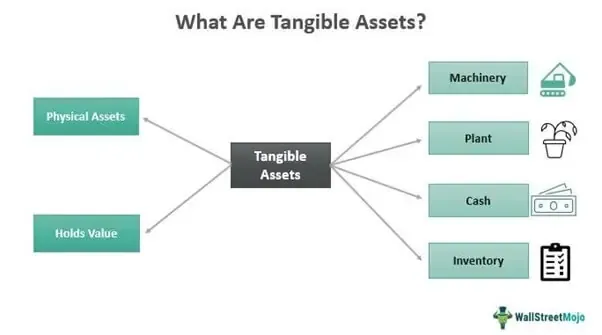

## Table of Contents

## What is Attachment Theory?

Attachment Theory is a psychological model that explains how the emotional bonds formed between children and their caregivers can influence their development and relationships throughout life. It was first developed by John Bowlby in the 1950s and later expanded by Mary Ainsworth. The theory suggests that the quality of the early attachment experiences shapes a person's expectations and behaviors in future relationships. If a child feels safe and loved, they are likely to develop a secure attachment, which can lead to healthier relationships as an adult.

There are different types of attachment styles, including secure, anxious, and avoidant. A secure attachment is formed when caregivers are consistently responsive and supportive, helping the child feel confident and secure. An anxious attachment might develop if a caregiver is inconsistently available, leading the child to feel anxious and uncertain about their relationship. An avoidant attachment can occur if a caregiver is emotionally distant or unresponsive, causing the child to learn to suppress their need for closeness. Understanding these attachment styles can help people improve their relationships and address any issues stemming from their early experiences.

## Who developed Attachment Theory and when?

Attachment Theory was developed by a man named John Bowlby. He started working on it in the 1950s. Bowlby was a psychologist who wanted to understand how the relationships between children and their caregivers affect them as they grow up. He believed that these early relationships are very important and can shape how people behave and feel in relationships later in life.

Later, another psychologist named Mary Ainsworth helped expand Bowlby's ideas. She did a lot of research and came up with different types of attachment styles. These styles help explain how children react to their caregivers and how this can influence their future relationships. Together, Bowlby and Ainsworth's work has helped many people understand the importance of early relationships.

## What are the different types of attachment styles?

Attachment styles are the ways people connect with others based on their early experiences with caregivers. There are three main types: secure, anxious, and avoidant. Secure attachment happens when caregivers are loving and responsive. Kids with secure attachment feel safe and trust that their needs will be met. This helps them have healthy relationships as adults. They are good at communicating and feel comfortable being close to others.

Anxious attachment develops when caregivers are not always there or are unpredictable. Kids with anxious attachment might feel worried and unsure about their relationships. They often need a lot of reassurance and can be clingy. As adults, they might worry a lot about their relationships and feel insecure even when things are going well.

Avoidant attachment comes from caregivers who are distant or don't respond to a child's needs. Kids with avoidant attachment learn to not depend on others and might seem independent. But inside, they might feel lonely or afraid to get close to people. As adults, they might keep others at a distance and find it hard to trust or share feelings.

## How do attachment styles develop in early childhood?

Attachment styles start to form in the first few years of a child's life. They depend a lot on how caregivers respond to the child's needs. If a caregiver is warm, loving, and quick to respond when the child is upset or needs something, the child is likely to develop a secure attachment. This makes the child feel safe and loved, which helps them trust others and feel good about themselves. On the other hand, if a caregiver is not always there or is hard to predict, the child might develop an anxious attachment. This can make the child feel worried and unsure, always wondering if their needs will be met.

If a caregiver is often distant or doesn't respond to the child's needs, the child might develop an avoidant attachment. This can make the child learn to not rely on others and seem very independent. But deep down, they might feel lonely and scared to get close to people. These early experiences with caregivers shape how the child sees relationships and can affect how they connect with others as they grow up. Understanding these attachment styles can help people work on having healthier relationships in the future.

## What role do caregivers play in the formation of attachment styles?

Caregivers play a big role in how a child's attachment style develops. When caregivers are loving and quick to respond to a child's needs, the child feels safe and cared for. This helps the child develop a secure attachment. They learn to trust others and feel good about themselves, which can lead to healthy relationships as they grow up.

On the other hand, if caregivers are not always there or are hard to predict, the child might develop an anxious attachment. The child might feel worried and unsure about their relationships, always wondering if their needs will be met. If caregivers are often distant or don't respond to the child's needs, the child might develop an avoidant attachment. They might seem very independent but inside, they could feel lonely and scared to get close to people. These early experiences with caregivers shape how the child sees relationships and can affect how they connect with others in the future.

## How does Attachment Theory apply to adult relationships?

Attachment Theory helps us understand how the way we were cared for as kids affects our relationships as adults. If we felt safe and loved when we were young, we are likely to have a secure attachment style. This means we feel good about ourselves and trust others easily. We can have healthy relationships because we are good at talking and being close to others. But if our caregivers were not always there or were hard to predict, we might have an anxious attachment style. This can make us feel worried and unsure in our relationships, always needing a lot of reassurance from our partners.

If our caregivers were distant or didn't respond to our needs when we were young, we might have an avoidant attachment style. As adults, we might keep others at a distance and find it hard to trust or share our feelings. Even though we might seem independent, we could feel lonely inside. Understanding our attachment style can help us work on our relationships. By knowing where our feelings and behaviors come from, we can try to build healthier connections with others and feel better about ourselves.

## What are the long-term effects of different attachment styles on personal development?

The way we connect with our caregivers when we are little can have big effects on how we grow up and live our lives. If we had a secure attachment, we usually feel good about ourselves and trust others easily. This helps us make friends, do well in school, and have healthy relationships as adults. We are better at solving problems, feeling our emotions, and being happy. A secure attachment makes us feel strong and ready to face life's challenges.

If we had an anxious attachment, we might always feel worried and unsure in our relationships. This can make it hard to trust people and feel safe. As adults, we might need a lot of attention and reassurance from others, which can make relationships tiring for everyone. We might also struggle with feeling anxious or depressed. An avoidant attachment can make us keep others at a distance and find it hard to share our feelings. We might seem very independent, but inside we could feel lonely and scared to get close to people. This can make it hard to build deep, meaningful relationships and might lead to feeling alone or unhappy.

## How can attachment styles influence mental health outcomes?

Attachment styles can have a big impact on our mental health as we grow up. If we had a secure attachment when we were little, we are more likely to feel good about ourselves and trust others. This can help us stay happy and handle stress well. People with a secure attachment often have fewer problems with anxiety or depression because they feel loved and supported. They are better at dealing with their feelings and building strong relationships, which can make them feel more stable and happy.

On the other hand, if we had an anxious attachment, we might always feel worried and unsure in our relationships. This can lead to a lot of anxiety and sometimes even depression. We might need a lot of attention and reassurance from others, which can make us feel tired and stressed out. An avoidant attachment can make us keep others at a distance and find it hard to share our feelings. This can make us feel lonely and unhappy, even though we might seem very independent. It can lead to problems like depression or difficulty connecting with others, which can affect our mental health in a big way.

## What are the mechanisms through which attachment influences behavior and emotions?

Attachment influences behavior and emotions through the way we learn to connect with others when we are little. If we felt safe and loved by our caregivers, we develop a secure attachment. This makes us feel good about ourselves and trust others easily. When we grow up, we are better at understanding our feelings and talking about them. We can handle stress well and build strong relationships because we know we can count on others. This helps us feel happy and stable in our lives.

If our caregivers were not always there or were hard to predict, we might develop an anxious attachment. This can make us feel worried and unsure in our relationships. We might always need a lot of attention and reassurance from others, which can make us feel stressed and anxious. As adults, we might have trouble trusting people and feel sad or worried a lot. An avoidant attachment can happen if our caregivers were distant or didn't respond to our needs. This can make us keep others at a distance and find it hard to share our feelings. We might seem very independent, but inside we could feel lonely and scared to get close to people. This can lead to feeling unhappy and having trouble connecting with others.

## How can attachment styles be assessed and measured in clinical settings?

In clinical settings, attachment styles can be assessed and measured using different tools and methods. One common way is through interviews, like the Adult Attachment Interview (AAI). This interview asks people about their childhood and their relationships with their parents. It helps clinicians understand how someone thinks and feels about their early experiences. By listening to how a person talks about these experiences, clinicians can figure out if they have a secure, anxious, or avoidant attachment style. Another way is using questionnaires, like the Experiences in Close Relationships (ECR) scale. This asks people about their feelings and behaviors in their current relationships, which can show their attachment style.

Another tool used is the Strange Situation Procedure, which is mainly used with young children. In this test, a child is observed playing and interacting with their caregiver and a stranger in a controlled setting. The way the child reacts when the caregiver leaves and comes back can show if they have a secure, anxious, or avoidant attachment. For adults, self-report measures like the Attachment Style Questionnaire (ASQ) are also used. These ask people to answer questions about how they feel in relationships, helping clinicians understand their attachment style. By using these different methods, clinicians can get a good picture of someone's attachment style and how it might affect their life and relationships.

## What interventions are effective for addressing insecure attachment styles?

To help people with insecure attachment styles, therapists often use different kinds of therapy. One common method is called attachment-based therapy. This therapy helps people understand how their early experiences with caregivers affect their relationships now. The therapist works with the person to build a safe and trusting relationship. This can help the person feel more secure and learn new ways to connect with others. Another helpful approach is cognitive-behavioral therapy (CBT). This type of therapy helps people change the way they think and behave in relationships. By working on these thoughts and behaviors, people can feel less anxious or avoidant and build healthier connections.

Another effective intervention is called Emotionally Focused Therapy (EFT). This therapy focuses on helping couples improve their relationship by working on their emotional bonds. It helps both partners understand and express their feelings better, which can lead to a more secure attachment. For children, interventions like Theraplay can be very helpful. Theraplay is a type of play therapy that helps children and their caregivers build a stronger, more loving relationship. Through fun and engaging activities, children can feel more secure and loved. All these interventions aim to help people move from an insecure attachment to a more secure one, leading to happier and healthier relationships.

## How does recent research expand our understanding of Attachment Theory and its applications?

Recent research has helped us learn more about Attachment Theory and how it can be used in different ways. Scientists have found that attachment styles are not just set in stone from childhood but can change over time. This means that even if someone had an anxious or avoidant attachment as a child, they can work on building a more secure attachment as an adult. Studies also show that attachment can affect more than just personal relationships. It can influence how well someone does at work, how they handle stress, and even their physical health. Understanding this can help therapists and counselors use attachment-based methods to help people in many areas of their lives.

Another important finding is that attachment styles can be different in different relationships. For example, someone might have a secure attachment with their best friend but an anxious attachment with their partner. This shows that our attachment styles are not the same in every situation. Recent research also looks at how culture and society can affect attachment. In some cultures, being independent is valued more than being close to others, which can shape how people form attachments. By knowing these things, therapists can tailor their approaches to fit each person's unique situation and help them build stronger, healthier connections.

## References & Further Reading

[1]: Ainsworth, M. D. S., & Bowlby, J. (1991). ["An Ethological Approach to Personality Development."](https://psycnet.apa.org/record/1991-23791-001) American Psychologist, 46(4), 333–341.

[2]: Shiller, R. J. (2008). ["The Subprime Solution: How Today's Global Financial Crisis Happened, and What to Do about It."](https://www.jstor.org/stable/j.cttq94jd) Princeton University Press.

[3]: Baker, M., & Wurgler, J. (2007). ["Investor Sentiment in the Stock Market."](https://www.jstor.org/stable/30033721) Journal of Economic Perspectives, 21(2), 129–151. 

[4]: ["Attachment in Adulthood: Structure, Dynamics, and Change"](https://psycnet.apa.org/record/2007-12400-000) by Mario Mikulincer and Philip R. Shaver

[5]: Bowlby, J. (1982). ["Attachment and Loss: Retrospect and Prospect."](https://onlinelibrary.wiley.com/doi/abs/10.1111/j.1939-0025.1982.tb01456.x) American Journal of Orthopsychiatry, 52(4), 664–678.