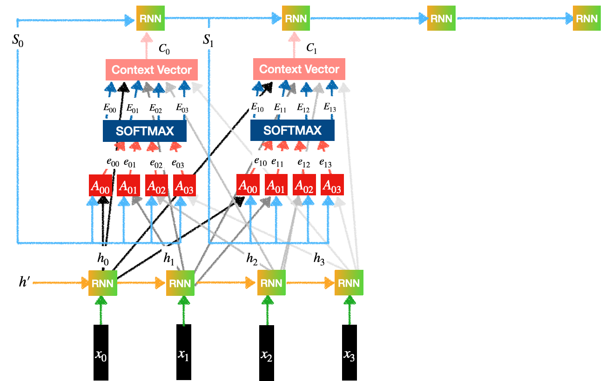

## Table of Contents

## What is an attention mechanism in machine learning?

An attention mechanism in machine learning is a technique that helps models focus on the most relevant parts of the input data when making predictions or generating outputs. Imagine you're reading a long document to answer a question. Instead of reading the entire document, you'd skim through it and pay more attention to the sections that seem most relevant to your question. That's what attention mechanisms do for machine learning models; they allow the model to weigh different parts of the input data differently, emphasizing the parts that are most important for the task at hand.

Attention mechanisms are particularly useful in tasks like machine translation, where the model needs to understand and align parts of a sentence in one language to another. For example, when translating a sentence from English to French, the model can use attention to focus on the English words that are most relevant to the French words it is currently generating. This helps improve the accuracy and coherence of the translation. In essence, attention mechanisms help models to be more efficient and effective by allowing them to concentrate on the most pertinent information, much like how a human would approach a complex task.

## How does the basic concept of attention work in neural networks?

The basic concept of attention in neural networks is like giving the model a way to focus on certain parts of the input data. Think of it as if you're reading a book and you want to answer a question about it. You wouldn't read the whole book again; instead, you'd quickly look through it and pay more attention to the parts that seem important for your question. In neural networks, attention mechanisms do something similar. They help the model decide which parts of the input data are more important for the task it's trying to do, like translating a sentence or answering a question.

To make this work, the model calculates something called attention scores. These scores tell the model how much it should focus on each part of the input. The model uses these scores to create a weighted sum of the input, where the parts with higher scores get more weight. This weighted sum is what the model then uses to make its predictions or generate its output. So, attention mechanisms help the model be more efficient and accurate by letting it concentrate on the most relevant information, much like how a person would focus on key details when solving a problem.

## What are the different types of attention mechanisms used in machine learning?

There are several types of attention mechanisms used in machine learning, each designed for different purposes and tasks. The most common types are self-attention, multi-head attention, and global vs. local attention. Self-attention, often used in transformers, allows the model to relate different positions of a single sequence in order to compute a representation of the sequence. This is useful in tasks like language understanding, where the model needs to understand how different words in a sentence relate to each other. Multi-head attention, a variation of self-attention, allows the model to jointly attend to information from different representation subspaces at different positions. This can be visualized as the model looking at the input data from multiple perspectives, which can improve the model's understanding and performance.

Global and local attention mechanisms differ in their scope of focus. Global attention considers all parts of the input sequence when computing attention scores, which can be computationally expensive but provides a comprehensive view of the input. Local attention, on the other hand, focuses on a smaller, predefined window of the input sequence, making it more efficient but potentially less accurate for tasks that require understanding the entire context. For example, in machine translation, global attention might be more suitable because it can consider the entire source sentence when translating, while local attention might be used in tasks where only a small context is necessary.

In practical implementations, attention mechanisms can be expressed in different ways. For instance, the attention scores can be computed using a softmax function over the dot products of query and key vectors. The formula for this can be written as $$ \text{Attention}(Q, K, V) = \text{softmax}\left(\frac{QK^T}{\sqrt{d_k}}\right)V $$, where $$Q$$ are the query vectors, $$K$$ are the key vectors, $$V$$ are the value vectors, and $$d_k$$ is the dimension of the key vectors. This formula is commonly used in transformer models and helps in weighting the importance of different parts of the input data.

## Can you explain the difference between Scaled Dot-Product Attention and Additive Attention?

Scaled Dot-Product Attention and Additive Attention are two different ways to calculate attention scores in neural networks. Scaled Dot-Product Attention is simpler and more commonly used, especially in transformer models. It works by taking the dot product of query and key vectors, scaling it down by the square root of the key vector's dimension, and then applying a softmax function to get the attention weights. The formula for this is $$ \text{Attention}(Q, K, V) = \text{softmax}\left(\frac{QK^T}{\sqrt{d_k}}\right)V $$. This method is efficient because it uses matrix operations that can be easily parallelized on modern hardware.

Additive Attention, also known as Bahdanau attention, is a bit more complex but can be more flexible. Instead of using a dot product, it uses a neural network to compute the attention scores. This involves concatenating the query and key vectors, passing them through a feedforward neural network, and then applying a softmax function to get the attention weights. While this method can capture more complex relationships between the query and key vectors, it is computationally more expensive than Scaled Dot-Product Attention. Additive Attention can be useful in scenarios where the relationships between the input elements are more intricate and require a deeper understanding.

## How does Temporal Attention differ from Channel Attention, and where are they commonly applied?

Temporal Attention and Channel Attention are two types of attention mechanisms used in different ways in neural networks. Temporal Attention focuses on different time steps in sequential data, like video frames or text sentences. It helps the model pay more attention to certain moments in time that are more important for the task. For example, in video analysis, Temporal Attention can help the model focus on key frames that show important actions. In contrast, Channel Attention looks at different channels or features of the data, like the different color channels in an image or different filters in a convolutional neural network. It helps the model understand which features are more important for the task at hand. For instance, in image recognition, Channel Attention can help the model focus on the color channels that are most useful for identifying objects.

Both types of attention are commonly applied in different fields. Temporal Attention is often used in natural language processing and video analysis. In language tasks, it helps models understand the context and focus on relevant words or phrases in a sentence. In video tasks, it helps models pay attention to important frames or sequences of frames. Channel Attention, on the other hand, is widely used in image processing and computer vision tasks. It helps models focus on the most relevant features in an image, improving their ability to recognize and classify objects. By using these attention mechanisms, models can become more efficient and effective at their tasks, much like how a person would focus on key details when solving a problem.

## What is the role of attention mechanisms in Transformer models?

Attention mechanisms are a key part of Transformer models, helping them understand and process data better. In Transformers, attention allows the model to focus on different parts of the input data, like words in a sentence, when making predictions or generating outputs. This is important because it helps the model understand the context and relationships between different parts of the data. For example, when translating a sentence, the model can use attention to focus on the words in the original language that are most important for the words it is currently translating. This makes the model's predictions more accurate and helps it handle long sequences of data more effectively.

The main type of attention used in Transformers is called self-attention, which lets the model relate different positions of a single sequence to compute a representation of the sequence. The self-attention mechanism calculates attention scores using a formula called Scaled Dot-Product Attention, which is $$ \text{Attention}(Q, K, V) = \text{softmax}\left(\frac{QK^T}{\sqrt{d_k}}\right)V $$. Here, $$Q$$ are the query vectors, $$K$$ are the key vectors, $$V$$ are the value vectors, and $$d_k$$ is the dimension of the key vectors. This formula helps the model weigh the importance of different parts of the input data. Transformers also use multi-head attention, which allows the model to look at the input data from different perspectives, improving its understanding and performance. By using these attention mechanisms, Transformers can process and understand complex data more effectively than traditional models.

## How do advanced attention mechanisms like Axial Attention and Global-Local Attention enhance model performance?

Advanced attention mechanisms like Axial Attention and Global-Local Attention help models work better by making them more efficient and able to handle bigger data. Axial Attention breaks down the attention process into smaller, more manageable parts. Instead of looking at the whole input at once, it looks at it row by row or column by column. This makes the model faster and able to handle bigger inputs without using too much memory. For example, in image processing, Axial Attention can look at an image one row at a time, which is easier on the computer than looking at the whole image at once.

Global-Local Attention, on the other hand, combines the best of both worlds. It uses global attention to get a broad understanding of the input and local attention to focus on the details. This helps the model understand the big picture while still paying attention to the important small parts. For instance, in natural language processing, Global-Local Attention can help a model understand the overall meaning of a long document while also focusing on the specific words or phrases that are key to answering a question. By using these advanced attention mechanisms, models can perform better and handle more complex tasks.

## What are the computational challenges faced by attention mechanisms, and how can techniques like Sparse Sinkhorn Attention address them?

Attention mechanisms can be computationally heavy, especially when dealing with long sequences of data. The main challenge is that they need to calculate attention scores for every pair of elements in the input, which can become very slow and memory-intensive as the input size grows. For example, in a long document, the model has to consider how every word relates to every other word, which can take a lot of time and computer power. This makes it hard for models to handle big inputs like long videos or large images efficiently.

Sparse Sinkhorn Attention is a technique that helps solve these computational challenges by making the attention process more efficient. Instead of calculating attention scores for every pair of elements, Sparse Sinkhorn Attention uses a method called the Sinkhorn algorithm to focus on only the most important connections. This reduces the number of calculations the model needs to do, making it faster and using less memory. The formula for Sparse Sinkhorn Attention can be written as $$ \text{SparseSinkhorn}(Q, K, V) = \text{sinkhorn}\left(\frac{QK^T}{\sqrt{d_k}}\right)V $$, where the sinkhorn function helps to sparsify the attention matrix. By using this technique, models can handle larger inputs more effectively without sacrificing too much accuracy.

## How do attention mechanisms contribute to tasks like visual question answering and image segmentation?

Attention mechanisms help models focus on the important parts of images and questions in tasks like visual question answering (VQA). In VQA, a model needs to understand both an image and a question about that image to give the right answer. Attention helps the model look at the parts of the image that are most relevant to the question. For example, if the question is "What color is the dog's collar?", the model can use attention to focus on the dog's collar in the image and ignore other parts like the background. This makes the model's answers more accurate and helps it understand complex scenes better.

In image segmentation, attention mechanisms help the model identify and outline different objects in an image. The model uses attention to focus on different parts of the image, like the edges or colors, that are important for distinguishing one object from another. For example, when segmenting an image of a busy street, the model can use attention to focus on the cars, pedestrians, and buildings separately. This helps the model create more accurate and detailed segmentations, making it easier to understand what's in the image and how different parts relate to each other.

## Can you discuss the application of attention in reinforcement learning, specifically with models like RAM and RAN?

Attention mechanisms have found significant applications in reinforcement learning, particularly in models like Recurrent Attention Model (RAM) and Recurrent Attention Network (RAN). In RAM, attention helps the model focus on different parts of an input image over time, much like how a human might scan a scene to gather information. The model uses a glimpse sensor to take small, focused views of the image, and attention decides where to look next based on what it has seen so far. This approach allows the model to efficiently process high-dimensional inputs like images without needing to analyze the entire image at once. By concentrating on relevant parts, RAM can make better decisions in tasks like object recognition or navigation.

Similarly, RAN uses attention to enhance its decision-making process in reinforcement learning tasks. In RAN, the model applies attention to both spatial and temporal aspects of the input data. This means it can focus on specific regions of an image or specific moments in a sequence of actions, improving its ability to learn and perform tasks like game playing or robot control. By using attention, RAN can dynamically adjust its focus based on the current state of the environment, leading to more effective and adaptive learning. Both RAM and RAN demonstrate how attention can significantly improve the performance of reinforcement learning models by allowing them to prioritize and process the most relevant information.

## What are some recent innovations in attention mechanisms, such as HyperHyperNetwork and Vision Eagle Attention?

HyperHyperNetwork is a new idea in attention mechanisms that helps models learn how to create other models. It uses attention to figure out which parts of the data are important for making different parts of the new model. This can be really helpful in tasks like generating images or predicting future events, where the model needs to understand complex patterns. By using attention in this way, HyperHyperNetwork can make models that are better at adapting to new situations and learning from less data.

Vision Eagle Attention is another new type of attention that helps models look at images more efficiently. It uses a special way of calculating attention scores that lets the model focus on the most important parts of an image without looking at every single pixel. This makes the model faster and able to handle bigger images. For example, in tasks like finding objects in a picture, Vision Eagle Attention can help the model quickly zoom in on the key areas, making it easier to find what it's looking for.

## How can attention mechanisms be integrated with other neural network architectures like CNNs and RNNs to improve performance on complex tasks?

Attention mechanisms can be combined with Convolutional Neural Networks (CNNs) to make them better at understanding images. In a CNN, attention can help the model focus on the important parts of an image, like the edges or colors that help identify objects. For example, in image classification, the model can use attention to look at the parts of the image that are most useful for telling what's in the picture. This can make the model's predictions more accurate and help it understand complex scenes better. By using attention, CNNs can handle tasks like object detection and image segmentation more effectively, much like how a person would focus on key details when looking at a picture.

Similarly, attention mechanisms can be integrated with Recurrent Neural Networks (RNNs) to improve their performance on tasks involving sequences, like text or time series data. In an RNN, attention can help the model focus on the most relevant words or time steps when making predictions or generating outputs. For example, in natural language processing, the model can use attention to concentrate on the key words in a sentence that are important for understanding its meaning. This helps the model handle long sequences of data more effectively and makes its predictions more accurate. By combining attention with RNNs, models can better understand context and relationships in sequential data, much like how a person would focus on important details when reading a text.