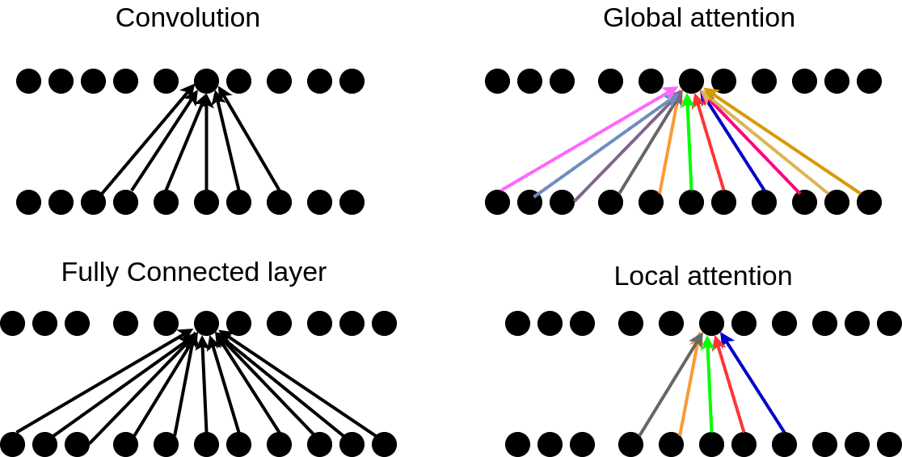

## Table of Contents

## What is attention in the context of machine learning?

Attention in machine learning is a technique that helps models focus on the most important parts of the input data when making predictions or generating outputs. Imagine you're reading a long document and need to answer a question about it. You wouldn't read the entire document again; instead, you'd quickly scan it and focus on the parts that are relevant to your question. That's similar to how attention works in machine learning. It allows the model to weigh different parts of the input data differently, giving more importance to the parts that are most relevant for the task at hand.

In technical terms, attention mechanisms compute a set of attention weights that reflect the importance of different parts of the input. These weights are then used to create a weighted sum of the input, which the model can use to make more informed decisions. For example, in natural language processing, attention can help a model understand which words in a sentence are most important for translating it into another language. The attention mechanism can be described mathematically as follows: given an input sequence $$x$$ and a query vector $$q$$, the attention weights $$a$$ are computed as $$a = \text{softmax}(\frac{q \cdot x^T}{\sqrt{d}})$$, where $$d$$ is the dimension of the query and key vectors. The output of the attention mechanism is then a weighted sum of the input, $$ \text{output} = \sum_i a_i x_i $$. This process allows the model to dynamically focus on different parts of the input, improving its performance on a wide range of tasks.

## How does attention mechanism improve the performance of neural networks?

Attention mechanisms help neural networks perform better by allowing them to focus on the most important parts of the input data. Imagine you're trying to understand a long sentence. Instead of treating every word the same, attention lets the network pay more attention to certain words that are key to understanding the sentence's meaning. This is especially useful in tasks like language translation, where the network needs to understand which words in the source language are most important for generating the correct words in the target language. By doing this, the network can make more accurate predictions and generate better outputs.

In technical terms, attention works by calculating attention weights that show how important each part of the input is. These weights are used to create a weighted sum of the input, which the network then uses to make its decisions. For example, in a sequence-to-sequence model, the attention mechanism can be described as $$a = \text{softmax}(\frac{q \cdot x^T}{\sqrt{d}})$$, where $$q$$ is a query vector, $$x$$ is the input sequence, and $$d$$ is the dimension of the vectors. The output of the attention mechanism is then $$ \text{output} = \sum_i a_i x_i $$. This process helps the network to dynamically focus on different parts of the input, making it more flexible and effective at handling complex tasks.

## What is the difference between soft attention and hard attention?

Soft attention and hard attention are two different ways attention mechanisms can work in neural networks. Soft attention is smoother and more flexible. It looks at all parts of the input and gives each part a weight, kind of like a score, to show how important it is. These weights are usually calculated using a softmax function, which makes sure all the weights add up to 1. This means the network can use information from every part of the input, but it pays more attention to some parts than others. The formula for soft attention is $$a = \text{softmax}(\frac{q \cdot x^T}{\sqrt{d}})$$ where $$q$$ is the query, $$x$$ is the input, and $$d$$ is the dimension of the vectors.

Hard attention, on the other hand, is more strict. It picks just one part of the input to focus on at a time. Instead of giving weights to all parts, it chooses the most important part and ignores the rest. This can be useful because it makes the network focus more intensely on what it thinks is most important, but it can also be harder to train because it's a more abrupt choice. Hard attention often uses techniques like [reinforcement learning](/wiki/reinforcement-learning) to decide which part to focus on. While soft attention is easier to train and use, hard attention can sometimes give better results because it's more focused.

## Can you explain the concept of Scaled Dot-Product Attention?

Scaled Dot-Product Attention is a type of attention mechanism used in neural networks. It works by taking a query and comparing it to a set of keys to figure out which parts of the input are most important. Imagine you're looking for a specific book in a library. You have a query (what you're looking for), and you compare it to the titles of the [books](/wiki/algo-trading-books) (the keys). The more similar the query is to a key, the more attention you pay to that book. In this case, the attention mechanism calculates how similar the query is to each key and uses that to decide which parts of the input to focus on.

The way Scaled Dot-Product Attention works is by taking the dot product of the query with each key, scaling it down by the square root of the dimension of the keys, and then applying a softmax function to get attention weights. The formula for this is $$a = \text{softmax}(\frac{q \cdot k^T}{\sqrt{d_k}})$$ where $$q$$ is the query, $$k$$ is the key, and $$d_k$$ is the dimension of the key vectors. These weights are then used to create a weighted sum of the values, which gives the final output. This method helps the network focus on the most relevant parts of the input, making its predictions more accurate and useful.

## What is Multi-Head Attention and how does it differ from single-head attention?

Multi-Head Attention is a way to improve attention mechanisms in neural networks by using multiple sets of attention, called "heads," at the same time. Each head looks at the input in a different way, kind of like having multiple people read the same book but focusing on different aspects of the story. By combining the results from all these heads, the network can understand the input better and make more accurate predictions. The formula for Multi-Head Attention is $$ \text{MultiHead}(Q, K, V) = \text{Concat}(\text{head}_1, \text{head}_2, ..., \text{head}_h)W^O $$ where $$ \text{head}_i = \text{Attention}(QW_i^Q, KW_i^K, VW_i^V) $$ and $$ W_i^Q, W_i^K, W_i^V, W^O $$ are learned weight matrices.

Single-head attention, on the other hand, uses just one set of attention weights to focus on the input. It's simpler and can still be very effective, but it doesn't have the advantage of looking at the input from multiple perspectives like Multi-Head Attention does. Single-head attention uses the same basic formula as Scaled Dot-Product Attention, $$ a = \text{softmax}(\frac{q \cdot k^T}{\sqrt{d_k}}) $$, but it only does this once, without the extra heads. This means it might miss some important details that Multi-Head Attention could catch.

## How does the Self-Attention mechanism work in transformers?

Self-Attention in transformers is a way for the model to understand how different parts of the input relate to each other. Imagine you're reading a sentence and want to understand how each word connects to the others. Self-Attention helps the model focus on different words and figure out which ones are most important for understanding the whole sentence. It does this by comparing each word (or "token") to every other word, calculating how similar they are, and then using that information to weigh the importance of each word. The formula for this is $$a = \text{softmax}(\frac{q \cdot k^T}{\sqrt{d_k}})$$ where $$q$$ is the query vector for a word, $$k$$ is the key vector for another word, and $$d_k$$ is the dimension of the key vectors. This way, the model can see the whole sentence at once and understand how all the parts fit together.

In the transformer model, self-attention is applied to all the words in the input sequence at the same time. Each word gets its own query, key, and value vectors, which are created by multiplying the word's input vector by learned weight matrices. The self-attention mechanism then uses these vectors to compute attention scores for each word with respect to every other word. After calculating the attention scores, the model creates a weighted sum of the value vectors based on these scores, which gives the final output for each word. This process allows the model to consider the context of every word in the sentence, making it better at understanding and generating language.

## What are some common applications of attention mechanisms in natural language processing?

Attention mechanisms are really useful in natural language processing (NLP). They help machines understand and work with text better. One common use is in machine translation. When translating a sentence from one language to another, attention helps the model focus on the most important words in the original sentence. This makes the translation more accurate because the model can see which words are key to understanding the meaning. For example, if you're translating "The cat is on the mat" to another language, the model can pay more attention to "cat" and "mat" because they are central to the sentence's meaning.

Another application of attention is in text summarization. When you want to create a short summary of a long document, attention helps the model pick out the most important sentences or phrases. This way, the summary captures the main points without including unnecessary details. Attention also helps in tasks like sentiment analysis, where the model needs to understand which words contribute most to the overall sentiment of a piece of text. By focusing on these key words, the model can better determine if the text is positive, negative, or neutral.

## How can attention be applied to computer vision tasks?

In computer vision, attention helps machines focus on the most important parts of an image, just like how it helps with text in natural language processing. Imagine you're looking at a busy street scene and trying to find a specific object, like a bicycle. Instead of looking at the whole scene equally, you'd quickly scan and focus on areas where a bicycle is likely to be. Attention mechanisms in computer vision do something similar. They help the model pay more attention to certain parts of the image that are more relevant to the task at hand, like object detection or image classification.

For example, in object detection, attention can help the model find and focus on different objects within an image. The model uses attention to look at different regions of the image and decide which ones are most likely to contain the objects it's looking for. This makes the model more efficient and accurate because it doesn't waste time on less important parts of the image. In image classification, attention can help the model understand which parts of the image are most important for deciding what the image shows. By focusing on these key areas, the model can better classify the image, even if it's complex or has a lot of different elements.

## What is the role of attention in sequence-to-sequence models?

In sequence-to-sequence models, attention helps the model focus on the most important parts of the input when generating the output. Imagine you're translating a sentence from one language to another. Instead of just looking at the whole sentence at once, attention lets the model pay more attention to certain words that are key to understanding the meaning. For example, if you're translating "The cat is on the mat," the model can focus more on "cat" and "mat" because they are central to the sentence's meaning. This makes the translation more accurate because the model knows which parts of the input are most important for each part of the output.

The way attention works in these models is by calculating attention weights. These weights show how important each part of the input is for generating each part of the output. The formula for this is $$a = \text{softmax}(\frac{q \cdot x^T}{\sqrt{d}})$$, where $$q$$ is a query vector, $$x$$ is the input sequence, and $$d$$ is the dimension of the vectors. The model uses these weights to create a weighted sum of the input, which helps it generate the output more accurately. By doing this, the model can better understand the relationship between the input and output sequences, making it more effective at tasks like translation, summarization, and more.

## Can you describe the concept of Cross-Attention and its applications?

Cross-Attention is a way for a model to look at two different pieces of information and see how they relate to each other. Imagine you're reading a book and you need to answer questions about it. Cross-Attention helps the model focus on the parts of the book that are most important for answering each question. It does this by comparing the question (the query) to different parts of the book (the keys) and figuring out which parts are most relevant. The formula for Cross-Attention is similar to self-attention, $$a = \text{softmax}(\frac{q \cdot k^T}{\sqrt{d_k}})$$ where $$q$$ is the query vector from one sequence, $$k$$ is the key vector from another sequence, and $$d_k$$ is the dimension of the key vectors. This way, the model can understand how the two pieces of information connect and use that to make better predictions or generate more accurate outputs.

Cross-Attention is really useful in tasks like machine translation and question-answering. In machine translation, the model uses Cross-Attention to compare the sentence in the original language (the source) to the sentence it's trying to create in the new language (the target). By focusing on the most important words in the source sentence, the model can create a better translation. In question-answering, Cross-Attention helps the model find the parts of a document or a passage that are most relevant to the question being asked. This makes it easier for the model to find the right answer and give a more accurate response. Overall, Cross-Attention helps models understand and use information from different sources more effectively, making them better at a wide range of tasks.

## What are some advanced attention mechanisms like FlashAttention and how do they optimize performance?

FlashAttention is a new way to make attention mechanisms faster and use less memory. It does this by breaking down the attention calculation into smaller pieces that can be done one after the other. This means the computer doesn't have to keep all the data in memory at once, which saves space and makes things run faster. Instead of calculating all the attention scores at the same time, FlashAttention does it in chunks, which is like solving a big puzzle by working on smaller parts first. This method is especially helpful when dealing with very long sequences of data, like long documents or videos, because it keeps the process efficient and manageable.

In technical terms, FlashAttention optimizes the standard attention formula $$a = \text{softmax}(\frac{q \cdot k^T}{\sqrt{d_k}})$$ by breaking it into smaller, more manageable steps. This approach reduces the peak memory usage and speeds up the computation by allowing the model to process data in a streaming fashion. By doing so, FlashAttention can handle larger inputs and perform better on tasks that require understanding long sequences, making it a powerful tool for improving the performance of models in areas like natural language processing and computer vision.

## How do attention mechanisms contribute to the interpretability of deep learning models?

Attention mechanisms help make [deep learning](/wiki/deep-learning) models easier to understand by showing which parts of the input the model is focusing on. Imagine you're reading a long article and trying to answer a question about it. You would quickly scan the text and focus on the parts that seem most relevant to the question. Attention mechanisms do something similar for deep learning models. By highlighting which parts of the input, like words in a sentence or pixels in an image, the model pays more attention to, we can see how the model makes its decisions. This makes it easier for people to understand why the model gives a certain answer or prediction.

For example, in a model that translates sentences from one language to another, attention can show which words in the original sentence are most important for each word in the translated sentence. If you see that the model is focusing on the word "cat" when translating "The cat is on the mat," it makes sense that the model is trying to understand and translate that part correctly. This transparency helps researchers and users trust the model more because they can see the reasoning behind its outputs. By using attention, we can make deep learning models not just more accurate but also more interpretable, which is crucial for applying these models in real-world situations where understanding the model's decisions is important.