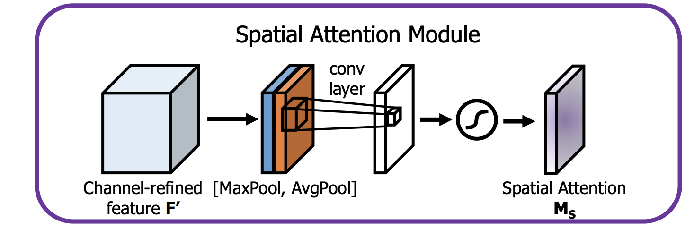

## Table of Contents

## What is an attention module in machine learning?

An attention module in machine learning is a part of a neural network that helps the model focus on the most important parts of the input data. Imagine you're reading a long article and you want to quickly find the main points. Instead of reading every word, you might skim through and pay more attention to certain sentences or keywords. An attention module does something similar for a machine learning model. It allows the model to weigh different parts of the input data differently, so it can focus on what's most relevant for the task at hand.

For example, in a language translation task, an attention module can help the model pay more attention to certain words in the source language that are crucial for translating into the target language. This is especially useful for long sentences where not every word is equally important. The attention mechanism calculates a score for each part of the input, and these scores are used to decide how much focus should be given to each part. This way, the model can better understand and process the input, leading to more accurate outputs.

## How does the Multi-Head Attention mechanism work?

Multi-Head Attention is a way to let a machine learning model look at different parts of the input data in multiple ways at the same time. Think of it like having several pairs of eyes, each looking at the same picture but focusing on different details. In this mechanism, the input data is transformed into three sets of vectors: Query, Key, and Value. The model uses these vectors to calculate how much attention should be paid to each part of the input. This is done by computing a score between the Query and Key vectors, which is then used to weigh the Value vectors. The attention scores are calculated as $$ \text{Attention}(Q, K, V) = \text{softmax}\left(\frac{QK^T}{\sqrt{d_k}}\right)V $$, where $$Q$$ is the Query, $$K$$ is the Key, $$V$$ is the Value, and $$d_k$$ is the dimension of the Key vectors.

Instead of using just one set of Query, Key, and Value vectors, Multi-Head Attention splits them into several "heads." Each head performs the attention calculation independently, allowing the model to capture different aspects of the input data. The outputs from all these heads are then combined to form the final attention output. This combination is done by concatenating the outputs from each head and then applying a linear transformation. The process can be described as follows: the input is first linearly transformed into multiple sets of Query, Key, and Value vectors, attention is computed for each set, and the results are concatenated and transformed again. This allows the model to have a richer understanding of the input by considering it from multiple perspectives simultaneously.

## What are the key differences between Spatial Attention and Channel Attention Modules?

Spatial Attention and Channel Attention Modules are two types of attention mechanisms used in [deep learning](/wiki/deep-learning), especially in tasks like image processing. Spatial Attention focuses on which parts of an image are important. It creates a map that shows where in the image the model should pay more attention. This is useful for tasks where different regions of an image might have different importance. For example, in object detection, the model might need to focus on the area where an object is located. Spatial Attention helps by creating a 2D map that highlights important areas, which can be represented as $$ \text{Spatial Attention} = f(\text{input}) $$, where $$ f $$ is a function that generates the attention map.

On the other hand, Channel Attention looks at which channels (or features) in the image are more important. In a [convolutional [neural network](/wiki/neural-network)](/wiki/convolutional-neural-network), each channel represents a different feature of the image, like edges or colors. Channel Attention helps the model decide which of these features are more relevant for the task at hand. It does this by creating a 1D vector that weights each channel differently. This can be represented as $$ \text{Channel Attention} = g(\text{input}) $$, where $$ g $$ is a function that generates the channel weights. By focusing on different channels, the model can better understand and process the image.

Both types of attention can be used together to improve the performance of a model. Spatial Attention helps the model focus on where to look, while Channel Attention helps it decide what to look for. By combining these two, the model can have a more comprehensive understanding of the input, leading to better results in tasks like image classification or segmentation.

## Can you explain the function of the SAGAN Self-Attention Module?

The Self-Attention GAN (SAGAN) Self-Attention Module helps the model understand different parts of an image better. Imagine you're looking at a picture and you want to focus on the most important parts. The Self-Attention Module in SAGAN does something similar. It looks at the whole image and decides which parts are more important to pay attention to. This helps the model generate better images because it can focus on the right details.

The way it works is by creating three sets of vectors from the input image: Query, Key, and Value. These vectors help the model calculate how much attention to give to each part of the image. The attention scores are calculated using the formula $$ \text{Attention}(Q, K, V) = \text{softmax}\left(\frac{QK^T}{\sqrt{d_k}}\right)V $$, where $$Q$$ is the Query, $$K$$ is the Key, $$V$$ is the Value, and $$d_k$$ is the dimension of the Key vectors. By using these scores, the model can focus on the most relevant parts of the image, making the generated images more detailed and realistic.

## How does the Cross-Attention Module facilitate information exchange between different data streams?

Cross-Attention Modules help different data streams talk to each other in [machine learning](/wiki/machine-learning) models. Think of it like having two friends who speak different languages, and you want them to understand each other. The Cross-Attention Module acts as a translator, allowing one data stream to focus on the important parts of the other data stream. It does this by creating Query vectors from one stream and Key and Value vectors from the other stream. The attention scores are then calculated using the formula $$ \text{Attention}(Q, K, V) = \text{softmax}\left(\frac{QK^T}{\sqrt{d_k}}\right)V $$, where $$Q$$ is the Query, $$K$$ is the Key, $$V$$ is the Value, and $$d_k$$ is the dimension of the Key vectors. This way, the model can better understand and use information from both streams.

For example, in a task like image captioning, one data stream might be the image, and the other might be the text of the caption. The Cross-Attention Module helps the model focus on the parts of the image that are most relevant to the words in the caption. By doing this, the model can generate more accurate and detailed captions because it knows which parts of the image to pay attention to when describing it in words. This exchange of information between different data streams is crucial for tasks that require understanding and combining different types of data.

## What are the advantages of using a Deformable Attention Module over traditional attention mechanisms?

Deformable Attention Modules are better than traditional attention mechanisms because they can focus on more flexible parts of the input. Traditional attention looks at fixed spots in the input, but deformable attention can move around and look at different spots that might be more important. This is like having a camera that can zoom in and move to different parts of a picture, instead of just looking at the same spots every time. By doing this, deformable attention can capture more details and understand the input better, which is really helpful for tasks like image processing where the important parts might be in different places each time.

Another advantage of deformable attention is that it can handle changes in the input more easily. For example, if you're looking at a video where objects are moving, traditional attention might keep looking at the same spot even though the object has moved. But deformable attention can follow the object and keep focusing on it. This makes the model more accurate and able to work with different kinds of data. The way it works is by using a formula like $$ \text{Deformable Attention}(Q, K, V) = \sum_{i=1}^{N} A_i \cdot V(p_i + \Delta p_i) $$, where $$A_i$$ is the attention weight, $$V$$ is the value, $$p_i$$ is the fixed position, and $$\Delta p_i$$ is the offset that lets the attention move around. This flexibility makes deformable attention a powerful tool for many machine learning tasks.

## How does the CBAM (Convolutional Block Attention Module) enhance feature representation in CNNs?

The CBAM (Convolutional Block Attention Module) makes Convolutional Neural Networks (CNNs) better at understanding images by focusing on the most important parts. It does this by using two types of attention: channel attention and spatial attention. Channel attention helps the model decide which features, like edges or colors, are more important. Spatial attention helps the model focus on which parts of the image are more important. By using both types of attention, CBAM can make the model pay attention to the right details in the right places, which makes the feature representation more accurate and detailed.

In CBAM, the process starts with channel attention. The model looks at all the features it has found in the image and decides which ones are more important. It does this by creating a 1D vector that weighs each feature differently. This can be shown as $$ \text{Channel Attention} = g(\text{input}) $$, where $$ g $$ is a function that generates the weights. After that, the model uses spatial attention to focus on different parts of the image. It creates a 2D map that shows which areas of the image are more important, which can be represented as $$ \text{Spatial Attention} = f(\text{input}) $$, where $$ f $$ is a function that generates the attention map. By combining these two types of attention, CBAM helps the CNN understand and process images better, leading to improved performance in tasks like image classification and object detection.

## What is the role of the Global Context Block in capturing long-range dependencies?

The Global Context Block helps machine learning models understand how different parts of the input are connected, even if they are far apart. Imagine you're reading a book and you need to understand how the beginning relates to the end. The Global Context Block does something similar for the model. It looks at the entire input at once and figures out which parts are important to each other, no matter how far apart they are. This is really helpful for tasks like image recognition, where understanding the whole picture can be more important than focusing on small parts.

The way the Global Context Block works is by creating a special kind of attention. It uses a formula like $$ \text{Global Context}(x) = \text{softmax}(W_v^T x) \cdot W_k^T x $$, where $$x$$ is the input, $$W_v$$ and $$W_k$$ are learned weights. This formula helps the model see the big picture and understand how all the pieces fit together. By doing this, the Global Context Block makes the model better at tasks where understanding long-range dependencies is important, like in natural language processing or complex image analysis.

## How does the Triplet Attention mechanism improve upon traditional attention techniques?

The Triplet Attention mechanism improves upon traditional attention techniques by looking at the input data in three different ways at the same time. It splits the input into three parts: height, width, and channel. By doing this, Triplet Attention can focus on different aspects of the input, like the vertical lines, horizontal lines, and the different features in the image. This helps the model understand the input better because it can see it from multiple angles. Traditional attention might only look at the input in one way, which can miss important details. But with Triplet Attention, the model can capture more information and make better decisions.

The way Triplet Attention works is by creating three sets of attention maps, one for each dimension of the input. It uses a formula like $$ \text{Triplet Attention}(x) = \text{Attention}_H(x) \cdot \text{Attention}_W(x) \cdot \text{Attention}_C(x) $$, where $$x$$ is the input, and $$\text{Attention}_H$$, $$\text{Attention}_W$$, and $$\text{Attention}_C$$ are the attention maps for height, width, and channel, respectively. By multiplying these attention maps together, the model can focus on the most important parts of the input in all three dimensions. This makes the model more accurate and efficient, especially for tasks like image recognition where understanding the whole picture is crucial.

## Can you describe the architecture and benefits of the Bottleneck Transformer Block?

The Bottleneck Transformer Block is a special part of a machine learning model that helps it understand and process information better. It's called a "bottleneck" because it first squeezes the input data into a smaller size, and then it uses a Transformer to look at this smaller data in a smart way. The Transformer part is like having a friend who can read and understand a lot of information quickly. It uses something called self-attention to focus on the most important parts of the data. The formula for self-attention is $$ \text{Attention}(Q, K, V) = \text{softmax}\left(\frac{QK^T}{\sqrt{d_k}}\right)V $$, where $$Q$$ is the Query, $$K$$ is the Key, $$V$$ is the Value, and $$d_k$$ is the dimension of the Key vectors. By doing this, the Bottleneck Transformer Block can capture important details without needing too much computing power.

The benefits of using a Bottleneck Transformer Block are that it makes the model faster and more efficient. Because it squeezes the data first, it doesn't need as much memory or time to process everything. This is really helpful for tasks like image recognition or language translation, where you might have a lot of data to go through. Also, the Transformer part helps the model understand long pieces of information better, like understanding a whole sentence or a whole picture. This makes the model more accurate because it can see the big picture and the small details at the same time. Overall, the Bottleneck Transformer Block helps make machine learning models smarter and quicker.

## What are the unique features of the Re-Attention Module and its impact on model performance?

The Re-Attention Module is a special part of a machine learning model that helps it focus better on important parts of the input. It does this by looking at the input multiple times, each time adjusting its focus based on what it learned before. Imagine you're reading a book and you want to understand it better. You might read a chapter, then go back and read it again, paying more attention to the parts that seemed important the first time. The Re-Attention Module does something similar. It uses a formula like $$ \text{Re-Attention}(x) = \text{Attention}(\text{Attention}(x)) $$ to keep refining its focus. This helps the model understand the input more deeply and accurately.

Using the Re-Attention Module can make a model perform better because it can capture more details and understand the input more thoroughly. For example, in tasks like image recognition, the model can focus on the right parts of the image more effectively, leading to more accurate results. It's like having a second chance to look at the data and make sure you didn't miss anything important. By doing this, the model can improve its performance without needing more data or more computing power. This makes the Re-Attention Module a powerful tool for many machine learning tasks.

## How does the Attention-augmented Convolution combine the strengths of convolutional and attention mechanisms?

The Attention-augmented Convolution combines the strengths of convolutional and attention mechanisms by allowing a model to both focus on local details and understand global context. In traditional convolutional neural networks, the model looks at small parts of an image at a time, which is good for capturing local patterns like edges or textures. However, these models can miss the bigger picture. The attention mechanism helps by letting the model focus on important parts of the entire input, no matter where they are. By combining these two, the Attention-augmented Convolution can see both the small details and the overall structure of the input, making the model more accurate and versatile.

The way it works is by using a formula like $$ \text{Attention-Augmented Convolution}(x) = \text{Convolution}(x) + \text{Attention}(x) $$. This means the model first applies a traditional convolution to the input to capture local features, and then it adds an attention mechanism to focus on the most important parts across the whole input. This combination allows the model to understand and process the input more effectively, leading to better performance in tasks like image recognition or object detection. By using both convolution and attention, the model can handle a wide range of data and make more informed decisions.

## References & Further Reading

[1]: Vaswani, A., Shazeer, N., Parmar, N., Uszkoreit, J., Jones, L., Gomez, A. N., ... & Polosukhin, I. (2017). ["Attention is All You Need."](https://arxiv.org/abs/1706.03762) Advances in Neural Information Processing Systems 30.

[2]: Hu, J., Shen, L., & Sun, G. (2018). ["Squeeze-and-Excitation Networks."](https://ieeexplore.ieee.org/document/8578843) IEEE Conference on Computer Vision and Pattern Recognition (CVPR).

[3]: Woo, S., Park, J., Lee, J. Y., & Kweon, I. S. (2018). ["CBAM: Convolutional Block Attention Module."](https://arxiv.org/abs/1807.06521) Proceedings of the European Conference on Computer Vision (ECCV).

[4]: Wang, X., Girshick, R., Gupta, A., & He, K. (2018). ["Non-local Neural Networks."](https://arxiv.org/abs/1711.07971) IEEE Conference on Computer Vision and Pattern Recognition (CVPR).

[5]: Zhang, H., Goodfellow, I., Metaxas, D., & Odena, A. (2019). ["Self-Attention Generative Adversarial Networks."](https://arxiv.org/abs/1805.08318) Proceedings of the 36th International Conference on Machine Learning (ICML).

[6]: Chen, Y., Rohrbach, M., Yan, Z., Shuicheng, Y., Feng, J., & Kalantidis, Y. (2019). ["Graph-Based Global Reasoning Networks."](https://arxiv.org/abs/1811.12814) IEEE Conference on Computer Vision and Pattern Recognition (CVPR).

[7]: Dosovitskiy, A., Beyer, L., Kolesnikov, A., Weissenborn, D., Zhai, X., Unterthiner, T., ... & Houlsby, N. (2021). ["An Image is Worth 16x16 Words: Transformers for Image Recognition at Scale."](https://arxiv.org/abs/2010.11929) International Conference on Learning Representations (ICLR).

[8]: Liu, Z., Lin, Y., Cao, Y., Hu, H., Wei, Y., Zhang, Z., ... & Guo, B. (2021). ["Swin Transformer: Hierarchical Vision Transformer using Shifted Windows."](https://ieeexplore.ieee.org/document/9710580) IEEE Conference on Computer Vision and Pattern Recognition (CVPR).