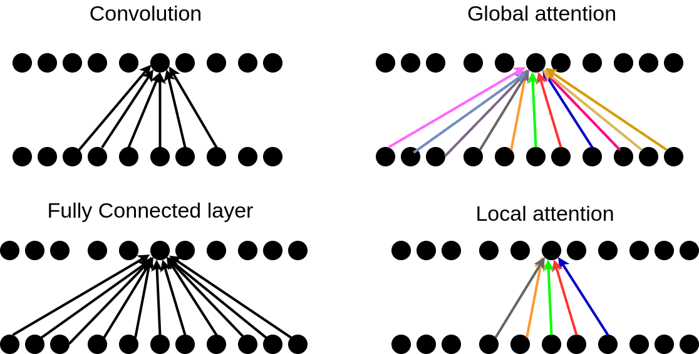

## Table of Contents

## What is attention in the context of machine learning?

Attention in machine learning is a technique that helps models focus on the most relevant parts of the input data when making predictions or generating outputs. Imagine you're reading a long document and need to answer a question about it. Instead of reading the entire document again, you'd quickly scan it and pay more attention to the parts that seem most relevant to the question. Similarly, attention mechanisms allow a model to weigh different parts of the input differently, focusing more on the parts that are likely to be important for the task at hand.

In the context of neural networks, attention is often implemented using a set of weights that are learned during training. These weights determine how much focus should be given to each part of the input. For example, in a sequence-to-sequence model used for machine translation, the attention mechanism helps the model decide which words in the source language are most important for translating each word in the target language. This makes the model more efficient and can improve its performance, as it can better understand the relationships between different parts of the input and output.

## How does attention mechanism work in neural networks?

Attention mechanisms in neural networks help the model focus on important parts of the input data. Imagine you're reading a long story and need to answer a question about it. Instead of re-reading the whole story, you'd quickly look over it and pay more attention to the parts that seem relevant to the question. In a similar way, attention mechanisms allow the neural network to weigh different parts of the input differently, giving more importance to the parts that are likely to be useful for the task.

The way attention works is by calculating a set of weights, called attention weights, for each part of the input. These weights are learned during training and help the model decide which parts of the input to focus on. For example, in a machine translation task, the model might use attention to decide which words in the source language are most important for translating each word in the target language. The attention weights are often calculated using a formula like this: $$ \text{Attention}(Q, K, V) = \text{softmax}\left(\frac{QK^T}{\sqrt{d_k}}\right)V $$, where Q, K, and V are matrices representing the query, key, and value, and $$d_k$$ is the dimension of the key vectors. This formula helps the model focus on the most relevant parts of the input when making predictions or generating outputs.

## What are the main types of attention mechanisms used in machine learning?

There are several main types of attention mechanisms used in machine learning, but the most common ones are self-attention and multi-head attention. Self-attention, also known as intra-attention, is when a model pays attention to different parts of the same input sequence. For example, in a sentence, self-attention can help the model understand how words relate to each other. It calculates attention weights for each word based on how relevant it is to every other word in the sequence. The formula for self-attention is similar to the general attention formula: $$ \text{Attention}(Q, K, V) = \text{softmax}\left(\frac{QK^T}{\sqrt{d_k}}\right)V $$. Here, Q, K, and V are all derived from the same input sequence.

Multi-head attention is an extension of self-attention. It involves running multiple self-attention operations in parallel, allowing the model to focus on different aspects of the input at the same time. Each attention "head" can learn to pay attention to different parts of the input, and the results are combined to form the final output. The formula for multi-head attention can be written as: $$ \text{MultiHead}(Q, K, V) = \text{Concat}(\text{head}_1, \text{head}_2, ..., \text{head}_h)W^O $$, where each head is computed using the self-attention formula, and the results are concatenated and transformed by a weight matrix $$W^O$$. This allows the model to capture a wider range of relationships within the input data.

Another type of attention is cross-attention, which is used when the model needs to focus on different sequences. For example, in machine translation, the model might use cross-attention to relate words in the source language to words in the target language. Cross-attention works similarly to self-attention, but the query (Q) comes from one sequence, while the key (K) and value (V) come from another sequence. This helps the model understand how different sequences relate to each other, which is crucial for tasks like translation or question answering.

## Can you explain the difference between soft attention and hard attention?

Soft attention and hard attention are two different ways that a neural network can focus on parts of the input data. Soft attention is like looking at a whole picture but paying more attention to some parts than others. It uses a formula to calculate attention weights for every part of the input, and these weights are used to combine the input into a final output. The formula for soft attention is $$ \text{Attention}(Q, K, V) = \text{softmax}\left(\frac{QK^T}{\sqrt{d_k}}\right)V $$. Because it considers all parts of the input at once, soft attention is easier to train and can be used with standard backpropagation.

Hard attention, on the other hand, is like looking at only one part of the picture at a time. It chooses to focus on a specific part of the input and ignores the rest. This can be more like how humans focus on things, but it's harder to train because it involves making discrete choices, which can't be easily optimized using standard backpropagation. Instead, techniques like reinforcement learning or variational inference are often used to train models with hard attention. While hard attention can be more efficient and sometimes more accurate, it's also more complex to implement and train.

## How does the attention mechanism improve the performance of models like transformers?

The attention mechanism helps models like transformers by letting them focus on the most important parts of the input data. Think of it like reading a long story and trying to answer a question about it. Instead of re-reading the whole story, you'd quickly look over it and pay more attention to the parts that seem relevant to the question. In the same way, attention helps the transformer model understand which parts of the input are most useful for making predictions or generating outputs. It does this by calculating attention weights, which tell the model how much to focus on each part of the input. The formula for attention is $$ \text{Attention}(Q, K, V) = \text{softmax}\left(\frac{QK^T}{\sqrt{d_k}}\right)V $$. This helps the model make better predictions because it can see how different parts of the input relate to each other.

Transformers use a special kind of attention called multi-head attention, which is like having multiple sets of eyes looking at the input from different angles. Each "head" can focus on different parts of the input, and the results are combined to give the model a richer understanding of the data. The formula for multi-head attention is $$ \text{MultiHead}(Q, K, V) = \text{Concat}(\text{head}_1, \text{head}_2, ..., \text{head}_h)W^O $$. This allows the model to capture a wider range of relationships within the input, making it more effective at tasks like language translation or text generation. By using attention, transformers can handle long sequences of data more efficiently and accurately than older models, which is why they've become so popular in fields like natural language processing.

## What is self-attention and how does it differ from other attention mechanisms?

Self-attention is a type of attention mechanism where a model pays attention to different parts of the same input sequence. Imagine you're reading a sentence and trying to understand how the words relate to each other. Self-attention helps the model do this by calculating attention weights for each word based on how relevant it is to every other word in the sentence. The formula for self-attention is $$ \text{Attention}(Q, K, V) = \text{softmax}\left(\frac{QK^T}{\sqrt{d_k}}\right)V $$. Here, Q, K, and V are all derived from the same input sequence. This allows the model to see how different parts of the input are connected, which is really helpful for tasks like language understanding.

Self-attention is different from other attention mechanisms like cross-attention or multi-head attention. Cross-attention is used when the model needs to focus on different sequences, like in machine translation where the model relates words in the source language to words in the target language. Multi-head attention, on the other hand, is like having multiple sets of eyes looking at the input from different angles. It runs several self-attention operations in parallel, allowing the model to capture a wider range of relationships within the input. The formula for multi-head attention is $$ \text{MultiHead}(Q, K, V) = \text{Concat}(\text{head}_1, \text{head}_2, ..., \text{head}_h)W^O $$. While self-attention focuses on relationships within a single sequence, these other mechanisms can handle more complex scenarios by focusing on different sequences or multiple aspects of the same sequence.

## Can you describe the architecture of a typical attention layer in a neural network?

An attention layer in a neural network is like a special tool that helps the model focus on the most important parts of the input data. Imagine you're reading a long story and need to answer a question about it. Instead of re-reading the whole story, you'd quickly look over it and pay more attention to the parts that seem relevant to the question. In the same way, an attention layer calculates attention weights for each part of the input, telling the model how much to focus on each part. The formula for calculating attention is $$ \text{Attention}(Q, K, V) = \text{softmax}\left(\frac{QK^T}{\sqrt{d_k}}\right)V $$. Here, Q, K, and V are matrices representing the query, key, and value, and these are all derived from the input data.

A typical attention layer starts by transforming the input data into these Q, K, and V matrices using learned weight matrices. For example, if the input is a sequence of words, each word is represented as a vector, and these vectors are multiplied by the weight matrices to create Q, K, and V. Then, the attention weights are calculated by taking the dot product of Q and K, scaling it by the square root of the dimension of K, and applying a softmax function. These weights are used to combine the V matrix into a final output, which the model uses for its predictions or next steps. This process helps the model understand which parts of the input are most important for the task at hand, making its predictions more accurate and efficient.

## How do you implement an attention mechanism in a deep learning model?

Implementing an attention mechanism in a deep learning model involves a few key steps that help the model focus on the most important parts of the input data. Imagine you're reading a long story and need to answer a question about it. Instead of re-reading the whole story, you'd quickly look over it and pay more attention to the parts that seem relevant to the question. In the same way, attention helps the model by calculating attention weights for each part of the input. These weights are calculated using the formula $$ \text{Attention}(Q, K, V) = \text{softmax}\left(\frac{QK^T}{\sqrt{d_k}}\right)V $$. Here, Q, K, and V are matrices representing the query, key, and value, all derived from the input data. The model starts by transforming the input into these Q, K, and V matrices using learned weight matrices. Then, it calculates the attention weights by taking the dot product of Q and K, scaling it by the square root of the dimension of K, and applying a softmax function. These weights are used to combine the V matrix into a final output, which the model uses for its predictions or next steps.

To implement this in code, you can use a deep learning library like PyTorch or TensorFlow. Here's a simple example in PyTorch:

```python
import torch
import torch.nn as nn
import torch.nn.functional as F

class AttentionLayer(nn.Module):
    def __init__(self, hidden_size):
        super(AttentionLayer, self).__init__()
        self.hidden_size = hidden_size
        self.query = nn.Linear(hidden_size, hidden_size)
        self.key = nn.Linear(hidden_size, hidden_size)
        self.value = nn.Linear(hidden_size, hidden_size)

    def forward(self, x):
        q = self.query(x)
        k = self.key(x)
        v = self.value(x)

        # Calculate attention weights
        attention_weights = torch.matmul(q, k.transpose(-2, -1)) / math.sqrt(self.hidden_size)
        attention_weights = F.softmax(attention_weights, dim=-1)

        # Apply attention weights to value
        output = torch.matmul(attention_weights, v)
        return output
```

In this example, the `AttentionLayer` class defines an attention mechanism. The `forward` method takes the input `x` and transforms it into Q, K, and V using linear layers. It then calculates the attention weights using the formula $$ \text{Attention}(Q, K, V) = \text{softmax}\left(\frac{QK^T}{\sqrt{d_k}}\right)V $$, and applies these weights to the V matrix to get the final output. This process helps the model focus on the most relevant parts of the input, improving its performance on tasks like language understanding or machine translation.

## What are some common challenges and limitations when using attention mechanisms?

Using attention mechanisms in machine learning models can be tricky. One common challenge is that attention layers can be computationally expensive, especially when dealing with long sequences of data. This is because the attention mechanism has to calculate attention weights for every part of the input, which can take a lot of time and memory. For example, in the formula $$ \text{Attention}(Q, K, V) = \text{softmax}\left(\frac{QK^T}{\sqrt{d_k}}\right)V $$, the model needs to compute the dot product of Q and K, which becomes more complex as the sequence length increases. This can make the model slower and harder to train, especially on devices with limited computing power.

Another limitation is that attention mechanisms can sometimes struggle to capture long-range dependencies. While attention helps the model focus on important parts of the input, it can be hard for the model to see how words or elements that are far apart in the sequence relate to each other. This is particularly challenging in tasks like language translation, where understanding the context of the entire sentence is crucial. Researchers are working on new techniques, like using hierarchical attention or combining attention with other types of layers, to help models better capture these long-range relationships.

## How can attention mechanisms be applied to different types of data, such as text, images, and time series?

Attention mechanisms can be used with different types of data like text, images, and time series to help models focus on the most important parts of the input. For text data, attention is often used in models like transformers to understand how words relate to each other. Imagine you're reading a long story and need to answer a question about it. Instead of re-reading the whole story, you'd quickly look over it and pay more attention to the parts that seem relevant to the question. In the same way, attention helps the model by calculating attention weights for each word based on how relevant it is to every other word in the sentence. The formula for this is $$ \text{Attention}(Q, K, V) = \text{softmax}\left(\frac{QK^T}{\sqrt{d_k}}\right)V $$. This allows the model to make better predictions because it can see how different parts of the text are connected.

For images, attention can help the model focus on specific parts of the image that are important for the task. Imagine you're looking at a picture and trying to find a specific object. Instead of looking at the whole picture, you'd quickly scan it and pay more attention to the areas where the object might be. In image processing, attention mechanisms can be used to highlight these important areas, helping the model understand and classify the image more accurately. For time series data, attention can help the model understand patterns over time. Imagine you're looking at a graph of stock prices and trying to predict future prices. Instead of looking at all the data points, you'd focus on the parts of the graph that show significant changes or trends. Attention helps the model do this by weighting different time steps based on their relevance, allowing it to make more accurate predictions about future trends.

## What are some advanced techniques for optimizing attention mechanisms in large-scale models?

Optimizing attention mechanisms in large-scale models can be tricky but important for making them work better and faster. One advanced technique is using sparse attention, which means the model only looks at a few parts of the input instead of all of it. This can save a lot of time and memory, especially when dealing with long sequences of data. Another technique is using low-rank approximations, where the model uses simpler versions of the attention weights to make calculations faster. For example, instead of using the full attention formula $$ \text{Attention}(Q, K, V) = \text{softmax}\left(\frac{QK^T}{\sqrt{d_k}}\right)V $$, the model might use a simpler version that still captures the main relationships but is quicker to compute.

Another way to optimize attention mechanisms is by using techniques like multi-query attention, where the model uses multiple sets of queries to focus on different aspects of the input at the same time. This can help the model capture more complex relationships within the data. Also, researchers are exploring ways to use hardware-specific optimizations, like using GPUs or TPUs more efficiently, to speed up the attention calculations. These advanced techniques can make large-scale models with attention mechanisms run faster and use less memory, which is really important for practical applications where speed and efficiency matter.

## How do recent research developments in attention mechanisms impact the future of machine learning?

Recent research developments in attention mechanisms are shaping the future of machine learning by making models smarter and more efficient. One big change is the use of sparse attention, which means the model only looks at a few important parts of the input instead of all of it. This can save a lot of time and memory, especially when dealing with long sequences of data. Another development is the use of low-rank approximations, where the model uses simpler versions of the attention weights to make calculations faster. For example, instead of using the full attention formula $$ \text{Attention}(Q, K, V) = \text{softmax}\left(\frac{QK^T}{\sqrt{d_k}}\right)V $$, the model might use a simpler version that still captures the main relationships but is quicker to compute. These techniques are making it possible to use attention mechanisms in bigger and more complex models, which can lead to better performance in tasks like language understanding and image processing.

Another important development is the use of multi-query attention, where the model uses multiple sets of queries to focus on different aspects of the input at the same time. This can help the model capture more complex relationships within the data, making it more accurate and versatile. Researchers are also exploring ways to use hardware-specific optimizations, like using GPUs or TPUs more efficiently, to speed up the attention calculations. These advancements are not only improving the performance of current models but also paving the way for new applications in fields like healthcare, finance, and autonomous driving. By making attention mechanisms more efficient and effective, these developments are helping to push the boundaries of what machine learning can do, leading to smarter and more capable AI systems in the future.