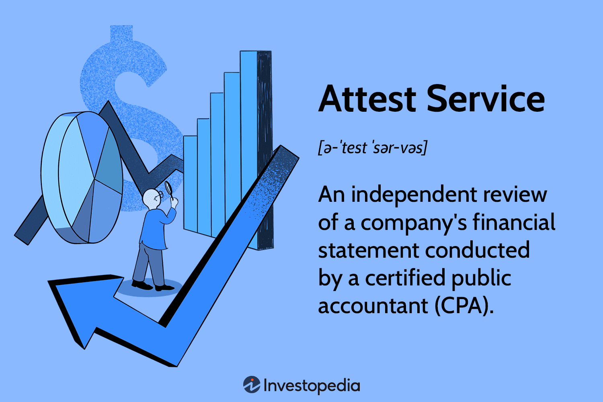

In the complex financial landscape, businesses often seek clarity and assurance in their financial reporting. Attest services and audits are vital components of this process, especially in environments involving algorithmic trading. Financial reporting demands precision, driven by the necessity for transparency and accuracy in communicating a company's financial health. Attest services, conducted by Certified Public Accountants (CPAs), provide an independent and objective examination of a company's financial statements or other financial information. These services act as a pivotal assurance mechanism that enhances stakeholders' trust in the authenticity of the reported data.

Algorithmic trading, characterized by complex algorithms executing trades at high speed, introduces a unique set of challenges and risks. This aspect of trading has gained prominence, emphasizing the need for meticulous financial oversight. The rapid transaction execution and vast data sets involved in algorithmic trading demand robust auditing processes to ensure financial records' reliability and prevent potential discrepancies or fraudulent activities.



As the financial markets evolve, so too must the practices and standards governing attest and audit services. Regulatory frameworks exist to uphold the integrity of financial reporting, offering structured guidelines for auditing processes. Understanding these standards is crucial for businesses to navigate the intricate web of financial regulations effectively.

This article will explore attest services in financial reporting, the role of audit services, and their intersection with the growing field of algorithmic trading. It will offer insights into regulatory standards and highlight best practices that businesses can adopt to enhance their financial reporting accuracy and compliance. Through this exploration, the article aims to provide valuable perspectives for businesses operating within these challenging environments, underscoring the importance of integrating attest and audit services in their financial practices.

## Table of Contents

## Understanding Attest and Audit Services

Attest services are essential in the domain of financial reporting, serving as a means to authenticate and enhance the credibility of financial information. These services are conducted by Certified Public Accountants (CPAs), who possess the expertise to evaluate and certify the accuracy and trustworthiness of an entity's financial data. Attest services encompass various engagements where a CPA is tasked with providing an objective examination of financial information. This process results in a report that expresses a conclusion about the reliability of the data assessed, thereby increasing stakeholder confidence.

On the other hand, audit services are structured to provide a comprehensive analysis of a company's financial statements. They are designed to ensure that these statements present a fair and accurate view of the entity's financial performance and position, complying with established accounting standards, such as Generally Accepted Accounting Principles (GAAP) in the United States, or International Financial Reporting Standards (IFRS) internationally. Audits are more extensive than attest services and entail a systematic review of financial records, internal controls, and other pertinent data, ultimately leading to the issuance of an audit opinion by a CPA.

The distinction between attest and audit services primarily revolves around the scope and depth of the examination. While all audits are a form of attest service, not all attest services are audits. Attest services can also include reviews or agreed-upon procedures, which are less comprehensive than audits. A review provides limited assurance that no material modifications are needed for the financial statements, whereas agreed-upon procedures involve performed tasks as per a specific client request without providing an opinion or assurance.

In summary, both attest and audit services are vital for validating and confirming the integrity of financial information. They collectively reassure stakeholders of an organization's financial health and compliance, albeit through different scopes and levels of scrutiny.

## The Importance of Attest Services in Financial Reporting

Attest services play a significant role in enhancing the credibility and reliability of financial reporting. By engaging in attest services, organizations can ensure that their financial statements are reviewed comprehensively, contributing to improved stakeholder trust. Stakeholders, such as investors, creditors, and regulatory bodies, rely on accurate financial information to make informed decisions. Attest services, conducted by Certified Public Accountants (CPAs), provide an independent and objective examination of a company's financial statements, thereby boosting stakeholders' confidence in the reported figures.

Compliance with regulatory requirements is another substantial benefit of using attest services. In many jurisdictions, companies are legally obligated to undergo financial statement reviews to meet regulatory standards. These reviews help businesses conform to applicable accounting standards and legal mandates, safeguarding them against potential legal pitfalls. The process ensures that the financial information presented by companies reflects a true and fair view of their financial position and performance.

Scenarios where attest services are crucial extend beyond standard financial audits. For instance, during mergers and acquisitions, attest services are vital in verifying the financial health and valuation of the entities involved. This ensures that all parties have a clear and accurate understanding of the financial implications of the transaction. Similarly, privacy statement reviews necessitate the involvement of attest services to verify that organizations comply with data protection regulations and maintain robust privacy controls.

The American Institute of Certified Public Accountants (AICPA) plays a pivotal role in setting standards for attest services. As a reputable professional organization, AICPA establishes guidelines and frameworks that CPAs must adhere to during attest engagements. These standards ensure the quality and consistency of attest services across different firms and industries. The AICPA's Statement on Standards for Attestation Engagements (SSAE) provides the foundation for conducting attest services, encompassing various types of engagements such as reviews, compilations, and agreed-upon procedures. By following AICPA standards, CPAs can deliver high-quality attest services that meet the evolving needs of businesses and their stakeholders.

In summary, attest services are indispensable for ensuring the integrity of financial reporting. They not only fortify stakeholder trust but also aid in regulatory compliance by affirming the accuracy and fairness of financial statements. Through the guidance of the AICPA, attest services uphold the standards necessary for maintaining financial transparency and accountability.

## Audit Services: Ensuring Financial Integrity

Audit services are fundamental to maintaining credibility and accuracy in financial reporting, serving as a cornerstone for business transparency and investor confidence. The primary objective of audit services is to provide an independent evaluation of a company’s financial statements, ensuring they fairly represent the company’s financial position and comply with accepted accounting standards.

Comprehensive audits involve a full-scale examination of a company's financial statements. Certified Public Accountants (CPAs) scrutinize the details within the financial records, transactions, and accounting practices. They assess internal controls and test for compliance with financial policies, measuring these against established benchmarks. Partial examinations, in contrast, may focus on specific components or processes within the financial reporting system. These targeted audits can help identify issues in distinct areas such as inventory management or payroll processing.

The process typically culminates in the issuance of an audit opinion, a statement which signifies the auditor's assessment of the accuracy and fairness of the financial statements. These opinions can be unqualified, qualified, adverse, or a disclaimer of opinion, with the unqualified opinion being the most favorable, indicating that the financial statements present a true and fair view.

Audit services are crucial for error detection and validation of financial data. By systematically examining financial documents, auditors can catch misstatements due to error or fraud, enhancing the reliability of financial reports. This process helps safeguard businesses against potential financial discrepancies and protects stakeholders' interests.

Regulatory frameworks and standards play a vital role in shaping audit practices. The Generally Accepted Auditing Standards (GAAS), used primarily in the United States, provides a comprehensive guideline for audit procedures. These standards ensure consistency, clarity, and accountability in audits. Internationally, the International Standards on Auditing (ISA) serve as the foundational framework for audits conducted worldwide, promoting robust and universally accepted audit quality.

The adherence to these standards not only aligns audit practices but also enhances the credibility and transparency of financial reporting. They guide CPAs through the audit process, ensuring auditors approach their evaluations with diligence, due professional care, and objectivity.

## Algorithmic Trading and Its Impact on Financial Audits

Algorithmic trading refers to the use of computers programmed to follow a defined set of instructions (an algorithm) to place a trade with the aim of generating profit at speeds and frequencies that are impossible for a human trader. It plays a significant role in the financial markets by providing [liquidity](/wiki/liquidity-risk-premium), reducing transaction costs, and enhancing trading efficiency. The algorithms can be based on models that analyze multiple market variables simultaneously, allowing trades to be executed at the optimal moment.

One key challenge that [algorithmic trading](/wiki/algorithmic-trading) poses for financial audits is the complexity of data sets used and generated by these trading algorithms. These data sets can include real-time market data, news feeds, and historical data which need to be processed and analyzed to guide trading decisions. The velocity at which algorithmic trading occurs adds another layer of complexity, with trades being executed in milliseconds. This rapid execution requires auditors to employ advanced data analytics and auditing tools to handle and scrutinize large volumes of data effectively.

To address these challenges, auditors have adapted by incorporating technologies like [machine learning](/wiki/machine-learning) and [artificial intelligence](/wiki/ai-artificial-intelligence) in their analysis to identify anomalies and trends within data sets that could indicate inaccurate reporting or fraudulent activities. Additionally, auditors employ specialized software to track and replicate algorithmic trading processes to ensure that reported transactions are valid and in compliance with financial reporting standards.

Moreover, auditors need to assess the robustness of the algorithms themselves. This includes examining the algorithms' programming and logic, understanding the parameters set for trading, and ensuring that they comply with regulatory policies. Unlike traditional audits, auditor skills have expanded to encompass a deep understanding of information systems and statistical models used in algorithmic trading.

Auditors also play a critical role in evaluating the control environment of firms engaged in algorithmic trading. This includes verifying that checks and balances are in place to prevent unauthorized access and modifications to trading algorithms, as well as monitoring systems to detect and report irregular transactions in real-time.

In conclusion, algorithmic trading significantly influences financial audits by introducing complex data environments and necessitating the use of sophisticated auditing techniques. Auditors address these challenges through the use of advanced technologies and by ensuring comprehensive controls are in place, thereby maintaining the integrity and reliability of financial reporting in this fast-paced trading environment.

## Best Practices for Integrating Attestation and Audit Services in Algo Trading

Integrating attestation and audit services within algorithmic trading requires businesses to adopt several best practices to ensure robust financial reporting and compliance. One of the most critical practices is the establishment of continuous monitoring and evaluation systems. These systems help maintain the accuracy, integrity, and compliance of financial reporting by providing real-time insights into trading operations and financial transactions. Continuous monitoring allows for the detection of irregularities and anomalies in trading activities, thus enabling prompt corrective actions.

In addition to real-time monitoring, businesses should leverage advanced technologies and tools to enhance their attestation and audit processes. The use of artificial intelligence (AI), machine learning, and data analytics plays a significant role in improving the efficiency and effectiveness of audits. For instance, machine learning algorithms can process vast amounts of data to identify patterns and outliers that may indicate financial discrepancies. This technological integration not only enhances the speed and precision of audits but also enables auditors to focus on high-risk areas that require more detailed attention.

Furthermore, blockchain technology offers an immutable and transparent ledger that can improve the traceability and verification of transactions in algorithmic trading. By incorporating blockchain, businesses can create a more secure and reliable record-keeping system that auditors can easily access and verify. This reduces the risk of data manipulation and enhances the overall trustworthiness of financial reporting.

To effectively implement these advanced technologies, businesses must invest in the continuous training and education of their auditing and compliance teams. Equipping professionals with the necessary skills to operate and interpret advanced tools ensures that these technologies are utilized to their full potential, thereby optimizing audit outcomes.

Python, as a programming language, can be employed to develop scripts that automate auditing tasks and data analysis. For example, Python's pandas library can simplify the process of handling large data sets from trading activities. Using Python, auditors can write scripts to automate the extraction and analysis of trading data, which could be sampled as follows:

```python
import pandas as pd

# Load transaction data
data = pd.read_csv('trading_data.csv')

# Identify potential anomalies in transaction amounts
anomalies = data[data['amount'] > data['amount'].quantile(0.99)]

# Output detected anomalies
print(anomalies)
```

This script loads trading data, identifies transactions exceeding the 99th percentile in amounts, and outputs these as potential anomalies for further review.

In summary, businesses involved in algorithmic trading can greatly benefit from integrating attestation and audit services with continuous monitoring and advanced technologies. By adopting these best practices, they can ensure compliance, enhance the accuracy of financial reporting, and reinforce stakeholder trust.

## Conclusion

Attest and audit services play integral roles in ensuring the reliability and integrity of financial reporting. These services are foundational to achieving transparency and maintaining trust in financial markets. By providing an independent evaluation of financial statements, they help confirm that the financial data presented by a company is accurate and complies with established accounting standards.

Businesses, especially those engaged in algorithmic trading, need to leverage these services to promote better compliance and enhance operational efficiency. Algorithmic trading introduces complexities due to rapid transactions and large data sets, making it essential to adopt robust attest and audit measures. The insights derived from these services can help mitigate risks associated with discrepancies in financial outputs and provide assurance to stakeholders regarding the accuracy of reported information.

For stakeholders, understanding and appreciating the value of attest and audit services are crucial. They provide a framework for ongoing improvements in financial transparency, which is vital for informed decision-making. As businesses increasingly operate in fast-paced and technologically advanced environments, these services become indispensable tools for reinforcing the credibility and reliability of financial reporting processes.

## References & Further Reading

[1]: Bergstra, J., Bardenet, R., Bengio, Y., & Kégl, B. (2011). ["Algorithms for Hyper-Parameter Optimization."](https://dl.acm.org/doi/10.5555/2986459.2986743) Advances in Neural Information Processing Systems 24.

[2]: ["Advances in Financial Machine Learning"](https://www.amazon.com/Advances-Financial-Machine-Learning-Marcos/dp/1119482089) by Marcos Lopez de Prado

[3]: ["Evidence-Based Technical Analysis: Applying the Scientific Method and Statistical Inference to Trading Signals"](https://www.amazon.com/Evidence-Based-Technical-Analysis-Scientific-Statistical/dp/0470008741) by David Aronson

[4]: ["Machine Learning for Algorithmic Trading"](https://github.com/stefan-jansen/machine-learning-for-trading) by Stefan Jansen

[5]: ["Quantitative Trading: How to Build Your Own Algorithmic Trading Business"](https://www.amazon.com/Quantitative-Trading-Build-Algorithmic-Business/dp/1119800064) by Ernest P. Chan