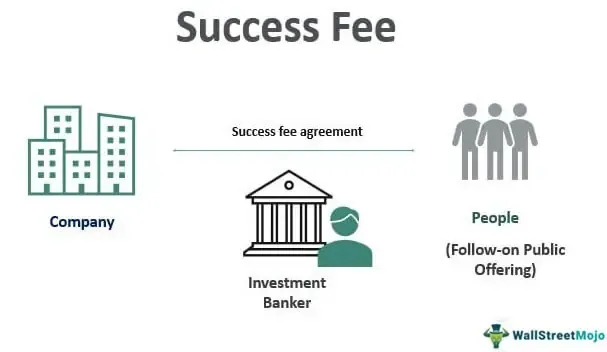

In the complex world of law and finance, understanding the nuances of legal costs, attorney fees, and fee awards becomes crucial, especially for individuals and businesses involved in litigation. Legal disputes often entail significant financial implications, and knowledge of how these costs are determined and the circumstances under which they might be shifted is vital. This article explores the various facets of attorney fees, legal costs, and fee awards. It places a special focus on algorithmic trading, a rapidly expanding field that poses unique legal challenges.

Algorithmic trading involves using complex algorithms and automated systems to execute trades at high speeds and volumes, often without immediate human intervention. The legal landscape surrounding this innovative practice is evolving, as firms must navigate intricate regulatory frameworks and potential litigation. Understanding the costs associated with these legal aspects is essential for industry professionals who need to manage both compliance and potential legal disputes effectively.

This article aims to provide insights into how legal fees are calculated and under what circumstances fee awards may be granted, along with implications for affected parties. By understanding the structure and rationale behind these fees, stakeholders can better plan and strategize their financial operations amidst potential legal challenges.

## Table of Contents

## Understanding Attorney Fees and Legal Costs

Attorney fees are the compensation attorneys receive for their services, reflecting various criteria such as time invested, legal expertise, and the complexity of the case. These fees are an essential aspect of legal practice, serving as the primary means for lawyers to sustain their operations and provide quality legal service to their clients. The determination of attorney fees typically involves several established models, including hourly rates, flat fees, contingency fees, and retainer arrangements. Each model aligns differently with client needs and the nature of the legal issue at hand.

Hourly rates are perhaps the most traditional form of compensation, calculated based on the time an attorney spends working on a client's case. This model is often favored in situations where the scope of work cannot be precisely estimated in advance. Flat fees, on the other hand, provide a set fee for a specific legal service, bringing predictability to clients who prefer knowing their total financial responsibility upfront. In cases such as personal injury or class-action suits, contingency fees are prevalent, where attorneys receive a percentage of the settlement or award only if the case is won. Retainer agreements allow clients to pay an advance fee from which the lawyer draws funds as services are rendered.

Legal costs, distinct from attorney fees, comprise a broader range of litigation-related expenses. These include, but are not limited to, court fees, charges for obtaining official documents, costs for expert witness testimony, and expenses related to the discovery process such as depositions and subpoenas. Understanding these costs is crucial, as they can significantly impact the overall financial burden of pursuing legal action.

In navigating legal disputes, both businesses and individuals benefit from comprehending the intricacies underlying attorney fees and legal costs. This knowledge facilitates informed decision-making, allowing parties to budget appropriately and evaluate the potential financial implications of litigation. It also aids in ensuring transparency and fairness in legal billing practices. For those involved in lengthy or complex legal battles, understanding how and why these costs accrue can be just as important as the eventual outcome of the case.

## What Are Attorney’s Fee Awards?

Attorney’s fee awards are judicial orders that allocate the responsibility of one party's legal costs to another party, typically following a court judgment or settlement. This mechanism is designed to alleviate the financial burden on the prevailing party, thereby ensuring equitable access to legal recourse. By transferring the legal expenses to the losing party, fee awards serve a dual purpose: incentivizing meritorious claims and deterring frivolous lawsuits. 

The underlying principle of these awards rests on the premise that the costs incurred by the winning party while asserting their rights should not impose a prohibitive burden. As such, these awards support the broader objective of facilitating access to justice for plaintiffs who might otherwise be deterred by the high cost of litigation.

In the United States, however, the prevailing approach differs due to the 'American rule,' under which each party is responsible for its own legal fees, irrespective of the case outcome. This rule stands in contrast to the 'English rule,' where the losing party typically assumes the winner's legal fees. Despite the general adherence to the American rule, notable exceptions exist, such as statutory provisions for fee-shifting in certain legal contexts, including civil rights and consumer protection cases. These statutory exceptions are tailored to promote enforcement of specific legal rights by reducing the financial risk for the parties involved.

The granting of attorney’s fee awards is subject to judicial discretion and often hinges upon specific statutory guidelines or contractual provisions. Courts may consider factors like the proportionality of the fees requested to the relief obtained, the complexity of the legal issues involved, and the conduct of the parties throughout the litigation process when determining the appropriateness and extent of fee awards.

## When Attorney’s Fee Awards May Be Granted

Attorney's fee awards are often granted in legal scenarios where financial justice and access to legal resources are pivotal. These awards serve as a mechanism to mitigate financial disparities between parties, thereby promoting fairness and accessibility in litigation. Notably, attorney’s fee awards are prevalent in several specific contexts, including class-action lawsuits, civil rights cases, and consumer protection disputes, where statutory provisions allow for fee-shifting.

Class-action lawsuits are designed to address grievances of a large group of individuals collectively, often against corporations or organizations. In such cases, the court may grant fee awards to ensure that the costs of representing a large class do not deter attorneys from taking on these complex cases. This provision is essential because class-action suits often involve significant legal work, and fee-shifting helps distribute these costs fairly, rather than leaving them entirely on the plaintiffs who may have limited resources.

In civil rights cases, attorney’s fee awards are instrumental in promoting access to justice for plaintiffs whose rights have been infringed. The Civil Rights Attorney’s Fees Awards Act of 1976, under Title 42 of the U.S. Code, Section 1988, allows courts to grant reasonable attorney’s fees to the prevailing party in civil rights litigation. This statutory provision aims to encourage the enforcement of civil rights laws by alleviating the financial burden of litigation from those whose rights have been violated.

Consumer protection disputes also often involve fee-shifting statutes. These statutes are crucial in ensuring that individuals can seek legal recourse against unfair or deceptive business practices without the deterrent effect of prohibitive legal costs. By allowing for the possibility of fee awards, these statutes empower consumers and promote fairness in the marketplace, enabling plaintiffs to pursue valid claims without fear of financial ruin from legal expenses.

In summary, attorney’s fee awards serve a fundamental role in ensuring that justice is achievable for all parties, regardless of their financial standing. By enabling parties who might otherwise lack the resources to pursue legitimate claims, these awards help maintain a balanced legal system and uphold the principles of fairness and accessibility.

## Calculating Attorney’s Fee Awards: The Lodestar Method

The lodestar method is a widely recognized approach used by courts to calculate attorney's fee awards in various legal contexts. This method is grounded in the principle of ensuring that attorneys receive fair compensation for the time and effort invested in representing their clients.

At its core, the lodestar calculation involves two primary components: the number of hours reasonably worked on a case and a reasonable hourly rate. The formula typically applied is:

$$
\text{Lodestar Amount} = \text{Hours Worked} \times \text{Hourly Rate}
$$

### Determining Hours Worked

The first step in the lodestar method involves accurately documenting the number of hours an attorney or legal team has devoted to a case. These records should reflect only those hours considered necessary and reasonable for the successful prosecution or defense of a case. Factors influencing this determination include the complexity of the legal issues, the amount of documentation or evidence reviewed, and the level of opposition encountered during the case.

### Establishing a Reasonable Hourly Rate

The second component focuses on establishing an appropriate hourly rate for legal services rendered. This rate is often influenced by several factors, including the prevailing market rates for legal services in a given jurisdiction, the attorney's experience, and the particular expertise required for the case. For instance, specialized fields, such as intellectual property or financial regulation, may justify higher rates due to the complexity and expertise required.

### Adjustments to the Lodestar Amount

While the initial lodestar calculation provides a baseline for attorney's fees, courts may adjust this amount based on additional factors. These can include:

- **Case Complexity:** Particularly challenging or novel cases might warrant an upward adjustment to account for the additional skill and effort required.
- **Attorney's Expertise and Performance:** Exceptional legal representation or results that exceed typical expectations might justify an enhancement of the fee award.
- **Outcome of the Case:** In some instances, the outcome achieved, such as a significant verdict or settlement, may influence adjustments to the lodestar award.

The lodestar method is favored for its objectivity and consistency, offering a structured approach to determining fair compensation in legal proceedings. While it serves as a foundational guideline, courts retain discretion to tailor the final fee award to reflect the unique circumstances of each case.

## Legal Costs in Algorithmic Trading

Algorithmic trading involves using complex algorithms to execute trades at high speeds and volumes, a practice that has grown rapidly due to advancements in technology and data analytics. However, this form of trading presents several legal challenges, primarily centered around regulatory compliance and litigation risks related to trading strategies and market influence. 

### Regulatory Compliance

Regulatory compliance is a critical component of [algorithmic trading](/wiki/algorithmic-trading) operations. Firms must adhere to a broad range of financial regulations designed to ensure market integrity and protect investors. These regulations are enforced by authorities such as the U.S. Securities and Exchange Commission (SEC) and the Commodity Futures Trading Commission (CFTC). Compliance involves implementing robust systems to monitor and control trading activities, preventing manipulative practices such as spoofing or layering [1].

To maintain compliance, algorithmic trading firms often invest heavily in sophisticated compliance infrastructures. This includes hiring legal experts, developing internal controls, and continuously updating algorithms to align with regulatory changes. The cost of regulatory compliance can be substantial, reflecting the need for specialized knowledge and advanced technological solutions. For example, firms may need to implement real-time surveillance systems to detect and mitigate any illicit trading patterns automatically.

### Litigation Risks

Litigation risks in algorithmic trading arise when disputes occur over trading algorithms that may result in market disruptions or financial losses. Legal proceedings may involve accusations of unfair market practices or breaches of fiduciary duties. High-profile cases often involve substantial legal fees due to the complexity and technical nature of the evidence presented.

Firms may face lawsuits from competitors, investors, or regulatory bodies. In some scenarios, lawsuits might be triggered by significant market events, such as the "Flash Crash" of 2010, where rapid algorithmic trading contributed to extreme market [volatility](/wiki/volatility-trading-strategies). In the aftermath, firms involved might incur costs related to class action lawsuits or government investigations. Defending against these legal actions can be expensive, impacting a company’s financial stability.

### Financial Implications for Firms

The financial implications of legal costs in algorithmic trading can affect a firm's operational and strategic planning. Firms must allocate resources efficiently to manage these costs while ensuring competitiveness in the market. Failure to effectively manage legal risks and compliance costs may lead to reduced profitability and reputational damage.

To mitigate these risks, algorithmic trading firms are increasingly incorporating risk management practices, such as:

- **Risk Assessment Models**: Developing quantitative models to assess potential legal and compliance risks associated with trading activities.
- **Scenario Analysis**: Conducting scenario analyses to evaluate the impact of various legal and regulatory changes on the business.
- **Insurance Policies**: Securing insurance coverage that protects against specific legal liabilities related to trading activities.

In conclusion, while algorithmic trading offers significant benefits in terms of speed and efficiency, it also exposes firms to considerable legal costs. Effective management of these costs is essential for sustainable growth and compliance in a highly regulated financial environment.

[1] Commodity Futures Trading Commission. "Spoofing". Retrieved from https://www.cftc.gov/IndustryOversight/Technology/Spoofing/index.htm

## Major Legal Settlements and Fee Awards in Recent Times

In recent years, significant legal settlements and attorney fee awards have underscored the substantial financial implications for organizations embroiled in legal battles. Such settlements serve as a critical illustration of how substantial the costs can be when litigations reach their conclusion.

One notable case is the antitrust settlement with Blue Cross Blue Shield (BCBS). In this major litigation, BCBS agreed to a settlement of $2.67 billion to resolve claims that it conspired to limit competition in the health insurance market. The settlement included a significant component for attorney fees, demonstrating the substantial impact of legal costs on the total financial burden of settling such disputes. The attorneys involved in the case successfully argued for fee awards citing the complexity and duration of the litigation process.

Another high-profile case involved the National Collegiate Athletic Association (NCAA), which faced multiple lawsuits related to student-athlete compensation. The case of Alston v. NCAA led to a Supreme Court ruling that supported student-athletes' rights to educational benefits. The resulting settlement included tens of millions of dollars in attorney fees awarded to the plaintiffs' legal representatives, reflecting the extensive resources necessary to bring the case to a successful conclusion.

These examples highlight the broader pattern within major legal settlements where attorney fee awards become a significant portion of total settlement costs. Companies often face considerable financial exposure, not only due to the direct costs of settlements but also because of these substantial fee awards. Fee awards serve a dual purpose: they compensate attorneys for the extensive time and expertise required to litigate complex cases and act as a deterrent against prolonged or unnecessary litigation strategies by either party.

In the context of algorithmic trading or other financially-driven industries, understanding the potential for high legal costs, including fee awards, becomes crucial. Organizations are advised to incorporate potential legal expenses into their financial risk assessments and strategic planning to mitigate unexpected fiscal burdens resulting from litigation. These cases exemplify the critical need for comprehensive legal cost management strategies in avoiding substantial financial repercussions.

## Conclusion

Understanding attorney fees, legal costs, and fee awards is vital for businesses and individuals participating in or considering legal action. These aspects hold particular significance in algorithmic trading, where maintaining compliance with regulatory frameworks and managing associated legal challenges are critical. Properly accounting for these costs is essential for strategic financial planning, as legal expenses can substantially impact a firm's profitability and operational effectiveness.

In the dynamic landscape of algorithmic trading, stakeholders must remain vigilant about their legal responsibilities and potential financial liabilities. This sector is characterized by rapidly evolving regulatory standards aimed at ensuring fair market practices and preventing financial misconduct. Consequently, algorithmic trading firms face substantial risks, including investigations and lawsuits due to issues like market manipulation or non-compliance with trading regulations.

For industry professionals, staying informed about changing legal frameworks and cost structures enables better decision-making and risk management. It contributes to the sustainable growth and optimization of resources in an increasingly competitive field. By comprehensively understanding legal complexities and expenses, organizations can ensure robust operational frameworks and mitigate potential legal repercussions.

Such proactive engagement with legal cost management fosters not only compliance but also innovation and competitiveness, enabling firms to thrive in a complex and challenging environment.

## References & Further Reading

[1]: Commodity Futures Trading Commission. ["Spoofing."](https://www.cftc.gov/PressRoom/PressReleases/8260-20)

[2]: Bergstra, J., Bardenet, R., Bengio, Y., & Kégl, B. (2011). ["Algorithms for Hyper-Parameter Optimization."](https://dl.acm.org/doi/10.5555/2986459.2986743) Advances in Neural Information Processing Systems 24.

[3]: Lopez de Prado, Marcos. ["Advances in Financial Machine Learning."](https://www.amazon.com/Advances-Financial-Machine-Learning-Marcos/dp/1119482089) Wiley, 2018.

[4]: Aronson, David. ["Evidence-Based Technical Analysis: Applying the Scientific Method and Statistical Inference to Trading Signals."](https://www.amazon.com/Evidence-Based-Technical-Analysis-Scientific-Statistical/dp/0470008741) Wiley, 2006.

[5]: Jansen, Stefan. ["Machine Learning for Algorithmic Trading."](https://github.com/stefan-jansen/machine-learning-for-trading) Packt Publishing, 2018.

[6]: Chan, Ernest P. ["Quantitative Trading: How to Build Your Own Algorithmic Trading Business."](https://github.com/ftvision/quant_trading_echan_book) Wiley, 2009.