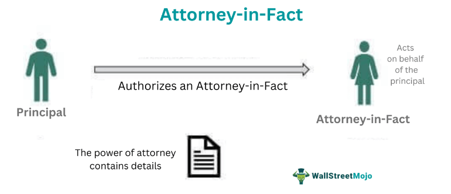

In today's dynamic financial landscape, understanding the intersection between legal authority and algorithmic trading is crucial. Algorithmic trading involves the use of computer programs and algorithms to execute trades at speeds and frequencies that are impossible for human traders. As this method of trading becomes increasingly prevalent, the legal frameworks governing financial transactions must evolve to accommodate these technological advancements. One such framework involves the concept of an attorney-in-fact, which is a crucial element in managing financial strategies, including those involving automated trading environments.

An attorney-in-fact is granted powers through a legal instrument known as a power of attorney. This arrangement enables individuals to delegate their financial responsibilities to a trusted representative. This delegation is particularly significant in algorithmic trading, where swift decision-making and execution can result in substantial financial gain or loss. Hence, deciding who holds this power becomes a critical consideration.



This article aims to explore the intricate dynamics of power delegation via an attorney-in-fact and its integration with algorithmic trading strategies. We will examine the legal subtleties of this authority and the various types of powers that can be delegated. By doing so, our objective is to provide readers with valuable insights to make educated decisions regarding the granting of power of attorney in trading contexts.

Understanding the key components that bind the legal and financial worlds through the role of an attorney-in-fact in algorithmic trading is essential. This knowledge empowers individuals to safely and effectively utilize technological advancements in trading, ensuring they can align their financial strategies with their legal rights and responsibilities. As we navigate further into this complex terrain, the ability to effectively manage both legal procedures and algorithmic strategies will be vital for success in modern financial markets.

## Table of Contents

## Understanding the Attorney-in-Fact

An attorney-in-fact, commonly known as an agent, is a person or entity appointed by a principal to act on their behalf in legal or financial matters through the execution of a power of attorney. This individual is distinct from an attorney-at-law, who requires formal legal certification to practice law. Instead, the attorney-in-fact is typically a trusted individual or organization delegated to execute tasks and make decisions as specified within the power of attorney document.

The role of an attorney-in-fact is rooted in trust, reliability, and understanding of the specified areas in which they are authorized to act. Anyone who is legally capable of entering into contracts can potentially serve as an attorney-in-fact. This could be a family member, a close friend, a professional advisor, or even a financial institution, depending on the principal's preference and the nature of the duties involved.

Selecting a trustworthy attorney-in-fact is paramount to safeguarding the principal's interests. The scope of authority granted to the attorney-in-fact can be broad or narrowly tailored, depending on the principal's needs. Therefore, it is essential to choose someone with integrity and a keen understanding of the responsibilities and limitations established by the power of attorney.

The role also carries with it potential liabilities and protections. For example, while the attorney-in-fact is obliged to act in the principal's best interests, they are generally protected from liability for decisions made in good faith, within the scope of their authority. Nevertheless, abuse of power or failure to fulfill their duties can lead to legal consequences.

In scenarios such as trading, where decision-making needs to be swift and precise, these roles become amplified. The fast-paced nature of trading demands not only a dependable agent but also one who is knowledgeable in market dynamics and can make informed financial decisions on behalf of the principal.

Understanding the fundamental aspects of appointing an attorney-in-fact is crucial, particularly when financial affairs are at stake. The right attorney-in-fact can ensure efficient management of assets aligned with the principal's goals and safeguard against potential risks or mismanagement. In environments like trading, their role could be pivotal to maintaining a successful financial strategy.

## Power of Attorney: Types and Implications

Power of attorney (POA) is a crucial legal instrument that enables a principal to authorize an attorney-in-fact to make decisions on their behalf. This delegation of power is particularly pertinent in the financial sector, where timely and informed decision-making is vital. A POA can be tailored to fit various scopes and levels of authority, making it a versatile tool for financial management and [algorithmic trading](/wiki/algorithmic-trading).

There are several types of power of attorney, each with distinct characteristics and implications:

1. **General Power of Attorney**: This type grants the attorney-in-fact broad powers to act on behalf of the principal in a wide array of matters, including financial transactions. It is comprehensive and flexible but ceases to be effective if the principal becomes incapacitated.

2. **Limited Power of Attorney**: As the name suggests, a limited POA restricts the attorney-in-fact’s authority to specific actions or a predetermined period. This is ideal for principals who want to grant authority in narrowly defined scenarios, such as executing a single trade or managing a specific portfolio for a certain duration. In algorithmic trading, a limited POA can be crafted to allow specific trades without giving total control over the entire trading account.

3. **Durable Power of Attorney**: This remains effective even if the principal becomes incapacitated. It can be general or limited in scope. For traders who wish to ensure continuity of trading activities regardless of their health status, a durable POA provides reassurance that their financial strategies will continue to be executed according to their preferences.

4. **Springing Power of Attorney**: This takes effect only upon the occurrence of a specified event, typically the incapacitation of the principal. While it provides a safeguard against unwanted delegation of authority, its activation could be less immediate compared to other types. In the context of trading, a springing POA could specify that trading authority is transferred only if the principal is unable to communicate their intentions.

In algorithmic trading, leveraging the right type of POA is critical. A limited or durable POA offers the flexibility needed to capitalize on market opportunities without ceding complete control. These POAs can be aligned with algorithmic strategies to ensure that they operate within the principal's specified risk parameters and financial goals.

Customizing a power of attorney to align with specific trading strategies involves clear communication and a thorough understanding of both the legal instrument and the trading environment. Ensuring that the attorney-in-fact comprehends the trading algorithms and their associated risks is essential for maintaining the integrity and profitability of the trading operations. By strategically deploying POAs, traders can navigate the complexities of financial markets while safeguarding their investments.

## The Role of Attorney-in-Fact in Algorithmic Trading

Algorithmic trading has fundamentally transformed the way financial markets operate, allowing for high-frequency trading strategies that require instantaneous decision-making. In this context, the role of an attorney-in-fact becomes crucial, as these individuals or entities are empowered by power of attorney (POA) to manage trading decisions on behalf of the principal.

An attorney-in-fact, under the authority of a POA, can execute trades by leveraging algorithmic systems that analyze market data in real-time and act upon pre-defined trading strategies. The ability to execute trades rapidly allows the attorney-in-fact to capitalize on fleeting market opportunities that manual trading processes might miss. For instance, within milliseconds, an algorithm can assess the market conditions and instruct the attorney-in-fact to buy or sell securities following the principal's trading strategy.

Moreover, the attorney-in-fact is responsible for managing and rebalancing investment portfolios, an essential function in algorithmic trading. This involves real-time monitoring of asset allocations, adjusting positions to adhere to the trading strategy, and ensuring that the risk exposure is kept within acceptable limits. The ability to make these financial adjustments promptly is made possible by sophisticated algorithms that consider factors like asset [volatility](/wiki/volatility-trading-strategies), market trends, and [liquidity](/wiki/liquidity-risk-premium).

A practical example could be executed using Python, where an algorithm continuously evaluates portfolio performance and makes adjustments:

```python
def rebalance_portfolio(portfolio, target_allocation):
    for asset in portfolio:
        current_value = portfolio[asset]['current_value']
        target_value = portfolio['total_assets'] * target_allocation[asset]

        if current_value < target_value:
            buy_asset(asset, target_value - current_value)
        elif current_value > target_value:
            sell_asset(asset, current_value - target_value)

# Assuming buy_asset and sell_asset are functions that interact with a trading platform
```

The flexibility of the attorney-in-fact arrangement is particularly advantageous when it comes to reaching instantaneous decisions amid dynamic market conditions. This flexibility ensures that, irrespective of sudden shifts in the market, the trading objectives are met consistently according to the principal’s overarching financial directives.

Overall, the attorney-in-fact plays a vital role in integrating legal authority with algorithmic precision, allowing for the seamless execution of trading strategies that are both legally compliant and strategically effective. Through these mechanisms, principals can entrust their trading operations to parties capable of harnessing technology to align with their financial goals efficiently.

## Legal and Ethical Considerations

Handling trading decisions as an attorney-in-fact involves navigating a complex landscape of legal and ethical responsibilities. The foundational principle is that actions taken by the attorney-in-fact must always align with legal compliance, confidentiality, and the best interests of the principal. This section outlines the critical considerations and potential challenges faced when authorizing trading activities under a power of attorney arrangement.

Firstly, legal compliance is paramount. The attorney-in-fact must ensure that all trading activities adhere to relevant financial regulations and laws. This includes understanding security laws, tax obligations, and trading regulations that might affect both domestic and international transactions. Failure to comply could result in legal penalties for both the principal and the attorney-in-fact. For instance, engaging in insider trading or misrepresenting financial transactions can have severe legal consequences.

Confidentiality is another key responsibility. The attorney-in-fact holds a position of trust, requiring the secure handling of sensitive financial information. Any breach of confidentiality not only erodes trust but could also lead to financial loss or legal action against the attorney-in-fact. Safeguarding data involves implementing robust cybersecurity measures and ensuring compliance with data protection laws, such as the General Data Protection Regulation (GDPR) in the European Union.

Acting in the principal's best interest is a fundamental ethical obligation. The attorney-in-fact must prioritize the financial well-being of the principal over any personal gains. This fiduciary duty involves making informed decisions that align with the principal's financial goals and risk tolerance. Transparency in decision-making processes and maintaining open communication with the principal are essential strategies to uphold this duty.

Several challenges and legal pitfalls can arise in the execution of trading activities. One common issue is conflicts of interest, where the attorney-in-fact might face situations where their interests diverge from those of the principal. Developing and adhering to a conflict-of-interest policy can help mitigate this risk. Additionally, keeping comprehensive records of all transactions and communications with the principal ensures transparency and protects against potential disputes.

Ethical considerations extend beyond legal obligations, emphasizing the importance of accountability and integrity. An attorney-in-fact must be vigilant in identifying and avoiding any unethical trading practices, such as manipulating markets or engaging in unauthorized transactions. Ethical decision-making frameworks can guide attorneys-in-fact in navigating complex scenarios where the right [course](/wiki/best-algorithmic-trading-courses) of action may not be immediately clear.

In conclusion, understanding and addressing the legal and ethical considerations associated with acting as an attorney-in-fact in trading is critical for maintaining the integrity of the trading process. By ensuring legal compliance, upholding confidentiality, and prioritizing the principal's best interests, attorneys-in-fact can effectively manage trading activities while protecting all parties from potential liabilities.

## Conclusion

The attorney-in-fact plays a pivotal role in ensuring that legal authority is seamlessly integrated with financial strategy, a task that becomes increasingly significant in the context of algorithmic trading. By effectively leveraging the various types of power of attorney, traders can maintain agile control over their trading strategies while effectively managing their broader financial affairs. This integration is crucial, as it allows for quick decision-making and implementation of complex trading algorithms which require precise execution in real-time markets.

As outlined in this article, understanding the intricacies of appointing and acting as an attorney-in-fact equips traders with the ability to navigate the legal complexities associated with algorithmic trading. This knowledge is essential for structuring their operations within a legally compliant framework, thereby safeguarding both their financial assets and the integrity of their trading strategies. It is not merely about delegation but about strategic empowerment, enabling traders to focus on optimizing their trading performance with a robust legal backing.

As financial markets continue to evolve, driven by technological advancements and regulatory changes, the associated legal roles and responsibilities will also transform. This dynamic nature of the markets necessitates continuous adaptation and learning regarding legal authority constructs like power of attorney. Traders must stay informed and proactive in aligning these legal mechanisms with their trading ambitions, ensuring that they are equipped to face new challenges and leverage new opportunities as they arise.

Empowered with this comprehensive understanding, traders can make more informed decisions that harmonize legal frameworks with their financial and strategic objectives. This alignment not only enhances the efficacy of their trading activities but also ensures they are well-prepared to capitalize on future developments within the trading sector.

## References & Further Reading

[1]: Bergstra, J., Bardenet, R., Bengio, Y., & Kégl, B. (2011). ["Algorithms for Hyper-Parameter Optimization."](https://papers.nips.cc/paper/4443-algorithms-for-hyper-parameter-optimization) Advances in Neural Information Processing Systems 24.

[2]: ["Advances in Financial Machine Learning"](https://www.amazon.com/Advances-Financial-Machine-Learning-Marcos/dp/1119482089) by Marcos Lopez de Prado

[3]: ["Evidence-Based Technical Analysis: Applying the Scientific Method and Statistical Inference to Trading Signals"](https://www.amazon.com/Evidence-Based-Technical-Analysis-Scientific-Statistical/dp/0470008741) by David Aronson

[4]: ["Machine Learning for Algorithmic Trading"](https://github.com/stefan-jansen/machine-learning-for-trading) by Stefan Jansen

[5]: ["Quantitative Trading: How to Build Your Own Algorithmic Trading Business"](https://www.amazon.com/Quantitative-Trading-Build-Algorithmic-Business/dp/1119800064) by Ernest P. Chan