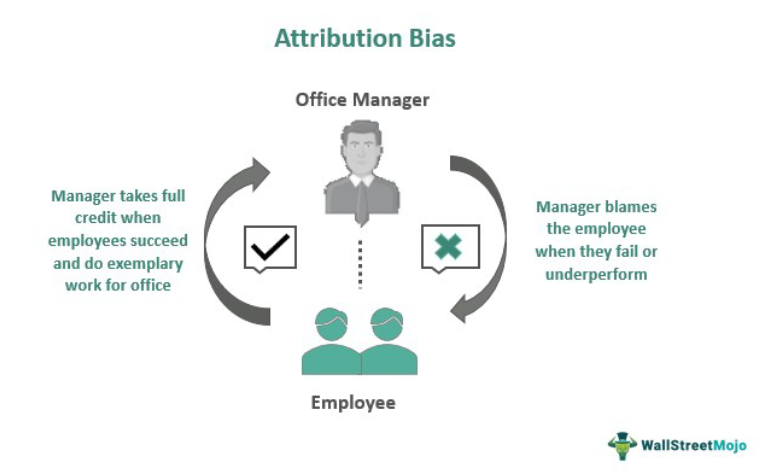

Cognitive biases are systematic deviations from rational judgment, significantly influencing decision-making across various domains, including finance and trading. These biases affect how individuals perceive and process information, often resulting in errors in judgment and decision-making. In the context of trading, where decisions can have substantial financial implications, the impact of cognitive biases is critically pronounced.

Algorithmic trading, the practice of using computer algorithms to execute trades, is often perceived as objective and devoid of emotional influences that typically affect human traders. However, this objectivity is challenged by the fact that algorithms are crafted by humans, who are inherently subject to cognitive biases. Consequently, these biases can inadvertently permeate algorithmic models and strategies, leading to unintended and potentially detrimental trading outcomes.



The focus of this article is to examine various cognitive and attribute biases within algorithmic trading. Cognitive biases, such as confirmation bias, overconfidence bias, and hindsight bias, are known to influence human decision-making and can manifest in trading algorithms through the biases of the developers. These biases may lead developers to design models that overestimate market trends or overlook risk factors, ultimately resulting in irrational trade decisions.

Attribute bias, another significant concern in algorithmic trading, occurs when quantitative models consistently select securities exhibiting similar characteristics. This can inadvertently concentrate risk in portfolios and undermine diversification efforts, posing a significant threat to financial performance.

Understanding and managing these biases is essential for traders seeking to enhance their decision-making processes and achieve better performance outcomes. Identifying the presence of biases and implementing strategies to counteract their effects are crucial steps in optimizing trading strategies.

This article will also explore techniques to mitigate the influence of these biases on trading strategies. By adopting practices such as seeking feedback, engaging in team discussions, and implementing rules-based trading strategies, traders and developers can work towards minimizing the impact of biases and ensure a more balanced and data-driven approach to algorithmic trading.

## Table of Contents

## Understanding Cognitive Biases in Trading

Cognitive biases are systematic patterns of deviation from norm or rationality in judgment, which affect how individuals perceive and interpret information. These biases emerge due to the human brain's tendency to take mental shortcuts or "heuristics" to make decisions swiftly, often at the expense of accuracy. In trading, such cognitive biases can have a profound impact, altering decision-making processes and potentially leading to suboptimal investment choices.

One of the most prevalent cognitive biases in trading is confirmation bias. This occurs when traders favor information that confirms their pre-existing beliefs or hypotheses while disregarding contradictory data. Such biased information processing can cause traders to hold onto losing positions or to prematurely close out profitable trades based on selective evidence. To mitigate confirmation bias, traders are encouraged to adopt a more structured approach to data analysis, ensuring that all relevant information is evaluated objectively before making trading decisions.

Overconfidence bias is another common cognitive distortion where traders overestimate their knowledge, abilities, and the precision of their information. This bias can lead to overtrading, excessive risk-taking, and ultimately, significant financial loss. Overconfident traders might ignore vital risk management strategies or dismiss signs of market [volatility](/wiki/volatility-trading-strategies), believing in their ability to predict future market movements better than others. Critical strategies to manage overconfidence include setting strict risk limits, diversifying investments, and continuously reviewing trading performance against objective benchmarks.

Hindsight bias involves the tendency to see events as having been predictable after they have already occurred. In trading, this bias can lead to a distorted evaluation of past trading decisions, often attributing successful trades to personal skill while blaming failures on external factors. Such biased recollections can foster unrealistic expectations and reinforce overconfidence. Traders should practice maintaining detailed records of their decision-making processes to counter hindsight bias, helping them develop a more accurate understanding of past successes and failures.

Traders need to be vigilant in identifying these cognitive biases, as they can profoundly influence trading strategies. Awareness is the first step toward mitigating their effects. Employing structured decision-making frameworks, engaging in critical self-assessment, and incorporating comprehensive feedback mechanisms can aid traders in recognizing and correcting cognitive biases, ultimately enhancing trading outcomes.

## Attribute Bias in Algorithmic Models

Attribute bias in algorithmic models is a critical concern in the field of quantitative finance, as it can inadvertently skew investment portfolios towards specific securities sharing similar characteristics. This lack of diversification increases the risk profile of the portfolio, as it becomes susceptible to sector-specific downturns or systemic shocks affecting those particular securities. In practice, attribute bias might manifest when an algorithm consistently selects high-growth technology stocks, thereby neglecting opportunities in other sectors.

Recognizing attribute bias requires a systematic approach to portfolio analysis and model evaluation. Traders must identify patterns where the algorithm disproportionately selects assets with overlapping features, such as similar sector exposure, market capitalization, or valuation metrics. Addressing this issue involves devising strategies that mitigate the impact of such biases, thereby promoting a diversified investment strategy that aligns with risk management goals.

One effective technique to counter attribute bias is employing multiple models with varied parameters. By diversifying the input parameters and methodologies of these models, traders can achieve a more comprehensive analysis of the market, capturing a broader array of investment opportunities. For example, using a combination of models that incorporate factors such as value, growth, size, and [momentum](/wiki/momentum) can reduce the tendency to converge on a narrow subset of securities.

Moreover, incorporating [machine learning](/wiki/machine-learning) techniques, such as ensemble learning, can enhance model performance and robustness against attribute bias. Ensemble learning methods, like random forests or gradient boosting, aggregate predictions from multiple models, thereby diluting the individual biases inherent in each model. This approach not only improves prediction accuracy but also ensures that the selection of securities reflects diverse investment attributes.

In summary, awareness and proactive management of attribute bias are essential in [algorithmic trading](/wiki/algorithmic-trading). By leveraging a variety of models and methodologies, traders can create a more balanced and risk-averse investment portfolio, ultimately improving long-term performance.

## Impact of Cognitive Biases on Algorithmic Trading

Algorithmic trading is often perceived as a mechanism to escape human emotional biases, offering the allure of optimized, data-driven decisions. However, the intricate process of developing these algorithms inherently involves human judgment and decision-making, which can introduce cognitive biases into trading strategies. These biases, deeply rooted in human cognitive processes, manifest in various forms, such as overconfidence, confirmation, and anchoring biases, potentially undermining the efficacy of algorithmic trading models.

Cognitive biases can distort market perceptions, leading developers to overestimate market trends. Overconfidence bias, for instance, may cause developers to be excessively confident in their predictive models, assuming accuracy where there is uncertainty. This overestimation can result in aggressive trading strategies that overlook critical market volatility, ultimately exposing portfolios to significant risks.

Moreover, these biases can induce tunnel vision among algorithm developers, where confirmation bias plays a significant role. Developers may unintentionally favor information or data sets that support their pre-existing beliefs or hypotheses. Such selective attention can lead to inadequate risk assessment, as contradictory data points are ignored or undervalued. This flaw in judgment can cause algorithms to persist in flawed trade execution, failing to adapt to new market conditions or unexpected economic events.

The iterative nature of designing and refining trading algorithms presents multiple opportunities for biases to perpetuate. Without systematic examination, these biases remain embedded, continuously influencing trade decisions. To counteract this, traders utilizing algorithmic strategies must implement rigorous checks to routinely analyze and adjust their systems. This includes [backtesting](/wiki/backtesting) models with diverse data sets to identify potential biases and ensure comprehensiveness and accuracy in market predictions.

One effective approach to detecting and mitigating cognitive bias is augmenting algorithms with machine learning techniques. These techniques can help discern patterns often overlooked by human designers, thus making the trading model more robust against biases. Regular auditing of trading algorithms, coupled with an emphasis on objective data analysis, can help maintain the integrity of decision-making processes. By doing so, traders can harness the true potential of algorithmic trading, ensuring that market decisions remain firmly rooted in data-driven insights rather than subjective human biases.

## Managing and Mitigating Cognitive Biases

Managing and mitigating cognitive biases in algorithmic trading require systematic approaches that emphasize consistency and objective analysis. Awareness and active avoidance of these biases are foundational. Recognizing one's own cognitive tendencies is the first step towards minimizing their effects on trading decisions. 

Engaging in team discussions and seeking feedback are practical measures to counteract individual biases. Collaborative environments facilitate the sharing of diverse perspectives, promoting a more balanced view and helping to identify blind spots in judgment. This cooperative approach encourages critical evaluation of trading strategies, leading to more effective decision-making processes.

Another approach is the implementation of rules-based strategies. These strategies are designed to enforce discipline and reduce emotional interference. By adhering to predefined rules, traders can maintain consistency and objectivity, minimizing the influence of cognitive biases on trading outcomes. Rules-based strategies provide a framework within which decisions are made based on objective criteria, rather than subjective judgment.

Regularly reviewing and updating trading algorithms and strategies is essential for managing cognitive biases. This process involves assessing the performance of trading strategies against objective metrics and making necessary adjustments. By continuously refining algorithms, traders ensure that their strategies remain aligned with evolving market conditions and empirical data. This iterative process of evaluation and adjustment helps in mitigating biases that might creep into algorithmic models over time.

In addition to these techniques, leveraging technology and data analytics can further enhance efforts to manage cognitive biases. Advanced data analysis tools and machine learning algorithms can identify patterns and anomalies that human traders might overlook. This technology-assisted approach complements traditional methods, offering an additional layer of scrutiny and validation.

Overall, the key to managing cognitive biases in algorithmic trading lies in the consistent application of evidence-based strategies, fostering an environment of open feedback, and maintaining a commitment to objective data analysis. By integrating these practices, traders can effectively mitigate the influence of cognitive biases and enhance their decision-making processes.

## Conclusion

Recognizing and understanding cognitive and attribute biases is essential for enhancing algorithmic trading outcomes. These biases can result in skewed decision-making processes, often leading to systematic errors that could diminish trading performance. By identifying these biases, developers and traders can implement targeted strategies to mitigate their influence.

One crucial practice for minimizing bias is to prioritize objective data analysis. This involves leveraging statistical methods and rigorous data validation techniques to ensure the accuracy and reliability of trading algorithms. Enhancing the transparency of these models allows for deeper insights into how decisions are made and helps identify areas prone to bias.

For example, assessing the performance of a trading strategy against diverse market conditions can reveal potential biases. A Python snippet implementing cross-validation on a simple trading model might look like this:

```python
from sklearn.model_selection import cross_val_score
from sklearn.linear_model import LinearRegression
import numpy as np

# Sample data (replace with actual trading data)
X = np.random.rand(100, 5)  # Features
y = np.random.rand(100)     # Target variable

# Linear Regression model
model = LinearRegression()

# Perform cross-validation
scores = cross_val_score(model, X, y, cv=5)

# Print cross-validation scores
print("Cross-validation scores:", scores)
print("Mean score:", scores.mean())
```

Furthermore, continuous learning and adaptation are imperative in responding to the dynamic nature of financial markets. This includes staying updated with the latest developments in analytical methods, algorithms, and market trends. Regularly reassessing and adjusting algorithms based on empirical evidence ensures that trading strategies remain robust and competitive. 

In summary, a proactive approach to bias management, coupled with a commitment to objective analysis and continuous improvement, will significantly bolster trading effectiveness. By integrating these practices, developers and traders can maintain their competitive advantage and consistently achieve optimal outcomes in algorithmic trading.

## References & Further Reading

[1]: Bergstra, J., Bardenet, R., Bengio, Y., & Kégl, B. (2011). ["Algorithms for Hyper-Parameter Optimization."](https://dl.acm.org/doi/10.5555/2986459.2986743) Advances in Neural Information Processing Systems 24.

[2]: ["Advances in Financial Machine Learning"](https://www.amazon.com/Advances-Financial-Machine-Learning-Marcos/dp/1119482089) by Marcos Lopez de Prado

[3]: ["Evidence-Based Technical Analysis: Applying the Scientific Method and Statistical Inference to Trading Signals"](https://www.amazon.com/Evidence-Based-Technical-Analysis-Scientific-Statistical/dp/0470008741) by David Aronson

[4]: ["Machine Learning for Algorithmic Trading"](https://github.com/stefan-jansen/machine-learning-for-trading) by Stefan Jansen

[5]: ["Quantitative Trading: How to Build Your Own Algorithmic Trading Business"](https://www.amazon.com/Quantitative-Trading-Build-Algorithmic-Business/dp/1119800064) by Ernest P. Chan