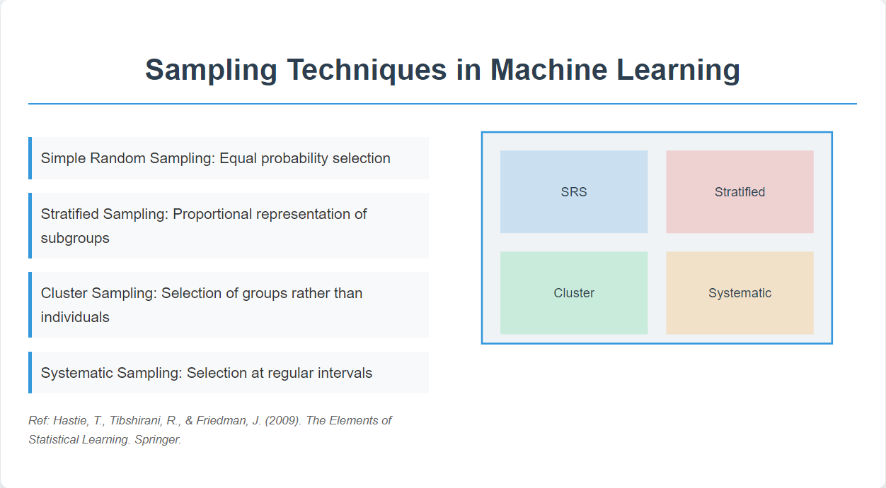

## Table of Contents

## What is attribute sampling in the context of machine learning?

Attribute sampling in machine learning is a technique used to select a subset of features or attributes from a larger dataset. This method is crucial when dealing with high-dimensional data, where having too many features can lead to overfitting and increased computational costs. By carefully choosing which attributes to include, machine learning models can become more efficient and effective, focusing on the most relevant information to make accurate predictions or classifications.

The process of attribute sampling often involves techniques like feature selection or dimensionality reduction. Feature selection methods, such as forward selection, backward elimination, or using algorithms like Random Forests to assess feature importance, help identify which attributes contribute most to the model's performance. Dimensionality reduction techniques, like Principal Component Analysis (PCA), transform the original features into a new set of variables that capture the most variance in the data, thereby simplifying the model without losing essential information. Both approaches aim to enhance the model's ability to generalize from the training data to new, unseen data.

## How does attribute sampling differ from other sampling techniques?

Attribute sampling focuses on choosing a subset of features or attributes from a dataset, unlike other sampling techniques that typically focus on selecting a subset of data points or observations. For example, in random sampling, you might select a certain number of rows from your dataset at random, while in stratified sampling, you ensure that different groups within your data are proportionally represented. Attribute sampling, on the other hand, is about deciding which columns or features to keep or discard, aiming to improve the performance and efficiency of a machine learning model by reducing the number of variables it needs to consider.

The goal of attribute sampling is to identify and use only the most relevant features that contribute to the model's predictive power. This is different from other sampling methods, which aim to represent the entire dataset accurately with fewer data points. For instance, if you're trying to predict house prices, attribute sampling might help you decide whether to include features like the number of bedrooms, the size of the lot, or the age of the house, based on their impact on the model's accuracy. Other sampling techniques would focus on selecting a subset of houses from your dataset, ensuring that your sample still represents the overall population of houses accurately.

## What are the main benefits of using attribute sampling in machine learning?

Attribute sampling helps make [machine learning](/wiki/machine-learning) models work better and faster. By choosing only the most important features, models can focus on what really matters for making good predictions. This means the models can learn more quickly and use less computer power. For example, if you're trying to predict if someone will buy a product, you might find that only a few things like their age and past purchases are really important. By using attribute sampling, you can ignore less important details like their favorite color, making your model simpler and more effective.

Another big benefit of attribute sampling is that it can help prevent overfitting. Overfitting happens when a model learns too much from the training data, including the random noise, and then doesn't work well on new data. By reducing the number of features, attribute sampling makes it harder for the model to memorize the training data and easier for it to generalize to new situations. This leads to more reliable predictions and a model that works well even when faced with new, unseen data.

## Can you explain how attribute sampling is applied in supervised learning?

In supervised learning, attribute sampling is used to pick the best features that help the model learn to make good predictions. Imagine you're teaching a computer to tell if a picture is of a cat or a dog. You might start with lots of details like the color of the fur, the shape of the ears, and the size of the nose. But not all these details are equally important. Attribute sampling helps you figure out which details, like the shape of the ears, are most useful for telling cats and dogs apart. By focusing on these key features, the model can learn faster and make better guesses.

To do attribute sampling in supervised learning, you can use different methods. One way is to try different combinations of features and see which ones make the model perform the best. Another way is to use special algorithms that can tell you which features are most important. For example, you might use a method called Random Forests, which can show you which features help the most in making accurate predictions. By using these techniques, you can make your model simpler and more effective, helping it to work well even with new pictures it hasn't seen before.

## What role does attribute sampling play in feature selection?

Attribute sampling is a key part of feature selection in machine learning. It helps you pick the best features from your data to use in your model. Imagine you're trying to guess how much a house will sell for. You might start with lots of information like the number of bedrooms, the size of the yard, and the color of the walls. But not all this information is equally important. Attribute sampling helps you figure out which pieces of information, like the number of bedrooms and the size of the yard, are most useful for making good guesses about the house price. By focusing on these key pieces of information, your model can learn faster and make better predictions.

In practice, attribute sampling can be done in different ways. One way is to try different combinations of features and see which ones make your model work the best. Another way is to use special algorithms that can tell you which features are most important. For example, you might use a method called Random Forests, which can show you which features help the most in making accurate predictions. By using these techniques, you can make your model simpler and more effective. This means your model will work well even when it sees new data it hasn't seen before, making it more reliable and useful.

## How can attribute sampling help in dealing with imbalanced datasets?

Attribute sampling can help deal with imbalanced datasets by focusing on the most important features that distinguish between different classes. When a dataset is imbalanced, one class might have many more examples than another. This can make it hard for a model to learn about the less common class. By using attribute sampling, you can pick out the features that are most helpful for telling the classes apart, even if there are fewer examples of one class. This way, the model can learn better from the available data and make more accurate predictions for all classes.

For example, if you're trying to predict whether an email is spam or not, and most of your emails are not spam, you have an imbalanced dataset. Attribute sampling can help you find the key features, like certain words or phrases, that are most useful for spotting spam emails. By focusing on these key features, your model can learn to identify spam more effectively, even when there are fewer spam examples in your training data. This makes your model better at handling imbalanced data and improves its overall performance.

## What are some common algorithms that use attribute sampling?

Attribute sampling is used in many machine learning algorithms to help pick the best features. One common algorithm is Random Forests. Random Forests work by making lots of decision trees and then combining their guesses. Each tree picks a random set of features to use when it splits the data. By looking at how much each feature helps in making good splits, Random Forests can tell you which features are most important. This helps in choosing the best features to use in your model, making it simpler and better at guessing new data.

Another algorithm that uses attribute sampling is the Lasso (Least Absolute Shrinkage and Selection Operator) method. Lasso adds a penalty to the model's coefficients, which can make some of them become zero. This means the model will ignore the features with zero coefficients, effectively doing attribute sampling. By using Lasso, you can find out which features are not very helpful and remove them, making your model simpler and more accurate. This is especially useful when you have a lot of features and want to focus on the most important ones.

## How does attribute sampling affect model performance and accuracy?

Attribute sampling can make a big difference in how well a machine learning model performs. By choosing only the most important features, the model can focus on what really matters for making good predictions. This means the model can learn faster and use less computer power. For example, if you're trying to predict if someone will buy a product, you might find that only a few things like their age and past purchases are really important. By using attribute sampling to ignore less important details like their favorite color, the model becomes simpler and more effective. This can lead to better accuracy because the model is not distracted by irrelevant information.

Another way attribute sampling helps is by preventing overfitting. Overfitting happens when a model learns too much from the training data, including the random noise, and then doesn't work well on new data. By reducing the number of features, attribute sampling makes it harder for the model to memorize the training data and easier for it to generalize to new situations. This leads to more reliable predictions and a model that works well even when faced with new, unseen data. In summary, attribute sampling can improve model performance and accuracy by making the model simpler and better at generalizing.

## What are the potential challenges and limitations of attribute sampling?

Attribute sampling can be tricky because it's not always clear which features are the best to keep. Sometimes, the features you think are important might not help the model as much as you expect. This can happen because the relationship between features and the outcome can be complex and hard to understand. For example, if you're trying to predict if someone will buy a product, you might think their age is important, but it might not be as useful as their past buying habits. Choosing the wrong features can make your model less accurate and less reliable.

Another challenge is that attribute sampling can sometimes throw away useful information. When you reduce the number of features, you might accidentally remove some that are important but not obvious. This can lead to a model that doesn't perform as well as it could. Also, attribute sampling can take a lot of time and computer power, especially if you have a lot of data. You need to try different combinations of features and see which ones work best, which can be slow and costly. So, while attribute sampling can make your model simpler and more effective, it also has its challenges and limitations that you need to be careful about.

## Can attribute sampling be used in unsupervised learning, and if so, how?

Attribute sampling can be used in unsupervised learning to help find the most important features in your data. In unsupervised learning, you don't have labels to guide you, so you need to find patterns and relationships in the data on your own. Attribute sampling helps by [picking](/wiki/asset-class-picking) out the features that show these patterns the best. For example, if you're trying to group similar customers together, attribute sampling can help you focus on the features like their shopping habits or age that make the groups clearer and easier to understand.

One way to do attribute sampling in unsupervised learning is by using a method called Principal Component Analysis (PCA). PCA looks at all the features in your data and finds new combinations of them that capture the most important information. By using PCA, you can reduce the number of features you need to look at, making it easier to see the patterns in your data. For example, if you have data about different fruits, PCA might help you find that the size and color of the fruits are the most important features for grouping them together, even if you started with many more features like weight and texture.

## How do you determine the optimal number of attributes to sample in a dataset?

To figure out the best number of attributes to sample in a dataset, you usually try different numbers and see which one works best for your model. You can start with a small number of attributes and slowly add more, checking how well your model performs each time. This way, you can see if adding more attributes makes your model better or if it starts to get worse because it's too complicated. A common way to do this is by using something called cross-validation, where you split your data into different parts and test your model on each part to make sure it works well overall.

Another way to decide on the right number of attributes is by using special methods that can tell you how important each attribute is. For example, if you use a method like Random Forests, it can show you which attributes help the most in making good guesses. You can then pick the top few attributes that are most important and see if they are enough for your model to work well. If they are, you don't need to use more attributes, which keeps your model simple and fast. If they aren't enough, you can try adding a few more until you find the best balance.

## What advanced techniques can be combined with attribute sampling to enhance machine learning models?

Combining attribute sampling with advanced techniques can make machine learning models even better. One popular technique is called ensemble learning, which involves using multiple models together to make better predictions. For example, you can use attribute sampling to pick the best features and then use these features in different models like Random Forests or Gradient Boosting Machines. By combining these models, you can get more accurate and reliable results. Another technique is [deep learning](/wiki/deep-learning), where you can use attribute sampling to reduce the number of features before feeding them into a [neural network](/wiki/neural-network). This can help the neural network learn faster and perform better, especially when you have a lot of data.

Another advanced technique that works well with attribute sampling is feature engineering. This involves creating new features from the existing ones to make the model more effective. For example, if you're trying to predict house prices, you might combine the number of bedrooms and the size of the house into a new feature that represents the overall living space. Attribute sampling can help you choose which original features to use for this new feature, making sure you're focusing on the most important information. By using feature engineering along with attribute sampling, you can improve your model's performance and make it easier for the model to understand the data.

## References & Further Reading

[1]: Guyon, I., & Elisseeff, A. (2003). ["An Introduction to Variable and Feature Selection."](https://dl.acm.org/doi/10.5555/944919.944968) Journal of Machine Learning Research, 3, 1157-1182.

[2]: Hastie, T., Tibshirani, R., & Friedman, J. (2009). ["The Elements of Statistical Learning: Data Mining, Inference, and Prediction."](https://link.springer.com/book/10.1007/978-0-387-84858-7) Springer Series in Statistics.

[3]: Breiman, L. (2001). ["Random Forests."](https://link.springer.com/article/10.1023/A:1010933404324) Machine Learning, 45(1), 5-32.

[4]: Zhao, Z., & Liu, H. (2007). ["Spectral Feature Selection for Supervised and Unsupervised Learning."](https://dl.acm.org/doi/10.1145/1273496.1273641) Proceedings of the 24th International Conference on Machine Learning.

[5]: Jolliffe, I. T. (2002). ["Principal Component Analysis."](https://link.springer.com/book/10.1007/b98835) Springer Series in Statistics.

[6]: Tibshirani, R. (1996). ["Regression Shrinkage and Selection via the Lasso."](https://webdoc.agsci.colostate.edu/koontz/arec-econ535/papers/Tibshirani%20(JRSS-B%201996).pdf) Journal of the Royal Statistical Society: Series B (Statistical Methodology), 58(1), 267-288.