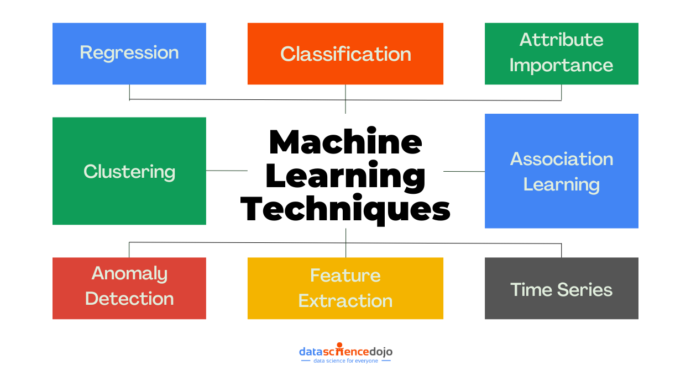

## Table of Contents

## What is an attribute in the context of machine learning?

In machine learning, an attribute is a characteristic or feature of a data point that helps describe it. Think of it like describing a person; you might mention their height, weight, or eye color. These are all attributes that help paint a picture of who they are. In the same way, in a dataset, each row represents a data point, and the columns are the attributes that provide information about that data point.

For example, if you're working with a dataset about houses, attributes might include the number of bedrooms, the size of the lot, or the age of the house. These attributes are used by machine learning models to learn patterns and make predictions. The choice of which attributes to include can greatly affect the performance of the model, so it's important to select attributes that are relevant and informative for the task at hand.

## How do attributes differ from features in machine learning?

In machine learning, the terms "attributes" and "features" are often used interchangeably, but there can be a subtle difference in how they are used depending on the context. An attribute is generally a characteristic or property of a data point that you start with in your dataset. For example, if you have a dataset about cars, attributes might include things like the car's color, make, and model year. These are the raw pieces of information you collect about each car.

A feature, on the other hand, is often a transformed or derived version of an attribute that is used specifically for building a machine learning model. Features are what the model uses to learn and make predictions. For instance, you might take the attribute "model year" and turn it into a feature called "age of car" by subtracting the model year from the current year. This transformation can make the data more useful for the model. So, while all features are attributes, not all attributes are necessarily used as features in a model.

To sum up, attributes are the initial characteristics of your data, while features are the specific pieces of information, possibly transformed, that you feed into your [machine learning](/wiki/machine-learning) model. Understanding the difference can help you better prepare your data and improve your model's performance.

## What types of attributes are commonly used in machine learning datasets?

In machine learning, there are several types of attributes that are commonly used in datasets. One common type is numerical attributes, which include numbers that can be measured or counted. These can be further divided into continuous and discrete attributes. Continuous attributes can take any value within a range, like the temperature or the weight of an object. Discrete attributes, on the other hand, can only take specific values, like the number of bedrooms in a house.

Another type of attribute is categorical, which includes data that can be divided into groups or categories. These can be further split into nominal and ordinal attributes. Nominal attributes are categories without any inherent order, like colors or types of fruits. Ordinal attributes have a natural order, like sizes (small, medium, large) or education levels (high school, bachelor's, master's). Understanding the type of attribute you're working with is important because it affects how you preprocess and use the data in your machine learning models.

Lastly, there are binary attributes, which are a special case of categorical attributes where there are only two possible values, like true/false or yes/no. These can be useful for tasks like classification, where you're trying to predict whether something belongs to one category or another. Each type of attribute can be used to help a machine learning model learn from the data and make accurate predictions, so choosing the right attributes and preparing them properly is key to building a successful model.

## How can one identify relevant attributes for a machine learning model?

Identifying relevant attributes for a machine learning model involves understanding the problem you're trying to solve and the data you have. Start by looking at the goal of your model. What are you trying to predict or classify? Think about which pieces of information might help the model make those predictions. For example, if you're predicting house prices, attributes like the number of bedrooms, the size of the lot, and the age of the house could be important. Talk to experts in the field or use your own knowledge to figure out which attributes might be useful.

Once you have a list of potential attributes, you can use different methods to check which ones are actually helpful. One common method is to use feature selection techniques. These techniques help you pick the best attributes by looking at how much they contribute to the model's performance. You can also try building simple models with different sets of attributes and see which ones give you the best results. Remember, it's not just about having a lot of attributes; it's about having the right ones that provide meaningful information to your model.

## What is the process of attribute selection and why is it important?

Attribute selection, also known as feature selection, is the process of choosing which attributes or features from your dataset to use in your machine learning model. It starts with understanding the problem you're trying to solve and identifying which pieces of information might help your model make accurate predictions. You can talk to experts or use your own knowledge to come up with a list of potential attributes. Then, you use different methods to test which attributes are actually useful. These methods can include building simple models with different sets of attributes and seeing which ones perform better, or using special techniques that measure how much each attribute contributes to the model's performance.

Attribute selection is important because it can make your model work better and faster. When you use only the most relevant attributes, your model can focus on the information that really matters, which can lead to more accurate predictions. It also helps prevent a problem called overfitting, where the model learns too much from the data and doesn't work well on new data. By choosing the right attributes, you can make your model simpler and easier to understand, which is helpful when you need to explain how it works to others. In the end, good attribute selection can make your machine learning project more successful.

## How does attribute scaling impact machine learning model performance?

Attribute scaling is important for machine learning because it helps different attributes work together better in a model. Imagine you have attributes like the age of a house in years and the size of the house in square feet. If you don't scale these attributes, the size attribute might seem more important just because its numbers are bigger. This can make the model focus too much on size and not enough on age. By scaling the attributes, you make sure each one has an equal chance to affect the model's predictions. This can lead to a fairer and more accurate model.

Scaling can also help the model learn faster and work better. Many machine learning algorithms, like those using gradient descent, work better when the attributes are on a similar scale. If the attributes are not scaled, the algorithm might take longer to find the best solution or might not find it at all. For example, in a model that predicts house prices, scaling the age and size attributes can help the model converge faster and give more reliable predictions. So, scaling is a simple step that can make a big difference in how well your machine learning model performs.

## What are some common techniques for handling missing attribute values?

Handling missing attribute values is a common challenge in machine learning. One way to deal with them is by simply removing the rows or columns with missing values. If only a few values are missing, this can work well. But if a lot of data is missing, you might lose too much information. Another way is to fill in the missing values with an estimate. You could use the average or median value of the attribute to fill in the gaps. For example, if the age of a house is missing, you could replace it with the average age of all the houses in your dataset.

Another technique is called imputation, which can be more sophisticated. You can use other attributes to predict the missing values. For instance, if you know the size and number of bedrooms of a house, you might be able to guess its age. There are also machine learning algorithms that can help with this, like k-nearest neighbors, where you use similar data points to fill in the missing values. It's important to choose the right method based on your data and the problem you're trying to solve. Handling missing values well can make your model more accurate and reliable.

## How can categorical attributes be encoded for use in machine learning models?

Categorical attributes, like colors or types of fruits, need to be changed into numbers before they can be used in machine learning models. One common way to do this is called one-hot encoding. Imagine you have an attribute called "color" with values like red, blue, and green. You can create new columns for each color. If a data point is red, you put a 1 in the "red" column and 0s in the other color columns. This way, the model can understand and use the information about color.

Another way to encode categorical attributes is label encoding. Here, you assign a unique number to each category. For example, if you have the categories "small," "medium," and "large," you might assign them the numbers 1, 2, and 3. This can be simple and works well for some models, but it can cause problems if the model thinks the numbers have a special order or meaning. Choosing the right encoding method depends on your data and the type of model you're using, so it's important to think about which method will work best for your project.

## What is the role of attribute engineering in enhancing model performance?

Attribute engineering is like giving your machine learning model the best tools to do its job. It involves creating new attributes or changing the old ones to make them more useful for the model. For example, if you have the attribute "date of birth," you might create a new attribute called "age" by subtracting the birth date from the current date. This new attribute might help the model understand the data better and make better predictions. Attribute engineering can also mean combining different attributes to create something new and more informative. By doing this, you can help the model see patterns and relationships in the data that it might not have noticed before.

Using attribute engineering can make a big difference in how well your model works. It can help the model learn faster and be more accurate. For instance, if you're trying to predict how much a house will sell for, you might create an attribute that measures how close the house is to good schools. This new attribute could be very important for the model's predictions. By spending time on attribute engineering, you can improve your model's performance and make sure it's using the best possible information to learn from.

## How do you assess the importance of different attributes in a trained model?

To assess the importance of different attributes in a trained model, you can use various methods that help you understand which attributes have the biggest impact on the model's predictions. One common way is to look at the feature importance scores that some models, like decision trees or random forests, give you. These scores tell you how much each attribute contributes to the model's decisions. Another method is to use techniques like permutation importance, where you mix up the values of one attribute and see how much it affects the model's performance. If the model's accuracy drops a lot when you mix up an attribute, that attribute is probably important.

Another approach is to use a method called SHAP (SHapley Additive exPlanations) values, which can show you how each attribute influences the model's output for individual predictions. SHAP values help you see not just which attributes are important overall, but how they affect specific predictions. You can also use techniques like partial dependence plots to see how changing the value of an attribute affects the model's predictions. By using these methods, you can get a good understanding of which attributes are most important for your model and make better decisions about which ones to focus on or improve.

## What are the challenges associated with high-dimensional attribute spaces?

High-dimensional attribute spaces can make things harder for machine learning models. When you have a lot of attributes, it's like trying to find a needle in a haystack. The more attributes you have, the more data you need to train your model well. If you don't have enough data, the model might get confused and not learn the right patterns. This problem is called the "curse of dimensionality." It can make your model take longer to train and might even make it less accurate. Another challenge is that high-dimensional spaces can make it hard to see which attributes are really important. With so many attributes, it's easy to miss the ones that matter most.

Another issue with high-dimensional attribute spaces is something called overfitting. When you have a lot of attributes, the model might start to pay too much attention to small details in the data that don't really matter. This can make the model work well on the data it was trained on but not on new data. To deal with these challenges, you can use techniques like dimensionality reduction, which helps simplify the data by focusing on the most important attributes. By doing this, you can make your model work better and faster, and it can be easier to understand which attributes are helping the most.

## How can advanced techniques like attribute embedding improve machine learning models?

Attribute embedding is a smart way to turn things like words or categories into numbers that machine learning models can use easily. Imagine you have a list of different fruits like apples, bananas, and oranges. Instead of just giving each fruit a number, attribute embedding creates a special set of numbers for each fruit that show how similar or different they are to each other. For example, apples and oranges might have numbers that are closer together because they are both fruits, while bananas might be a bit further away because they are different in some ways. This helps the model understand the relationships between different attributes better and can make it work better overall.

Using attribute embedding can really help improve how well a machine learning model performs. When you use embeddings, the model can learn from the data more easily because it's not just looking at simple numbers, but at numbers that [carry](/wiki/carry-trading) more meaning. This can be especially helpful for things like understanding text or predicting what someone might like based on what they've done before. By using attribute embedding, you can make your model smarter and more accurate, which is great for all kinds of machine learning tasks.