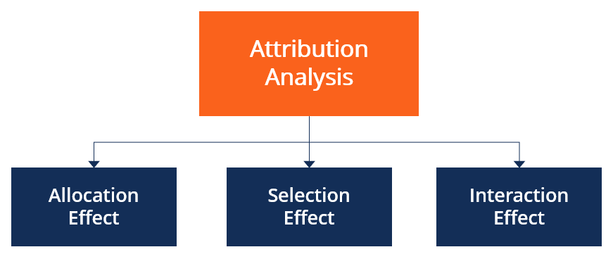

## Table of Contents

## What is attribution analysis in portfolio management?

Attribution analysis in portfolio management is a way to figure out why a portfolio performed the way it did. It breaks down the performance into different parts, like which investments did well or poorly, and how the choices made by the portfolio manager affected the results. This helps investors and managers understand what worked and what didn't, so they can make better decisions in the future.

For example, if a portfolio did better than a benchmark, attribution analysis can show if it was because the manager picked better stocks, or if it was because they invested more in a sector that did well. It's like looking under the hood of a car to see what makes it run. By understanding these details, managers can adjust their strategies to improve performance and meet their investment goals.

## Why is attribution analysis important for investors?

Attribution analysis is important for investors because it helps them understand why their investments are doing well or poorly. It breaks down the performance of a portfolio into smaller pieces, showing which parts are working and which aren't. This way, investors can see if their gains are coming from smart choices by the manager, like picking good stocks, or if it's just because they happened to invest in a sector that's doing well overall.

By knowing these details, investors can make better decisions about their money. If they see that a manager is good at picking stocks but bad at choosing sectors, they might decide to keep investing with that manager but also adjust their own strategy. Attribution analysis also helps investors hold their managers accountable, making sure they're [earning](/wiki/earning-announcement) their fees by adding value to the portfolio.

## What are the basic components of attribution analysis?

Attribution analysis looks at different parts of a portfolio to see what made it perform the way it did. The main parts it looks at are allocation and selection. Allocation is about how the money is spread across different types of investments, like stocks, bonds, or different sectors. If a portfolio has a lot of money in a sector that does well, that can boost its performance. Selection is about the specific investments chosen within those sectors. If a manager picks stocks that do better than others in the same sector, that can also help the portfolio.

Another part of attribution analysis is interaction, which looks at how allocation and selection work together. Sometimes, a manager might put a lot of money into a sector and also pick the best stocks in that sector, which can make the portfolio do even better. By breaking down the performance into these parts, attribution analysis helps investors and managers see what's working and what's not. This way, they can make smarter choices about where to invest their money in the future.

## How does attribution analysis help in understanding portfolio performance?

Attribution analysis helps investors understand why their portfolio is doing well or not so well. It breaks down the performance into smaller pieces, showing which parts are doing the work. For example, it can tell if the portfolio is doing well because the manager picked good stocks or because they invested more in a sector that's doing great. By looking at these details, investors can see if their gains are coming from smart choices or just luck.

This analysis also helps investors figure out what to do next. If they see that the manager is good at picking stocks but not so good at choosing sectors, they might decide to keep investing with that manager but also adjust their own strategy. By understanding how different parts of the portfolio are performing, investors can make better decisions about where to put their money in the future. It's like getting a report card for their investments, helping them see what's working and what needs to change.

## What is the difference between returns-based and holdings-based attribution?

Returns-based attribution and holdings-based attribution are two ways to figure out why a portfolio did well or not so well. Returns-based attribution looks at the overall returns of the portfolio and compares them to a benchmark, like an index. It uses statistical methods to guess why the portfolio did better or worse than the benchmark. This method is simpler and doesn't need a lot of detailed information about what's in the portfolio, but it can be less accurate because it's just making educated guesses.

On the other hand, holdings-based attribution looks at the actual investments in the portfolio. It breaks down the performance into parts like which stocks did well, which sectors were good, and how the manager's choices affected the results. This method needs a lot more information, like the exact stocks and how much of each the portfolio holds, but it gives a clearer and more detailed picture of what's going on. Holdings-based attribution is more accurate but can be harder to do because it needs so much data.

## How can attribution analysis be used to compare a portfolio against a benchmark?

Attribution analysis helps investors compare how their portfolio did compared to a benchmark, like an index. It breaks down the portfolio's performance into smaller parts to see what made it do better or worse than the benchmark. For example, it can show if the portfolio did well because the manager picked good stocks, or if it was because they put more money into a sector that did well. By looking at these details, investors can see if their portfolio's performance was due to smart choices or just luck.

This analysis also helps investors understand where they might need to make changes. If the portfolio did better than the benchmark because of good stock picks but not because of smart sector choices, the investor might decide to keep the manager but adjust their own strategy. On the other hand, if the portfolio did worse than the benchmark, attribution analysis can show where the problems were, like bad stock picks or poor sector allocation. This way, investors can make better decisions about where to put their money in the future, using the benchmark as a guide to see how they're doing.

## What are the common methods used in attribution analysis?

Attribution analysis uses different methods to figure out why a portfolio did well or not so well. One common method is the Brinson model, which breaks down performance into three parts: allocation, selection, and interaction. Allocation looks at how much money is put into different types of investments, like stocks or bonds. Selection looks at the specific investments chosen within those types. Interaction shows how allocation and selection work together. This method helps investors see if their portfolio did well because the manager picked good investments or because they put more money into a sector that did well.

Another method is the Brinson-Fachler model, which is similar to the Brinson model but adds more details. It separates the allocation effect into two parts: the effect of being in the right sector and the effect of being in the right country or region. This can be helpful for portfolios that invest in different countries. Both the Brinson and Brinson-Fachler models need a lot of information about what's in the portfolio, but they give a clear picture of what's working and what's not. By using these methods, investors can understand their portfolio better and make smarter choices about where to put their money.

## How do you calculate attribution effects such as allocation, selection, and interaction?

To calculate the allocation effect, you look at how much of the portfolio's performance came from putting money into different types of investments, like stocks or bonds. You compare the weight of each type of investment in the portfolio to its weight in the benchmark. Then, you multiply the difference by the return of that type of investment in the benchmark. For example, if the portfolio has more money in tech stocks than the benchmark and tech stocks did well, the allocation effect would show how much that choice helped the portfolio's performance.

The selection effect shows how much the portfolio's performance came from picking specific investments within each type. You calculate this by comparing the return of each investment in the portfolio to the return of the same type of investment in the benchmark. Then, you multiply the difference by the weight of that investment in the portfolio. If the portfolio's tech stocks did better than the tech stocks in the benchmark, the selection effect would show how much that choice helped the portfolio.

The interaction effect combines allocation and selection. It shows how the choices to put more money into certain types of investments and then pick specific investments within those types worked together. To calculate it, you multiply the difference in weights by the difference in returns. If the portfolio had more money in tech stocks and those stocks did better than the benchmark's tech stocks, the interaction effect would show how these two choices together affected the portfolio's performance.

## What are the challenges and limitations of attribution analysis?

Attribution analysis is a useful tool, but it has some challenges and limitations. One big challenge is that it needs a lot of detailed information about what's in the portfolio. If you don't have all the data, like the exact stocks and how much of each you own, it can be hard to do the analysis right. Another problem is that it can be tricky to figure out how much of the portfolio's performance came from smart choices versus just luck. Sometimes, a sector might do well by chance, and it's hard to tell if the manager made a good choice or if they just got lucky.

Another limitation is that attribution analysis can be affected by timing. If a manager buys or sells investments at just the right time, it can make their performance look better or worse than it really is. Also, different methods of attribution analysis can give different results, which can be confusing. For example, the Brinson model and the Brinson-Fachler model might show different things about the same portfolio. This means that investors need to be careful about which method they use and understand that the results might not always be perfect.

## How can multi-level attribution analysis enhance portfolio management decisions?

Multi-level attribution analysis helps portfolio managers understand their investments better by looking at performance in more detail. Instead of just seeing if the whole portfolio did well or not, multi-level analysis breaks things down into smaller pieces. It can look at how different sectors, countries, or even individual stocks did compared to a benchmark. This way, managers can see if their gains came from smart choices in picking sectors, or if it was because they picked the right stocks within those sectors. By understanding these details, managers can make better decisions about where to put their money in the future.

This type of analysis also helps managers see how their choices at different levels work together. For example, they might find that putting more money into a certain sector and then picking good stocks within that sector made their portfolio do really well. Or, they might see that their sector choices were good, but their stock picks were not so great. By knowing this, managers can adjust their strategies to focus on what's working and fix what's not. Multi-level attribution analysis gives a clearer picture of what's driving the portfolio's performance, helping managers make smarter and more informed decisions.

## What advanced techniques can be applied to improve the accuracy of attribution analysis?

One advanced technique to improve the accuracy of attribution analysis is using multi-[factor](/wiki/factor-investing) models. These models look at different things that can affect how investments do, like how big a company is, how much it grows, or how risky it is. By considering these factors, multi-factor models can give a more detailed picture of why a portfolio did well or not so well. This helps managers see if their gains came from picking good stocks or if it was because they invested in companies with certain traits that did well.

Another technique is using time-weighted attribution, which looks at how investments perform over different periods. This can help managers understand if their choices were good at different times, not just overall. By breaking down performance into shorter time frames, time-weighted attribution can show if a manager made smart moves at the right time or if they got lucky. This way, managers can adjust their strategies to focus on what works best at different times, making their decisions more accurate and effective.

## How does attribution analysis integrate with risk management and performance forecasting in portfolio management?

Attribution analysis helps with risk management by showing where the risks in a portfolio are coming from. It breaks down the performance into parts like allocation and selection, so managers can see if they're taking too much risk in certain sectors or if their stock picks are too risky. By understanding these details, managers can adjust their investments to lower the risk. For example, if attribution analysis shows that a portfolio did well because of high-risk stocks, the manager might decide to spread the money out more to reduce the chance of big losses.

Attribution analysis also helps with performance forecasting by giving managers a clearer picture of what's working and what's not. By looking at past performance, managers can see if their strategies are likely to keep working in the future. For example, if attribution analysis shows that picking good stocks in a certain sector has been successful, managers might predict that this will continue to help the portfolio. This way, they can make better guesses about how the portfolio will do in the future and plan their investments accordingly.

## What is the role of attribution analysis in portfolio management?

Attribution analysis is a vital tool in portfolio management, designed to evaluate a portfolio’s performance against a benchmark. This technique offers insights into the effectiveness of investment decisions by distinguishing between skill-based strategic choices and mere luck.

The analysis begins by breaking down the portfolio's excess return—typically measured over a specific period—into several components: asset allocation, security selection, and market timing. Each component represents a distinct decision-making area contributing to a portfolio's performance.

**Asset Allocation Attribution:** This component assesses the impact of the investor’s decision to allocate resources across different asset classes. By comparing the actual portfolio weights to the benchmark weights, investors can determine how their asset distribution decisions contributed to the overall return.

**Security Selection Attribution:** Here, the focus is on individual security choices within each asset class. By evaluating the performance of selected securities against their respective benchmark constituents, investors can identify whether the right securities have been chosen to outperform the market.

**Market Timing Attribution:** This measures the effect of strategic decisions made to capitalize on short-term market trends. Timing refers to adjusting the portfolio’s exposure based on anticipated market movements and is evaluated by observing changes in asset class weights over time in comparison to the benchmark.

Mathematically, the excess return $(R_p - R_b)$ of a portfolio over its benchmark can be represented as:

$$
R_p - R_b = \sum (w_{pi} - w_{bi}) \times (R_{bi} - R_b) + \sum w_{pi} \times (R_{pi} - R_{bi}) + \text{Timing}
$$

where:
- $w_{pi}$ and $w_{bi}$ are the weights of the portfolio and benchmark for asset $i$,
- $R_{pi}$ and $R_{bi}$ are the returns of the portfolio and benchmark for asset $i$,
- $(R_{bi} - R_b)$ reflects asset allocation,
- $(R_{pi} - R_{bi})$ reflects security selection,
- Timing is the component capturing market timing effects.

Portfolio managers leverage attribution analysis to refine investment strategies. By understanding which choices contribute positively and which detract from performance, they can adjust their strategies to enhance returns. For instance, a positive allocation effect suggests that the investor successfully identified asset classes that outperformed, while positive security selection indicates effective stock-[picking](/wiki/asset-class-picking) abilities.

Ultimately, attribution analysis empowers investors with a detailed understanding of performance dynamics. This transparency in performance metrics aids in the continuous improvement of investment strategies, thereby aligning them closer to the investor's financial goals.

## References & Further Reading

[1]: Bergstra, J., Bardenet, R., Bengio, Y., & Kégl, B. (2011). ["Algorithms for Hyper-Parameter Optimization."](https://dl.acm.org/doi/10.5555/2986459.2986743) Advances in Neural Information Processing Systems 24.

[2]: ["Advances in Financial Machine Learning"](https://www.amazon.com/Advances-Financial-Machine-Learning-Marcos/dp/1119482089) by Marcos Lopez de Prado

[3]: ["Evidence-Based Technical Analysis: Applying the Scientific Method and Statistical Inference to Trading Signals"](https://www.amazon.com/Evidence-Based-Technical-Analysis-Scientific-Statistical/dp/0470008741) by David Aronson

[4]: ["Machine Learning for Algorithmic Trading"](https://github.com/stefan-jansen/machine-learning-for-trading) by Stefan Jansen

[5]: ["Quantitative Trading: How to Build Your Own Algorithmic Trading Business"](https://www.amazon.com/Quantitative-Trading-Build-Algorithmic-Business/dp/1119800064) by Ernest P. Chan