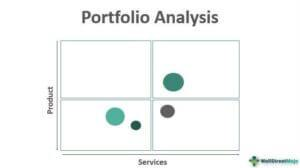

The world of finance is abundant with a diverse array of strategies and tools designed to optimize investments effectively. Central to this domain are investment analysis, attribution analysis, portfolio management, and algorithmic trading. Each of these elements plays a significant role in navigating the complexities of financial markets, ensuring that investment decisions are grounded in informed, data-driven insights. Investment analysis serves as the foundation for evaluating potential opportunities, focusing on profitability and risk assessment. Attribution analysis, on the other hand, evaluates portfolio performance against benchmarks, dissecting the various attributions of returns—be it due to asset allocation or security selection. Portfolio management is the strategic art of balancing risk and reward, tailoring investment sorties to align with financial objectives. Lastly, algorithmic trading introduces automation, enabling the execution of trading strategies with precision and speed that transcend human capabilities.

By understanding how these components interconnect and complement each other, investors and financial professionals are better equipped to enhance investment performance. These tools collectively refine and sharpen the decision-making process, fostering an environment where financial objectives can be achieved more efficiently. As the financial landscape evolves with technological advances, the synergy between these concepts promises to further revolutionize how investments are managed and optimized.



## Table of Contents

## Understanding Investment Analysis

Investment analysis is a critical process in financial markets, entailing the evaluation of an investment for its potential profitability and associated risks. This involves a comprehensive examination of economic and financial factors, alongside assessments of company financial statements and prevailing market conditions. The ultimate goal is to forecast future price movements and identify opportunities that align with an investor's financial objectives.

Several methodologies are prevalent in investment analysis, chief among them being fundamental analysis and technical analysis. Fundamental analysis seeks to evaluate an investment's intrinsic value by examining economic indicators, industry trends, and financial metrics such as earnings, dividends, and cash flows. Analysts use financial statements, including balance sheets, income statements, and cash flow statements, to assess a company's financial health. For example, a company with a strong balance sheet, consistent earnings growth, and robust cash flow generation might be deemed a worthwhile investment.

Technical analysis, on the other hand, involves the study of historical price and volume data to predict future price movements. This method relies on charts and statistical tools to identify patterns and trends. Analysts apply techniques such as moving averages, relative strength index (RSI), and Bollinger Bands to interpret market behavior and time entry or exit points for trades. Unlike fundamental analysis, technical analysis does not concern itself with the intrinsic value but focuses on past market behavior to anticipate future actions.

In modern investment analysis, quantitative models and algorithms play an increasing role. These models analyze vast datasets to generate insights that inform investment decisions. For instance, Python libraries like Pandas and NumPy can be utilized to execute data analysis, while machine learning techniques enable the identification of complex patterns in financial data:

```python
import pandas as pd
import numpy as np

# Load financial data
data = pd.read_csv('financial_data.csv')

# Calculate moving average
data['moving_average'] = data['close_price'].rolling(window=20).mean()

# Implementing a simple trading strategy
def simple_moving_average_strategy(data):
    buy_signals = []
    sell_signals = []

    for i in range(1, len(data)):
        if data['close_price'][i] > data['moving_average'][i] and \
           data['close_price'][i-1] <= data['moving_average'][i-1]:
            buy_signals.append((data['date'][i], data['close_price'][i]))
        elif data['close_price'][i] < data['moving_average'][i] and \
             data['close_price'][i-1] >= data['moving_average'][i-1]:
            sell_signals.append((data['date'][i], data['close_price'][i]))

    return buy_signals, sell_signals

buy_orders, sell_orders = simple_moving_average_strategy(data)
```

This code implements a simple moving average trading strategy, an example of how quantitative analysis is applied in investment analysis.

Effective investment analysis underpins successful investment strategies by providing a systematic framework for making informed decisions. By judiciously combining various analytical methods and tools, investors and financial professionals can better manage risk and maximize returns, thereby laying a robust foundation for achieving their financial goals.

## The Role of Attribution Analysis in Portfolio Management

Attribution analysis is a vital tool in portfolio management, designed to evaluate a portfolio’s performance against a benchmark. This technique offers insights into the effectiveness of investment decisions by distinguishing between skill-based strategic choices and mere luck.

The analysis begins by breaking down the portfolio's excess return—typically measured over a specific period—into several components: asset allocation, security selection, and market timing. Each component represents a distinct decision-making area contributing to a portfolio's performance.

**Asset Allocation Attribution:** This component assesses the impact of the investor’s decision to allocate resources across different asset classes. By comparing the actual portfolio weights to the benchmark weights, investors can determine how their asset distribution decisions contributed to the overall return.

**Security Selection Attribution:** Here, the focus is on individual security choices within each asset class. By evaluating the performance of selected securities against their respective benchmark constituents, investors can identify whether the right securities have been chosen to outperform the market.

**Market Timing Attribution:** This measures the effect of strategic decisions made to capitalize on short-term market trends. Timing refers to adjusting the portfolio’s exposure based on anticipated market movements and is evaluated by observing changes in asset class weights over time in comparison to the benchmark.

Mathematically, the excess return $(R_p - R_b)$ of a portfolio over its benchmark can be represented as:

$$
R_p - R_b = \sum (w_{pi} - w_{bi}) \times (R_{bi} - R_b) + \sum w_{pi} \times (R_{pi} - R_{bi}) + \text{Timing}
$$

where:
- $w_{pi}$ and $w_{bi}$ are the weights of the portfolio and benchmark for asset $i$,
- $R_{pi}$ and $R_{bi}$ are the returns of the portfolio and benchmark for asset $i$,
- $(R_{bi} - R_b)$ reflects asset allocation,
- $(R_{pi} - R_{bi})$ reflects security selection,
- Timing is the component capturing market timing effects.

Portfolio managers leverage attribution analysis to refine investment strategies. By understanding which choices contribute positively and which detract from performance, they can adjust their strategies to enhance returns. For instance, a positive allocation effect suggests that the investor successfully identified asset classes that outperformed, while positive security selection indicates effective stock-[picking](/wiki/asset-class-picking) abilities.

Ultimately, attribution analysis empowers investors with a detailed understanding of performance dynamics. This transparency in performance metrics aids in the continuous improvement of investment strategies, thereby aligning them closer to the investor's financial goals.

## Portfolio Management: Strategies and Tools

Portfolio management entails the strategic selection and oversight of investment assets to meet specific financial objectives while managing risk. Achieving these objectives requires a delicate balance between risk and reward, ensuring that the portfolio aligns with an investor's risk tolerance and investment horizon.

**Balancing Risk and Reward**

The risk-return tradeoff is a fundamental principle in portfolio management. Investors aim to maximize returns for a given level of risk, or alternatively, minimize risk for a desired return. This involves diversification, asset allocation, and continuous monitoring of market conditions. Diversification reduces risk by spreading investments across various asset classes, industries, or geographies, mitigating the impact of a poor-performing asset.

**Strategies in Portfolio Management**

Portfolio management strategies are broadly categorized into active, passive, and hybrid approaches:

1. **Active Management**: This strategy involves frequent buying and selling of assets to outperform a specific benchmark or index. Active managers rely on research, market forecasts, and their own judgment to make investment decisions. While this approach can potentially offer higher returns, it also incurs higher costs due to increased trading and management fees.

2. **Passive Management**: Passive management, or index investing, aims to replicate the performance of a specific benchmark index. This strategy involves minimal trading and focuses on long-term growth, resulting in lower management costs. It's predicated on the Efficient Market Hypothesis (EMH), which suggests that all available information is already reflected in asset prices, making it difficult to consistently outperform the market.

3. **Hybrid Management**: A hybrid approach combines elements of both active and passive management. Investors may choose index funds for a portion of their portfolio for stability and low costs, while allocating funds to actively managed investments to exploit specific market opportunities. This strategy aims to balance the risk and costs associated with active management with the low cost and consistency of passive investing.

**Tools for Portfolio Management**

Efficient portfolio management relies on tools such as performance attribution and risk analysis:

- **Performance Attribution**: This tool helps in understanding the sources of a portfolio's returns relative to a benchmark. It decomposes returns into various components such as asset allocation, sector selection, and security selection, allowing managers to identify successful strategies and areas needing improvement.

- **Risk Analysis**: Quantitative models, such as Value at Risk (VaR) and the Sharpe Ratio, are employed to measure and manage portfolio risk. VaR estimates the potential loss over a specified period at a given confidence level, while the Sharpe Ratio evaluates risk-adjusted returns by comparing the portfolio's excess return over the risk-free rate to its standard deviation.

Python Example:
```python
import numpy as np

# Example: Calculating Sharpe Ratio
def sharpe_ratio(returns, risk_free_rate):
    excess_returns = returns - risk_free_rate
    return np.mean(excess_returns) / np.std(excess_returns)

# Sample data
portfolio_returns = np.array([0.02, 0.01, 0.015, 0.03, 0.025])
risk_free_rate = 0.005

# Calculate Sharpe Ratio
sharpe = sharpe_ratio(portfolio_returns, risk_free_rate)
print(f"Sharpe Ratio: {sharpe:.2f}")
```

In summary, successful portfolio management requires a comprehensive understanding of risk management, strategic planning, and the effective use of analytical tools. By employing appropriate strategies and leveraging technological advancements, portfolio managers can enhance investment outcomes and achieve their financial goals.

## Algorithmic Trading: Automating the Investment Process

Algorithmic trading refers to the use of computer programs to automate the execution of trading strategies, thereby minimizing human intervention and maximizing trading efficiency. Integral to modern financial markets, it enables the execution of trades at velocities and frequencies beyond human capability, offering a substantial competitive advantage. High-frequency trading ([HFT](/wiki/high-frequency-trading-strategies)), one of the most prominent applications of [algorithmic trading](/wiki/algorithmic-trading), involves executing a large number of trades at extremely high speeds, often in milliseconds or microseconds.

The effectiveness of algorithmic trading is contingent on the quality of market data and the sophistication of the analytical models employed. Modern trading algorithms rely on robust datasets that include price quotes, market depth, and transaction data. This data feeds into analytical models that use various techniques such as statistical [arbitrage](/wiki/arbitrage) and [machine learning](/wiki/machine-learning) to predict market movements and identify profitable trading opportunities.

A typical algorithmic trading system follows a structured process. It begins with signal generation, where the algorithm analyzes market data to identify potential trading signals. These signals are then processed by a trading strategy, which decides whether to initiate a trade based on predefined criteria, such as thresholds for price movement or [volume](/wiki/volume-trading-strategy) changes. Finally, an execution algorithm places the order in the market, optimizing for price and minimizing market impact.

Consider, for example, a simple moving average crossover strategy implemented in Python:

```python
import pandas as pd

# Load historical price data
data = pd.read_csv('market_data.csv')

# Calculate moving averages
data['MA50'] = data['Close'].rolling(window=50).mean()
data['MA200'] = data['Close'].rolling(window=200).mean()

# Generate trading signals
data['Signal'] = 0
data.loc[data['MA50'] > data['MA200'], 'Signal'] = 1
data.loc[data['MA50'] <= data['MA200'], 'Signal'] = -1

# Generate trade orders
def generate_order_signal(data):
    order_signals = []
    for i in range(1, len(data)):
        if data['Signal'].iloc[i] != data['Signal'].iloc[i - 1]:
            order_signals.append((data['Date'].iloc[i], data['Signal'].iloc[i]))
    return order_signals

# Execute trades
order_signals = generate_order_signal(data)
```

In this example, the algorithm captures the crossover of the 50-day and 200-day moving averages to generate buy or sell signals. Such a strategy is simplistic but highlights the fundamental structure of algorithmic trading strategies: data analysis, signal generation, and order execution.

The efficacy of algorithmic trading systems is augmented by advanced analytical models which leverage large datasets and sophisticated algorithms. Techniques like machine learning enhance signal generation by identifying complex patterns in historical data that traditional models might miss.

As financial markets continue to evolve, the reliance on algorithmic trading is expected to grow, necessitating ongoing improvements in data analytics, model sophistication, and execution speed to maintain a competitive edge.

## The Intersection of Attribution Analysis and Algorithmic Trading

Combining attribution analysis with algorithmic trading offers substantial benefits for enhancing a portfolio's performance. Attribution analysis dissects the performance outcomes of portfolios, differentiating between elements attributable to decisions made regarding asset allocation, security selection, and market timing. By integrating these insights with algorithmic trading, which relies on automated systems to execute trades at high speeds, investors can markedly improve their strategic approach.

Algorithmic trading utilizes computational models that accommodate a breadth of data inputs to optimize trade execution efficiently. Incorporating insights from attribution analysis allows algorithms to intelligently adjust and target specific market segments where past performance metrics indicate potential for higher returns. The continuous flow of feedback from attribution analysis equips algorithms to adapt dynamically to evolving market conditions, enhancing the responsiveness and accuracy of the trading system.

This synergy ensures that investment decision-making is grounded in comprehensive performance assessments that consider past successes and failures. By doing so, traders can refine and hone their strategies, leading to improved precision in market predictions and execution. For instance, an attribution analysis might reveal that a certain sector allocation significantly contributed to excess returns. An algorithm informed by this analysis can then allocate resources in a similar pattern, exploiting these insights for future trades.

Moreover, the integration of these two methodologies fosters a cycle of continuous improvement. As algorithms implement trades informed by attribution insights, the resulting performance data feeds back into the attribution analysis process, creating a loop that enhances both the analytical model and the algorithmic strategies. This iterative cycle allows for optimization of strategies over time, as algorithms continuously learn and adapt based on the latest attribution data.

Ultimately, combining attribution analysis with algorithmic trading represents a forward-thinking approach to investment strategy, leveraging both quantitative data assessment and advanced computing power to achieve superior investment outcomes. As these technologies continue to advance, their integration will likely become an indispensable part of innovative investment practice, driving efficiency and profitability in increasingly complex financial markets.

## Conclusion

The integration of investment analysis, attribution analysis, portfolio management, and algorithmic trading forms a comprehensive ecosystem that enables superior investment outcomes. Each component contributes uniquely to this ecosystem: investment analysis evaluates potential risks and rewards, attribution analysis dissects portfolio performance relative to specific benchmarks, portfolio management balances risk and rewards to achieve financial objectives, and algorithmic trading enhances execution efficiency through automation.

Investment analysis serves as the foundational step, providing a thorough understanding of market trends, economic conditions, and financial metrics. This insightful groundwork supports more informed decision-making, ultimately leading to improved portfolio performance. Attribution analysis complements this by differentiating between portfolio managers' skill and market movements, allowing for precise adjustments to investment strategies.

Portfolio management strategically combines these insights, manifesting optimal risk-reward balances tailored to the investor's objectives. By employing strategies such as active, passive, or hybrid management, this component ensures portfolios remain aligned with the intended financial goals while remaining adaptable to market dynamics.

Algorithmic trading further amplifies this synergy by automating the execution of trades using pre-set criteria derived from both investment and attribution analyses. This technology-driven approach not only increases the speed and frequency of trades but also helps mitigate human errors, delivering a competitive edge in markets where milliseconds can determine profits.

As technology continues to advance, the synergy between these components is expected to grow, driving even greater efficiency and profitability in the investment landscape. The integration facilitates data-driven decision-making processes, harnessing the full potential of each element. Investors aligning these components efficiently can better navigate market complexities and achieve their financial objectives more effectively.

In conclusion, the evolving technology landscape and complex financial markets necessitate the harmonious integration of these elements. Investors who effectively leverage this integration are better equipped to enhance their decision-making processes, achieving their financial objectives with improved accuracy and efficiency. The interplay between investment analysis, attribution analysis, portfolio management, and algorithmic trading is not simply a trend but a robust framework optimizing the future of investment strategies.

## References & Further Reading

[1]: Bergstra, J., Bardenet, R., Bengio, Y., & Kégl, B. (2011). ["Algorithms for Hyper-Parameter Optimization."](https://dl.acm.org/doi/10.5555/2986459.2986743) Advances in Neural Information Processing Systems 24.

[2]: ["Advances in Financial Machine Learning"](https://www.amazon.com/Advances-Financial-Machine-Learning-Marcos/dp/1119482089) by Marcos Lopez de Prado

[3]: ["Evidence-Based Technical Analysis: Applying the Scientific Method and Statistical Inference to Trading Signals"](https://www.amazon.com/Evidence-Based-Technical-Analysis-Scientific-Statistical/dp/0470008741) by David Aronson

[4]: ["Machine Learning for Algorithmic Trading"](https://github.com/stefan-jansen/machine-learning-for-trading) by Stefan Jansen

[5]: ["Quantitative Trading: How to Build Your Own Algorithmic Trading Business"](https://www.amazon.com/Quantitative-Trading-Build-Algorithmic-Business/dp/1119800064) by Ernest P. Chan