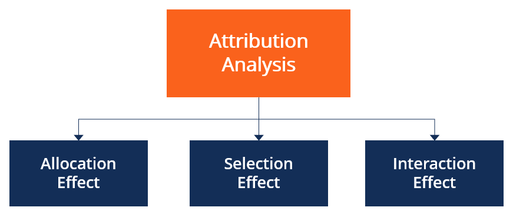

## Table of Contents

## What is attribution analysis in trading?

Attribution analysis in trading is a way to figure out why your investments are doing well or not so well. It helps traders and investors understand which parts of their portfolio are making money and which parts are losing money. By breaking down the performance, you can see if it's because of the stocks you picked, the industries you invested in, or other factors like how the overall market is doing.

This analysis is really useful because it shows you where to focus your efforts. If you find out that certain stocks or sectors are doing better than others, you might decide to invest more in those areas. On the other hand, if some parts of your portfolio are dragging down your performance, you can think about selling those assets or changing your strategy. It's like a report card for your investments, helping you make smarter decisions in the future.

## Why is attribution analysis important for traders and investors?

Attribution analysis is important for traders and investors because it helps them understand why their investments are performing the way they are. By looking at the details, they can see which parts of their portfolio are making money and which parts are losing money. This helps them figure out if their success is due to good stock picks, smart sector choices, or just because the overall market is doing well. Knowing this can make a big difference in how they manage their investments going forward.

For example, if attribution analysis shows that a certain sector, like technology, is doing really well for them, traders might decide to invest more in that area. On the other hand, if they find out that another part of their portfolio, like energy stocks, is not doing well, they might choose to sell those assets or change their strategy. This kind of analysis acts like a guide, helping investors make better decisions and adjust their portfolios to improve their chances of making money in the future.

## How does attribution analysis differ from performance measurement?

Attribution analysis and performance measurement are both important tools for investors, but they serve different purposes. Performance measurement looks at how well your investments are doing overall. It tells you if your portfolio made money or lost money over a certain time. It's like checking your report card to see your total score. This helps you know if you're doing well or not, but it doesn't explain why you got that score.

Attribution analysis goes deeper. It breaks down the performance of your investments to show you why they did well or poorly. It tells you which parts of your portfolio, like specific stocks or sectors, were the big winners or losers. This is like a teacher explaining which subjects you did well in and which ones you need to work on. By understanding these details, you can make smarter choices about where to invest more money or where to cut back.

## What are the key components of an attribution analysis?

Attribution analysis has a few main parts that help you figure out why your investments are doing what they're doing. The first part is looking at the returns from different investments. This means seeing how much money each stock or bond made or lost. The second part is figuring out how much of your success or failure comes from the choices you made, like [picking](/wiki/asset-class-picking) certain stocks or investing in specific industries. This is called the selection effect. The third part is understanding how much of your performance is due to the overall market or economy. This is called the allocation effect.

The last part of attribution analysis is looking at the timing of your investments. This means checking if you bought or sold things at the right time. Sometimes, making good choices about when to invest can make a big difference in your results. By putting all these pieces together, attribution analysis gives you a clear picture of why your portfolio performed the way it did. This helps you see what you did well and what you might want to do differently next time.

## Can you explain the difference between top-down and bottom-up attribution analysis?

Top-down attribution analysis starts with looking at the big picture. It focuses on how the overall market and different sectors are doing. Imagine you're looking at the whole forest before you look at the trees. With top-down analysis, you first see if your investment choices in different sectors or regions helped or hurt your performance. For example, if you put a lot of money into tech stocks and the tech sector did well, that might explain why your portfolio did well. It's about seeing if your big decisions, like which sectors to invest in, were good ones.

Bottom-up attribution analysis, on the other hand, starts with the small details. It looks at individual stocks or assets within your portfolio. Think of it like examining each tree in the forest. This type of analysis helps you understand if the specific stocks you chose were good picks. For instance, if you picked a certain tech company that did better than others in its sector, that would show up in bottom-up analysis. It's about figuring out if your choices in picking individual investments were smart, regardless of how the sector or market did overall.

Both approaches are important. Top-down helps you see the impact of your broad investment strategies, while bottom-up shows you the effectiveness of your individual stock picks. Together, they give you a complete picture of why your portfolio performed the way it did, helping you make better decisions in the future.

## How do you calculate returns contribution in attribution analysis?

To calculate the returns contribution in attribution analysis, you need to look at how each part of your investment portfolio added to or took away from your overall performance. You start by figuring out the return for each investment. This means finding out how much money each stock, bond, or other asset made or lost over a certain time. Then, you multiply that return by the amount of money you had invested in it. This gives you the contribution of that specific investment to your total portfolio's return. For example, if a stock returned 10% and you had $1,000 invested in it, its contribution would be $100.

Next, you add up all these contributions from each investment to get the total return for your portfolio. But in attribution analysis, you also want to know why these returns happened. So, you break down the contributions into different parts, like the selection effect and the allocation effect. The selection effect shows how well you picked individual stocks or assets. The allocation effect shows how well you chose to invest in certain sectors or markets. By understanding these parts, you can see what drove your portfolio's performance and make better investment decisions in the future.

## What role does sector allocation play in attribution analysis?

Sector allocation is a big part of attribution analysis. It helps you see if your choice to put money into certain industries, like tech or healthcare, made a difference in how your investments did. Imagine you decided to invest a lot in tech stocks because you thought they would do well. If the tech sector went up a lot, your portfolio might have done better because of that choice. This is called the allocation effect. It shows how your big decisions about which sectors to invest in helped or hurt your overall performance.

Understanding sector allocation is important because it can tell you where to focus your investments next time. If you see that putting money into tech stocks helped your portfolio, you might decide to invest even more in that sector. On the other hand, if you invested a lot in a sector that didn't do well, like maybe energy stocks, you might want to move your money to other areas. By looking at how each sector contributed to your returns, you can make smarter choices about where to invest in the future.

## How can attribution analysis help in identifying the sources of portfolio performance?

Attribution analysis is like a detective tool that helps you find out why your investments are doing well or not so well. It breaks down your portfolio's performance into smaller parts, so you can see which stocks, sectors, or even your timing of buying and selling made a difference. By looking at these details, you can figure out if your success came from picking good stocks, choosing the right industries, or just because the whole market was doing well. This helps you understand what's working and what's not in your investment strategy.

For example, if you see that the tech stocks in your portfolio did really well, you might decide to invest more in tech in the future. On the other hand, if you find out that your energy stocks didn't do well, you might choose to sell those or invest less in that sector next time. By understanding where your returns are coming from, attribution analysis helps you make better decisions about where to put your money. It's like getting a clear report card on your investments, showing you exactly what to keep doing and what to change.

## What are some common challenges faced when conducting attribution analysis?

One of the big challenges with attribution analysis is getting the right data. You need a lot of information about how each part of your portfolio did over time. Sometimes, this data can be hard to find or not very accurate. If you don't have good data, your analysis might not be right, and you could make decisions based on wrong information. Another challenge is choosing the right way to do the analysis. There are different methods, like top-down or bottom-up, and each one looks at things a bit differently. Picking the wrong method can make it hard to understand what's really going on with your investments.

Another issue is that markets are always changing, which makes it tough to figure out why your portfolio did well or poorly. Things like news events or changes in the economy can affect your investments in ways that are hard to predict. This means you have to keep updating your analysis to stay on top of what's happening. It can also be tricky to separate the effects of your choices from what's happening in the market. Sometimes, your portfolio might do well just because the market went up, not because you made great picks. Sorting all this out takes time and can be confusing.

## How can multi-factor models enhance the accuracy of attribution analysis?

Multi-[factor](/wiki/factor-investing) models can make attribution analysis more accurate by looking at many different things that affect how your investments do. Instead of just focusing on one or two factors, like which stocks you picked or which sectors you invested in, multi-factor models consider a bunch of different reasons, like how the economy is doing, what's happening in different industries, and even how much risk you're taking. By taking all these factors into account, you get a fuller picture of why your portfolio performed the way it did. This helps you see the real reasons behind your success or failure, making your analysis more reliable.

Using multi-factor models also helps you understand how different parts of your investment strategy work together. For example, if you invested in tech stocks because you thought the economy would grow, a multi-factor model can show you if that was a good choice or not. It can break down your returns to show how much came from the growth in the economy, how much came from the tech sector doing well, and how much came from your specific stock picks. This detailed view helps you make smarter decisions about where to invest next time, because you can see exactly what worked and what didn't.

## What advanced techniques can be used to refine attribution analysis in complex portfolios?

One advanced technique to refine attribution analysis in complex portfolios is using multi-factor models. These models look at many different things that can affect your investments, like the economy, industry trends, and even how much risk you're taking. By considering all these factors, you get a clearer picture of why your portfolio did well or poorly. For example, if you invested in tech stocks because you thought the economy would grow, a multi-factor model can show you if that was a good choice by breaking down your returns to see how much came from the economy, the tech sector, and your specific stock picks. This detailed view helps you make better decisions about where to invest next time.

Another technique is using [machine learning](/wiki/machine-learning) and [artificial intelligence](/wiki/ai-artificial-intelligence) to analyze your portfolio. These technologies can find patterns and connections in your data that might be hard for a person to see. They can look at huge amounts of information quickly and help you understand how different parts of your investment strategy work together. For example, machine learning can help you see if there are certain times of the year when your investments do better, or if certain combinations of stocks and sectors tend to perform well together. By using these advanced tools, you can make your attribution analysis more accurate and get a better understanding of your portfolio's performance.

## How does attribution analysis integrate with risk management strategies in trading?

Attribution analysis helps traders manage risk by showing them where their investments are doing well or poorly. By breaking down the performance of their portfolio, traders can see if their success comes from picking good stocks, choosing the right sectors, or just because the market did well. This information is important for risk management because it helps traders understand which parts of their portfolio are more risky and which ones are safer. If a certain sector or stock is dragging down the portfolio's performance, traders might decide to reduce their exposure to that risk by selling those assets or investing less in that area.

Once traders know where their risks are coming from, they can use this information to adjust their strategies. For example, if attribution analysis shows that a trader's portfolio is too heavily invested in one sector, they might diversify their investments to spread out the risk. They could also use the analysis to set up stop-loss orders or other risk management tools to protect their investments from big losses. By integrating attribution analysis with risk management, traders can make smarter decisions and better protect their portfolios from unexpected market changes.

## References & Further Reading

To gain a more comprehensive understanding of attribution analysis and its vital role in [algorithmic trading](/wiki/algorithmic-trading), several publications and resources provide valuable insights. For those interested in the SHAP methodology and its applications in finance, the following references are recommended:

1. **"Interpretable Machine Learning: A Guide for Making Black Box Models Explainable" by Christoph Molnar** - This book offers a great overview of methods for interpreting machine learning models, including SHAP. It is essential for understanding how to apply SHAP values to complex models.

2. **"Advances in Financial Machine Learning" by Marcos López de Prado** - This book is seminal for anyone looking to explore the intersection of machine learning and finance. It covers various machine learning techniques and their financial applications, offering insights into how these can be utilized in developing algorithmic trading strategies.

3. **"A Guide to SHAP: Understanding SHAP Values in Python"** - This online resource provides practical guidance on implementing SHAP in Python, offering code snippets and examples to effectively interpret model predictions. It is highly useful for those implementing complex models in trading scenarios.

4. **Research Papers on Attribution Analysis** - Several peer-reviewed articles provide deep dives into attribution methods and their effectiveness in portfolio management. Key papers can be accessed through financial journals and repositories such as SSRN.

5. **"Machine Learning Interpretability: Understanding Apple-to-Apple Comparisons"** - This resource highlights various interpretability techniques, focusing on how they can be applied to ensure transparent and accountable financial algorithms.

6. **Online Python Documentation and Tutorials for 'shap' Library** - The official documentation of the 'shap' library in Python offers extensive instructions on how to use SHAP values across different types of models, enhancing algorithmic transparency and trustworthiness.

Incorporating these readings and resources into your study will provide a robust foundation for understanding the intricacies of attribution analysis, improving your ability to refine and interpret complex trading models effectively.

