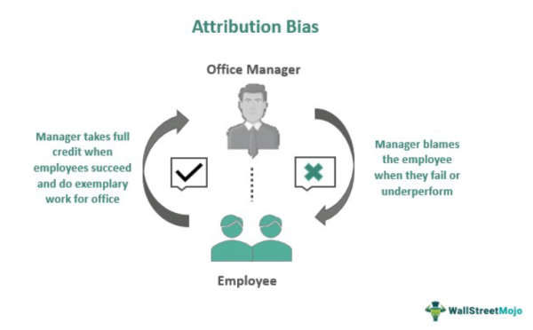

## Table of Contents

## What is attribution bias?

Attribution bias is when people make quick judgments about why others do things, often getting it wrong. It's like when you see someone trip and think they're clumsy, but maybe they just stepped on a rock. We tend to think people's actions are because of who they are, not because of things around them.

This bias can cause problems because it makes us misunderstand others. For example, if a friend cancels plans, you might think they don't care about you, but maybe they're just sick. It's important to try to see the whole picture before deciding why someone did something. This can help us be fairer and kinder in how we treat others.

## How does attribution bias affect financial decision-making?

Attribution bias can mess up financial decisions by making us think in the wrong way about why things happen with money. For example, if you invest in a stock and it goes up, you might think you're a great investor. But really, it might just be because the whole market was doing well. This can make you too confident and take bigger risks than you should.

Also, if you see someone else lose money, you might think they're bad at managing money. But maybe they just had bad luck or didn't know something important. This can make you judge others too harshly and not learn from their mistakes the right way. Understanding attribution bias can help you make better choices and be kinder when thinking about your own and others' financial moves.

## Can you provide examples of attribution bias in everyday financial situations?

Imagine you're at a store and you see someone buying a lot of expensive stuff. You might think they're showing off or bad with money. But maybe they just got a bonus at work or it's a special occasion. If you judge them too quickly, you might miss the real reason behind their spending.

Another common situation is when someone you know doesn't save much money. You might think they're lazy or don't care about the future. But maybe they have a lot of bills to pay or their job doesn't pay well. If you don't consider these things, you might not understand their financial choices and could even give them bad advice.

Lastly, think about when you make a good investment and the value goes up. You might feel really smart and think you can't go wrong. But maybe the market was just doing well overall. If you don't realize this, you might start taking bigger risks, thinking you're always right, which could lead to big losses later on.

## What are the different types of attribution bias that impact finance?

One type of attribution bias that impacts finance is called the self-serving bias. This is when people take credit for good things that happen, like making money from an investment, but blame bad things on other stuff, like the market going down. For example, if you buy a stock and it goes up, you might say it's because you're smart. But if it goes down, you might say it's because the economy is bad. This can make people too confident and take bigger risks than they should.

Another type is the fundamental attribution error. This is when people think other people's actions are because of who they are, not because of things around them. For example, if a friend loses money on an investment, you might think they're bad at investing. But maybe they just got unlucky or didn't have all the information. This can make you judge others too harshly and not learn from their mistakes the right way.

A third type is the hindsight bias. This happens when people think they knew something was going to happen after it already did. For example, if a stock crashes, you might say you knew it was going to happen, even if you didn't. This can make people think they're better at predicting the future than they really are, which can lead to bad financial decisions.

## How can attribution bias lead to poor investment choices?

Attribution bias can make people think they're better at [picking](/wiki/asset-class-picking) investments than they really are. For example, if someone buys a stock and it goes up, they might think it's because they're smart. But really, it might just be because the whole market was doing well. This can make them too confident and take bigger risks than they should. They might start investing in riskier stocks or putting all their money into one thing, thinking they can't lose. But this can lead to big losses if the market turns bad or if they just get unlucky.

Another way attribution bias can mess up investment choices is by making people judge others too quickly. If someone sees a friend lose money on an investment, they might think their friend is bad at investing. But maybe their friend just got unlucky or didn't have all the information. If people don't consider these things, they might not learn from others' mistakes the right way. They might even copy bad choices without understanding why they went wrong. This can lead to repeating the same mistakes and losing money.

## What role does attribution bias play in financial markets?

Attribution bias can mess up how people see what's happening in financial markets. For example, if the market goes up, investors might think they're really good at picking stocks. But really, it might just be because the whole market was doing well. This can make them too sure of themselves and take bigger risks than they should. They might start investing in riskier things or put all their money into one stock, thinking they can't lose. But this can lead to big losses if the market turns bad or if they just get unlucky.

Also, attribution bias can make people judge others too quickly in the financial world. If someone sees a friend lose money on an investment, they might think their friend is bad at investing. But maybe their friend just got unlucky or didn't have all the information. If people don't think about these things, they might not learn from others' mistakes the right way. They might even copy bad choices without understanding why they went wrong. This can lead to repeating the same mistakes and losing money in the markets.

## How can financial professionals mitigate the effects of attribution bias?

Financial professionals can mitigate the effects of attribution bias by being aware of it and actively working to avoid it. They should always think about all the reasons why something might have happened, not just the first thing that comes to mind. For example, if an investment does well, they should consider if it was just because the market was doing well overall, not just because they made a smart choice. By doing this, they can make better decisions and not get too confident or take too many risks.

Another way to reduce attribution bias is to learn from others without judging them too quickly. If a colleague makes a bad investment, financial professionals should try to understand all the reasons why it might have happened, like bad luck or missing information, instead of just thinking the colleague is bad at their job. This can help them learn from others' mistakes and successes in a more balanced way. By keeping an open mind and looking at the bigger picture, financial professionals can make smarter choices and help their clients do the same.

## What are the psychological underpinnings of attribution bias in finance?

Attribution bias in finance comes from how our brains naturally work. We all want to feel good about ourselves, so when we make money from an investment, we might think it's because we're smart. But if we lose money, we blame it on bad luck or the market. This is called self-serving bias. It makes us feel better, but it can also make us too confident and take bigger risks than we should. This is because we start to think we're always right, even when we're not.

Another part of attribution bias is how we see other people. When someone else loses money, we might think they're bad at investing, not considering that they might have just been unlucky or didn't have all the info. This is called the fundamental attribution error. It can make us judge others too quickly and miss out on learning from their experiences. By understanding these psychological reasons, we can try to be more fair and careful in our financial decisions.

## How does attribution bias influence risk assessment and management in finance?

Attribution bias can make people think they're better at figuring out risks than they really are. If someone makes money from an investment, they might think it's because they're smart and the risk was low. But really, it might just be because the market was doing well. This can make them too confident and take bigger risks than they should. They might start investing in riskier things or put all their money into one thing, thinking they can't lose. But this can lead to big losses if the market turns bad or if they just get unlucky.

Also, attribution bias can make people judge others' risk management too quickly. If someone sees a friend lose money on an investment, they might think their friend is bad at managing risk. But maybe their friend just got unlucky or didn't have all the information. If people don't consider these things, they might not learn from others' mistakes the right way. They might even copy bad choices without understanding why they went wrong. This can lead to repeating the same mistakes and losing money because they didn't see the whole picture.

## What empirical research exists on attribution bias in financial contexts?

There is a lot of research that shows how attribution bias affects financial decisions. One study found that investors often think they're good at picking stocks when the market goes up, but blame the market when it goes down. This is called self-serving bias. The study showed that this can make investors too confident and take bigger risks than they should. Another piece of research looked at how people judge others' financial decisions. It found that when someone else loses money, people often think it's because that person is bad at investing, not because of bad luck or missing information. This is called fundamental attribution error, and it can make people judge others too quickly and miss out on learning from their experiences.

More research has been done on how attribution bias can lead to bad investment choices. For example, a study showed that when people think they're good at picking investments because of a few good choices, they might start investing in riskier things. But this can lead to big losses if the market turns bad. Another study found that hindsight bias, where people think they knew something was going to happen after it already did, can make them think they're better at predicting the future than they really are. This can lead to bad financial decisions because they might not be as careful as they should be. By understanding these biases, people can try to make better choices and be more careful with their money.

## How do cultural differences affect attribution bias in global finance?

Cultural differences can change how people see why things happen in finance. In some cultures, people might think that success or failure in money matters comes from working hard or being smart. But in other cultures, they might believe it's more about luck or what's happening in the world around them. This can make people from different places judge financial choices differently. For example, someone from a culture that values hard work might think a person who loses money on an investment just didn't try hard enough. But someone from a culture that believes in luck might think the person just had bad luck.

These different ways of thinking can cause problems in global finance. When people from different cultures work together, they might not understand each other's views on why things happen. This can lead to disagreements or bad decisions. For example, if a team is deciding whether to invest in a risky project, someone who thinks success is all about hard work might push for it, while someone who believes in luck might be more cautious. Understanding these cultural differences can help people work better together and make smarter financial choices.

## What advanced strategies can be employed to counteract attribution bias in complex financial analyses?

To counteract attribution bias in complex financial analyses, financial professionals can use a few smart strategies. One way is to always look at the big picture. Instead of just thinking about why one thing happened, they should think about all the different reasons that might have played a part. For example, if a stock goes up, they should consider if it was because of their smart choice or if the whole market was doing well. By doing this, they can make better decisions and not get too sure of themselves or take too many risks.

Another strategy is to learn from others without judging them too quickly. If someone else makes a bad investment, financial professionals should try to understand all the reasons why it might have happened, like bad luck or missing information, instead of just thinking the person is bad at their job. They can also use tools like data analysis and simulations to check their ideas and see if they hold up. By keeping an open mind and looking at the bigger picture, financial professionals can make smarter choices and help their clients do the same.

## References & Further Reading

[1]: Barberis, N., & Thaler, R. (2003). ["A survey of behavioral finance."](https://www.semanticscholar.org/paper/A-Survey-of-Behavioral-Finance-Barberis-Thaler/a4ab7d7161deac0f532d121b1614cf7b97d90e78) Handbook of the Economics of Finance, 1, 1053-1128.

[2]: Kahneman, D. (2011). ["Thinking, Fast and Slow."](https://link.springer.com/article/10.1007/s00362-013-0533-y) Farrar, Straus and Giroux.

[3]: Tversky, A., & Kahneman, D. (1974). ["Judgment under Uncertainty: Heuristics and Biases."](https://www2.psych.ubc.ca/~schaller/Psyc590Readings/TverskyKahneman1974.pdf) Science, 185(4157), 1124-1131.

[4]: Odean, T. (1998). ["Are Investors Reluctant to Realize Their Losses?"](https://onlinelibrary.wiley.com/doi/full/10.1111/0022-1082.00072) The Journal of Finance, 53(5), 1775-1798.

[5]: Mitroi, A., & Prioteasa, V. (2016). ["Behavioral Biases in Trading on the Exchange."](https://www.utgjiu.ro/revista/ec/pdf/2016-Special%20ECOTREND%20Vol%201/42_ADRIAN%20MITROI.pdf) Procedia Economics and Finance, 39, 498-504.

[6]: Menkhoff, L., Schmidt, U., & Brozynski, T. (2011). ["The Impact of Experience on Risk Taking, Overconfidence, and Herding of Fund Managers: Complementary Survey Evidence."](https://www.sciencedirect.com/science/article/pii/S0014292105001200) Review of Financial Economics, 20(3), 127-137.