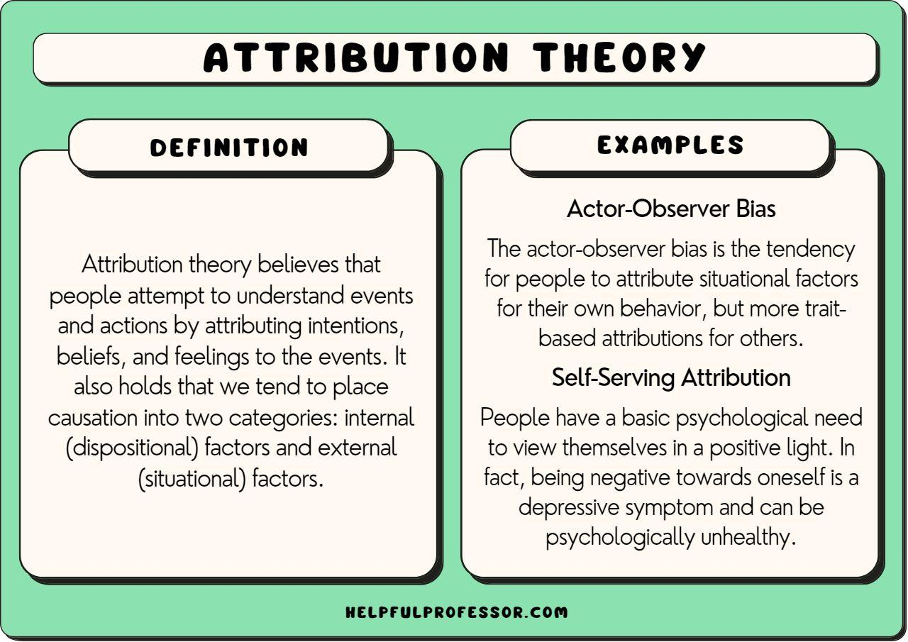

## Table of Contents

## What is attribution in the context of marketing and analytics?

Attribution in marketing and analytics is about figuring out which parts of your marketing efforts are actually helping you make sales or get more customers. Imagine you're running ads on social media, sending out emails, and also showing up in search results. When someone finally buys something from you, attribution helps you understand which of those efforts played the biggest role in that sale.

It's like being a detective, trying to piece together the journey a customer took before deciding to buy. Did they click on a social media ad first, then get an email, and finally search for your product? Attribution models help marketers see this path clearly, so they can spend their money on the most effective marketing channels. This way, they can make smarter decisions and improve their strategies to get better results.

## Why is attribution important for businesses?

Attribution is really important for businesses because it helps them see which marketing efforts are working and which ones aren't. When a business knows exactly what's bringing in customers, they can spend their money more wisely. Instead of guessing, they can focus on the ads, emails, or social media posts that are actually making a difference. This can save a lot of money and make sure they're not wasting resources on things that don't help.

Plus, understanding attribution can help businesses improve their overall marketing strategy. If they see that most customers come from social media ads, they might decide to put more effort into those. Or if they find out that emails are not very effective, they can try new ways to make them better. By figuring out the best paths to their customers, businesses can grow faster and make more sales.

## What are the different types of attribution models?

There are several types of attribution models that businesses use to understand how their marketing efforts lead to sales. One common type is the "last-click" model, which gives all the credit to the last thing a customer clicked before buying. For example, if someone clicked on a social media ad and then an email before buying, the email would get all the credit. Another type is the "first-click" model, where the first interaction gets all the credit. So in the same example, the social media ad would be seen as the most important. These models are simple but can miss out on the full story of a customer's journey.

There are also more complex models like "linear" attribution, where every touchpoint in the customer's journey gets an equal share of the credit. So if someone saw a social media ad, clicked an email, and then searched for the product, each of those steps would be considered equally important. Another model is "time-decay" attribution, which gives more credit to interactions closer to the time of purchase. This model thinks that the more recent a touchpoint is, the more it influenced the decision to buy. Lastly, there's "data-driven" attribution, which uses fancy math and data to figure out exactly how much each touchpoint contributed to the sale, based on lots of customer data.

Choosing the right attribution model depends on what the business wants to learn and how detailed they want their analysis to be. Simple models like last-click or first-click are easy to understand and use, but they might not give a complete picture. More complex models like linear, time-decay, or data-driven can provide a deeper understanding, but they require more data and can be harder to set up.

## How does the first-touch attribution model work?

The first-touch attribution model gives all the credit for a sale to the very first interaction a customer has with a business. Imagine someone sees your ad on social media, then later clicks on an email you sent, and finally buys something after searching for your product. With the first-touch model, the social media ad gets all the credit for that sale, even though the email and the search were also part of the journey.

This model is simple and easy to understand, which is why some businesses like it. It helps them see which marketing efforts are good at getting people's attention right from the start. But it can also miss out on important information. It doesn't show how other steps, like emails or searches, might have helped convince the customer to buy. So while it's useful for understanding initial attraction, it might not give a complete picture of the customer's journey.

## What is the last-touch attribution model and when is it most effective?

The last-touch attribution model gives all the credit for a sale to the very last thing a customer did before buying. Imagine someone saw your ad on social media, then clicked on an email, and finally bought something after searching for your product. With the last-touch model, the search gets all the credit for that sale, even though the social media ad and the email were also part of the journey. This model is simple and easy to understand, which is why some businesses like it.

The last-touch model is most effective when the final step in the customer's journey is really important. For example, if most people decide to buy right after they see a certain type of ad or click on a specific link, this model can help you see that. It's also good for businesses that want a simple way to measure the success of their marketing efforts without getting into the details of every step a customer takes. But remember, it might not show the full story of how other marketing efforts helped lead to the sale.

## Can you explain multi-touch attribution and its benefits?

Multi-touch attribution is a way to give credit to all the different steps a customer takes before they buy something. Instead of just focusing on the first thing they saw or the last thing they clicked, multi-touch attribution looks at the whole journey. For example, if someone saw your ad on social media, then clicked on an email, and finally bought something after searching for your product, multi-touch attribution would give some credit to each of those steps.

The big benefit of multi-touch attribution is that it gives a fuller picture of how your marketing works. By understanding that every step can be important, you can see which parts of your marketing are really helping to bring in customers. This can help you spend your money more wisely, making sure you're not missing out on important steps that lead to sales. Plus, it can show you where you might need to improve your marketing to make the whole journey better for customers.

## What role does data collection play in attribution?

Data collection is really important for attribution because it helps you see what customers are doing before they buy something. When you collect data, you can track things like which ads people click on, how many times they visit your website, and what they do before they decide to buy. This information helps you figure out which parts of your marketing are working and which aren't. Without good data, it's hard to know if your social media ads, emails, or search results are helping you make sales.

By collecting data carefully, you can use it with different attribution models to get a better understanding of your customers' journeys. For example, if you use a multi-touch attribution model, you need data to see all the steps a customer took before buying. This way, you can give credit to each step and see the whole picture. Good data collection makes your attribution more accurate, helping you make smarter decisions about where to spend your marketing money.

## How do you implement an attribution model in a digital marketing campaign?

To implement an attribution model in a digital marketing campaign, you first need to decide which model fits your goals best. If you want to know what first gets people interested, you might choose a first-touch model. If you're more interested in what finally convinces someone to buy, a last-touch model could be better. Or, if you want to see the whole journey, you might go for a multi-touch model like linear or time-decay. Once you've picked your model, you'll need to set up tracking tools to collect data on every interaction customers have with your marketing, like clicks on ads, email opens, and website visits.

After setting up your tracking, you'll need to analyze the data to see how each part of your campaign is performing according to your chosen model. This means looking at the data to see which touchpoints are leading to sales and how much credit each one should get. You can use software or analytics platforms to help with this, as they can automatically apply your attribution model and give you clear reports. By regularly checking these reports, you can adjust your marketing strategy to focus on what's working best and improve areas that aren't as effective.

## What are the challenges faced when using attribution models?

Using attribution models can be tricky because they often don't tell the whole story. For example, if you're using a last-touch model, it might seem like the last thing someone clicked before buying was the most important. But what about all the other steps they took before that? Maybe they saw your ad on social media first, and that's what got them interested. Attribution models can miss out on these important details, especially if they're too simple. Also, different models can give you different answers. If you switch from a first-touch to a last-touch model, suddenly a different part of your marketing might look more important. This can make it hard to know which model is really showing you the truth.

Another challenge is getting enough good data to make the models work well. If you don't track all the steps a customer takes, you won't have a complete picture. And if the data you do have isn't accurate, your attribution model won't be either. Sometimes, customers use different devices or clear their cookies, which makes it hard to follow their journey. Plus, setting up tracking and using the right software can be complicated and take a lot of time. It's not just about [picking](/wiki/asset-class-picking) a model; it's also about making sure you have the right tools and data to use it properly.

## How can machine learning improve attribution accuracy?

Machine learning can make attribution models better by looking at a lot of data and finding patterns that people might miss. Imagine you have tons of information about what customers do before they buy something. Machine learning can go through all that data and figure out which parts of your marketing really help lead to a sale. It can see things like how often someone clicks on an ad, how long they spend on your website, and even what they do on different devices. By understanding these patterns, [machine learning](/wiki/machine-learning) can give a more accurate picture of what's working in your marketing.

This is really helpful because it can make your attribution model more detailed and personal. Instead of just using a simple rule like "the last thing someone clicked gets all the credit," machine learning can show you how each step in a customer's journey matters. It can also change over time, learning from new data to keep getting better. This means your marketing strategy can be more up-to-date and effective, helping you spend your money where it will make the biggest difference.

## What advanced metrics should be considered in expert-level attribution analysis?

In expert-level attribution analysis, you should look at more than just clicks and sales. One important metric is the customer lifetime value (CLTV), which shows how much money a customer will spend over time. This helps you see which marketing efforts bring in customers who keep coming back and spending more. Another metric to consider is the conversion path length, which tells you how many steps it takes for someone to go from seeing your ad to making a purchase. This can show you if your marketing journey is too long or if you need more touchpoints to help customers decide.

You should also pay attention to the assist-to-conversion ratio, which looks at how often different marketing efforts help lead to a sale without being the final step. This can tell you which parts of your marketing are good at keeping people interested even if they don't get the last click. Additionally, consider the time-to-conversion metric, which measures how long it takes from the first interaction to the sale. This can help you understand if your marketing is working quickly or if you need to speed things up. By using these advanced metrics, you can get a deeper understanding of your marketing's effectiveness and make smarter decisions.

## How do you evaluate the effectiveness of different attribution models over time?

To evaluate the effectiveness of different attribution models over time, you need to keep track of how well they help you understand your marketing. Start by picking a few key metrics, like how many sales each model says come from different marketing efforts. Then, compare these metrics over time to see if the models are showing you the same things or if they change a lot. If a model keeps saying that social media ads are the most important, but you see more sales from emails, you might need to switch models or adjust how you're using them.

It's also important to look at how the models affect your marketing decisions. If a model helps you spend your money in a way that leads to more sales, it's probably working well. But if you keep changing your strategy based on what the model says, and you're not seeing better results, the model might not be accurate. Keep testing different models and comparing them to see which one gives you the best insights and helps you make the smartest choices for your business.

## What are the challenges with traditional models?

Traditional predictive models, while offering precise forecasts, often sacrifice interpretability, which is crucial in the domain of trading. The necessity to understand the financial implications behind predictions is paramount for traders, who must trust and verify the outputs before making decisions. Yet, many traditional models operate as "black boxes," providing results without a clear explanation of the factors influencing those outcomes.

Models such as Random Forests and XGBoost have gained popularity due to their predictive accuracy and ability to handle large datasets with nonlinear relationships. These models build on complex processes: Random Forests use an ensemble of decision trees to improve accuracy and control overfitting, while XGBoost employs gradient boosting on decision trees for high performance and efficiency. Despite their effectiveness, these models lack the transparency required to interpret how input variables contribute to the final prediction. This opacity arises because the models aggregate multiple decision paths, making it challenging to unravel the contribution of each feature.

The challenge is further compounded by the nature of financial markets, where decisions must often abide not only by accuracy but ethical standards and regulatory compliance. Regulatory bodies may require clear justifications of trading decisions, which opaque models cannot easily provide. The absence of interpretability in these models hinders their application in trading, limiting the ability of traders to align model outputs with market trends and sentiments comprehensively.

The complexity grows when considering the mathematical basis of these models. For example, XGBoost optimizes a regularized learning objective, as shown in the equation:

$$
L(\phi) = \sum_{i} l(y_i, \hat{y}_i) + \sum_{k} \Omega(f_k)
$$

where $l$ is a differentiable convex loss function that measures the difference between the prediction $\hat{y}_i$ and the target $y_i$, and $\Omega$ adds regularization to avoid overfitting. The intricacies of such equations contribute to difficulties in deriving straightforward interpretations of model decision processes.

These challenges underscore the importance of developing methods to enhance the interpretability of sophisticated models. Without clear attribution, traders might hesitate to adopt these advanced algorithms, despite their potential to optimize trading strategies. Hence, the rise of improved attribution techniques becomes significant to bridge this gap, ensuring that model complexity doesn't overshadow the necessity for transparency and trust in [algorithmic trading](/wiki/algorithmic-trading).

## What is Coalitional Game Theory and SHAP?

Coalitional game theory provides a foundation for quantifying the contribution of individual players, or features, to the overall outcome of a game or model. This theoretical framework underpins the development of SHAP (SHapley Additive exPlanations), a method for consistent feature attribution. SHAP values quantify the impact of each feature on a model's predictions, improving interpretability in complex algorithmic trading models.

At the core of SHAP is the Shapley value, derived from cooperative game theory, which offers a fair distribution of payoffs among players. The Shapley value is defined as the average marginal contribution of a feature across all permutations of features. Mathematically, it is given by:

$$
\phi_i = \sum_{S \subseteq N \setminus \{i\}} \frac{|S|! (|N|-|S|-1)!}{|N|!} (v(S \cup \{i\}) - v(S))
$$

where:
- $\phi_i$ is the Shapley value for feature $i$,
- $N$ is the set of all features,
- $S$ is a subset of features not including $i$,
- $v(S)$ is the model prediction based only on the features in $S$,
- $|S|$ is the size of the subset $S$,
- $|N|$ is the total number of features.

Integrating SHAP values into trading models provides transparent insights by indicating each feature's contribution to predictions, which is crucial for validating model behavior and understanding decision-making processes in trading. In Python, SHAP can be implemented using libraries such as `shap`, which compute Shapley values to interpret model predictions. A typical integration might look like this:

```python
import shap
import xgboost as xgb
import pandas as pd

# Load data and train a model
data = pd.read_csv('trading_data.csv')
X = data.drop('target', axis=1)
y = data['target']
model = xgb.train({'learning_rate': 0.1}, xgb.DMatrix(X, label=y), 100)

# Compute SHAP values
explainer = shap.Explainer(model, X)
shap_values = explainer(X)

# Visualize the first prediction's explanation
shap.plots.waterfall(shap_values[0])
```

Incorporating SHAP values into algorithmic trading models enhances interpretability and trust. By attributing decisions to specific model inputs, traders gain a clearer understanding of how predictions are made, enabling them to make informed adjustments to trading strategies. Improved interpretability also facilitates compliance with regulatory standards, which increasingly demand transparency in algorithmic decision-making processes.

## How can attribution be implemented in trading algorithms?

Integrating SHAP (SHapley Additive exPlanations) values into algorithmic trading models can significantly enhance both model transparency and the confidence of its users. SHAP values, based on concepts from coalitional game theory, attribute the contribution of individual features to the predictions made by a model. This integration is particularly useful in trading algorithms that rely on complex, non-linear models such as XGBoost and Random Forests, where traditional attribution methods may not suffice.

### Novel Method for SHAP Integration

A novel approach to utilizing SHAP values involves computing the impact of each input feature on the model's output systematically. SHAP provides an explanation model that assigns each feature an importance value for a particular prediction, enabling users to see the detailed contribution of all input parameters.

#### Mathematical Foundation

The SHAP value for a feature $i$ is computed as: 

$$
\phi_i = \sum_{S \subseteq N \setminus \{i\}} \frac{|S|!(n - |S| - 1)!}{n!} \left[v(S \cup \{i\}) - v(S)\right]
$$

Where:
- $N$ is the set of all features,
- $S$ is a subset of the features,
- $v(S)$ is the prediction function for set $S$.

This formula hinges on calculating the weighted average marginal contribution of a feature over all possible subsets $S$.

### Practical Implementation

Implementing SHAP values in trading algorithms consists of calculating these values for each feature used by the model for a trading decision. Python packages like `shap` can be used for this purpose, facilitating integration into existing trading systems:

```python
import shap
import xgboost as xgb

# Load data and train an example XGBoost model
dtrain = xgb.DMatrix(data=X_train, label=y_train)
model = xgb.train(params, dtrain)

# Create SHAP explainer
explainer = shap.Explainer(model, X_train)

# Calculate SHAP values
shap_values = explainer(X_test)

# Visualize the first prediction's explanation
shap.plots.waterfall(shap_values[0])
```

### Testing Outcomes

The integration of SHAP into trading models substantiates improved interpretability, as each trade's decision can be backtracked to specific feature influences. For instance, in [backtesting](/wiki/backtesting) scenarios, where trading algorithms were equipped with SHAP-explained predictions, users were better equipped to rationalize trade choices based on transparent feature contributions. This clarity enables traders to recognize patterns and make informed decisions, possibly adjusting their strategy if a particular feature consistently affects predictions contrary to expectations.

The tangible benefit extends to compliance settings, where financial institutions demand transparency. By explaining every model decision regarding feature contribution, firms can satisfy regulatory requirements more efficiently, reducing the risk of undue scrutiny.

### Benefits

Integrating SHAP values enhances algorithmic models by building trust through transparency, refining prediction quality, and ensuring compliance. With this methodology, traders and institutions can confidently deploy powerful models, assured by the clarity and reliability added by SHAP's feature of explanation.

## References & Further Reading

[1]: Aas, K., Jullum, M., & Løland, A. (2021). ["Explaining Individual Predictions When Features are Dependent: More Accurate Approximations to Shapley Values."](https://www.sciencedirect.com/science/article/pii/S0004370221000539) Journal of Machine Learning Research, 22(1), 1-32.

[2]: Lundberg, S. M., & Lee, S. I. (2017). ["A Unified Approach to Interpreting Model Predictions."](https://arxiv.org/abs/1705.07874) Advances in Neural Information Processing Systems, 30, 4765-4774.

[3]: ["Advances in Financial Machine Learning"](https://www.amazon.com/Advances-Financial-Machine-Learning-Marcos/dp/1119482089) by Marcos Lopez de Prado

[4]: ["Interpretable Machine Learning: A Guide for Making Black Box Models Explainable"](https://www.amazon.com/Interpretable-Machine-Learning-Making-Explainable/dp/B09TMWHVB4) by Christoph Molnar

[5]: ["Machine Learning for Algorithmic Trading"](https://github.com/PacktPublishing/Machine-Learning-for-Algorithmic-Trading-Second-Edition) by Stefan Jansen