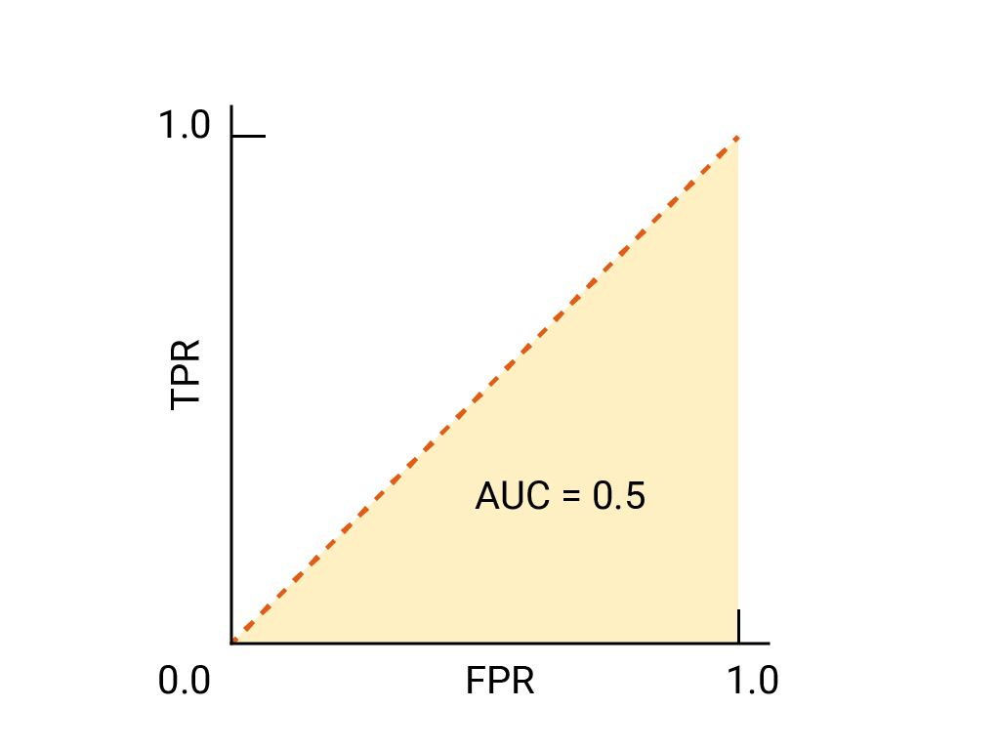

## Table of Contents

## What is the ROC curve and why is it important in machine learning?

The ROC curve, or Receiver Operating Characteristic curve, is a graphical plot that illustrates the performance of a binary classifier system as its discrimination threshold is varied. It's created by plotting the true positive rate (TPR) against the false positive rate (FPR) at various threshold settings. The TPR is also known as sensitivity, recall, or hit rate, and it measures the proportion of actual positives that are correctly identified. The FPR, on the other hand, is the proportion of actual negatives that are incorrectly identified as positives. The ROC curve helps us visualize how well a model can distinguish between the two classes.

The importance of the ROC curve in machine learning lies in its ability to provide a comprehensive view of a classifier's performance across all possible classification thresholds. This is particularly useful because it allows us to see the trade-offs between the sensitivity and specificity of the model. The area under the ROC curve (AUC) is a commonly used summary measure of the curve, where a higher AUC indicates better performance. An AUC of 1 represents a perfect classifier, while an AUC of 0.5 suggests no discriminative power, equivalent to random guessing. By using the ROC curve, we can make informed decisions about which model to choose and at what threshold to set it, depending on the specific needs of our application.

## How is the AUC calculated from the ROC curve?

The AUC, or Area Under the Curve, is a way to measure how well a model can tell the difference between two groups. To find the AUC, you look at the ROC curve, which shows how the model performs at different points. The AUC is the total area under this curve. If the AUC is close to 1, it means the model is very good at telling the groups apart. If it's close to 0.5, it's like guessing randomly, and if it's 0, the model is getting everything wrong.

To calculate the AUC, you can use a simple method called the trapezoidal rule. Imagine the ROC curve as a series of connected line segments. You find the area of each trapezoid formed by these segments and add them up. If you have the true positive rate (TPR) and false positive rate (FPR) at different points, you can use this formula to find the AUC: $$ \text{AUC} = \sum_{i=1}^{n-1} \frac{(\text{TPR}_i + \text{TPR}_{i+1}) \cdot (\text{FPR}_{i+1} - \text{FPR}_i)}{2} $$ where \( n \) is the number of points on the ROC curve. This formula breaks down the area into smaller parts and adds them together to get the total area under the curve.

## What does an AUC value of 0.5 indicate about a model's performance?

An AUC value of 0.5 means that the model is no better than random guessing at telling the difference between the two groups. Imagine flipping a coin to decide if something belongs to one group or another; that's how well the model is doing. If the model can't do better than chance, it's not very useful for making predictions.

In simple terms, an AUC of 0.5 shows that the model has no ability to separate the classes. It's like the model is just guessing, and it's getting things right about half the time, which is what you'd expect from random chance. If you see an AUC of 0.5, it's a sign that you need to work on improving your model or maybe even try a different approach.

## How can AUC be used to compare the performance of different models?

The AUC, or Area Under the Curve, is a great way to see which model is better at telling things apart. Imagine you have two models, and you want to know which one is better. You can look at their AUC values. The model with the higher AUC is better at separating the groups. For example, if Model A has an AUC of 0.8 and Model B has an AUC of 0.7, Model A is better because it's closer to 1, which means it's better at telling the groups apart.

You can also use AUC to see how much better one model is compared to another. If the difference in AUC values is big, it means one model is a lot better than the other. But if the difference is small, the models might be pretty similar in how well they work. So, by comparing the AUC values, you can make a smart choice about which model to use for your project.

## What are the advantages of using AUC over other performance metrics?

The AUC is a great way to see how well a model can tell things apart because it looks at how the model works at all different points, not just one. Other metrics, like accuracy, might only tell you how often the model gets things right, but they don't show how well the model can separate the groups at different levels. The AUC is like a big picture that helps you understand the model's performance in a way that other single-number metrics can't. It's especially useful when the groups you're trying to tell apart are not evenly split, because it focuses on how well the model can rank the examples rather than just getting the right answer.

Another advantage of AUC is that it's not affected by changes in the groups' sizes. This means you can trust the AUC to give you a good idea of how well the model works, even if the number of examples in each group changes. Other metrics might change a lot if the groups are not balanced, but the AUC stays steady. This makes it easier to compare different models or the same model on different sets of data. By looking at the AUC, you can make better choices about which model to use and how to set it up to work the best.

## Can AUC be misleading in certain scenarios, and if so, how?

AUC can sometimes be misleading because it looks at how well a model can rank examples, but it doesn't care about how much the model's predictions are off. Imagine a model that always says "yes" with a confidence of 51% when it should be "yes," and "no" with a confidence of 49% when it should be "no." This model would have a high AUC because it's ranking things correctly, but it's not very confident, so it might not be very useful in real life. In situations where you need the model to be sure about its answers, the AUC might make the model look better than it really is.

Another way AUC can be misleading is when the groups you're trying to tell apart are very different in size. The AUC doesn't change much if the groups are not balanced, which can be good, but it can also hide problems. For example, if you have a lot more examples of one group than the other, a model might do well on the bigger group but badly on the smaller one, and the AUC might not show this. If you care a lot about getting the smaller group right, you might need to look at other metrics like precision and recall to get a better picture of how the model is doing.

## How does class imbalance affect the interpretation of AUC?

Class imbalance happens when one group in your data has a lot more examples than the other. When you look at the AUC, it might seem like your model is doing well because the AUC doesn't change much even if the groups are not balanced. This can be good because it means the AUC is not tricked by the size of the groups, but it can also hide problems. If your model is doing well on the bigger group but not so well on the smaller one, the AUC might not show this. So, if you care a lot about getting the smaller group right, you might need to look at other things like precision and recall to get a better picture of how your model is doing.

For example, imagine you're trying to find a rare disease in a big group of people. Most people don't have the disease, so the "no disease" group is much bigger than the "disease" group. Your model might be really good at saying "no disease" for most people, but it might miss a lot of the people who actually have the disease. The AUC might still look good because it's ranking people correctly overall, but it's not helping you find the people with the disease. In cases like this, you might want to use other metrics that focus more on the smaller group to make sure your model is useful in real life.

## What is the relationship between AUC and the model's ability to rank predictions?

The AUC, or Area Under the Curve, tells us how well a model can rank examples from different groups. Imagine you have two groups, like "yes" and "no." The AUC looks at how well the model can put the "yes" examples ahead of the "no" examples. If the model is good at ranking, it will have a high AUC, close to 1. If it's not good at ranking, the AUC will be closer to 0.5, which means it's no better than guessing randomly.

The AUC is calculated using the ROC curve, which shows how the model performs at different points. The formula to find the AUC is $$ \text{AUC} = \sum_{i=1}^{n-1} \frac{(\text{TPR}_i + \text{TPR}_{i+1}) \cdot (\text{FPR}_{i+1} - \text{FPR}_i)}{2} $$, where TPR is the true positive rate and FPR is the false positive rate. This formula breaks down the area under the ROC curve into smaller parts and adds them up. By looking at the AUC, we can see if the model is good at ranking examples, which is important for understanding how well it can tell the groups apart.

## How can confidence intervals be used with AUC to assess model reliability?

Confidence intervals can help us understand how reliable the AUC value is. When we calculate the AUC for a model, it's based on the data we have. But if we got different data, the AUC might be a little different. A confidence interval gives us a range of values that we can be pretty sure the true AUC falls within. For example, if the AUC is 0.8 and the confidence interval is from 0.75 to 0.85, we can say we're pretty sure the true AUC is somewhere in that range. This helps us know if the model's performance is really good or if it might just be lucky with the data we used.

To calculate a confidence interval for the AUC, we can use a method called bootstrapping. Bootstrapping means taking random samples from our data, calculating the AUC for each sample, and then using these AUC values to find the confidence interval. The formula for a confidence interval using bootstrapping can look like this: $$ \text{CI} = \text{AUC} \pm z \cdot \text{SE} $$, where CI is the confidence interval, AUC is the calculated AUC, z is the z-score for the desired confidence level (like 1.96 for a 95% confidence interval), and SE is the standard error of the AUC. By using confidence intervals, we get a better idea of how reliable our model's AUC is and whether we can trust it to work well with new data.

## What are some common techniques to improve a model's AUC score?

One common way to improve a model's AUC score is by adjusting the model's parameters. This means trying different settings to see if the model works better. For example, if you're using a decision tree, you might change how deep the tree can go or how many examples it needs to split a node. Another way is to use a technique called cross-validation. This means splitting your data into different parts, training the model on some parts, and testing it on others. By doing this, you can find the best settings for your model that work well across different parts of your data. You can use a grid search to try many different combinations of settings and see which one gives the best AUC.

Another technique is to try different models or combine them. Sometimes, one model might not be the best at telling things apart, but if you use a few models together, they can do better. This is called ensemble learning. For example, you could use a random forest, which is a bunch of decision trees working together. Or you could use a method called boosting, where you train models one after another, and each new model tries to fix the mistakes of the last one. By trying different models or combining them, you can often get a higher AUC score.

Lastly, you can improve your data. This means making sure your data is clean and good quality. You might need to remove examples that are wrong or add more examples to make your data more balanced. You can also create new features from your data that might help the model tell things apart better. For example, if you're trying to predict if someone will buy a product, you might create a new feature that shows how often they've bought similar products before. By improving your data, you can help your model do a better job and get a higher AUC score.

## How does AUC relate to other metrics like precision, recall, and F1 score?

AUC, or Area Under the Curve, is a way to see how well a model can tell things apart by looking at all possible points where the model makes a decision. It's different from other metrics like precision, recall, and F1 score because it looks at the whole picture instead of just one point. Precision tells you how many of the things the model said were right actually were right. Recall, also called sensitivity, tells you how many of the right things the model found. The F1 score is a mix of precision and recall, and it gives you one number that shows how well the model is doing overall. These metrics focus on specific points where the model makes a decision, while AUC looks at how the model performs at all points.

Even though AUC and these other metrics look at different things, they can help each other. For example, if you want to make your model better, you might look at the AUC to see how well it's doing overall, and then use precision, recall, and F1 score to see where it's going wrong. If your model has a high AUC but low precision or recall, it might mean the model is good at ranking things but not so good at making the right decision at the point you care about. By looking at all these metrics together, you can get a better idea of how to make your model work better.

## What advanced methods exist for interpreting and extending the use of AUC in complex models?

One advanced method for interpreting AUC in complex models is to use partial AUC (pAUC). The pAUC focuses on a specific part of the ROC curve, which can be more useful if you care about certain levels of false positive rates more than others. For example, in medical tests, you might want to know how well the model performs at low false positive rates. The pAUC can help you see this by calculating the area under the ROC curve for a specific range of false positive rates. This can give you a better understanding of your model's performance where it matters most to you.

Another way to extend the use of AUC is by using techniques like bootstrapping to get confidence intervals. Bootstrapping involves taking many random samples from your data, calculating the AUC for each sample, and then using these AUC values to find a range where the true AUC likely falls. The formula for a confidence interval using bootstrapping is $$ \text{CI} = \text{AUC} \pm z \cdot \text{SE} $$, where CI is the confidence interval, AUC is the calculated AUC, z is the z-score for the desired confidence level (like 1.96 for a 95% confidence interval), and SE is the standard error of the AUC. By using confidence intervals, you can get a better idea of how reliable your model's AUC is and whether you can trust it to work well with new data.

For models that output probabilities rather than binary predictions, you can also use calibration plots to see how well the predicted probabilities match the actual outcomes. A well-calibrated model will have a calibration plot that closely follows the line of perfect calibration. This can help you understand if the AUC is truly reflecting the model's performance or if the model's probabilities are overconfident or underconfident. By combining AUC with calibration plots, you can get a more complete picture of how well your model is doing and where it might need improvement.